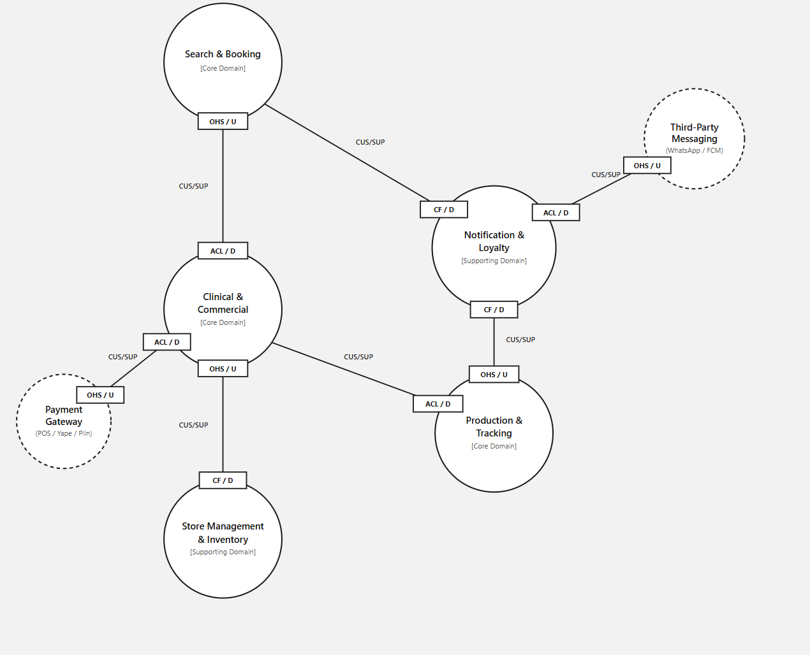
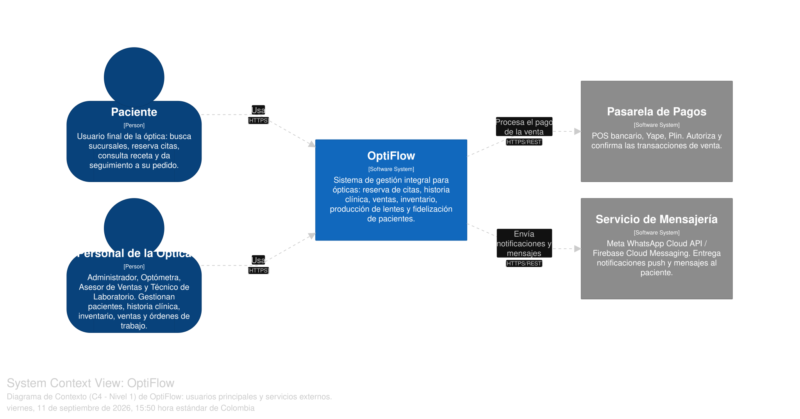
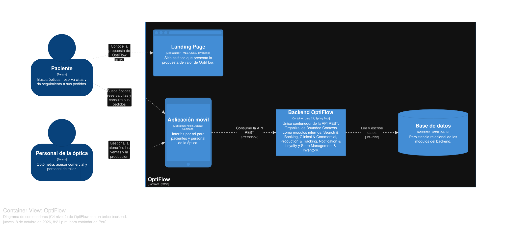
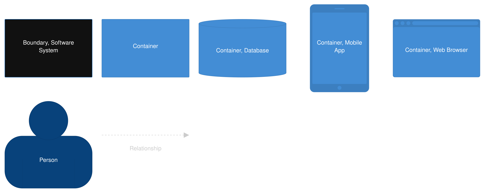
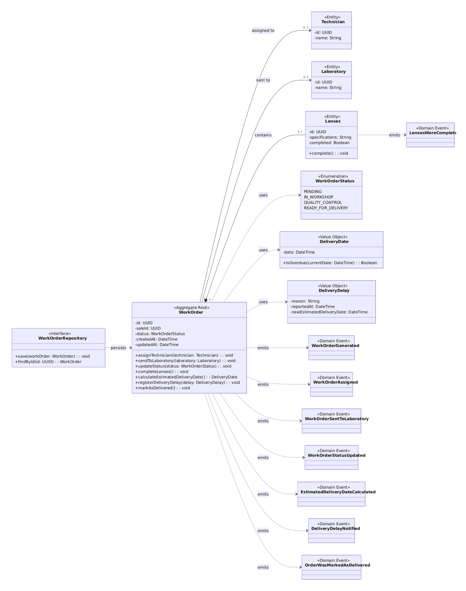
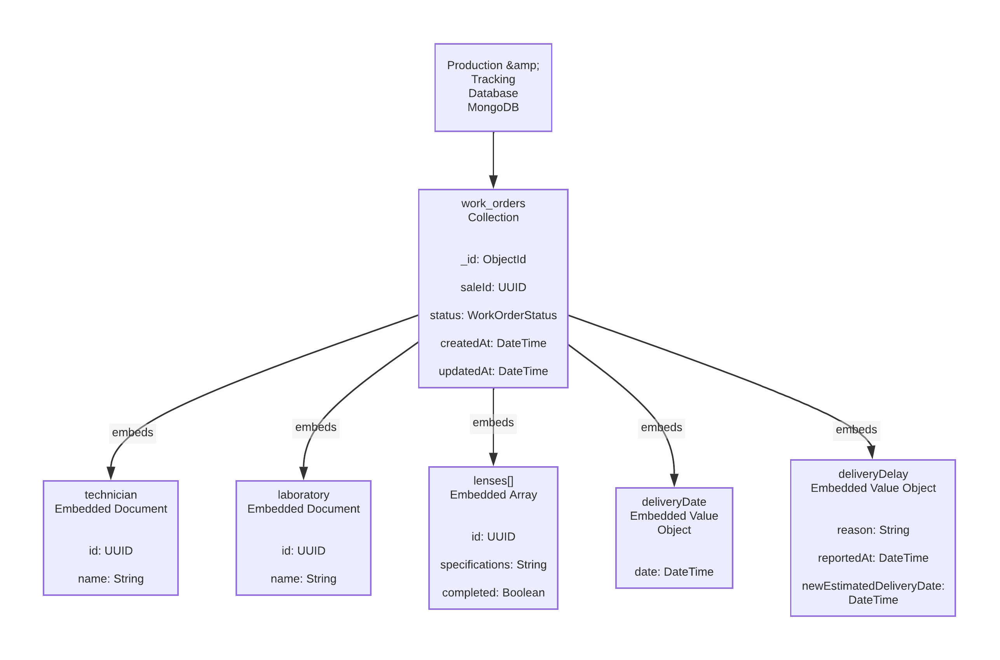

# Anexos

## Anexo A: EventStorming del dominio de OptiFlow

En este anexo se presenta la evidencia correspondiente al modelado del dominio mediante **EventStorming**, utilizado para identificar los principales eventos, comandos, actores y agrupaciones funcionales de la solución OptiFlow (ver Figura A1).

**Figura A1**

*EventStorming del dominio de OptiFlow*

## Anexo B: Bounded Contexts identificados

Los cinco canvases completos de [2.5.1.3](Capitulo2.md#2513-bounded-context-canvases) especifican responsabilidades, reglas, contratos, supuestos y criterios de verificación para los contextos resumidos en este anexo.

La siguiente evidencia corresponde a la identificación de los cinco Bounded Contexts que estructuran el dominio de OptiFlow:

- **Search & Booking Context**
- **Clinical & Commercial Context**
- **Production & Tracking Context**
- **Notification & Loyalty Context**
- **Store Management & Inventory Context**

Estos contextos fueron delimitados a partir de las agrupaciones funcionales identificadas durante el análisis del dominio.

## Anexo C: Domain Message Flows

Los diagramas por escenario y sus datos significativos se encuentran en [2.5.1.2](Capitulo2.md#2512-domain-message-flows-modeling). En la integración con inventario, consultar por escaneo no modifica el stock: el descuento de existencias corresponde a una actualización posterior al cierre de venta. La tabla siguiente conserva el resumen inicial y debe leerse con esa precisión.

En este anexo se presenta la evidencia del flujo de comunicación entre los Bounded Contexts mediante comandos y eventos de dominio.

Los principales flujos identificados incluyen:

La relación entre eventos, contextos receptores y comandos se detalla en la Tabla C1.

**Tabla C1**

*Relación entre eventos, contextos receptores y comandos*

| Contexto emisor | Comando | Evento | Contexto receptor | Comando disparado |
|---|---|---|---|---|
| Search & Booking | `BookAppointment` | `AppointmentBooked` | Clinical & Commercial | `ExaminePatient` |
| Search & Booking | `BookAppointment` | `AppointmentBooked` | Notification & Loyalty | `SendAppointmentReminder` |
| Clinical & Commercial | `CloseSale` | `SaleWasClosed` | Production & Tracking | `GenerateWorkOrder` |
| Clinical & Commercial | `CloseSale` | `SaleWasClosed` | Store Management & Inventory | `ScanQRBarcodeToCheckStock` |
| Production & Tracking | `UpdateWorkOrderStatus` | `WorkOrderStatusUpdated` | Notification & Loyalty | `NotifyLensOrderProgress` |
| Production & Tracking | `DeliverLensesToPatient` | `OrderWasMarkedAsDelivered` | Notification & Loyalty | `SendSatisfactionSurvey` |

Estos flujos permiten evidenciar la comunicación entre los contextos sin necesidad de compartir directamente sus modelos de datos.

## Anexo D: Context Mapping

En este anexo se presenta el **Context Map Final** de OptiFlow, donde se representan las relaciones entre los diferentes Bounded Contexts y sus mecanismos de integración (ver Figura D1).

**Figura D1**

*Context Map de OptiFlow*

## Anexo E: Arquitectura de Software

Se presentan como evidencia complementaria los diagramas correspondientes a los diferentes niveles de la arquitectura de software de OptiFlow.

### E.1. Context Level Diagram

El Context Level Diagram se presenta en la Figura E1.

**Figura E1**

*Context Level Diagram*

### E.2. Container Level Diagram

Se reproduce el Container Level Diagram de la sección 2.5.3.2, con un único contenedor backend y persistencia relacional (ver Figura E2).

**Figura E2**

*Container Level Diagram de OptiFlow elaborado en Structurizr*

La leyenda de los elementos del diagrama se presenta a continuación (ver Figura E3).

**Figura E3**

*Leyenda del Container Level Diagram*

### E.3. Component Diagrams

#### Clinical & Commercial

El Clinical & Commercial Component Diagram se observa en la Figura E4.

**Figura E4**

*Clinical & Commercial Component Diagram*

#### Notification & Loyalty

El Notification & Loyalty Component Diagram se muestra en la Figura E5.

**Figura E5**

*Notification & Loyalty Component Diagram*

#### Production & Tracking

El Production & Tracking Component Diagram se presenta en la Figura E6.

**Figura E6**

*Production & Tracking Component Diagram*

#### Search & Booking

El Search & Booking Component Diagram se observa en la Figura E7.

**Figura E7**

*Search & Booking Component Diagram*

#### Store Management & Inventory

El Store Management & Inventory Component Diagram se muestra en la Figura E8.

**Figura E8**

*Store Management & Inventory Component Diagram*

## Anexo F: Diagramas de diseño táctico

La cardinalidad vigente de cotización–venta se especifica en [2.6.2.6.2](Capitulo2.md#26262-bounded-context-database-design-diagram): una cotización genera como máximo una venta, respaldada por la restricción de unicidad del backend.

En este anexo se presentan evidencias complementarias de los diagramas desarrollados para representar la estructura interna de los Bounded Contexts a nivel táctico.

### F.1. Production & Tracking

#### Domain Layer Class Diagram

El Production & Tracking Domain Layer Class Diagram se presenta en la Figura F1.

**Figura F1**

*Production & Tracking Domain Layer Class Diagram*

#### Database Design Diagram

El Production & Tracking Database Design Diagram se observa en la Figura F2.

**Figura F2**

*Production & Tracking Database Design Diagram*

### F.2. Notification & Loyalty

El diseño táctico de este contexto contempla elementos como `NotificationPreferences`, `PatientBirthday`, `BirthdayDiscount`, `SatisfactionSurvey` y `ReactivationCampaign`, además de consumidores de eventos y adaptadores para servicios externos de mensajería.

## Anexo G: Product Backlog

Como evidencia complementaria del levantamiento y priorización de requisitos, se presenta el Product Backlog desarrollado para OptiFlow.

Entre las funcionalidades priorizadas se encuentran el inicio de sesión, registro de pacientes, gestión de historias clínicas, consulta de recetas, búsqueda de ópticas, reserva de citas y consulta de inventario mediante escáner móvil.
