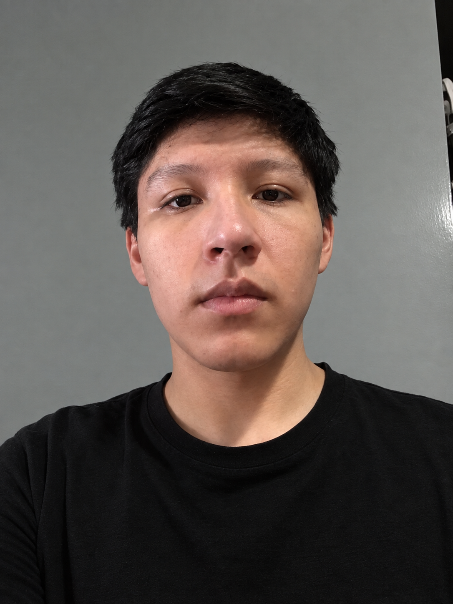

# Capítulo I: Introducción

## 1.1. Startup Profile

### 1.1.1. Descripción de la Startup

OptiFlow nace para cerrar la brecha entre la búsqueda dispersa de servicios ópticos y una experiencia de agendamiento moderna, ágil y centrada en el paciente. Somos una startup que conecta a los pacientes con las ópticas de su preferencia: nuestro enfoque abarca tanto a las ópticas como a los pacientes, pero en esta etapa priorizamos al paciente, facilitándole encontrar, comparar y reservar una cita —eligiendo el modelo, la fecha, la hora y el local que más le convenga— desde su celular, sin necesidad de desplazarse físicamente de óptica en óptica.

La misión de OptiFlow es ofrecer una plataforma móvil que simplifique al máximo el proceso de búsqueda y reserva de citas ópticas, y que a la vez afiance el vínculo entre el paciente y la óptica, entendiendo que este tipo de negocios se sostiene sobre una comunidad de clientes fieles. En paralelo, buscamos dotar al optometrista —y a la persona en quien delegue la gestión— de herramientas de notificación proactivas, como recordatorios de citas y alertas de cumpleaños de pacientes, que permitan una comunicación más clara y oportuna con la cartera de clientes, tanto antiguos como nuevos.

Nuestra visión es consolidarnos como la plataforma líder de agendamiento y fidelización para el sector óptico, siendo el punto de encuentro natural entre pacientes que buscan atención visual y ópticas que buscan construir relaciones duraderas con su comunidad, todo mediado por la conveniencia de un celular.

Alcance de la aplicación: El alcance de OptiFlow se centra, en esta etapa, en una aplicación móvil orientada al paciente, que le permite buscar ópticas, explorar el catálogo de modelos disponibles y reservar una cita en la fecha, hora y local que elija, sin salir de casa. Complementariamente, el sistema incorpora un módulo de notificaciones para el optometrista —y para la persona encargada de la gestión, en caso de delegación— que avisa sobre citas próximas y fechas especiales de los pacientes, como cumpleaños, promoviendo una atención más puntual, proactiva y personalizada.

### 1.1.2. Perfiles de integrantes del equipo

|Foto|Apellido y Nombre| 
| --- | --- |
 | Atoche Gonzales - Nicolas Fernando - u20241d317 Actualmente estoy en el sexto ciclo de la carrera de ingeniería de software. Poseo un conocimiento básico/intermedio en programación con C++, Lua, Luau, Python y Java. Además, cuento con conocimientos básicos en el desarrollo de videojuegos. Suelo orientarme por el conocimiento y el pensamiento lógico, con lo cual suelo buscar la solución más óptima y ágil dentro de un problema a través de pasos sencillos y definidos que construyan una base sólida donde pueda desarrollar respuestas claras y efectivas.
 | Felix Orlando Becerra Ttito - u20211b387 Soy estudiante de Ingeniería de Software, interesado en el desarrollo de soluciones tecnológicas y en la creación de aplicaciones que permitan resolver problemas de manera práctica y eficiente. He adquirido experiencia trabajando con tecnologías como Java, Python, HTML, CSS y bases de datos, participando en proyectos de desarrollo frontend y backend. Me considero una persona responsable, perseverante y con disposición para aprender nuevas tecnologías. Valoro el trabajo en equipo y busco aportar de manera activa en cada proyecto, mejorando continuamente mis conocimientos y habilidades para afrontar nuevos retos en el ámbito tecnológico.
 | Celis Berrospi Eslander - u201911249 Soy estudiante de Ingeniería de Software. Me considero una persona responsable y comprometida con mis objetivos, con una gran disposición para aprender y mejorar de manera continua. Valoro mucho la ética y el trabajo en equipo, aportando siempre ideas y soluciones para alcanzar resultados de calidad. Me esfuerzo por mantener un enfoque ordenado en mis tareas y contribuir activamente al desarrollo colectivo. Tengo conocimientos en Python, C++ y HTML, lo que me permite desarrollar soluciones tecnológicas y fortalecer mis habilidades en programación. Estoy motivado a seguir aprendiendo y asumir nuevos retos que me ayuden a crecer tanto profesional como personalmente.
 | Mariana Morocho Pinedo - u202411521 Soy estudiante de Ingeniería de Software. Cuento con conocimientos en lenguajes de programación como C++, Python y Java, los cuales he aplicado en distintos proyectos académicos orientados a la resolución de problemas y desarrollo de sistemas. Me caracterizo por ser proactiva y  con disposición de generar un buen ambiente.
 | Quispe Llacsahuanga César Agusto - u202417405 Soy estudiante de Ingeniería de Software, interesado en el desarrollo de soluciones tecnológicas y el aprendizaje continuo en herramientas de programación. Cuento con conocimientos en lógica de programación, bases de datos y desarrollo de aplicaciones, lo que me permite contribuir en la construcción de sistemas eficientes. Me caracterizo por ser responsable, proactivo y con buena disposición para el trabajo en equipo, adaptándome a nuevos retos y aportando en el cumplimiento de los objetivos del proyecto.

## 1.2. Solution Profile

### 1.2.1. Antecedentes y problemática

El problema central radica en la dificultad que enfrentan los pacientes para encontrar y reservar una cita óptica de forma rápida y centralizada. Actualmente, un paciente que busca renovar sus lentes o agendar una consulta debe desplazarse físicamente, óptica por óptica, o realizar llamadas dispersas, sin poder comparar de antemano modelos, horarios y disponibilidad desde un solo lugar. Esta fricción no solo desgasta la experiencia del paciente, sino que también impide a las ópticas competir con base en conveniencia y captar la demanda de nuevos clientes que hoy resuelven su necesidad visual con el primer establecimiento que encuentran disponible, y no necesariamente con el que mejor se ajusta a sus preferencias.

Por otro lado, una vez que el paciente ya es cliente de una óptica, se identifica una segunda problemática: la falta de herramientas para que el optometrista —y el personal en quien delegue la gestión— mantenga una comunicación proactiva y oportuna con su cartera de pacientes. El seguimiento de citas programadas, así como de fechas relevantes como los cumpleaños, se realiza hoy de forma manual o simplemente no se realiza, lo que se traduce en inasistencias, oportunidades de fidelización perdidas (como un saludo o descuento de cumpleaños) y una relación menos cercana entre el paciente y la óptica, pese a que las ópticas suelen sostenerse sobre una comunidad de pacientes fieles y recurrentes.

**What / ¿Qué?**
La problemática central es doble, la dispersión y falta de centralización en la búsqueda y reserva de citas ópticas por parte del paciente, quien debe indagar óptica por óptica sin visibilidad de disponibilidad, modelos u horarios; y la ausencia de un sistema de notificaciones y seguimiento que permita al optometrista y "a quien delegue esta tarea" estar al tanto de sus citas y de las fechas importantes de sus pacientes, debilitando la comunicación y la fidelización.

**When / ¿Cuándo?**
Se manifiesta en el momento en que el paciente necesita una cita y no cuenta con una forma rápida de comparar y reservar opciones. Del lado de la óptica, se manifiesta día a día en la gestión de la agenda: cuando el optometrista atiende a un paciente y deja el puesto libre, o simplemente pierde de vista su calendario y las fechas relevantes de sus clientes.

**Where / ¿Dónde?**
Ocurre de forma transversal en el mercado de ópticas independientes y cadenas medianas, donde el paciente no tiene un canal digital único para descubrir y reservar citas, y donde el personal no cuenta con un sistema móvil de recordatorios que centralice su agenda y la de su cartera de pacientes.

**Who / ¿Quién?**
Afecta principalmente a dos grupos: Pacientes (pierden tiempo buscando óptica por óptica y no siempre encuentran la opción que mejor se ajusta a su preferencia de modelo, horario o ubicación) y Optometristas / personal de gestión (pierden oportunidades de fidelización y puntualidad por falta de recordatorios y de visibilidad de su agenda, especialmente cuando delegan la gestión a un tercero).

**Why / ¿Por qué?**
El problema persiste porque no existe una plataforma que unifique, del lado del paciente, la búsqueda y reserva de citas en distintas ópticas, ni que, del lado de la óptica, automatice el recordatorio de citas y de fechas relevantes del paciente. La comunicación queda librada a la memoria del optometrista o a canales informales, lo cual resulta insostenible a medida que crece la cartera de pacientes.

**How / ¿Cómo?**
La solución operará a través de una aplicación móvil donde el paciente podrá buscar ópticas, explorar modelos disponibles y reservar una cita eligiendo fecha, hora y local. En simultáneo, el sistema notificará al optometrista sobre sus citas próximas y los cumpleaños de sus pacientes, permitiéndole delegar esta gestión en una persona encargada, quien recibirá las mismas alertas para dar seguimiento oportuno.

**How much (Cuánto)** 

[cambiar esto]

--La ineficiencia manual y la saturación de datos generan una fuga de capital masiva. Las fallas en la transcripción de datos en la industria cuestan a las empresas millones anuales en procesos de retrabajo y pérdida de clientes (Parseur, 2026). Por el contrario, la implementación de un software integrado y específico permite aumentar el volumen de atención de pacientes entre un 30% y 40% sin incrementar el agotamiento del personal, eliminando los cuellos de botella (Glasson, 2026). Además, las historias clínicas electrónicas (EHR) pueden reducir los retrasos y errores médicos en cerca del 30% (Kivicare, 2024). (faltaron graficas)

### 1.2.2. Lean UX Process

Nuestro servicio ofrece una aplicación móvil centrada en el paciente, que le permite descubrir ópticas, comparar modelos y reservar una cita en el lugar, fecha y hora de su preferencia, sin necesidad de desplazarse físicamente. En paralelo, dota al optometrista —y al personal en quien delegue la gestión— de un sistema de notificaciones que le recuerda sus citas y las fechas relevantes de sus pacientes, como cumpleaños, fortaleciendo así la relación de fidelidad entre la óptica y su comunidad. Hemos observado que, hoy en día, el paciente no cuenta con un canal único para buscar y reservar citas ópticas, mientras que el optometrista carece de herramientas que le permitan mantenerse proactivamente pendiente de su cartera de pacientes. Esto provoca una experiencia de búsqueda frustrante para el paciente y oportunidades de fidelización perdidas para la óptica. ¿De qué manera podemos, mediante una aplicación móvil, facilitarle al paciente la búsqueda y reserva de citas ópticas, y a la vez dotar al optometrista de un sistema de notificaciones que le permita ser más puntual y proactivo con su comunidad de pacientes?

#### 1.2.2.1. Lean UX Problem Statements

OptiFlow fue diseñado para permitir que el paciente pueda buscar, comparar y reservar una cita óptica —eligiendo modelo, fecha, hora y local— directamente desde su celular, sin necesidad de desplazarse óptica por óptica. En paralelo, permite que el optometrista, o la persona en quien delegue la gestión, reciba notificaciones sobre sus citas próximas y sobre fechas relevantes de sus pacientes, como cumpleaños, facilitando una comunicación más clara y oportuna. Sin embargo, hemos observado que actualmente el paciente no cuenta con un canal centralizado para conocer la disponibilidad de las distintas ópticas, lo que lo obliga a invertir tiempo desplazándose o llamando de establecimiento en establecimiento. Del lado de la óptica, el optometrista suele perder de vista su agenda y las fechas importantes de sus pacientes en medio de la atención diaria, debilitando el vínculo de fidelidad que caracteriza a este tipo de negocios. Esta situación provoca una experiencia de búsqueda poco eficiente para el paciente y oportunidades de fidelización perdidas para la óptica, limitando el crecimiento de una relación de largo plazo entre ambos. ¿Cómo podríamos ofrecer una aplicación móvil que facilite al paciente encontrar y reservar su cita óptica ideal, y que a la vez ayude al optometrista a ser más puntual y proactivo con su comunidad de pacientes mediante notificaciones inteligentes?

#### 1.2.2.2. Lean UX Assumptions

**Preguntas sobre el Producto / Usuario (User Assumptions)**

**¿Quién es el usuario?**
> Nuestro usuario principal y prioritario es el paciente que busca un servicio óptico. De forma secundaria, atendemos a la óptica: el optometrista y, en caso de delegación, la persona encargada de la gestión.
> - El paciente utilizará la aplicación móvil para buscar ópticas, comparar modelos y reservar su cita en el lugar, fecha y hora que prefiera.
> - El optometrista recibirá notificaciones sobre sus citas próximas y sobre fechas relevantes de sus pacientes, como cumpleaños.

**¿Dónde encaja nuestro producto en su trabajo o vida?**
> Para el paciente, será el primer punto de contacto al momento de necesitar un servicio óptico, reemplazando la búsqueda física de óptica en óptica o las llamadas telefónicas dispersas. Para el optometrista, será una extensión de su agenda diaria en el celular, presente desde que se despierta (recordatorio de la primera cita del día) hasta el cierre de operaciones, reemplazando:
> - La búsqueda manual y presencial de disponibilidad en ópticas.
> - Las agendas en papel o los recordatorios informales de citas y cumpleaños.
> - La coordinación telefónica entre el optometrista y la persona de gestión.

**¿Qué problemas tiene nuestro producto que resolver?**
> La fricción del paciente al buscar y reservar una cita óptica, y la falta de proactividad del optometrista en el seguimiento de su cartera de pacientes. Específicamente:
> - La pérdida de tiempo del paciente al desplazarse óptica por óptica para conocer disponibilidad y modelos.
> - La dificultad del paciente para elegir, en un solo lugar, el modelo, la fecha, la hora y el local de su preferencia.
> - El olvido de citas próximas y de fechas relevantes (cumpleaños) por parte del optometrista.
> - La falta de un canal claro para delegar el seguimiento de pacientes a otra persona sin perder visibilidad.

**¿Cuándo y cómo es usado nuestro producto?**
> El paciente lo usará de forma puntual, cada vez que necesite agendar o renovar un servicio óptico, desde cualquier lugar y en el momento que le resulte conveniente. El optometrista (o la persona de gestión) lo usará de forma continua durante la jornada, principalmente:
> - Al inicio del día, para revisar las citas y recordatorios pendientes.
> - Durante la jornada, al recibir notificaciones en tiempo real sobre citas próximas o cumpleaños de pacientes.
> - Al delegar tareas de seguimiento, manteniendo visibilidad compartida con la persona encargada de la gestión.

**¿Qué características son importantes?**
> - Buscador de ópticas con catálogo de modelos disponibles.
> - Reserva de citas eligiendo modelo, fecha, hora y local, desde el celular.
> - Notificaciones push al optometrista sobre citas próximas y cumpleaños de pacientes.
> - Delegación de la gestión de notificaciones a una persona designada, sin perder visibilidad.

**¿Cómo debe verse nuestro producto y cómo debe comportarse?**
> Debe ser simple, cercano y confiable, priorizando la facilidad de uso del paciente y la inmediatez de las notificaciones para el optometrista.
> - El flujo de búsqueda y reserva de cita debe completarse en pocos pasos, sin fricciones, y ser operable a una sola mano.
> - Las notificaciones deben ser claras, oportunas y accionables (por ejemplo, permitir confirmar, reprogramar o delegar una cita con un solo tap).

---

**Business Assumptions**

> Creo que mis clientes necesitan una herramienta móvil que:
> - Les permita captar pacientes que hoy buscan alternativas óptica por óptica.
> - Fortalezca la fidelidad de su comunidad de pacientes mediante comunicación oportuna.
> - Reduzca las inasistencias y el desorden en el seguimiento de citas y fechas relevantes.
> - Permita delegar la gestión de la comunicación sin perder control ni visibilidad.

> Estas necesidades se pueden resolver con:
> La implementación de nuestra aplicación móvil, que conecta al paciente con la óptica desde el momento de la búsqueda y reserva de la cita, y sostiene esa relación en el tiempo mediante notificaciones automáticas de citas y fechas relevantes al optometrista o a quien delegue esta tarea.

**Clientes iniciales:**
> Ópticas independientes y cadenas medianas en Lima Metropolitana que:
> - Buscan atraer nuevos pacientes que hoy comparan alternativas de forma manual.
> - Desean fidelizar a su cartera de pacientes existente mediante una comunicación más cercana y oportuna.

**Propuesta de valor**
> **Para el paciente:**
> - Encontrar y reservar su cita óptica ideal sin desplazarse físicamente de óptica en óptica.
> - Elegir el modelo, la fecha, la hora y el local de su preferencia, todo desde el celular.
> - Sentirse parte de una comunidad fiel a su óptica de confianza.
> 
> **Para el optometrista / la óptica:**
> - Ser más puntual y proactivo gracias a notificaciones automáticas de citas y cumpleaños.
> - Fortalecer la fidelización de pacientes antiguos y nuevos.
> - Delegar el seguimiento de la agenda en una persona de gestión sin perder visibilidad.

**Beneficios adicionales:**
> **Óptica:**
> - Mayor captación de pacientes nuevos que buscan reservar sin desplazarse.
> - Menor dependencia de la memoria o de canales informales para el seguimiento de citas.
> - Mejor clima de comunicación entre el optometrista y la persona de gestión.
> 
> **Paciente:**
> - Ahorro de tiempo al comparar y reservar en un solo lugar.
> - Sensación de cercanía y pertenencia a la comunidad de la óptica.

**Estrategia de adquisición de clientes**
> - Ventas directas B2B a ópticas independientes y cadenas medianas.
> - Demostraciones en vivo de la aplicación en el propio establecimiento.
> - Programas piloto gratuitos limitados en sucursales.
> - Del lado del paciente: presencia en tiendas de aplicaciones y recomendación boca a boca dentro de la comunidad de cada óptica.

**Modelo de ingresos**
> Modelo B2B tipo SaaS (Software as a Service) móvil, cobrado a las ópticas:
> - Suscripciones mensuales o anuales.
> - Escaladas según:
>   - Número de sucursales conectadas.
>   - Cantidad de citas o notificaciones gestionadas.
>   - Cantidad de dispositivos/usuarios activos (optometrista + persona de gestión).

**Competencia**
> - Búsqueda manual boca a boca o desplazamiento físico óptica por óptica.
> - Coordinación de citas vía llamadas telefónicas o WhatsApp.
> - Apps genéricas de reserva de citas sin especialización en el sector óptico.

**Ventaja competitiva**
> Proponemos una solución verticalizada y 100% móvil que:
> 
> - Centraliza la búsqueda, comparación y reserva de citas ópticas para el paciente.
> - Fortalece la fidelización mediante notificaciones inteligentes al optometrista.
> - Permite delegar el seguimiento de la agenda sin perder control ni visibilidad.
> 
> Todo en un solo ecosistema de bolsillo, pensado primero para el paciente.

**Riesgos principales**
> - Baja adopción inicial del paciente si no conoce o no confía en la app.
> - Resistencia al cambio del personal acostumbrado a la agenda en papel o WhatsApp.
> - Dependencia de que las ópticas mantengan actualizada su disponibilidad y catálogo de modelos.

**Mitigación**
> - Diseño Mobile UX/UI altamente intuitivo para el paciente (curva de aprendizaje casi nula).
> - Onboarding simple y programas piloto/promocionales para incentivar la primera reserva.
> - Interfaces simplificadas y notificaciones claras para el optometrista y la persona de gestión.

**Suposiciones tecnológicas**
> Se asume que las ópticas cuentan con:
> 
> - Smartphones o tablets para su personal operativo.
> - Red Wi-Fi estable o planes de datos móviles.
> 
> **Riesgo:**  
> Si no hay internet confiable, el modelo SaaS móvil podría experimentar interrupciones en la sincronización.
> 
> **Posible solución:**  
> Evaluar una arquitectura *offline-first* para la aplicación móvil, que guarde los datos localmente y los sincronice en background al recuperar la conexión.

#### 1.2.2.3. Lean UX Hypothesis Statements

#### Hipótesis y Métricas

##### Hipótesis 1
**Hipótesis:**  
Creemos que si le permitimos al paciente buscar, comparar y reservar una cita óptica (eligiendo modelo, fecha, hora y local) directamente desde su celular, aumentará la proporción de búsquedas que terminan en una cita efectivamente reservada.

**Métrica:**  
Sabremos que funcionó cuando la tasa de conversión de búsquedas a citas reservadas aumente en un 15% en el primer trimestre. (pendiente de validar con datos de campo del equipo)

---

##### Hipótesis 2
**Hipótesis:**  
Creemos que si notificamos al optometrista sobre sus citas próximas y los cumpleaños de sus pacientes, mejorará su puntualidad y proactividad en el seguimiento de su cartera.

**Métrica:**  
Sabremos que esto funcionó cuando las inasistencias o reprogramaciones de última hora disminuyan en un 80% en los primeros tres meses.

---

##### Hipótesis 3
**Hipótesis:**
Creemos que si permitimos al optometrista delegar la gestión de notificaciones en una persona encargada, se reducirá la carga de seguimiento manual y mejorará la comunicación con el paciente.

**Métrica:**
Sabremos que funcionó cuando el tiempo de respuesta a solicitudes o dudas de pacientes se reduzca en un 80% en los primeros tres meses.

#### 1.2.2.4. Lean UX Canvas

## 1.3. Segmentos objetivo

### Segmento 1: Optómetras
El optometrista es el profesional encargado de la salud visual del paciente dentro del establecimiento óptico. Su rol combina funciones clínicas y administrativas: realiza el examen de la vista y la medición precisa de graduación, pero también registra manualmente los datos del paciente, anota las medidas en fichas físicas, gestiona historiales clínicos y coordina con el asesor y el laboratorio para asegurar que los lentes se fabriquen según la prescripción indicada. Se trata de profesionales de entre 25 y 55 años, de nivel socioeconómico B y C, ubicados principalmente en zonas urbanas de Lima Metropolitana y otras ciudades con alta concentración comercial como Arequipa, Trujillo, Piura y Chiclayo.
En cuanto al tamaño del mercado, el sector óptico en Perú alcanzó un volumen aproximado de USD 295,05 millones en 2025 y se proyecta que llegará a USD 403,93 millones en 2035, con una tasa de crecimiento anual compuesta del 3,60% (Informes de Expertos, 2026). Este crecimiento sostenido implica un aumento proporcional en el número de establecimientos ópticos que necesitan herramientas de gestión más sofisticadas. El mercado peruano se caracteriza por su alta fragmentación, con una marcada división entre un grupo de grandes cadenas que controla una sola compañía y un vasto sector de ópticos independientes, donde la gran mayoría opera entre una y diez tiendas (Infomercado, 2026). Este segundo grupo representa el principal mercado objetivo de OptiFlow, ya que son precisamente estos negocios los que carecen de estructura tecnológica para escalar sus operaciones.
En términos de comportamiento, el entorno es altamente atomizado con un crecimiento del consumo estimado en torno al 10% anual (Modaengafas, 2026). Esto genera una presión operativa creciente sobre el personal, que debe atender más pacientes con los mismos recursos humanos y herramientas deficientes. Los usuarios de este segmento experimentan frustración ante sistemas fragmentados que obligan a duplicar registros entre consultorio, ventas y laboratorio, y valoran herramientas que centralicen la información, reduzcan errores operativos y mejoren la trazabilidad de las órdenes de trabajo en tiempo real.

### Segmento 2: Clientes de la óptica (Pacientes)
Los pacientes que reciben servicios en las ópticas donde se implemente OptiFlow. Son personas de entre 18 y 60 años o más, de nivel socioeconómico transversal (A, B, C y D), residentes en zonas urbanas con acceso a centros ópticos. Según datos de 2024, el 80,4% de la población peruana vive en áreas urbanas, con una edad media de 29,8 años (Informes de Expertos, 2026), lo que define un mercado potencial amplio y con creciente necesidad de corrección visual, impulsada por el uso intensivo de dispositivos digitales.
El comportamiento de este segmento está marcado por agendas ajustadas y altas expectativas de servicio. La prevalencia de problemas visuales va en aumento: el uso de lentes crece debido a la masificación de dispositivos tecnológicos que afectan la salud visual, y la demanda de lentes progresivos ha crecido significativamente, representando el 80% del mercado global (Gestión, 2025). Los pacientes de este segmento experimentan frustración ante demoras en la entrega, falta de comunicación sobre el estado de sus pedidos y errores en la fabricación. Aunque no interactúan directamente con el sistema, son los principales beneficiarios de la eficiencia operativa que OptiFlow genera: reciben notificaciones automatizadas, entregas puntuales y atención sin reprocesos.

### Segmento 3: Asesor de lentes
El asesor de lentes es el primer contacto comercial del paciente con la óptica. Su rol es estratégico: atrae al paciente mediante promociones y comunicación persuasiva, lo deriva al optómetra para la medición clínica y, una vez finalizada la consulta, lo recibe nuevamente para guiarlo en la selección del modelo. Se trata de profesionales de entre 22 y 50 años, de nivel socioeconómico B y C, ubicados en zonas urbanas de Lima Metropolitana, Arequipa, Trujillo, Piura y Chiclayo.
En el mercado laboral peruano, la demanda de asesores de lentes ha mostrado un crecimiento sostenido. Según el Ministerio de Trabajo y Promoción del Empleo (MTPE, 2025), el rubro de comercio minorista de artículos médicos y ópticos ha incrementado su contratación en un 8% anual durante los últimos tres años, destacando la figura del asesor comercial como un puesto clave para la atención al cliente y el cierre de ventas.
Según estudios del sector retail en Perú, el personal de ventas en establecimientos ópticos enfrenta una presión constante por cumplir metas de facturación, con un enfoque creciente en la fidelización del cliente y la venta cruzada de accesorios y servicios complementarios (Cámara de Comercio de Lima, 2025). Además, experimentan frustración ante la falta de información actualizada de stock y precios, la descoordinación con el optometrista y el laboratorio, y la ausencia de herramientas que les permitan mostrar catálogos completos de manera ágil.