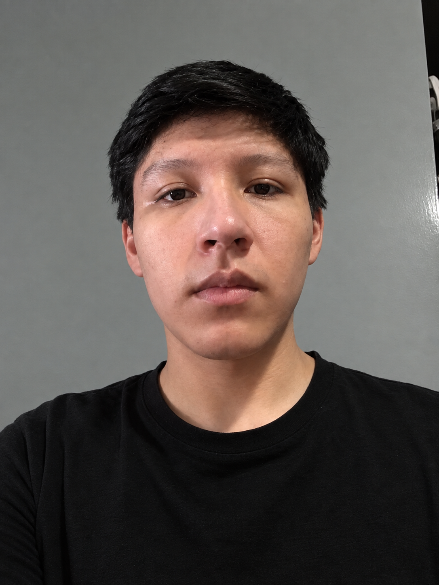

# Capítulo I: Introducción

## 1.1. Startup Profile

### 1.1.1. Descripción de la Startup

OptiFlow es una startup que propone conectar a pacientes y ópticas mediante una aplicación móvil. Surge ante la dispersión de los canales utilizados para consultar establecimientos, conocer su disponibilidad y coordinar una atención. La solución contempla las necesidades de ambos segmentos; en el Sprint 1 prioriza el flujo del paciente para buscar ópticas, consultar horarios y reservar una cita desde su celular.

La misión de OptiFlow es simplificar la búsqueda y reserva de citas ópticas y fortalecer la comunicación entre el establecimiento y sus pacientes. Como parte de la propuesta integral, se plantean recordatorios de citas y alertas de fechas relevantes que faciliten el seguimiento por parte del optometrista o del personal autorizado para gestionar la agenda.

La visión de OptiFlow es convertirse en una plataforma de referencia para el agendamiento y la fidelización en el sector óptico, conectando a pacientes que necesitan atención visual con establecimientos que buscan ofrecer un servicio organizado y mantener relaciones duraderas con sus clientes.

**Alcance de la aplicación:** la propuesta integral comprende la búsqueda de ópticas, la consulta de catálogos y disponibilidad, la reserva de citas y el seguimiento posterior del paciente. Para TB1, el incremento del Sprint 1 se concentra en la búsqueda y reserva, correspondientes a US05 y US06. Las funciones de fidelización, notificaciones y gestión interna forman parte del diseño general; su definición no implica que todas estén implementadas en la aplicación móvil de esta entrega.

### 1.1.2. Perfiles de integrantes del equipo

La [Tabla 1-001](#tabla-1-001) presenta detalle de 1.1.2. Perfiles de integrantes del equipo y permite revisar los elementos documentados en esta sección.

**Tabla 1-001. Detalle de 1.1.2. Perfiles de integrantes del equipo.**

La evidencia de 1.1.2. Perfiles de integrantes del equipo se presenta en [Figura 1-001](#figura-1-001), [Figura 1-002](#figura-1-002), [Figura 1-003](#figura-1-003), [Figura 1-004](#figura-1-004), [Figura 1-005](#figura-1-005).

|Foto|Apellido y Nombre| 
| --- | --- |
 | Atoche Gonzales - Nicolas Fernando - u20241d317 Actualmente estoy en el sexto ciclo de la carrera de ingeniería de software. Poseo un conocimiento básico/intermedio en programación con C++, Lua, Luau, Python y Java. Además, cuento con conocimientos básicos en el desarrollo de videojuegos. Suelo orientarme por el conocimiento y el pensamiento lógico, con lo cual suelo buscar la solución más óptima y ágil dentro de un problema a través de pasos sencillos y definidos que construyan una base sólida donde pueda desarrollar respuestas claras y efectivas.
 | Felix Orlando Becerra Ttito - u20211b387 Soy estudiante de Ingeniería de Software, interesado en el desarrollo de soluciones tecnológicas y en la creación de aplicaciones que permitan resolver problemas de manera práctica y eficiente. He adquirido experiencia trabajando con tecnologías como Java, Python, HTML, CSS y bases de datos, participando en proyectos de desarrollo frontend y backend. Me considero una persona responsable, perseverante y con disposición para aprender nuevas tecnologías. Valoro el trabajo en equipo y busco aportar de manera activa en cada proyecto, mejorando continuamente mis conocimientos y habilidades para afrontar nuevos retos en el ámbito tecnológico.
 | Celis Berrospi Eslander - u201911249 Soy estudiante de Ingeniería de Software. Me considero una persona responsable y comprometida con mis objetivos, con una gran disposición para aprender y mejorar de manera continua. Valoro mucho la ética y el trabajo en equipo, aportando siempre ideas y soluciones para alcanzar resultados de calidad. Me esfuerzo por mantener un enfoque ordenado en mis tareas y contribuir activamente al desarrollo colectivo. Tengo conocimientos en Python, C++ y HTML, lo que me permite desarrollar soluciones tecnológicas y fortalecer mis habilidades en programación. Estoy motivado a seguir aprendiendo y asumir nuevos retos que me ayuden a crecer tanto profesional como personalmente.
 | Mariana Morocho Pinedo - u202411521 Soy estudiante de Ingeniería de Software. Cuento con conocimientos en lenguajes de programación como C++, Python y Java, los cuales he aplicado en distintos proyectos académicos orientados a la resolución de problemas y desarrollo de sistemas. Me caracterizo por ser proactiva y  con disposición de generar un buen ambiente.
 | Quispe Llacsahuanga César Agusto - u202417405 Soy estudiante de Ingeniería de Software, interesado en el desarrollo de soluciones tecnológicas y el aprendizaje continuo en herramientas de programación. Cuento con conocimientos en lógica de programación, bases de datos y desarrollo de aplicaciones, lo que me permite contribuir en la construcción de sistemas eficientes. Me caracterizo por ser responsable, proactivo y con buena disposición para el trabajo en equipo, adaptándome a nuevos retos y aportando en el cumplimiento de los objetivos del proyecto.

**Figura 1-001. Evidencia visual de 1.1.2. Perfiles de integrantes del equipo.**

**Figura 1-002. Evidencia visual de 1.1.2. Perfiles de integrantes del equipo.**

**Figura 1-003. Evidencia visual de 1.1.2. Perfiles de integrantes del equipo.**

**Figura 1-004. Evidencia visual de 1.1.2. Perfiles de integrantes del equipo.**

**Figura 1-005. Evidencia visual de 1.1.2. Perfiles de integrantes del equipo.**

## 1.2. Solution Profile

### 1.2.1. Antecedentes y problemática

El problema central identificado se relaciona con la dificultad que enfrentan los pacientes para encontrar y reservar una cita óptica de manera rápida, organizada y centralizada. Actualmente, un paciente que necesita renovar sus lentes o realizarse un control visual puede verse obligado a consultar diferentes ópticas mediante llamadas, redes sociales, páginas web o visitas presenciales, sin contar necesariamente con un espacio único donde pueda comparar establecimientos, horarios y disponibilidad de atención. Esta situación genera una experiencia fragmentada y aumenta el tiempo necesario para encontrar una alternativa que se adapte a sus preferencias.

Por otro lado, una vez que el paciente ya es atendido por una óptica, se presenta una segunda problemática relacionada con el seguimiento y la comunicación. La gestión de citas, recordatorios y fechas importantes de los pacientes puede depender de registros manuales, hojas de cálculo, agendas personales o canales informales de comunicación. Esto dificulta que el optometrista o el personal autorizado para realizar esta gestión pueda mantener un seguimiento oportuno de su cartera de pacientes.

Esta situación puede generar inasistencias, pérdida de oportunidades de fidelización y una comunicación poco constante con los clientes. Por ello, la problemática no solo afecta al paciente, sino también a la capacidad de la óptica para organizar su agenda, mantener una relación cercana con sus clientes y aprovechar de manera eficiente los espacios disponibles para atención.

**What / ¿Qué?**

La problemática central comprende dos aspectos relacionados. Por un lado, existe una falta de centralización en la búsqueda y reserva de citas ópticas, lo que obliga al paciente a consultar diferentes establecimientos sin contar con información integrada sobre disponibilidad, horarios y opciones de atención. Por otro lado, existe una limitada automatización del seguimiento de citas y fechas relevantes de los pacientes, dificultando que el optometrista o el personal autorizado pueda realizar recordatorios y mantener una comunicación oportuna.

**When / ¿Cuándo?**

La problemática se presenta principalmente cuando un paciente necesita encontrar una óptica y programar una atención visual, especialmente cuando requiere comparar diferentes alternativas antes de tomar una decisión. Desde la perspectiva de la óptica, se manifiesta durante la gestión diaria de la agenda, cuando es necesario controlar las citas próximas, identificar espacios disponibles y realizar seguimiento a los pacientes para reducir inasistencias o fortalecer la relación con ellos.

**Where / ¿Dónde?**

La problemática se presenta principalmente en ópticas independientes y cadenas medianas que gestionan la atención de sus pacientes mediante diferentes canales y herramientas. Para el paciente, la búsqueda puede realizarse mediante llamadas, redes sociales, páginas web o visitas presenciales. Para el personal de la óptica, la gestión puede encontrarse distribuida entre agendas, hojas de cálculo y medios de comunicación como WhatsApp, dificultando la centralización de la información.

**Who / ¿Quién?**

La problemática afecta principalmente a dos grupos:

- **Pacientes:** necesitan invertir tiempo en buscar establecimientos, consultar disponibilidad y coordinar una cita, sin disponer necesariamente de un canal único que centralice estas acciones.
- **Optometristas y personal autorizado de gestión:** necesitan administrar las citas y mantener el seguimiento de sus pacientes, pero pueden depender de procesos manuales que dificultan el control de la agenda, los recordatorios y las oportunidades de fidelización.

**Why / ¿Por qué?**

El problema persiste cuando los canales utilizados por la óptica no integran la búsqueda del establecimiento, la disponibilidad, la reserva y el seguimiento posterior. La dependencia de agendas manuales o herramientas generales dificulta mantener información consistente entre el paciente y el personal. Esta situación constituye una oportunidad de integración para OptiFlow, sin suponer que no existan otras soluciones en el mercado.

Como consecuencia, la información puede permanecer dispersa entre diferentes canales y aumentar la posibilidad de olvidar citas, realizar seguimientos tardíos o perder oportunidades de mantener una relación continua con los pacientes.

**How / ¿Cómo?**

OptiFlow abordará esta problemática mediante una aplicación móvil que permitirá al paciente buscar ópticas disponibles, consultar información relevante sobre los establecimientos y reservar una cita seleccionando una fecha y horario disponible.

De manera complementaria, la plataforma permitirá gestionar las citas y generar notificaciones y recordatorios para los pacientes. Estas alertas podrán ser consultadas por el optometrista o por el personal autorizado al que se delegue la gestión, permitiendo realizar un seguimiento oportuno de las citas y de fechas relevantes de los pacientes.

De esta manera, OptiFlow busca conectar el proceso de descubrimiento y reserva realizado por el paciente con la gestión y seguimiento realizado por la óptica, reduciendo la dependencia de procesos manuales y canales dispersos.

**How much / ¿Cuánto?**

La dimensión del problema puede observarse principalmente en el impacto que generan las inasistencias y la gestión manual de las citas. Una revisión sistemática de 105 estudios sobre citas médicas encontró una tasa promedio de inasistencia de aproximadamente **23%**, evidenciando que la pérdida de citas constituye un problema relevante para la utilización eficiente de los recursos disponibles.

Asimismo, una revisión sistemática y metaanálisis que analizó 26 estudios encontró que las notificaciones electrónicas incrementaron la asistencia a las citas: los pacientes que recibieron recordatorios presentaron una asistencia del **67% frente al 54%** del grupo sin notificaciones y fueron aproximadamente **25% menos propensos a no asistir** a sus citas.

Estos resultados permiten establecer una relación directa con la problemática identificada en OptiFlow: la automatización de recordatorios puede contribuir a disminuir las inasistencias y mejorar el aprovechamiento de los horarios disponibles. Por ello, la plataforma busca generar un impacto medible mediante indicadores como:

- **Tasa de inasistencia a citas.**
- **Porcentaje de citas confirmadas mediante recordatorios.**
- **Cantidad de citas reservadas mediante la plataforma.**
- **Cantidad de pacientes que reciben recordatorios oportunamente.**
- **Tiempo promedio requerido para encontrar y reservar una cita.**
- **Número de pacientes con seguimiento activo.**

Además, el uso de sistemas electrónicos para gestionar información clínica puede contribuir a mejorar la eficiencia operativa. Una revisión sistemática y metaanálisis encontró una reducción promedio de **22.4% en el tiempo de documentación** asociada al uso de historias clínicas electrónicas, lo que respalda el valor de centralizar la información clínica y reducir procesos manuales.

Es importante señalar que estos porcentajes corresponden a estudios realizados en diferentes contextos sanitarios y **no representan directamente una estimación del mercado peruano de ópticas**. Por ello, para OptiFlow se plantea utilizar estos resultados como referencia y posteriormente medir el impacto real de la solución mediante los indicadores definidos durante la validación del producto.

### 1.2.2. Lean UX Process

Nuestro servicio ofrece una aplicación móvil centrada en el paciente, que le permite descubrir ópticas, comparar modelos y reservar una cita en el lugar, fecha y hora de su preferencia, sin necesidad de desplazarse físicamente. En paralelo, dota al optometrista —y al personal en quien delegue la gestión— de un sistema de notificaciones que le recuerda sus citas y las fechas relevantes de sus pacientes, como cumpleaños, fortaleciendo así la relación de fidelidad entre la óptica y su comunidad. Hemos observado que, hoy en día, el paciente no cuenta con un canal único para buscar y reservar citas ópticas, mientras que el optometrista carece de herramientas que le permitan mantenerse proactivamente pendiente de su cartera de pacientes. Esto provoca una experiencia de búsqueda frustrante para el paciente y oportunidades de fidelización perdidas para la óptica. ¿De qué manera podemos, mediante una aplicación móvil, facilitarle al paciente la búsqueda y reserva de citas ópticas, y a la vez dotar al optometrista de un sistema de notificaciones que le permita ser más puntual y proactivo con su comunidad de pacientes?

#### 1.2.2.1. Lean UX Problem Statements

OptiFlow fue diseñado para permitir que el paciente pueda buscar, comparar y reservar una cita óptica —eligiendo modelo, fecha, hora y local— directamente desde su celular, sin necesidad de desplazarse óptica por óptica. En paralelo, permite que el optometrista, o la persona en quien delegue la gestión, reciba notificaciones sobre sus citas próximas y sobre fechas relevantes de sus pacientes, como cumpleaños, facilitando una comunicación más clara y oportuna. Sin embargo, hemos observado que actualmente el paciente no cuenta con un canal centralizado para conocer la disponibilidad de las distintas ópticas, lo que lo obliga a invertir tiempo desplazándose o llamando de establecimiento en establecimiento. Del lado de la óptica, el optometrista suele perder de vista su agenda y las fechas importantes de sus pacientes en medio de la atención diaria, debilitando el vínculo de fidelidad que caracteriza a este tipo de negocios. Esta situación provoca una experiencia de búsqueda poco eficiente para el paciente y oportunidades de fidelización perdidas para la óptica, limitando el crecimiento de una relación de largo plazo entre ambos. ¿Cómo podríamos ofrecer una aplicación móvil que facilite al paciente encontrar y reservar su cita óptica ideal, y que a la vez ayude al optometrista a ser más puntual y proactivo con su comunidad de pacientes mediante notificaciones inteligentes?

#### 1.2.2.2. Lean UX Assumptions

**Preguntas sobre el Producto / Usuario (User Assumptions)**

**¿Quién es el usuario?**
> Nuestro usuario principal y prioritario es el paciente que busca un servicio óptico. De forma secundaria, atendemos a la óptica: el optometrista y, en caso de delegación, la persona encargada de la gestión.
> - El paciente utilizará la aplicación móvil para buscar ópticas, comparar modelos y reservar su cita en el lugar, fecha y hora que prefiera.
> - El optometrista recibirá notificaciones sobre sus citas próximas y sobre fechas relevantes de sus pacientes, como cumpleaños.

**¿Dónde encaja nuestro producto en su trabajo o vida?**
> Para el paciente, será el primer punto de contacto al momento de necesitar un servicio óptico, reemplazando la búsqueda física de óptica en óptica o las llamadas telefónicas dispersas. Para el optometrista, será una extensión de su agenda diaria en el celular, presente desde que se despierta (recordatorio de la primera cita del día) hasta el cierre de operaciones, reemplazando:
> - La búsqueda manual y presencial de disponibilidad en ópticas.
> - Las agendas en papel o los recordatorios informales de citas y cumpleaños.
> - La coordinación telefónica entre el optometrista y la persona de gestión.

**¿Qué problemas tiene nuestro producto que resolver?**
> La fricción del paciente al buscar y reservar una cita óptica, y la falta de proactividad del optometrista en el seguimiento de su cartera de pacientes. Específicamente:
> - La pérdida de tiempo del paciente al desplazarse óptica por óptica para conocer disponibilidad y modelos.
> - La dificultad del paciente para elegir, en un solo lugar, el modelo, la fecha, la hora y el local de su preferencia.
> - El olvido de citas próximas y de fechas relevantes (cumpleaños) por parte del optometrista.
> - La falta de un canal claro para delegar el seguimiento de pacientes a otra persona sin perder visibilidad.

**¿Cuándo y cómo es usado nuestro producto?**
> El paciente lo usará de forma puntual, cada vez que necesite agendar o renovar un servicio óptico, desde cualquier lugar y en el momento que le resulte conveniente. El optometrista (o la persona de gestión) lo usará de forma continua durante la jornada, principalmente:
> - Al inicio del día, para revisar las citas y recordatorios pendientes.
> - Durante la jornada, al recibir notificaciones en tiempo real sobre citas próximas o cumpleaños de pacientes.
> - Al delegar tareas de seguimiento, manteniendo visibilidad compartida con la persona encargada de la gestión.

**¿Qué características son importantes?**
> - Buscador de ópticas con catálogo de modelos disponibles.
> - Reserva de citas eligiendo modelo, fecha, hora y local, desde el celular.
> - Notificaciones push al optometrista sobre citas próximas y cumpleaños de pacientes.
> - Delegación de la gestión de notificaciones a una persona designada, sin perder visibilidad.

**¿Cómo debe verse nuestro producto y cómo debe comportarse?**
> Debe ser simple, cercano y confiable, priorizando la facilidad de uso del paciente y la inmediatez de las notificaciones para el optometrista.
> - El flujo de búsqueda y reserva de cita debe completarse en pocos pasos, sin fricciones, y ser operable a una sola mano.
> - Las notificaciones deben ser claras, oportunas y accionables (por ejemplo, permitir confirmar, reprogramar o delegar una cita con un solo tap).

---

**Business Assumptions**

> Creo que mis clientes necesitan una herramienta móvil que:
> - Les permita captar pacientes que hoy buscan alternativas óptica por óptica.
> - Fortalezca la fidelidad de su comunidad de pacientes mediante comunicación oportuna.
> - Reduzca las inasistencias y el desorden en el seguimiento de citas y fechas relevantes.
> - Permita delegar la gestión de la comunicación sin perder control ni visibilidad.

> Estas necesidades se pueden resolver con:
> La implementación de nuestra aplicación móvil, que conecta al paciente con la óptica desde el momento de la búsqueda y reserva de la cita, y sostiene esa relación en el tiempo mediante notificaciones automáticas de citas y fechas relevantes al optometrista o a quien delegue esta tarea.

**Clientes iniciales:**
> Ópticas independientes y cadenas medianas en Lima Metropolitana que:
> - Buscan atraer nuevos pacientes que hoy comparan alternativas de forma manual.
> - Desean fidelizar a su cartera de pacientes existente mediante una comunicación más cercana y oportuna.

**Propuesta de valor**
> **Para el paciente:**
> - Encontrar y reservar su cita óptica ideal sin desplazarse físicamente de óptica en óptica.
> - Elegir el modelo, la fecha, la hora y el local de su preferencia, todo desde el celular.
> - Sentirse parte de una comunidad fiel a su óptica de confianza.
> 
> **Para el optometrista / la óptica:**
> - Ser más puntual y proactivo gracias a notificaciones automáticas de citas y cumpleaños.
> - Fortalecer la fidelización de pacientes antiguos y nuevos.
> - Delegar el seguimiento de la agenda en una persona de gestión sin perder visibilidad.

**Beneficios adicionales:**
> **Óptica:**
> - Mayor captación de pacientes nuevos que buscan reservar sin desplazarse.
> - Menor dependencia de la memoria o de canales informales para el seguimiento de citas.
> - Mejor clima de comunicación entre el optometrista y la persona de gestión.
> 
> **Paciente:**
> - Ahorro de tiempo al comparar y reservar en un solo lugar.
> - Sensación de cercanía y pertenencia a la comunidad de la óptica.

**Estrategia de adquisición de clientes**
> - Ventas directas B2B a ópticas independientes y cadenas medianas.
> - Demostraciones en vivo de la aplicación en el propio establecimiento.
> - Programas piloto gratuitos limitados en sucursales.
> - Del lado del paciente: presencia en tiendas de aplicaciones y recomendación boca a boca dentro de la comunidad de cada óptica.

**Modelo de ingresos**
> Modelo B2B tipo SaaS (Software as a Service) móvil, cobrado a las ópticas:
> - Suscripciones mensuales o anuales.
> - Escaladas según:
>   - Número de sucursales conectadas.
>   - Cantidad de citas o notificaciones gestionadas.
>   - Cantidad de dispositivos/usuarios activos (optometrista + persona de gestión).

**Competencia**
> - Búsqueda manual boca a boca o desplazamiento físico óptica por óptica.
> - Coordinación de citas vía llamadas telefónicas o WhatsApp.
> - Apps genéricas de reserva de citas sin especialización en el sector óptico.

**Ventaja competitiva**
> Proponemos una solución especializada en el sector óptico, con una experiencia centrada en dispositivos móviles, que:
> 
> - Centraliza la búsqueda, comparación y reserva de citas ópticas para el paciente.
> - Fortalece la fidelización mediante notificaciones inteligentes al optometrista.
> - Permite delegar el seguimiento de la agenda sin perder control ni visibilidad.
> 
> La propuesta integra la experiencia del paciente con los procesos de atención del establecimiento.

**Riesgos principales**
> - Baja adopción inicial del paciente si no conoce o no confía en la app.
> - Resistencia al cambio del personal acostumbrado a la agenda en papel o WhatsApp.
> - Dependencia de que las ópticas mantengan actualizada su disponibilidad y catálogo de modelos.

**Mitigación**
> - Diseñar una interfaz móvil clara y evaluar su facilidad de uso con los segmentos objetivo.
> - Onboarding simple y programas piloto/promocionales para incentivar la primera reserva.
> - Interfaces simplificadas y notificaciones claras para el optometrista y la persona de gestión.

**Suposiciones tecnológicas**
> Se asume que las ópticas cuentan con:
> 
> - Smartphones o tablets para su personal operativo.
> - Red Wi-Fi estable o planes de datos móviles.
> 
> **Riesgo:**  
> Si no hay internet confiable, el modelo SaaS móvil podría experimentar interrupciones en la sincronización.
> 
> **Posible solución:**  
> Evaluar una arquitectura *offline-first* para la aplicación móvil, que guarde los datos localmente y los sincronice en background al recuperar la conexión.

#### 1.2.2.3. Lean UX Hypothesis Statements

**Gestión Clínica y Comercial Integrada**

Creemos que integrar la historia clínica y las cotizaciones en una aplicación móvil facilitará el trabajo de los optómetras y asesores comerciales, al reducir la transcripción repetida de datos entre la evaluación y la venta. Planteamos como meta experimental aumentar la conversión de ventas en un 20% y reducir los errores de transcripción. Contrastaremos esta hipótesis comparando registros antes y después del uso de la solución, junto con entrevistas al personal. Estas metas son criterios de evaluación futuros y no resultados obtenidos en TB1.

**Trazabilidad mediante Tablero Kanban Móvil**

Creemos que un tablero Kanban móvil permitirá al personal y al laboratorio consultar y actualizar el estado de las órdenes de trabajo con mayor claridad. La hipótesis plantea reducir los tiempos de entrega en al menos un 25% y alcanzar un cumplimiento superior al 95% de los plazos prometidos. Se evaluará mediante la comparación de tiempos registrados, incidencias y comentarios del personal; estos valores son metas pendientes de validación.

**Consulta Ágil de Inventario por Cámara**

Creemos que consultar stock y precios mediante el escaneo de códigos QR o de barras facilitará la preparación de cotizaciones frente al cliente y reducirá las diferencias entre el inventario registrado y las existencias físicas. La hipótesis se contrastará mediante tiempos de consulta, incidencias de inventario y comentarios de los asesores. La función se plantea como parte del diseño y no como un resultado validado del Sprint 1.

**Seguimiento y Notificaciones Push para Pacientes**

Creemos que el seguimiento móvil de pedidos y las notificaciones oportunas reducirán la incertidumbre del paciente y las consultas manuales atendidas por el personal. Se plantea como meta disminuir estas consultas en un 80% durante los primeros tres meses de uso. La evaluación considerará el volumen de consultas antes y después de la adopción y la satisfacción reportada por los pacientes. Esta meta requiere una evaluación posterior en operación real.

#### 1.2.2.4. Lean UX Canvas

La evidencia de 1.2.2.4. Lean UX Canvas se presenta en [Figura 1-006](#figura-1-006).

**Figura 1-006. Evidencia visual de 1.2.2.4. Lean UX Canvas.**

## 1.3. Segmentos objetivo

### Segmento 1: Staff de la Óptica (Optómetras y Asesores Comerciales)
Este segmento agrupa a los usuarios operativos internos del ecosistema móvil, combinando las funciones clínicas y comerciales del establecimiento. Incluye al optometrista, encargado de realizar el examen visual y gestionar el historial clínico, y al asesor de lentes, responsable de atraer al paciente, guiar la selección del producto y cerrar la venta. Son profesionales de entre 22 y 55 años, de nivel socioeconómico B y C, radicados en zonas urbanas de Lima Metropolitana y ciudades con alta concentración comercial como Arequipa, Trujillo, Piura y Chiclayo. 

A nivel de mercado, el sector óptico en Perú alcanzó un volumen de USD 295,05 millones en 2025 y proyecta llegar a USD 403,93 millones en 2035 (CAGR 3,60%, Informes de Expertos, 2026). Este crecimiento exige herramientas de gestión más sofisticadas, impulsado también por un incremento del 8% anual en la contratación de personal comercial del rubro (MTPE, 2025). El mercado peruano presenta una alta fragmentación, siendo el objetivo principal de OptiFlow los negocios independientes que operan entre una y diez tiendas (Infomercado, 2026). Estos enfrentan una creciente presión operativa debido a un aumento del consumo del 10% anual (Modaengafas, 2026) y metas estrictas de facturación y venta cruzada (Cámara de Comercio de Lima, 2025). El personal experimenta frustración ante sistemas fragmentados, duplicidad de registros manuales, falta de información de stock en tiempo real y descoordinación con el laboratorio. Requieren herramientas móviles ágiles que unifiquen la historia clínica, muestren catálogos completos y optimicen la trazabilidad de las órdenes.

### Segmento 2: Clientes de la óptica (Pacientes)
Los pacientes son los consumidores finales y usuarios del portal móvil de seguimiento de OptiFlow. Son personas de entre 18 y 60 años o más, de nivel socioeconómico transversal (A, B, C y D), residentes en zonas urbanas. Dado que el 80,4% de la población peruana vive en áreas urbanas con una edad media de 29,8 años (Informes de Expertos, 2026), conforman un mercado potencial masivo con una creciente necesidad de corrección visual generada por el uso intensivo de dispositivos digitales. 

La prevalencia de problemas visuales va en aumento continuo, destacando la demanda de lentes progresivos que ya representan el 80% del mercado global (Gestión, 2025). El comportamiento de este segmento está marcado por agendas ajustadas y altas expectativas de atención y servicio. Usualmente experimentan frustración ante las demoras en las entregas, la falta de comunicación proactiva sobre el estado de sus pedidos y los errores en la fabricación. A través del ecosistema de la aplicación móvil, se convierten en los principales beneficiarios de la eficiencia operativa: reciben notificaciones push automatizadas, logran visibilidad del estado de sus lentes y aseguran entregas puntuales sin reprocesos.
