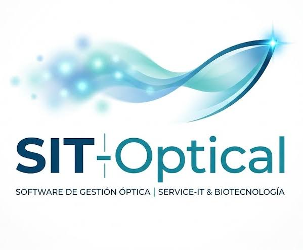
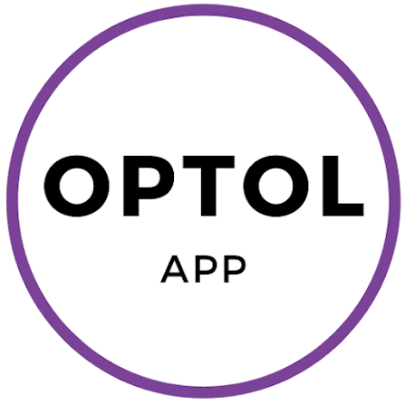

# Capítulo II: Requirements Development and Software Solution Design

## 2.1. Competidores
Para comprender la posición de OptiFlow dentro del mercado de soluciones digitales orientadas al sector óptico, se identificaron competidores que ofrecen productos con funcionalidades relacionadas con la gestión clínica, comercial, administrativa y logística de ópticas. El análisis considera soluciones que atienden necesidades similares a las identificadas en el Capítulo I, tales como el registro de historias clínicas, el control de inventario, la gestión de ventas, el seguimiento de órdenes de trabajo y la administración de múltiples sucursales.

Se seleccionaron tres competidores: SIT-OPTICAL, OptiGestion y OPTOL. Los dos primeros presentan una orientación directa hacia el mercado peruano, mientras que OPTOL posee una propuesta con presencia internacional y una mayor trayectoria dentro del sector óptico.

**SIT-OPTICAL:**  Es una plataforma SaaS especializada en la gestión de ópticas en Perú. Su propuesta integra historia clínica optométrica, inventario multitienda, facturación electrónica mediante SUNAT, CRM especializado y herramientas de Business Intelligence. Asimismo, cuenta con funcionalidades de gestión de laboratorio, compras, recursos humanos y automatización mediante inteligencia artificial. La plataforma opera completamente en la nube y puede ser utilizada desde computadoras, tablets o teléfonos mediante navegador web. :contentReference[oaicite:0]{index=0}

**OptiGestion:**  Es una solución SaaS dirigida a ópticas, consultorios oftalmológicos y centros de salud visual del mercado peruano. La plataforma incluye funcionalidades de admisión de pacientes, historias clínicas, recetas digitales, cálculo de lunas y tratamientos, cotizaciones, inventario multi-sucursal, punto de venta y un Kanban logístico para el seguimiento de pedidos. Actualmente se encuentra en fase beta y desarrolla una estrategia de adquisición basada en un programa de usuarios fundadores. :contentReference[oaicite:1]{index=1}

**OPTOL:**  Es una plataforma SaaS especializada en ópticas, laboratorios ópticos y almacenes. Su propuesta integra gestión de inventario, ficha médica, ventas, órdenes de trabajo, facturación, campañas de marketing, laboratorios y múltiples sucursales. La solución se encuentra disponible desde diferentes dispositivos y permite utilizar la cámara de teléfonos o tablets para realizar operaciones relacionadas con inventario. También ofrece seguimiento de órdenes de trabajo y notificaciones automáticas para pacientes. :contentReference[oaicite:2]{index=2}

La selección de estos competidores permite contrastar la propuesta de OptiFlow con soluciones existentes que ya cubren parcialmente las necesidades identificadas. Por este motivo, el análisis no se limita a comparar funcionalidades, sino que busca identificar oportunidades reales de diferenciación en términos de movilidad, experiencia de usuario, integración entre áreas y trazabilidad del flujo completo de una orden óptica.

### 2.1.1. Análisis competitivo

El análisis competitivo tiene como objetivo identificar las principales diferencias entre OptiFlow y las soluciones existentes para la gestión de ópticas, permitiendo reconocer oportunidades de diferenciación y establecer estrategias frente a los principales competidores del mercado.

<table>
  <thead>
    <tr>
      <th colspan="6">Competitive Analysis Landscape</th>
    </tr>
  </thead>

  <tbody>
    <tr>
      <td><strong>¿Por qué llevar a cabo este análisis?</strong></td>
      <td colspan="5">
        Determinar cómo puede OptiFlow diferenciarse de las soluciones digitales existentes para ópticas mediante una experiencia mobile-first que integre los procesos clínicos, comerciales y logísticos, reduzca la fragmentación de información y mejore la trazabilidad de las órdenes de trabajo.
      </td>
    </tr>
    <tr>
      <td colspan="2"><strong>Competidor</strong></td>
      <td align="center">
    <strong>OptiFlow</strong>  
    
  </td>

  <td align="center">
    <strong>SIT-OPTICAL</strong>  
    
  </td>

  <td align="center">
    <strong>OptiGestion</strong>  
    
  </td>

  <td align="center">
    <strong>OPTOL</strong>  
    
  </td>
    </tr>
    <!-- PERFIL -->
    <tr>
      <td rowspan="2"><strong>Perfil</strong></td>
      <td><strong>Overview</strong></td>
      <td>
        Solución digital especializada en ópticas que integra gestión clínica, inventario, ventas y seguimiento de órdenes de trabajo, con énfasis en una experiencia móvil diferenciada según los roles del negocio.
      </td>
      <td>
        Plataforma SaaS especializada en ópticas peruanas que integra historia clínica, inventario multitienda, CRM, facturación electrónica y herramientas de gestión empresarial.
      </td>
      <td>
        Plataforma SaaS dirigida a ópticas y consultorios que integra historias clínicas, inventario, ventas, cotizaciones y seguimiento logístico de pedidos.
      </td>
      <td>
        Plataforma especializada en la gestión de ópticas, laboratorios y almacenes, con funcionalidades clínicas, comerciales, administrativas y logísticas.
      </td>
    </tr>
    <tr>
      <td>
        <strong>Ventaja competitiva 
        ¿Qué valor ofrece a los clientes?</strong>
      </td>
      <td>
        Integración continua entre consultorio, ventas y laboratorio mediante una experiencia mobile-first. Busca reducir errores de transcripción, tiempos de atención y dependencia de estaciones de trabajo fijas.
      </td>
      <td>
        Amplia cobertura funcional adaptada al mercado peruano, incluyendo gestión multitienda, facturación electrónica e integración de diferentes procesos administrativos.
      </td>
      <td>
        Centralización de procesos clínicos, comerciales y logísticos dentro de una solución orientada específicamente a establecimientos ópticos.
      </td>
      <td>
        Amplia experiencia en el sector óptico, soporte para múltiples sucursales, laboratorios y almacenes, además de funcionalidades disponibles desde dispositivos móviles.
      </td>
    </tr>
    <!-- PERFIL DE MARKETING -->
    <tr>
      <td rowspan="2"><strong>Perfil de Marketing</strong></td>
      <td><strong>Mercado objetivo</strong></td>
      <td>
        Ópticas medianas y cadenas en crecimiento que necesitan mejorar la coordinación entre administradores, optómetras, asesores de ventas y personal de laboratorio.
      </td>
      <td>
        Optómetras independientes, ópticas comerciales y cadenas de ópticas principalmente del mercado peruano.
      </td>
      <td>
        Ópticas, consultorios oftalmológicos y centros especializados en salud visual.
      </td>
      <td>
        Ópticas independientes, cadenas de ópticas, laboratorios ópticos y almacenes especializados.
      </td>
    </tr>
    <tr>
      <td><strong>Estrategias de marketing</strong></td>
      <td>
        Demostraciones B2B, pruebas piloto, Landing Page, difusión digital y validaciones directas con establecimientos ópticos.
      </td>
      <td>
        Demostraciones del producto, periodos de prueba, planes escalables y atención comercial mediante canales digitales.
      </td>
      <td>
        Programa de usuarios fundadores, acceso durante la etapa beta y captación temprana de ópticas interesadas en digitalizar sus operaciones.
      </td>
      <td>
        Demostraciones comerciales, pruebas del servicio, presencia digital, testimonios de clientes y comercialización internacional.
      </td>
    </tr>
    <!-- PERFIL DE PRODUCTO -->
    <tr>
      <td rowspan="3"><strong>Perfil de Producto</strong></td>
      <td><strong>Productos &amp; Servicios</strong></td>
      <td>
        Historia clínica digital, gestión de inventario, ventas, seguimiento Kanban de órdenes de trabajo, notificaciones push, consulta de stock y seguimiento de pedidos.
      </td>
      <td>
        Historia clínica, inventario multitienda, CRM, facturación electrónica, agenda, gestión de laboratorio, reportes y herramientas empresariales.
      </td>
      <td>
        Historias clínicas, admisión de pacientes, cotizaciones, inventario multi-sucursal, punto de venta y seguimiento Kanban de pedidos.
      </td>
      <td>
        Ficha médica, inventarios, ventas, facturación, órdenes de laboratorio, almacenes, agenda, marketing y reportes.
      </td>
    </tr>
    <tr>
      <td><strong>Precios &amp; Costos</strong></td>
      <td>
        Modelo SaaS por validar con los segmentos objetivo. Se proyecta una suscripción escalable según número de usuarios o sucursales.
      </td>
      <td>
        Modelo de suscripción mensual mediante diferentes planes según funcionalidades y tamaño de la operación.
      </td>
      <td>
        Modelo SaaS actualmente asociado a una estrategia de captación temprana mediante acceso beta y beneficios para usuarios fundadores.
      </td>
      <td>
        Modelo de suscripción mediante planes diferenciados de acuerdo con las funcionalidades y necesidades del establecimiento.
      </td>
    </tr>
    <tr>
      <td><strong>Canales de distribución (Web y/o Móvil)</strong></td>
      <td>
        Aplicación móvil nativa o multiplataforma, servicios RESTful y Landing Page web.
      </td>
      <td>
        Plataforma SaaS accesible principalmente mediante navegador web desde diferentes dispositivos.
      </td>
      <td>
        Plataforma SaaS web accesible mediante navegador.
      </td>
      <td>
        Plataforma SaaS accesible mediante navegadores web, smartphones y tablets.
      </td>
    </tr>
    <!-- SWOT -->
    <tr>
      <td rowspan="4"><strong>Análisis SWOT</strong></td>
      <td><strong>Fortalezas</strong></td>
      <td>
        Enfoque mobile-first; experiencia según roles; integración clínica, comercial y logística; trazabilidad de órdenes; utilización de recursos del dispositivo móvil.
      </td>
      <td>
        Especialización en el mercado peruano; amplia cobertura funcional; administración multitienda; facturación electrónica y CRM.
      </td>
      <td>
        Especialización en ópticas; integración de procesos clínicos y comerciales; seguimiento Kanban; solución adaptada al contexto local.
      </td>
      <td>
        Trayectoria en el sector; presencia internacional; soporte para ópticas, laboratorios y almacenes; capacidad multitienda y acceso móvil.
      </td>
    </tr>
    <tr>
      <td><strong>Debilidades</strong></td>
      <td>
        Producto nuevo sin una cartera consolidada de clientes; menor reconocimiento de marca; modelo comercial y funcionalidades todavía sujetos a validación.
      </td>
      <td>
        Una amplia cantidad de funcionalidades puede incrementar la complejidad para pequeñas ópticas que únicamente necesitan procesos esenciales.
      </td>
      <td>
        Menor trayectoria y reconocimiento frente a competidores consolidados; producto todavía en proceso de crecimiento.
      </td>
      <td>
        Su amplia cobertura funcional puede generar una mayor complejidad de adopción para establecimientos con necesidades más simples.
      </td>
    </tr>
    <tr>
      <td><strong>Oportunidades</strong></td>
      <td>
        Creciente digitalización de ópticas que todavía utilizan papel, hojas de cálculo y mensajería; aumento del uso de smartphones y necesidad de mayor trazabilidad.
      </td>
      <td>
        Crecimiento de cadenas de ópticas y necesidad de soluciones integradas adaptadas al contexto empresarial peruano.
      </td>
      <td>
        Captación de pequeñas y medianas ópticas que buscan reemplazar procesos manuales mediante soluciones SaaS especializadas.
      </td>
      <td>
        Expansión hacia nuevos mercados y crecimiento de organizaciones que requieren gestionar varias sucursales y laboratorios.
      </td>
    </tr>
    <tr>
      <td><strong>Amenazas</strong></td>
      <td>
        Competidores con mayor trayectoria; resistencia al cambio del personal; aparición de nuevos SaaS especializados y posibilidad de que soluciones existentes fortalezcan sus experiencias móviles.
      </td>
      <td>
        Aparición de soluciones más simples, móviles y especializadas que compitan mediante una experiencia de usuario de menor complejidad.
      </td>
      <td>
        Competidores consolidados con mayor cartera de clientes, recursos y reconocimiento en el mercado.
      </td>
      <td>
        Soluciones locales mejor adaptadas al mercado peruano y nuevos productos especializados en experiencias móviles más simples.
      </td>
    </tr>
  </tbody>
</table>

### 2.1.2. Estrategias y tácticas frente a competidores

A partir del análisis competitivo realizado sobre SIT-OPTICAL, OptiGestion y OPTOL, OptiFlow plantea una serie de estrategias orientadas a responder a las fortalezas de los competidores, aprovechar oportunidades identificadas en sus debilidades y reforzar los elementos diferenciales de la propuesta. Estas estrategias se enfocan principalmente en la simplicidad operativa, la continuidad de la información, la especialización por roles y el aprovechamiento del contexto móvil.

#### Estrategia 1: Simplificación de la experiencia según el rol del usuario

SIT-OPTICAL y OPTOL disponen de una amplia cantidad de módulos y funcionalidades, lo cual representa una fortaleza en términos de cobertura funcional, pero también puede incrementar la complejidad de interacción para usuarios que solo necesitan realizar un conjunto específico de tareas.

OptiFlow buscará aprovechar esta oportunidad mediante una experiencia diferenciada según cada rol. Como tácticas, se plantea desarrollar dashboards específicos para administradores, optómetras, asesores de ventas y personal de laboratorio, limitar las acciones disponibles de acuerdo con sus responsabilidades y priorizar visualmente las tareas de mayor frecuencia e importancia. De esta manera, cada usuario podrá concentrarse únicamente en la información necesaria para cumplir sus objetivos.

#### Estrategia 2: Competencia basada en simplicidad antes que en amplitud funcional

Los competidores más consolidados poseen una cantidad considerable de funcionalidades. Intentar igualar su cobertura desde las primeras versiones podría incrementar la complejidad del producto y desviar los esfuerzos de OptiFlow de los procesos que generan mayor valor.

Como táctica, OptiFlow priorizará inicialmente las funcionalidades asociadas al core business: registro y consulta de información clínica, inventario, ventas, generación y seguimiento de órdenes de trabajo y comunicación con el paciente. Las capacidades complementarias se incorporarán posteriormente únicamente cuando las entrevistas, validaciones y métricas demuestren su relevancia para los segmentos objetivo.

#### Estrategia 3: Reducción de la dependencia de procesos manuales y canales informales

Además de los competidores digitales, OptiFlow debe considerar que muchas ópticas pueden continuar utilizando alternativas como papel, hojas de cálculo o aplicaciones de mensajería. Estas herramientas representan una competencia indirecta debido a su familiaridad y bajo costo de adopción.

Las tácticas consistirán en centralizar las recetas, ventas, inventario y órdenes de trabajo dentro de un mismo ecosistema, mantener un historial trazable de los cambios realizados y automatizar las comunicaciones relacionadas con el estado de los pedidos. El objetivo será que el sistema reduzca tareas manuales en lugar de añadir pasos adicionales al trabajo cotidiano.

#### Estrategia 4: Facilitar la adopción del producto

La resistencia al cambio constituye una amenaza relevante frente a cualquier solución que busque reemplazar procesos previamente realizados mediante herramientas conocidas por el personal.

OptiFlow buscará reducir esta barrera mediante un proceso de adopción progresivo. Entre las tácticas propuestas se encuentran un onboarding guiado, interfaces con terminología propia del dominio óptico, instrucciones contextuales y pruebas piloto con establecimientos reales. Además, las principales tareas deberán poder comprenderse sin necesidad de conocimientos técnicos especializados.

#### Estrategia 5: Fortalecer la trazabilidad y comunicación con el paciente

Los competidores ya incorporan mecanismos relacionados con seguimiento de órdenes y notificaciones, por lo que OptiFlow deberá ofrecer una experiencia clara y consistente en este aspecto para generar valor adicional tanto para el personal como para los pacientes.

Como tácticas, se plantea implementar estados comprensibles para las órdenes, notificaciones push ante cambios relevantes y mecanismos para consultar recetas y seguimiento de pedidos. Esto busca reducir consultas repetitivas mediante llamadas o mensajería y aumentar la transparencia durante el proceso de fabricación de los lentes.

## 2.2. Entrevistas

### 2.2.1. Diseño de entrevistas

Preguntas generales:

1.  Datos de perfil: ¿Podrías indicarme tu nombre,  edad, estado civil y ocupación exacta?
2.  Contexto personal: ¿En qué distrito resides?
3.  Entorno digital: ¿Qué dispositivos (móvil, tablet, laptop) usas más en tu vida diaria y cuáles son tus canales digitales o marcas preferidas para informarte sobre el sector?

**Primer Segmento: *Optómetra***

4.  ¿Cómo describirías el funcionamiento general de tu óptica en el día a día?
5.  ¿Cuáles son las principales responsabilidades que tienes como administrador/a y cuánto tiempo te quita la parte operativa?( Agendamiento, historial médico,etc)
6.  ¿Qué es lo que más valoras en la gestión de una óptica para considerar que el negocio es realmente "eficiente"?
7.  ¿Cómo es actualmente el proceso desde que el cliente elige una montura hasta que el pedido llega al laboratorio?
8.  En cuanto a los historiales médicos, ¿cómo aseguras que la información de la consulta esté disponible inmediatamente para la venta comercial?
9.  ¿Cómo gestionas el inventario para saber exactamente qué tienes en stock y cuándo necesitas reponer sin tener que contar piezas manualmente?
10.  ¿Qué tipo de herramientas o sistemas utilizas hoy para centralizar las ventas, la clínica y la administración?¿Cuáles son?
11.  ¿Qué tan fácil te resulta hoy obtener un reporte de rentabilidad o de productos más vendidos al final del mes?
12.  ¿Cómo es la relación con tus clientes y qué procesos sigues para recordarles que deben volver para un ajuste o una nueva revisión?
13.  ¿Cómo manejas la competencia y qué aspectos consideras que hacen que un cliente prefiera tu servicio frente a una gran cadena?
14.  ¿Qué mejoras o procesos te gustaría automatizar en el futuro para que tú y tu equipo puedan enfocarse más en el paciente y menos en el papeleo?
15.  ¿Cómo imaginas que debería evolucionar una óptica para adaptarse a un mercado donde el cliente espera rapidez y acceso digital a su información

**Segundo Segmento: *Clientes de la óptica***

4. ¿Con qué frecuencia acudes a la óptica a medirte la vista o renovar tus lentes, y por qué motivo principal?
5. ¿Qué tipo de corrección visual utilizas actualmente (visión sencilla, bifocales, progresivos) y cuántas horas al día usas pantallas?
6. ¿Cómo ha sido tu experiencia habitual al momento de esperar por la fabricación o entrega de tus lentes?
7. ¿Alguna vez has experimentado retrasos o errores en la entrega de tus lentes? ¿Cómo te comunicaron ese problema?
8. ¿Cómo prefieres enterarte de que tus lentes ya están listos para ser recogidos (WhatsApp, SMS, llamada)?
9. ¿Te gustaría contar con un historial o carné digital con la receta de tus lentes accesible desde tu teléfono?
10. ¿Qué tan dispuesto/a estarías a recibir recordatorios automáticos sobre tus controles visuales o vencimiento de la receta?
11. ¿Estarías dispuesto/a a rastrear el estado de fabricación de tus lentes mediante un enlace de seguimiento en tiempo real?
12. ¿Qué es lo que más valoras de la atención en una óptica (rapidez, precio, asesoría, puntualidad en la entrega)?
13. ¿Qué canales digitales utilizas para investigar ofertas, marcas de monturas o salud visual antes de comprar?
14. ¿Has tenido problemas para recordar el tipo de luna o tratamiento que compraste en tu última visita?
15. ¿Qué haría que recomiendes una óptica a tus familiares o amigos sobre otras alternativas?

**Tercer Segmento: *Asesor de Lentes***

4. ¿Cómo realizas la cotización y selección de monturas y lunas cuando el paciente sale de la consulta con el optómetra?
5. ¿Cómo verificas si hay disponibilidad (stock) de una montura, luna o tratamiento específico mientras estás con el cliente?
6. ¿Qué problemas enfrentas cuando la receta ingresada por el optómetra no está clara o falta información para enviar al laboratorio?
7. ¿Cómo realizas el seguimiento de los pedidos que están en el laboratorio para dar respuesta a los clientes que consultan?
8. ¿Qué herramientas o materiales usas para mostrar el catálogo completo de productos o explicar beneficios (lentes progresivos, filtros, etc.)?
9. Si contaras con una app en una tablet/móvil para cotizar y mostrar catálogos interactivos al cliente al instante, ¿cómo afectaría tus ventas?
10. ¿Qué información del inventario o precios necesitas tener al alcance de la mano para no perder una venta?
11. ¿Qué tan útil sería para ti recibir una alerta inmediata cuando el laboratorio termine de procesar el lente de un cliente?
12. ¿Qué comisión o meta de venta cruzada (accesorios, tratamientos) te resulta más difícil de cumplir y por qué?
13. ¿En qué redes sociales o comunidades digitales sueles informarte o capacitarte sobre técnicas de venta retail o productos ópticos?
14. ¿Qué es lo más frustrante de tu jornada de trabajo respecto a los sistemas de registro o cobro que utilizas hoy?
15. ¿Qué incentivo o funcionalidad dentro de una app te motivaría a usarla constantemente durante toda tu jornada laboral?

### 2.2.2. Registro de entrevistas

En esta sección presentamos los registros de las entrevistas que hicimos para cada segmento objetivo de nuestra aplicación.

**Segmento 1:**

<table>
<colgroup>
</colgroup>
<thead>
  <tr>
    <th colspan="2">Entrevista #1 </th>
  </tr>
</thead>
<tbody>
  <tr>
    <td>Nombre</td>
    <td></td>
  </tr>
  <tr>
    <td>Apellidos</td>
    <td></td>
  </tr>
  <tr>
    <td>Edad</td>
    <td></td>
  </tr>
  <tr>
    <td>Distrito</td>
    <td></td>
  </tr>
  <tr>
    <td>Evidencia</td>
    <td>
</td>
  </tr>
  <tr>
    <td>Link</td>
    <td>
 <a target="_blank"  href=</td> 
  </tr>
  <tr>
    <td>Duracion </td>
    <td>0:00 min - n</td>
  </tr>
  <tr>
    <td>Resumen</td>
    <td>
</td>
  </tr>
</tbody>
</table>

**Segmento 2:**

| Campo | Detalle |
| :--- | :--- |
| **Entrevista** | **#1** |
| **Nombre** | Azumy Cristal |
| **Apellidos** | Bautista Coral |
| **Edad** | 20 |
| **Distrito** | El Agustino |
| **Evidencia** | 

 |
| **Link** | [Microsoft stream](https://upcedupe-my.sharepoint.com/:v:/g/personal/u202417405_upc_edu_pe/IQBIEeX3NHMTSJ-Hs-6tRzXVAfGqU3hm1XieccvWsvphaTI?nav=eyJyZWZlcnJhbEluZm8iOnsicmVmZXJyYWxBcHAiOiJTdHJlYW1XZWJBcHAiLCJyZWZlcnJhbFZpZXciOiJTaGFyZURpYWxvZy1MaW5rIiwicmVmZXJyYWxBcHBQbGF0Zm9ybSI6IldlYiIsInJlZmVycmFsTW9kZSI6InZpZXcifX0%3D&e=LflBFo) (https://upcedupe-my.sharepoint.com/:v:/g/personal/u202417405_upc_edu_pe/IQBIEeX3NHMTSJ-Hs-6tRzXVAfGqU3hm1XieccvWsvphaTI?nav=eyJyZWZlcnJhbEluZm8iOnsicmVmZXJyYWxBcHAiOiJTdHJlYW1XZWJBcHAiLCJyZWZlcnJhbFZpZXciOiJTaGFyZURpYWxvZy1MaW5rIiwicmVmZXJyYWxBcHBQbGF0Zm9ybSI6IldlYiIsInJlZmVycmFsTW9kZSI6InZpZXcifX0%3D&e=LflBFo)|
| **Duración** | 0:00 min - 7:34 min |
| **Resumen** | Azumy es una estudiante universitaria de 20 años y trabajadora a medio tiempo que reside en El Agustino. Pasa aproximadamente 6 horas diarias frente a pantallas y utiliza lentes de visión sencilla debido a la fatiga visual. Valora la buena asesoría y la puntualidad en la entrega por parte de las ópticas. Mostró gran interés en una solución digital que le permita tener su historial y receta a la mano en el teléfono, dado que suele olvidar qué tipo de luna o tratamiento eligió en compras anteriores. Considera muy útil poder rastrear el estado de fabricación de sus lentes mediante un enlace en tiempo real (comparándolo con la logística de Shalom) y acepta recibir recordatorios de renovación vía WhatsApp. Recomienda que la interfaz de cualquier aplicativo sea sumamente clara y fácil de entender, especialmente pensando en la accesibilidad para adultos mayores. |

| Campo | Detalle |
| :--- | :--- |
| **Entrevista** | **#2** |
| **Nombre** | Alejandro  |
| **Apellidos** | Livano Flores |
| **Edad** | 29 |
| **Distrito** | Chorrillos |
| **Evidencia** | 

 |
| **Link** | [Microsoft stream](https://upcedupe-my.sharepoint.com/:v:/g/personal/u20211b387_upc_edu_pe/IQBMUlBOK_rhRI8Pq8g7udEgAVBBYM9n0z2XQPdOsLIoIWM?e=ekXG8g&nav=eyJyZWZlcnJhbEluZm8iOnsicmVmZXJyYWxBcHAiOiJTdHJlYW1XZWJBcHAiLCJyZWZlcnJhbFZpZXciOiJTaGFyZURpYWxvZy1MaW5rIiwicmVmZXJyYWxBcHBQbGF0Zm9ybSI6IldlYiIsInJlZmVycmFsTW9kZSI6InZpZXcifX0%3D) (https://upcedupe-my.sharepoint.com/:v:/g/personal/u20211b387_upc_edu_pe/IQBMUlBOK_rhRI8Pq8g7udEgAVBBYM9n0z2XQPdOsLIoIWM?e=ekXG8g&nav=eyJyZWZlcnJhbEluZm8iOnsicmVmZXJyYWxBcHAiOiJTdHJlYW1XZWJBcHAiLCJyZWZlcnJhbFZpZXciOiJTaGFyZURpYWxvZy1MaW5rIiwicmVmZXJyYWxBcHBQbGF0Zm9ybSI6IldlYiIsInJlZmVycmFsTW9kZSI6InZpZXcifX0%3D)|
| **Duración** | 0:00 min - 4:36 min |
| **Resumen** | Alejandro es un arquitecto soltero de 29 años que reside en Chorrillos. Pasa entre 8 y 9 horas diarias frente a pantallas debido a su trabajo y acude a la óptica con una frecuencia de cada cuatro meses para revisar su graduación visual. Valora principalmente la rapidez en el servicio y la claridad en la comunicación al momento de atenderse. Mostró gran interés en contar con un historial o carné digital en el celular para consultar su receta y tratamientos, ya que no suele recordar con exactitud las especificaciones técnicas de sus lunas anteriores. Considera muy conveniente recibir notificaciones automáticas tanto para el recojo de sus lentes como para recordarle sus controles periódicos, dado que por su rutina laboral suele olvidarlos. Además, valida positivamente poder rastrear el estado de fabricación de sus monturas en tiempo real y destaca que la agilidad en la entrega es el factor determinante para recomendar una óptica a sus conocidos. |

### 2.2.3. Análisis de entrevistas

## 2.3. Needfinding

### 2.3.1. User Personas

### 2.3.2. User Task Matrix

### 2.3.3. User Journey Mapping

### 2.3.4. Empathy Mapping

### 2.3.5. Big Picture EventStorming

### 2.3.6. Ubiquitous Language

## 2.4. Requirements Specification

### 2.4.1. User Stories

En esta sección se detallan las historias de usuario orientadas al desarrollo de la plataforma **OptiFlow**, enfocada en la gestión oftalmológica, clínica, comercial y logística mediante tecnología móvil, bajo la visión de la startup.

| Epic / Story ID | Título | Descripción | Criterios de Aceptación | Relacionado con (Epic ID) |
| :--- | :--- | :--- | :--- | :--- |
| EP01 / US01 | Inicio de sesión en la aplicación móvil | **Como** usuario de la óptica (administrador, optómetra o asesor), **quiero** registrar mi inicio de sesión en la plataforma móvil **para** establecer un acceso seguro y vincular mi rol operativo con el sistema centralizado de OptiFlow. | **Scenario 1:** Inicio de sesión exitoso. **Dado que** el usuario cuenta con credenciales válidas, **cuando** ingresa su usuario y contraseña y presiona "Iniciar sesión", **entonces** el sistema valida el acceso y redirige al dashboard correspondiente a su rol.   **Scenario 2:** Credenciales incorrectas. **Dado que** el usuario ingresa datos erróneos, **cuando** intenta iniciar sesión, **entonces** el sistema muestra un mensaje indicando "Credenciales inválidas". | EP01: Authentication Management |
| EP01 / US02 | Registro de pacientes desde el móvil | **Como** optómetra o asesor de ventas, **quiero** registrar nuevos pacientes directamente desde la aplicación móvil **para** gestionar su información personal y antecedentes en el sistema de la óptica. | Scenario 1: Registro exitoso de paciente. **Dado que** el usuario se encuentra en el módulo de pacientes, **cuando** completa los datos obligatorios y selecciona "Guardar", **entonces** el sistema registra correctamente al paciente y muestra un mensaje de confirmación.  Scenario 2: Datos incompletos. **Dado que** el usuario deja campos obligatorios vacíos, **cuando** intenta registrar al paciente, **entonces** el sistema muestra una advertencia indicando los datos faltantes. | EP01: Patient Management |
| EP02 / US03 | Creación de historial clínico electrónico (EHR) | **Como** optómetra, **quiero** registrar y actualizar la historia clínica electrónica del paciente desde una tablet o smartphone **para** mantener un control preciso de su graduación y diagnósticos visuales. | Scenario 1: Guardado exitoso de EHR. **Dado que** el optómetra ingresa los valores de medida y observaciones, **cuando** selecciona "Guardar receta", **entonces** el sistema almacena la historia clínica asociada al paciente y la vincula de inmediato al sistema.   Scenario 2: Error por campos inválidos. **Dado que** se ingresan datos fuera del rango óptico permitido, **cuando** el optómetra intenta guardar, **entonces** el sistema muestra un mensaje de validación. | EP02: Clinical Management |
| EP03 / US04 | Consulta de inventario mediante escáner móvil | **Como** asesor de ventas, **quiero** escanear el código de barras o QR de una montura utilizando la cámara del dispositivo móvil **para** verificar el stock y precio en tiempo real frente al cliente. | Scenario 1: Lectura exitosa de stock. **Dado que** el producto cuenta con un código válido, **cuando** el asesor escanea el producto con la cámara, **entonces** la aplicación muestra la disponibilidad exacta, características y precio actual.  Scenario 2: Producto no encontrado. **Dado que** el código escaneado no existe en el sistema, **cuando** se realiza la lectura, **entonces** el sistema muestra un mensaje indicando que el artículo no está registrado. | EP03: Inventory Control |
| EP03 / US05 | Cotización rápida vinculada a receta | **Como** asesor de ventas, **quiero** generar una cotización seleccionando la receta médica del paciente y cruzándola con el inventario disponible **para** armar un presupuesto ágil sin errores manuales. | Scenario 1: Cotización generada con éxito. **Dado que** el paciente cuenta con una receta activa y se selecciona una montura disponible, **cuando** el asesor genera la cotización, **entonces** el sistema calcula el monto total considerando lunas, tratamientos y descuentos.  Scenario 2: Receta no seleccionada. **Dado que** no se ha vinculado una receta médica, **cuando** se intenta emitir la cotización de lunas formuladas, **entonces** el sistema exige seleccionar una receta válida. | EP03: Inventory Control |
| EP04 / US06 | Gestión y actualización de Órdenes de Trabajo (Tablero Kanban) | **Como** técnico de laboratorio o administrador, **quiero** visualizar y mover las órdenes de trabajo en un tablero Kanban optimizado para pantallas táctiles **para** actualizar el estado de fabricación de los lentes de forma visual e intuitiva. | Scenario 1: Cambio de estado exitoso. **Dado que** una orden se encuentra en proceso, **cuando** el usuario arrastra o cambia la tarjeta a la columna "Listo para entrega", **entonces** el sistema actualiza el estado del pedido en tiempo real.   Scenario 2: Error de sincronización. **Dado que** se pierde la conexión de red, **cuando** el usuario intenta mover la tarjeta, **entonces** el sistema muestra un aviso de error de conexión y retiene el cambio localmente. | EP04: Production & Kanban |
| EP15 / US07 | Cambio de tema visual de la aplicación | **Como** usuario de OptiFlow, **quiero** cambiar entre modo claro y modo oscuro en la aplicación móvil **para** mejorar la comodidad visual durante las distintas horas de la jornada laboral en la óptica. | Scenario 1: Cambio exitoso de tema visual. **Dado que** el usuario se encuentra en la configuración de la app, **when** selecciona un nuevo tema visual, **entonces** el sistema aplica inmediatamente el cambio en toda la interfaz.   Scenario 2: Conservación de preferencias. **Dado que** el usuario ya configuró un tema preferido, **cuando** vuelve a iniciar sesión en la aplicación, **entonces** el sistema mantiene la selección anterior. | EP15: Usability |
| EP15 / US08 | Cambio de idioma de la plataforma | **Como** usuario de la óptica, **quiero** cambiar el idioma de la aplicación móvil entre español e inglés **para** operar la plataforma en el idioma de mi preferencia. | Scenario 1: Cambio exitoso de idioma. **Dado que** el usuario accede al panel de ajustes, **cuando** selecciona un idioma diferente, **entonces** la interfaz actualiza sus textos al idioma elegido.   Scenario 2: Persistencia del idioma. **Dado que** se seleccionó un idioma distinto al predeterminado, **cuando** se reinicia la aplicación, **entonces** el sistema conserva dicha preferencia. | EP15: Usability |
| EP05 / US09 | Notificaciones push de estado de pedidos para el paciente | **Como** paciente de la óptica, **quiero** recibir notificaciones push en mi celular **para** enterarme en tiempo real cuándo mis lentes están listos para ser recogidos. | Scenario 1: Recepción de alerta de taller. **Dado que** la orden cambia a estado "Finalizado" en el Kanban del laboratorio, **cuando** el sistema procesa el cambio, **entonces** envía una notificación push al dispositivo móvil del paciente.  Scenario 2: Notificación desactivada. **Dado que** el paciente deshabilitó las notificaciones en su dispositivo, **cuando** el pedido finaliza, **entonces** el sistema registra el evento sin enviar la alerta visual push. | EP05: Notifications |
| EP06 / US10 | Cierre de sesión seguro en dispositivos móviles | **Como** usuario de OptiFlow, **quiero** cerrar sesión de manera segura desde mi dispositivo móvil **para** proteger la información confidencial de los pacientes y las operaciones de la óptica. | Scenario 1: Cierre de sesión exitoso. **Dado que** el usuario tiene una sesión activa, **when** selecciona "Cerrar sesión" en el menú, **entonces** el sistema finaliza el token de acceso y redirige a la pantalla de login.   Scenario 2: Acceso denegado post-cierre. **Dado que** la sesión fue finalizada, **cuando** se intenta retroceder mediante gestos del sistema, **entonces** se bloquea la vista protegida solicitando credenciales. | EP06: Security & Logs |
| EP07 / US11 | Visualización de catálogo de monturas en la Landing Page | **Como** visitante de la landing page de OptiFlow, **quiero** explorar una sección con modelos de monturas y opciones disponibles **para** conocer la oferta antes de acudir o reservar una cita en la óptica. | Scenario 1: Visualización correcta del catálogo web. **Dado que** el visitante navega en la landing page, **cuando** accede a la sección de productos, **entonces** el sistema muestra una galería organizada de monturas y marcas.  Scenario 2: Adaptación responsiva móvil. **Dado que** el usuario ingresa desde un smartphone, **when** visualiza la galería, **entonces** las imágenes se adaptan fluidamente a la pantalla táctil. | EP07: Website Showcase |
| EP07 / US12 | Visualización de sucursales y horarios en la Landing Page | **Como** paciente visitante, **quiero** consultar los locales disponibles, direcciones y horarios de atención **para** elegir la sucursal más cercana antes de programar mi visita. | Scenario 1: Listado de sucursales visible. **Dado que** el usuario visita la sección de sedes, **cuando** la página carga, **entonces** visualiza el mapa, direcciones y teléfonos de los locales de la óptica.   Scenario 2: Sin sucursales activas. **Dado que** no existen sedes registradas temporalmente, **cuando** se accede a la sección, **entonces** se muestra un mensaje informativo. | EP07: Website Showcase |
| EP08 / US13 | Actualización de contraseña de usuario | **Como** usuario del sistema, **quiero** modificar mi contraseña desde el perfil de usuario **para** resguardar la seguridad de mi cuenta corporativa en la óptica. | Scenario 1: Actualización exitosa. **Dado que** el usuario ingresa una contraseña actual válida y una nueva contraseña segura, **cuando** confirma los cambios, **entonces** el sistema actualiza la clave y muestra un aviso de éxito.   Scenario 2: Contraseña actual errónea. **Dado que** los datos ingresados no coinciden, **cuando** se intenta guardar, **entonces** el sistema rechaza la operación notificando el error. | EP08: User Management |
| EP08 / US14 | Edición de datos de perfil del personal | **Como** empleado de la óptica, **quiero** editar mi nombre y datos de contacto en la aplicación **para** mantener mi perfil actualizado dentro de la red interna de trabajo. | Scenario 1: Modificación correcta. **Dado que** el usuario ingresa un nombre válido en los campos editables, **cuando** selecciona "Guardar", **entonces** el sistema actualiza los datos mostrados en el dashboard.   Scenario 2: Campo vacío. **Dado que** se deja el nombre en blanco, **cuando** se intenta guardar, **entonces** el sistema despliega un mensaje de validación obligatoria. | EP08: User Management |
| EP09 / US15 | Visualización de métricas de ventas y conversión | **Como** administrador de la óptica, **quiero** visualizar gráficos y reportes de conversión de citas a ventas en la aplicación móvil **para** evaluar el rendimiento comercial del negocio en tiempo real. | Scenario 1: Carga exitosa de métricas. **Dado que** el administrador accede al módulo gerencial, **cuando** selecciona el rango de fechas, **entonces** el sistema muestra indicadores de ventas y conversiones en gráficos interactivos.  Scenario 2: Ausencia de transacciones. **Dado que** no existen ventas registradas en el periodo, **cuando** se consulta el reporte, **entonces** el sistema muestra un estado vacío informativo. | EP09: Analytics & Reporting |
| EP09 / US16 | Descarga de reportes financieros móviles | **Como** administrador, **quiero** descargar reportes de ingresos y cobranzas en formato digital **para** auditar el flujo de caja y compartir la información con contabilidad. | Scenario 1: Descarga exitosa de reporte. **Dado que** existen registros financieros en el periodo seleccionado, **cuando** el usuario presiona "Exportar reporte", **entonces** el sistema genera y descarga el archivo correspondiente.   Scenario 2: Datos insuficientes. **Dado que** el periodo está vacío, **cuando** se solicita la descarga, **entonces** el sistema avisa que no hay información para exportar. | EP09: Analytics & Reporting |
| EP10 / US10 | Información institucional en la Landing Page | **Como** visitante de la landing page, **quiero** conocer la propuesta de valor y los beneficios de atenderme en las ópticas aliadas a OptiFlow **para** confiar en el servicio digital. | Scenario 1: Despliegue de propuesta de valor. **Dado que** el usuario ingresa a la página principal, **cuando** explora el banner principal, **entonces** observa información clara sobre la transformación digital oftalmológica.   Scenario 2: Visualización en dispositivos móviles. **Dado que** se accede desde un teléfono, **cuando** se recorre el sitio, **entonces** el diseño se ajusta sin solapamientos de texto. | EP10: Website |
| EP10 / US18 | Formulario de contacto y consultas en la web | **Como** visitante de la web, **quiero** enviar un mensaje mediante un formulario de contacto **para** resolver dudas sobre atención corporativa o servicios especializados. | Scenario 1: Envío exitoso de consulta. **Dado que** el usuario completa su correo y mensaje, **cuando** presiona "Enviar", **entonces** el sistema registra la solicitud y muestra una confirmación en pantalla.   Escenario 2: Faltan campos obligatorios. **Dado que** se omite el correo electrónico, **cuando** se intenta enviar, **entonces** el sistema detiene el proceso y resalta el error. | EP10: Website |
| EP11 / US19 | Seguridad y autenticación en el servicio RESTful API | **Como** desarrollador del backend, **quiero** proteger los endpoints mediante tokens de autenticación **para** asegurar que solo las aplicaciones móviles autorizadas consuman los servicios de OptiFlow. | Scenario 1: Petición autorizada con token válido. **Dado que** la solicitud HTTP incluye un Bearer Token correcto, **cuando** el API procesa la petición, **entonces** otorga acceso y retorna los datos solicitados.   Scenario 2: Token expirado o ausente. **Dado que** el request carece de credenciales válidas, **when** el servidor evalúa la solicitud, **entonces** responde con un código de error de acceso no autorizado (401). | EP11: RESTful Backend Services |
| EP11 / US20 | Endpoints para sincronización de stock y órdenes | **Como** desarrollador frontend móvil, **quiero** consumir servicios RESTful para consultar el inventario y actualizar órdenes de laboratorio **para** mantener la aplicación sincronizada con la base de datos central en la nube. | Scenario 1: Consulta de datos exitosa vía API. **Dado que** se realiza una petición GET al endpoint de inventario, **cuando** los parámetros son correctos, **entonces** el servidor retorna la lista de productos en formato JSON.   Scenario 2: Error interno del servidor. **Dado que** ocurre un fallo en la base de datos, **cuando** se invoca el servicio, **entonces** la API responde con un código 500 y un mensaje descriptivo del error. | EP11: RESTful Backend Services |
| EP12 / US21 | Sincronización offline temporal para operaciones críticas | **Como** usuario operativo en piso de venta, **quiero** registrar ventas o consultas básicas incluso si hay intermitencias en la red **para** no detener la atención del paciente ante caídas de internet. | Scenario 1: Almacenamiento local temporal. **Dado que** el dispositivo pierde conexión a internet, **cuando** el usuario registra una acción prioritaria, **entonces** la app guarda el estado localmente para sincronizarlo al recuperar señal.   Scenario 2: Reconexión exitosa. **Dado que** el dispositivo recupera la red, **cuando** el sistema detecta conectividad, **entonces** sincroniza automáticamente los datos pendientes con el servidor. | EP12: Mobile Offline Capability |
| EP13 / US22 | Visualización de alertas de stock crítico en almacén | **Como** administrador de la óptica, **quiero** recibir alertas visuales en la app cuando una montura o lente mantenga stock mínimo **para** solicitar reabastecimiento a tiempo. | Scenario 1: Alerta de stock bajo visible. **Dado que** un producto llega al límite de unidades mínimas, **cuando** el administrador abre el inventario móvil, **entonces** el sistema resalta el ítem con una etiqueta de advertencia.   Scenario 2: Stock estable. **Dado que** los productos superan el stock mínimo, **when** se revisa el panel, **entonces** no se muestran advertencias de reposición. | EP13: Inventory Alerts |
| EP13 / US23 | Historial de auditoría de movimientos de inventario | **Como** administrador, **quiero** revisar un registro cronológico de entradas y salidas de productos **para** detectar posibles mermas o descuadres de inventario. | Scenario 1: Visualización del historial. **Dado que** existen transacciones registradas, **cuando** el administrador ingresa al historial de almacén, **entonces** visualiza fecha, usuario y cantidad de productos movilizados.   Scenario 2: Sin registros previos. **Dado que** el almacén es nuevo o no registra movimientos, **cuando** se consulta la sección, **entonces** el sistema muestra un mensaje de historial vacío. | EP13: Inventory Alerts |
| EP14 / US24 | Refresco manual de datos en pantallas operativas | **Como** usuario de la aplicación móvil, **quiero** deslizar hacia abajo para actualizar manualmente los datos en pantalla **para** forzar la sincronización inmediata con el servidor. | Scenario 1: Refresco exitoso de vista. **Dado que** el usuario realiza el gesto de arrastrar hacia abajo (pull-to-refresh), **cuando** la app consulta el servidor, **entonces** actualiza los registros visualizados.   Scenario 2: Error de carga al refrescar. **Dado que** no hay red disponible durante el gesto, **when** se intenta actualizar, **entonces** la interfaz mantiene los datos previos y muestra una alerta discreta. | EP14: Mobile UX Performance |
| EP14 / US25 | Resumen ejecutivo diario de caja y atenciones | **Como** gerente de la óptica, **quiero** ver un resumen rápido de las atenciones del día al abrir la aplicación **para** conocer el estado operativo general de inmediato. | Scenario 1: Visualización de métricas diarias. **Dado que** el gerente inicia sesión con rol administrativo, **cuando** accede al panel principal, **entonces** observa el total de pacientes atendidos, ventas del día y pedidos en taller.   Scenario 2: Jornada sin atenciones. **Dado que** es el inicio de un nuevo día operativo, **cuando** se revisa el panel, **entonces** los contadores marcan cero a la espera de registros. | EP14: Mobile UX Performance |
| EP15 / US26 | Cuadro de diálogo de confirmación para acciones críticas | **Como** usuario del sistema, **quiero** visualizar un mensaje de confirmación antes de eliminar o cancelar un registro importante **para** prevenir errores operativos accidentales. | Scenario 1: Confirmación de acción. **Dado que** el usuario presiona "Eliminar historia o producto", **cuando** el sistema despliega la ventana de alerta, **entonces** la acción solo se ejecuta si el usuario presiona "Confirmar".   Scenario 2: Cancelación de la acción. **Dado que** aparece el cuadro de advertencia, **when** el usuario presiona "Cancelar", **entonces** el sistema aborta el proceso sin alterar los datos. | EP15: Usability |
| EP15 / US27 | Alertas flotantes (Toasts/Snackbars) de éxito y error | **Como** usuario móvil, **quiero** recibir notificaciones emergentes breves en pantalla **para** confirmar de forma visual si una tarea se guardó correctamente o falló. | Scenario 1: Mensaje de éxito flotante. **Dado que** una operación de guardado finaliza con éxito, **cuando** se procesa la respuesta, **entonces** aparece un banner flotante verde indicando "Guardado correctamente".   Scenario 2: Mensaje de error flotante. **Dado que** ocurre un fallo de validación, **cuando** se rechaza la acción, **entonces** aparece un aviso flotante rojo con la causa del problema. | EP15: Usability |
| EP16 / US28 | Eliminación lógica de registros de catálogo obsoletos | **Como** administrador de la óptica, **quiero** dar de baja o eliminar productos descontinuados del catálogo móvil **para** mantener la interfaz limpia y evitar cotizaciones de monturas agotadas. | Scenario 1: Eliminación exitosa de ítem. **Dado que** un producto seleccionado ya no tiene stock ni reposición, **cuando** el administrador confirma su eliminación, **entonces** el sistema lo remueve de la vista activa de ventas.   Scenario 2: Error por dependencias activas. **Dado que** un producto está vinculado a una orden en curso, **cuando** se intenta borrar, **entonces** el sistema bloquea la acción para proteger la trazabilidad. | EP16: Catalog Management |
| EP16 / US29 | Edición de nombres y descripciones de productos | **Como** administrador, **quiero** editar las características y precios de las monturas desde la app **para** mantener actualizado el tarifario comercial frente a los clientes. | Scenario 1: Edición exitosa de precio. **Dado que** el administrador modifica el costo de una montura válida, **cuando** presiona "Actualizar", **entonces** el sistema refleja el nuevo precio de inmediato en el cotizador.   Scenario 2: Formato de precio inválido. **Dado que** se ingresan caracteres alfabéticos en un campo numérico de costo, **cuando** se intenta guardar, **entonces** el sistema muestra un error de validación. | EP16: Catalog Management |
| EP17 / US30 | Visualización del historial de mantenimiento de equipos ópticos | **Como** administrador del establecimiento, **quiero** consultar las fechas de mantenimiento de los equipos de consultorio (autorrefractómetros, lensómetros) **para** asegurar la precisión diagnóstica. | Scenario 1: Historial visible en app. **Dado que** existen mantenimientos registrados en el sistema, **cuando** el usuario accede al panel de equipos, **entonces** visualiza el detalle de las revisiones pasadas y futuras.   Scenario 2: Sin registros de mantenimiento. **Dado que** no se han ingresado fichas técnicas, **cuando** se consulta la sección, **entonces** la interfaz muestra un estado vacío con opción de añadir un registro. | EP17: Equipment Maintenance |
| EP17 / US31 | Registro manual de mantenimiento correctivo o preventivo | **Como** administrador, **quiero** registrar la fecha y el reporte de mantenimiento de un equipo óptico **para** llevar trazabilidad del estado de la maquinaria del consultorio. | Scenario 1: Registro correcto de mantenimiento. **Dado que** se ingresan la descripción del servicio y la fecha, **cuando** el administrador guarda el formulario, **entonces** el sistema almacena la bitácora del equipo.   Scenario 2: Datos incompletos. **Dado que** se omite la fecha de revisión, **quando** se intenta guardar, **entonces** la aplicación advierte sobre el campo faltante. | EP17: Equipment Maintenance |
| EP18 / US32 | Verificación de compatibilidad de servicios y pasarelas de pago | **Como** desarrollador móvil, **quiero** verificar la integración de pasarelas de pago y servicios de notificación push **para** asegurar que la app soporte cobros de adelantos sin fallos técnicos. | Scenario 1: Conexión de pasarela exitosa. **Dado que** se configuran las credenciales del servicio externo de pagos, **cuando** se ejecuta una prueba de integración, **entonces** el API responde con éxito y valida la transacción.   Scenario 2: Fallo de credenciales externas. **Dado que** las llaves de acceso son incorrectas, **cuando** se intenta procesar una prueba, **entonces** el sistema reporta un error de comunicación con el proveedor. | EP18: Third-Party Integrations |
| EP18 / US33 | Configuración de recordatorios automáticos de control visual | **Como** administrador, **quiero** programar el envío automático de notificaciones móviles a pacientes que cumplieron un año desde su última medida de vista **para** incentivar la recompra. | Scenario 1: Programación exitosa de campaña. **Dado que** el administrador activa la regla de recordatorio anual, **when** se cumple el plazo para un paciente, **entonces** el sistema despacha una notificación push automática.   Scenario 2: Paciente sin dispositivo vinculado. **Dado que** el paciente no tiene instalada la app móvil, **cuando** se cumple el periodo, **entonces** el sistema omite la push y registra una alerta para contacto alternativo. | EP18: Third-Party Integrations |
| EP19 / US34 | Optimización del flujo de pantallas en dispositivos móviles | **Como** diseñador y desarrollador, **quiero** optimizar los tiempos de carga y transiciones entre vistas móviles **para** garantizar una experiencia fluida sin bloqueos operativos en horas punta. | Scenario 1: Transición fluida entre vistas. **Dado que** el usuario navega entre el historial clínico y el catálogo, **cuando** cambia de pantalla, **entonces** el renderizado ocurre en menos de un segundo.   Scenario 2: Demora en red de datos lenta. **Dado que** la señal móvil es débil, **cuando** se cargan imágenes pesadas de monturas, **entonces** la app muestra indicadores de carga (skeletons) evitando congelamientos. | EP19: Performance Optimization |
| EP19 / US35 | Recomendaciones personalizadas de monturas por tipo de rostro | **Como** asesor de ventas, **quiero** visualizar sugerencias de monturas basadas en las preferencias previas del paciente **para** ofrecer una asesoría más rápida y personalizada. | Scenario 1: Generación de recomendaciones. **Dado que** el paciente cuenta con historial de compras o gustos registrados, **cuando** el asesor abre su perfil en la app, **entonces** el sistema muestra estilos compatibles recomendados.   Scenario 2: Perfil nuevo sin historial. **Dado que** se trata de un paciente por primera vez, **cuando** se consulta el módulo de sugerencias, **entonces** se muestra el catálogo general ordenado por tendencia. | EP19: Performance Optimization |
| EP20 / US36 | Detección y registro de anomalías en transacciones o inventario | **Como** administrador, **quiero** recibir alertas automáticas ante movimientos inusuales de inventario o anulaciones excesivas de ventas **para** prevenir mermas o malas prácticas internas. | Scenario 1: Alerta por anomalía detectada. **Dado que** se registra un patrón de anulaciones fuera del promedio, **cuando** el motor de análisis evalúa los datos, **entonces** genera una notificación de seguridad para el administrador.   Scenario 2: Operación dentro de rangos normales. **Dado que** el flujo comercial es transparente, **cuando** el sistema revisa la bitácora, **entonces** no emite alertas preventivas. | EP20: Security & Monitoring |
| EP20 / US37 | Clasificación de monturas por categorías de uso y estilo | **Como** asesor de ventas, **quiero** filtrar el catálogo de monturas por material, forma de rostro y estilo (casual, ejecutivo, deportivo) **para** ubicar productos ideales de forma inmediata. | Scenario 1: Filtrado exitoso de catálogo. **Dado que** el usuario selecciona filtros específicos en la app, **when** aplica la búsqueda, **entonces** el sistema muestra únicamente las monturas que coinciden con los criterios.   Scenario 2: Sin coincidencias en filtros. **Dado que** no hay stock para la combinación elegida, **cuando** se aplica el filtro, **entonces** la pantalla muestra un aviso de resultados vacíos. | EP20: Security & Monitoring |
| EP21 / US38 | Gestión de permisos diferenciados por roles en la app móvil | **Como** administrador, **quiero** restringir el acceso a módulos financieros y de configuración general según el rol del usuario (optómetra o vendedor) **para** proteger información sensible de la óptica. | Scenario 1: Restricción aplicada correctamente. **Dado que** un usuario con rol de ventas intenta acceder a reportes de caja general, **cuando** selecciona la opción bloqueada, **entonces** el sistema deniega el acceso mostrando un aviso de permisos insuficientes.   Scenario 2: Acceso autorizado por rol. **Dado que** el administrador ingresa a los mismos reportes, **cuando** selecciona la opción, **entonces** visualiza la información completa sin restricciones. | EP21: Data & Role Management |
| EP21 / US39 | Configuración del formato de exportación de reportes corporativos | **Como** administrador, **quiero** seleccionar el formato de exportación preferido (PDF o Excel) para los reportes gerenciales de la óptica **para** facilitar su lectura en herramientas externas. | Scenario 1: Exportación en formato compatible. **Dado que** se elige el formato PDF en las opciones de descarga, **cuando** el administrador confirma la acción, **entonces** el sistema genera el reporte descargable correctamente.   Scenario 2: Formato no soportado. **Dado que** ocurre un error en la selección del tipo de archivo, **cuando** se solicita la exportación, **entonces** el sistema alerta sobre la incompatibilidad antes de procesar el archivo. | EP21: Data & Role Management |
| EP10 / US40 | Previsualización interactiva de pantallas de la app en la Landing Page | **Como** visitante de la landing page, **quiero** observar capturas y flujos explicativos de la aplicación móvil **para** entender el funcionamiento del sistema antes de solicitar una afiliación corporativa. | Scenario 1: Visualización correcta de mockups web. **Dado que** el visitante navega en la web, **when** llega a la sección de interfaz móvil, **entonces** observa capturas adaptadas de las pantallas de historia clínica y tablero Kanban.   Scenario 2: Navegación por carrusel de funciones. **Dado que** existen múltiples pantallas para mostrar, **cuando** el usuario interactúa con el visor, **entonces** puede cambiar de imagen de manera fluida. | EP10: Website |

### 2.4.2. Impact Mapping

### 2.4.3. Product Backlog

| # Orden | User Story Id | Título | Descripción | Story Points (1/2/3/5/8) |
| :--- | :--- | :--- | :--- | :--- |
| **1** | **US01** | Inicio de sesión en la aplicación móvil | **Como** usuario de la óptica (administrador, optómetra o asesor), **quiero** registrar mi inicio de sesión en la plataforma móvil **para** establecer un acceso seguro y vincular mi rol operativo con el sistema centralizado de OptiFlow. | **2** |
| **2** | **US02** | Registro de pacientes desde el móvil | **Como** optómetra o asesor de ventas, **quiero** registrar nuevos pacientes directamente desde la aplicación móvil **para** gestionar su información personal y antecedentes en el sistema de la óptica. | **4** |
| **3** | **US03** | Creación de historial clínico electrónico (EHR) | **Como** optómetra, **quiero** registrar y actualizar la historia clínica electrónica del paciente desde una tablet o smartphone **para** mantener un control preciso de su graduación y diagnósticos visuales. | **3** |
| **4** | **US04** | Consulta de inventario mediante escáner móvil | **Como** asesor de ventas, **quiero** escanear el código de barras o QR de una montura utilizando la cámara del dispositivo móvil **para** verificar el stock y precio en tiempo real frente al cliente. | **2** |
| **5** | **US05** | Cotización rápida vinculada a receta | **Como** asesor de ventas, **quiero** generar una cotización seleccionando la receta médica del paciente y cruzándola con el inventario disponible **para** armar un presupuesto ágil sin errores manuales. | **3** |
| **6** | **US06** | Gestión y actualización de Órdenes de Trabajo (Tablero Kanban) | **Como** técnico de laboratorio o administrador, **quiero** visualizar y mover las órdenes de trabajo en un tablero Kanban optimizado para pantallas táctiles **para** actualizar el estado de fabricación de los lentes de forma visual e intuitiva. | **5** |
| **7** | **US09** | Notificaciones push de estado de pedidos para el paciente | **Como** paciente de la óptica, **quiero** recibir notificaciones push en mi celular **para** enterarme en tiempo real cuándo mis lentes están listos para ser recogidos. | **5** |
| **8** | **US21** | Sincronización offline temporal para operaciones críticas | **Como** usuario operativo en piso de venta, **quiero** registrar ventas o consultas básicas incluso si hay intermitencias en la red **para** no detener la atención del paciente ante caídas de internet. | **5** |
| **9** | **US15** | Visualización de métricas de ventas y conversión | **Como** administrador de la óptica, **quiero** visualizar gráficos y reportes de conversión de citas a ventas en la aplicación móvil **para** evaluar el rendimiento comercial del negocio en tiempo real. | **5** |
| **10** | **US16** | Descarga de reportes financieros móviles | **Como** administrador, **quiero** descargar reportes de ingresos y cobranzas en formato digital **para** auditar el flujo de caja y compartir la información con contabilidad. | **5** |
| **11** | **US22** | Visualización de alertas de stock crítico en almacén | **Como** administrador de la óptica, **quiero** recibir alertas visuales en la app cuando una montura o lente mantenga stock mínimo **para** solicitar reabastecimiento a tiempo. | **5** |
| **12** | **US23** | Historial de auditoría de movimientos de inventario | **Como** administrador, **quiero** revisar un registro cronológico de entradas y salidas de productos **para** detectar posibles mermas o descuadres de inventario. | **5** |
| **13** | **US25** | Resumen ejecutivo diario de caja y atenciones | **Como** gerente de la óptica, **quiero** ver un resumen rápido de las atenciones del día al abrir la aplicación **para** conocer el estado operativo general de inmediato. | **5** |
| **14** | **US19** | Seguridad y autenticación en el servicio RESTful API | **Como** desarrollador del backend, **quiero** proteger los endpoints mediante tokens de autenticación **para** asegurar que solo las aplicaciones móviles autorizadas consuman los servicios de OptiFlow. | **5** |
| **15** | **US20** | Endpoints para sincronización de stock y órdenes | **Como** desarrollador frontend móvil, **quiero** consumir servicios RESTful para consultar el inventario y actualizar órdenes de laboratorio **para** mantener la aplicación sincronizada con la base de datos central en la nube. | **5** |
| **16** | **US10** | Cierre de sesión seguro en dispositivos móviles | **Como** usuario de OptiFlow, **quiero** cerrar sesión de manera segura desde mi dispositivo móvil **para** proteger la información confidencial de los pacientes y las operaciones de la óptica. | **5** |
| **17** | **US13** | Actualización de contraseña de usuario | **Como** usuario del sistema, **quiero** modificar mi contraseña desde el perfil de usuario **para** resguardar la seguridad de mi cuenta corporativa en la óptica. | **5** |
| **18** | **US14** | Edición de datos de perfil del personal | **Como** empleado de la óptica, **quiero** editar mi nombre y datos de contacto en la aplicación **para** mantener mi perfil actualizado dentro de la red interna de trabajo. | **5** |
| **19** | **US24** | Refresco manual de datos en pantallas operativas | **Como** usuario de la aplicación móvil, **quiero** deslizar hacia abajo para actualizar manualmente los datos en pantalla **para** forzar la sincronización inmediata con el servidor. | **5** |
| **20** | **US26** | Cuadro de diálogo de confirmación para acciones críticas | **Como** usuario del sistema, **quiero** visualizar un mensaje de confirmación antes de eliminar o cancelar un registro importante **para** prevenir errores operativos accidentales. | **5** |
| **21** | **US27** | Alertas flotantes (Toasts/Snackbars) de éxito y error | **Como** usuario móvil, **quiero** recibir notificaciones emergentes breves en pantalla **para** confirmar de forma visual si una tarea se guardó correctamente o falló. | **5** |
| **22** | **US28** | Eliminación lógica de registros de catálogo obsoletos | **Como** administrador de la óptica, **quiero** dar de baja o eliminar productos descontinuados del catálogo móvil **para** mantener la interfaz limpia y evitar cotizaciones de monturas agotadas. | **5** |
| **23** | **US29** | Edición de nombres y descripciones de productos | **Como** administrador, **quiero** editar las características y precios de las monturas desde la app **para** mantener actualizado el tarifario comercial frente a los clientes. | **5** |
| **24** | **US30** | Visualización del historial de mantenimiento de equipos ópticos | **Como** administrador del establecimiento, **quiero** consultar las fechas de mantenimiento de los equipos de consultorio (autorrefractómetros, lensómetros) **para** asegurar la precisión diagnóstica. | **5** |
| **25** | **US31** | Registro manual de mantenimiento correctivo o preventivo | **Como** administrador, **quiero** registrar la fecha y el reporte de mantenimiento de un equipo óptico **para** llevar trazabilidad del estado de la maquinaria del consultorio. | **5** |
| **26** | **US11** | Visualización de catálogo de monturas en la Landing Page | **Como** visitante de la landing page de OptiFlow, **quiero** explorar una sección con modelos de monturas y opciones disponibles **para** conocer la oferta antes de acudir o reservar una cita en la óptica. | **5** |
| **27** | **US12** | Visualización de sucursales y horarios en la Landing Page | **Como** paciente visitante, **quiero** consultar los locales disponibles, direcciones y horarios de atención **para** elegir la sucursal más cercana antes de programar mi visita. | **5** |
| **28** | **US17** | Información institucional en la Landing Page | **Como** visitante de la landing page, **quiero** conocer la propuesta de valor y los beneficios de atenderme en las ópticas aliadas a OptiFlow **para** confiar en el servicio digital. | **5** |
| **29** | **US18** | Formulario de contacto y consultas en la web | **Como** visitante de la web, **quiero** enviar un mensaje mediante un formulario de contacto **para** resolver dudas sobre atención corporativa o servicios especializados. | **5** |
| **30** | **US40** | Previsualización interactiva de pantallas de la app en la Landing Page | **Como** visitante de la landing page, **quiero** observar capturas y flujos explicativos de la aplicación móvil **para** entender el funcionamiento del sistema antes de solicitar una afiliación corporativa. | **5** |
| **31** | **US32** | Verificación de compatibilidad de servicios y pasarelas de pago | **Como** desarrollador móvil, **quiero** verificar la integración de pasarelas de pago y servicios de notificación push **para** asegurar que la app soporte cobros de adelantos sin fallos técnicos. | **5** |
| **32** | **US33** | Configuración de recordatorios automáticos de control visual | **Como** administrador, **quiero** programar el envío automático de notificaciones móviles a pacientes que cumplieron un año desde su última medida de vista **para** incentivar la recompra. | **5** |
| **33** | **US07** | Cambio de tema visual de la aplicación | **Como** usuario de OptiFlow, **quiero** cambiar entre modo claro y modo oscuro en la aplicación móvil **para** mejorar la comodidad visual durante las distintas horas de la jornada laboral en la óptica. | **5** |
| **34** | **US08** | Cambio de idioma de la plataforma | **Como** usuario de la óptica, **quiero** cambiar el idioma de la aplicación móvil entre español e inglés **para** operar la plataforma en el idioma de mi preferencia. | **5** |
| **35** | **US34** | Optimización del flujo de pantallas en dispositivos móviles | **Como** diseñador y desarrollador, **quiero** optimizar los tiempos de carga y transiciones entre vistas móviles **para** garantizar una experiencia fluida sin bloqueos operativos en horas punta. | **5** |
| **36** | **US35** | Recomendaciones personalizadas de monturas por tipo de rostro | **Como** asesor de ventas, **quiero** visualizar sugerencias de monturas basadas en las preferencias previas del paciente **para** ofrecer una asesoría más rápida y personalizada. | **5** |
| **37** | **US36** | Detección y registro de anomalías en transacciones o inventario | **Como** administrador, **quiero** recibir alertas automáticas ante movimientos inusuales de inventario o anulaciones excesivas de ventas **para** prevenir mermas o malas prácticas internas. | **5** |
| **38** | **US37** | Clasificación de monturas por categorías de uso y estilo | **Como** asesor de ventas, **quiero** filtrar el catálogo de monturas por material, forma de rostro y estilo (casual, ejecutivo, deportivo) **para** ubicar productos ideales de forma inmediata. | **5** |
| **39** | **US38** | Gestión de permisos diferenciados por roles en la app móvil | **Como** administrador, **quiero** restringir el acceso a módulos financieros y de configuración general según el rol del usuario (optómetra o vendedor) **para** proteger información sensible de la óptica. | **4** |
| **40** | **US39** | Configuración del formato de exportación de reportes corporativos | **Como** administrador, **quiero** seleccionar el formato de exportación preferido (PDF o Excel) para los reportes gerenciales de la óptica **para** facilitar su lectura en herramientas externas. | **3** |

## 2.5. Strategic-Level Domain-Driven Design

### 2.5.1. EventStorming

#### 2.5.1.1. Candidate Context Discovery

#### 2.5.1.2. Domain Message Flows Modeling

#### 2.5.1.3. Bounded Context Canvases

### 2.5.2. Context Mapping

### 2.5.3. Software Architecture

#### 2.5.3.1. Software Architecture Context Level Diagrams

#### 2.5.3.2. Software Architecture Container Level Diagrams

#### 2.5.3.3. Software Architecture Deployment Diagrams

## 2.6. Tactical-Level Domain-Driven Design

### 2.6.1. Bounded Context: <Bounded Context Name>

#### 2.6.1.1. Domain Layer

#### 2.6.1.2. Interface Layer

#### 2.6.1.3. Application Layer

#### 2.6.1.4. Infrastructure Layer

#### 2.6.1.5. Bounded Context Software Architecture Component Level Diagrams

#### 2.6.1.6. Bounded Context Software Architecture Code Level Diagrams

##### 2.6.1.6.1. Bounded Context Domain Layer Class Diagrams

##### 2.6.1.6.2. Bounded Context Database Design Diagram