# Capítulo II: Requirements Development and Software Solution Design

## 2.1. Competidores
Para comprender la posición de OptiFlow dentro del mercado de soluciones digitales orientadas al sector óptico, se identificaron competidores que ofrecen productos con funcionalidades relacionadas con la gestión clínica, comercial, administrativa y logística de ópticas. El análisis considera soluciones que atienden necesidades similares a las identificadas en el Capítulo I, tales como el registro de historias clínicas, el control de inventario, la gestión de ventas, el seguimiento de órdenes de trabajo y la administración de múltiples sucursales.

Se seleccionaron tres competidores: SIT-OPTICAL, OptiGestion y OPTOL. Los dos primeros presentan una orientación directa hacia el mercado peruano, mientras que OPTOL posee una propuesta con presencia internacional y una mayor trayectoria dentro del sector óptico.

**SIT-OPTICAL:**  Es una plataforma SaaS especializada en la gestión de ópticas en Perú. Su propuesta integra historia clínica optométrica, inventario multitienda, facturación electrónica mediante SUNAT, CRM especializado y herramientas de Business Intelligence. Asimismo, cuenta con funcionalidades de gestión de laboratorio, compras, recursos humanos y automatización mediante inteligencia artificial. La plataforma opera completamente en la nube y puede ser utilizada desde computadoras, tablets o teléfonos mediante navegador web. :contentReference[oaicite:0]{index=0}

**OptiGestion:**  Es una solución SaaS dirigida a ópticas, consultorios oftalmológicos y centros de salud visual del mercado peruano. La plataforma incluye funcionalidades de admisión de pacientes, historias clínicas, recetas digitales, cálculo de lunas y tratamientos, cotizaciones, inventario multi-sucursal, punto de venta y un Kanban logístico para el seguimiento de pedidos. Actualmente se encuentra en fase beta y desarrolla una estrategia de adquisición basada en un programa de usuarios fundadores. :contentReference[oaicite:1]{index=1}

**OPTOL:**  Es una plataforma SaaS especializada en ópticas, laboratorios ópticos y almacenes. Su propuesta integra gestión de inventario, ficha médica, ventas, órdenes de trabajo, facturación, campañas de marketing, laboratorios y múltiples sucursales. La solución se encuentra disponible desde diferentes dispositivos y permite utilizar la cámara de teléfonos o tablets para realizar operaciones relacionadas con inventario. También ofrece seguimiento de órdenes de trabajo y notificaciones automáticas para pacientes. :contentReference[oaicite:2]{index=2}

La selección de estos competidores permite contrastar la propuesta de OptiFlow con soluciones existentes que ya cubren parcialmente las necesidades identificadas. Por este motivo, el análisis no se limita a comparar funcionalidades, sino que busca identificar oportunidades reales de diferenciación en términos de movilidad, experiencia de usuario, integración entre áreas y trazabilidad del flujo completo de una orden óptica.

### 2.1.1. Análisis competitivo

El análisis competitivo tiene como objetivo identificar las principales diferencias entre OptiFlow y las soluciones existentes para la gestión de ópticas, permitiendo reconocer oportunidades de diferenciación y establecer estrategias frente a los principales competidores del mercado.

<table>
  <thead>
    <tr>
      <th colspan="6">Competitive Analysis Landscape</th>
    </tr>
  </thead>

  <tbody>
    <tr>
      <td><strong>¿Por qué llevar a cabo este análisis?</strong></td>
      <td colspan="5">
        Determinar cómo puede OptiFlow diferenciarse de las soluciones digitales existentes para ópticas mediante una experiencia mobile-first que integre los procesos clínicos, comerciales y logísticos, reduzca la fragmentación de información y mejore la trazabilidad de las órdenes de trabajo.
      </td>
    </tr>
    <tr>
      <td colspan="2"><strong>Competidor</strong></td>
      <td align="center">
    <strong>OptiFlow</strong>  
     

  </td>

  <td align="center">
    <strong>SIT-OPTICAL</strong>  
    

  </td>

  <td align="center">
    <strong>OptiGestion</strong>  
    

  </td>

  <td align="center">
    <strong>OPTOL</strong>  
    

  </td>
    </tr>
    <tr>
      <td rowspan="2"><strong>Perfil</strong></td>
      <td><strong>Overview</strong></td>
      <td>
        Solución digital especializada en ópticas que integra gestión clínica, inventario, ventas y seguimiento de órdenes de trabajo, con énfasis en una experiencia móvil diferenciada según los roles del negocio.
      </td>
      <td>
        Plataforma SaaS especializada en ópticas peruanas que integra historia clínica, inventario multitienda, CRM, facturación electrónica y herramientas de gestión empresarial.
      </td>
      <td>
        Plataforma SaaS dirigida a ópticas y consultorios que integra historias clínicas, inventario, ventas, cotizaciones y seguimiento logístico de pedidos.
      </td>
      <td>
        Plataforma especializada en la gestión de ópticas, laboratorios y almacenes, con funcionalidades clínicas, comerciales, administrativas y logísticas.
      </td>
    </tr>
    <tr>
      <td>
        <strong>Ventaja competitiva 
        ¿Qué valor ofrece a los clientes?</strong>
      </td>
      <td>
        Integración continua entre consultorio, ventas y laboratorio mediante una experiencia mobile-first. Busca reducir errores de transcripción, tiempos de atención y dependencia de estaciones de trabajo fijas.
      </td>
      <td>
        Amplia cobertura funcional adaptada al mercado peruano, incluyendo gestión multitienda, facturación electrónica e integración de diferentes procesos administrativos.
      </td>
      <td>
        Centralización de procesos clínicos, comerciales y logísticos dentro de una solución orientada específicamente a establecimientos ópticos.
      </td>
      <td>
        Amplia experiencia en el sector óptico, soporte para múltiples sucursales, laboratorios y almacenes, además de funcionalidades disponibles desde dispositivos móviles.
      </td>
    </tr>
    <!-- PERFIL DE MARKETING -->
    <tr>
      <td rowspan="2"><strong>Perfil de Marketing</strong></td>
      <td><strong>Mercado objetivo</strong></td>
      <td>
        Ópticas medianas y cadenas en crecimiento que necesitan mejorar la coordinación entre administradores, optómetras, asesores de ventas y personal de laboratorio.
      </td>
      <td>
        Optómetras independientes, ópticas comerciales y cadenas de ópticas principalmente del mercado peruano.
      </td>
      <td>
        Ópticas, consultorios oftalmológicos y centros especializados en salud visual.
      </td>
      <td>
        Ópticas independientes, cadenas de ópticas, laboratorios ópticos y almacenes especializados.
      </td>
    </tr>
    <tr>
      <td><strong>Estrategias de marketing</strong></td>
      <td>
        Demostraciones B2B, pruebas piloto, Landing Page, difusión digital y validaciones directas con establecimientos ópticos.
      </td>
      <td>
        Demostraciones del producto, periodos de prueba, planes escalables y atención comercial mediante canales digitales.
      </td>
      <td>
        Programa de usuarios fundadores, acceso durante la etapa beta y captación temprana de ópticas interesadas en digitalizar sus operaciones.
      </td>
      <td>
        Demostraciones comerciales, pruebas del servicio, presencia digital, testimonios de clientes y comercialización internacional.
      </td>
    </tr>
    <!-- PERFIL DE PRODUCTO -->
    <tr>
      <td rowspan="3"><strong>Perfil de Producto</strong></td>
      <td><strong>Productos &amp; Servicios</strong></td>
      <td>
        Historia clínica digital, gestión de inventario, ventas, seguimiento Kanban de órdenes de trabajo, notificaciones push, consulta de stock y seguimiento de pedidos.
      </td>
      <td>
        Historia clínica, inventario multitienda, CRM, facturación electrónica, agenda, gestión de laboratorio, reportes y herramientas empresariales.
      </td>
      <td>
        Historias clínicas, admisión de pacientes, cotizaciones, inventario multi-sucursal, punto de venta y seguimiento Kanban de pedidos.
      </td>
      <td>
        Ficha médica, inventarios, ventas, facturación, órdenes de laboratorio, almacenes, agenda, marketing y reportes.
      </td>
    </tr>
    <tr>
      <td><strong>Precios &amp; Costos</strong></td>
      <td>
        Modelo SaaS por validar con los segmentos objetivo. Se proyecta una suscripción escalable según número de usuarios o sucursales.
      </td>
      <td>
        Modelo de suscripción mensual mediante diferentes planes según funcionalidades y tamaño de la operación.
      </td>
      <td>
        Modelo SaaS actualmente asociado a una estrategia de captación temprana mediante acceso beta y beneficios para usuarios fundadores.
      </td>
      <td>
        Modelo de suscripción mediante planes diferenciados de acuerdo con las funcionalidades y necesidades del establecimiento.
      </td>
    </tr>
    <tr>
      <td><strong>Canales de distribución (Web y/o Móvil)</strong></td>
      <td>
        Aplicación móvil nativa o multiplataforma, servicios RESTful y Landing Page web.
      </td>
      <td>
        Plataforma SaaS accesible principalmente mediante navegador web desde diferentes dispositivos.
      </td>
      <td>
        Plataforma SaaS web accesible mediante navegador.
      </td>
      <td>
        Plataforma SaaS accesible mediante navegadores web, smartphones y tablets.
      </td>
    </tr>
    <!-- SWOT -->
    <tr>
      <td rowspan="4"><strong>Análisis SWOT</strong></td>
      <td><strong>Fortalezas</strong></td>
      <td>
        Enfoque mobile-first; experiencia según roles; integración clínica, comercial y logística; trazabilidad de órdenes; utilización de recursos del dispositivo móvil.
      </td>
      <td>
        Especialización en el mercado peruano; amplia cobertura funcional; administración multitienda; facturación electrónica y CRM.
      </td>
      <td>
        Especialización en ópticas; integración de procesos clínicos y comerciales; seguimiento Kanban; solución adaptada al contexto local.
      </td>
      <td>
        Trayectoria en el sector; presencia internacional; soporte para ópticas, laboratorios y almacenes; capacidad multitienda y acceso móvil.
      </td>
    </tr>
    <tr>
      <td><strong>Debilidades</strong></td>
      <td>
        Producto nuevo sin una cartera consolidada de clientes; menor reconocimiento de marca; modelo comercial y funcionalidades todavía sujetos a validación.
      </td>
      <td>
        Una amplia cantidad de funcionalidades puede incrementar la complejidad para pequeñas ópticas que únicamente necesitan procesos esenciales.
      </td>
      <td>
        Menor trayectoria y reconocimiento frente a competidores consolidados; producto todavía en proceso de crecimiento.
      </td>
      <td>
        Su amplia cobertura funcional puede generar una mayor complejidad de adopción para establecimientos con necesidades más simples.
      </td>
    </tr>
    <tr>
      <td><strong>Oportunidades</strong></td>
      <td>
        Creciente digitalización de ópticas que todavía utilizan papel, hojas de cálculo y mensajería; aumento del uso de smartphones y necesidad de mayor trazabilidad.
      </td>
      <td>
        Crecimiento de cadenas de ópticas y necesidad de soluciones integradas adaptadas al contexto empresarial peruano.
      </td>
      <td>
        Captación de pequeñas y medianas ópticas que buscan reemplazar procesos manuales mediante soluciones SaaS especializadas.
      </td>
      <td>
        Expansión hacia nuevos mercados y crecimiento de organizaciones que requieren gestionar varias sucursales y laboratorios.
      </td>
    </tr>
    <tr>
      <td><strong>Amenazas</strong></td>
      <td>
        Competidores con mayor trayectoria; resistencia al cambio del personal; aparición de nuevos SaaS especializados y posibilidad de que soluciones existentes fortalezcan sus experiencias móviles.
      </td>
      <td>
        Aparición de soluciones más simples, móviles y especializadas que compitan mediante una experiencia de usuario de menor complejidad.
      </td>
      <td>
        Competidores consolidados con mayor cartera de clientes, recursos y reconocimiento en el mercado.
      </td>
      <td>
        Soluciones locales mejor adaptadas al mercado peruano y nuevos productos especializados en experiencias móviles más simples.
      </td>
    </tr>
  </tbody>
</table>

### 2.1.2. Estrategias y tácticas frente a competidores

A partir del análisis competitivo realizado sobre SIT-OPTICAL, OptiGestion y OPTOL, OptiFlow plantea una serie de estrategias orientadas a responder a las fortalezas de los competidores, aprovechar oportunidades identificadas en sus debilidades y reforzar los elementos diferenciales de la propuesta. Estas estrategias se enfocan principalmente en la simplicidad operativa, la continuidad de la información, la especialización por roles y el aprovechamiento del contexto móvil.

#### Estrategia 1: Simplificación de la experiencia según el rol del usuario

SIT-OPTICAL y OPTOL disponen de una amplia cantidad de módulos y funcionalidades, lo cual representa una fortaleza en términos de cobertura funcional, pero también puede incrementar la complejidad de interacción para usuarios que solo necesitan realizar un conjunto específico de tareas.

OptiFlow buscará aprovechar esta oportunidad mediante una experiencia diferenciada según cada rol. Como tácticas, se plantea desarrollar dashboards específicos para administradores, optómetras, asesores de ventas y personal de laboratorio, limitar las acciones disponibles de acuerdo con sus responsabilidades y priorizar visualmente las tareas de mayor frecuencia e importancia. De esta manera, cada usuario podrá concentrarse únicamente en la información necesaria para cumplir sus objetivos.

#### Estrategia 2: Competencia basada en simplicidad antes que en amplitud funcional

Los competidores más consolidados poseen una cantidad considerable de funcionalidades. Intentar igualar su cobertura desde las primeras versiones podría incrementar la complejidad del producto y desviar los esfuerzos de OptiFlow de los procesos que generan mayor valor.

Como táctica, OptiFlow priorizará inicialmente las funcionalidades asociadas al core business: registro y consulta de información clínica, inventario, ventas, generación y seguimiento de órdenes de trabajo y comunicación con el paciente. Las capacidades complementarias se incorporarán posteriormente únicamente cuando las entrevistas, validaciones y métricas demuestren su relevancia para los segmentos objetivo.

#### Estrategia 3: Reducción de la dependencia de procesos manuales y canales informales

Además de los competidores digitales, OptiFlow debe considerar que muchas ópticas pueden continuar utilizando alternativas como papel, hojas de cálculo o aplicaciones de mensajería. Estas herramientas representan una competencia indirecta debido a su familiaridad y bajo costo de adopción.

Las tácticas consistirán en centralizar las recetas, ventas, inventario y órdenes de trabajo dentro de un mismo ecosistema, mantener un historial trazable de los cambios realizados y automatizar las comunicaciones relacionadas con el estado de los pedidos. El objetivo será que el sistema reduzca tareas manuales en lugar de añadir pasos adicionales al trabajo cotidiano.

#### Estrategia 4: Facilitar la adopción del producto

La resistencia al cambio constituye una amenaza relevante frente a cualquier solución que busque reemplazar procesos previamente realizados mediante herramientas conocidas por el personal.

OptiFlow buscará reducir esta barrera mediante un proceso de adopción progresivo. Entre las tácticas propuestas se encuentran un onboarding guiado, interfaces con terminología propia del dominio óptico, instrucciones contextuales y pruebas piloto con establecimientos reales. Además, las principales tareas deberán poder comprenderse sin necesidad de conocimientos técnicos especializados.

#### Estrategia 5: Fortalecer la trazabilidad y comunicación con el paciente

Los competidores ya incorporan mecanismos relacionados con seguimiento de órdenes y notificaciones, por lo que OptiFlow deberá ofrecer una experiencia clara y consistente en este aspecto para generar valor adicional tanto para el personal como para los pacientes.

Como tácticas, se plantea implementar estados comprensibles para las órdenes, notificaciones push ante cambios relevantes y mecanismos para consultar recetas y seguimiento de pedidos. Esto busca reducir consultas repetitivas mediante llamadas o mensajería y aumentar la transparencia durante el proceso de fabricación de los lentes.

## 2.2. Entrevistas

### 2.2.1. Diseño de entrevistas

Preguntas generales:

1.  Datos de perfil: ¿Podrías indicarme tu nombre,  edad, estado civil y ocupación exacta?
2.  Contexto personal: ¿En qué distrito resides?
3.  Entorno digital: ¿Qué dispositivos (móvil, tablet, laptop) usas más en tu vida diaria y cuáles son tus canales digitales o marcas preferidas para informarte sobre el sector?

**Primer Segmento: *Optómetra***

4.  ¿Cómo describirías el funcionamiento general de tu óptica en el día a día?
5.  ¿Cuáles son las principales responsabilidades que tienes como administrador/a y cuánto tiempo te quita la parte operativa?( Agendamiento, historial médico,etc)
6.  ¿Qué es lo que más valoras en la gestión de una óptica para considerar que el negocio es realmente "eficiente"?
7.  ¿Cómo es actualmente el proceso desde que el cliente elige una montura hasta que el pedido llega al laboratorio?
8.  En cuanto a los historiales médicos, ¿cómo aseguras que la información de la consulta esté disponible inmediatamente para la venta comercial?
9.  ¿Cómo gestionas el inventario para saber exactamente qué tienes en stock y cuándo necesitas reponer sin tener que contar piezas manualmente?
10.  ¿Qué tipo de herramientas o sistemas utilizas hoy para centralizar las ventas, la clínica y la administración?¿Cuáles son?
11.  ¿Qué tan fácil te resulta hoy obtener un reporte de rentabilidad o de productos más vendidos al final del mes?
12.  ¿Cómo es la relación con tus clientes y qué procesos sigues para recordarles que deben volver para un ajuste o una nueva revisión?
13.  ¿Cómo manejas la competencia y qué aspectos consideras que hacen que un cliente prefiera tu servicio frente a una gran cadena?
14.  ¿Qué mejoras o procesos te gustaría automatizar en el futuro para que tú y tu equipo puedan enfocarse más en el paciente y menos en el papeleo?
15.  ¿Cómo imaginas que debería evolucionar una óptica para adaptarse a un mercado donde el cliente espera rapidez y acceso digital a su información

**Segundo Segmento: *Clientes de la óptica***

4. ¿Con qué frecuencia acudes a la óptica a medirte la vista o renovar tus lentes, y por qué motivo principal?
5. ¿Qué tipo de corrección visual utilizas actualmente (visión sencilla, bifocales, progresivos) y cuántas horas al día usas pantallas?
6. ¿Cómo ha sido tu experiencia habitual al momento de esperar por la fabricación o entrega de tus lentes?
7. ¿Alguna vez has experimentado retrasos o errores en la entrega de tus lentes? ¿Cómo te comunicaron ese problema?
8. ¿Cómo prefieres enterarte de que tus lentes ya están listos para ser recogidos (WhatsApp, SMS, llamada)?
9. ¿Te gustaría contar con un historial o carné digital con la receta de tus lentes accesible desde tu teléfono?
10. ¿Qué tan dispuesto/a estarías a recibir recordatorios automáticos sobre tus controles visuales o vencimiento de la receta?
11. ¿Estarías dispuesto/a a rastrear el estado de fabricación de tus lentes mediante un enlace de seguimiento en tiempo real?
12. ¿Qué es lo que más valoras de la atención en una óptica (rapidez, precio, asesoría, puntualidad en la entrega)?
13. ¿Qué canales digitales utilizas para investigar ofertas, marcas de monturas o salud visual antes de comprar?
14. ¿Has tenido problemas para recordar el tipo de luna o tratamiento que compraste en tu última visita?
15. ¿Qué haría que recomiendes una óptica a tus familiares o amigos sobre otras alternativas?

### 2.2.2. Registro de entrevistas

En esta sección presentamos los registros de las entrevistas que hicimos para cada segmento objetivo de nuestra aplicación.

**Segmento 1: *Staff de la Óptica***

| Campo | Detalle |
| :--- | :--- |
| **Entrevista** | **#1** |
| **Nombre** | Liz |
| **Apellidos** | Guevara |
| **Edad** | 30 |
| **Distrito** | Tarapoto |
| **Evidencia** | 

 |
| **Link** | [Ver grabación aquí](https://upcedupe-my.sharepoint.com/:v:/g/personal/u202411521_upc_edu_pe/IQBXLLgufdLNR4wlRKUybGTaAT9_nKNDnHk8RC6EUQi7FB4?e=UPxDWc&nav=eyJyZWZlcnJhbEluZm8iOnsicmVmZXJyYWxBcHAiOiJTdHJlYW1XZWJBcHAiLCJyZWZlcnJhbFZpZXciOiJTaGFyZURpYWxvZy1MaW5rIiwicmVmZXJyYWxBcHBQbGF0Zm9ybSI6IldlYiIsInJlZmVycmFsTW9kZSI6InZpZXcifX0%3D)
| **Duración** | 0:00 min - 13:22 min |
| **Resumen** | La entrevista a Liz Guevara evidenció que la óptica tiene una gestión principalmente manual, utilizando celular, redes sociales, Word y Excel para atender a los clientes y administrar el negocio. Sus principales funciones son realizar mediciones visuales, asesorar sobre lentes y concretar ventas, buscando garantizar la satisfacción del paciente. El control de historiales e inventario se realiza manualmente, lo que dificulta obtener reportes precisos. Entre las principales necesidades identificadas están la automatización de recordatorios, mayor publicidad y una aplicación que permita a los clientes consultar el estado de sus pedidos y las monturas disponibles, mejorando la atención y ampliando el alcance del negocio.|

| Campo | Detalle |
| :--- | :--- |
| **Entrevista** | **#2** |
| **Nombre** | Marcos |
| **Apellidos** | Ruiz Coba |
| **Edad** | 52 |
| **Distrito** | Lambayeque |
| **Evidencia** | 

 |
| **Link** | [Ver grabación aquí](https://upcedupe-my.sharepoint.com/:v:/g/personal/u202411521_upc_edu_pe/IQA_o5xWsuv7S64CxdxlRuxAATN3jH0bNCNtNslhofYA-TY?e=DTSMx8&nav=eyJyZWZlcnJhbEluZm8iOnsicmVmZXJyYWxBcHAiOiJTdHJlYW1XZWJBcHAiLCJyZWZlcnJhbFZpZXciOiJTaGFyZURpYWxvZy1MaW5rIiwicmVmZXJyYWxBcHBQbGF0Zm9ybSI6IldlYiIsInJlZmVycmFsTW9kZSI6InZpZXcifX0%3D)
| **Duración** | 0:00 min - 15:17 min |
| **Resumen** | La entrevista a Marcos Ruiz evidenció que la óptica utiliza equipos especializados y herramientas digitales para el diagnóstico y registro de pacientes. Cuenta con una base de clientes frecuentes gracias a la calidad del servicio y utiliza un sistema que automatiza recordatorios de citas, controles y seguimiento de pedidos mejorando la organización y rapidez de atención. Entre sus principales objetivos está digitalizar y optimizar aún más los procesos, incorporando herramientas como internet e inteligencia artificial para mejorar la atención, agilizar la gestión e investigación de casos y mantener la competitividad de la óptica.|

| Campo | Detalle |
| :--- | :--- |
| **Entrevista** | **#3** |
| **Nombre** | Adan |
| **Apellidos** | Ruiz Coba |
| **Edad** | 34 |
| **Distrito** | Tarapoto |
| **Evidencia** | 

 |
| **Link** | [Ver grabación aquí](https://upcedupe-my.sharepoint.com/:v:/g/personal/u202411521_upc_edu_pe/IQCQotJFa40lRYgoZDHd8J7YAX1rOEMI58vA1Df2vhpqixQ?e=ZJP0PV&nav=eyJyZWZlcnJhbEluZm8iOnsicmVmZXJyYWxBcHAiOiJTdHJlYW1XZWJBcHAiLCJyZWZlcnJhbFZpZXciOiJTaGFyZURpYWxvZy1MaW5rIiwicmVmZXJyYWxBcHBQbGF0Zm9ybSI6IldlYiIsInJlZmVycmFsTW9kZSI6InZpZXcifX0%3D)
| **Duración** | 0:00 min - 45:00 min |
| **Resumen** | La entrevista a Adán Ruiz Jova permitió identificar que el celular es la principal herramienta tecnológica en su trabajo, ya que lo utiliza para comunicarse con pacientes, realizar pagos mediante Yape, Plin y Visa, y acceder a capacitaciones. La computadora se utiliza principalmente para tareas administrativas y contables. Asimismo, señaló que el negocio enfrenta dificultades por la competencia, la situación económica y política y la disminución de clientes, debido también a que muchas personas postergan la compra de lentes. Aunque reconoce el uso de historias clínicas digitales y equipos tecnológicos para mediciones visuales, considera que la digitalización debe complementar y no reemplazar la atención médica. Para él, la atención personalizada, la interacción humana y el criterio profesional siguen siendo fundamentales para atender las necesidades particulares de cada paciente.|

**Segmento 2: *Clientes de la óptica***

| Campo | Detalle |
| :--- | :--- |
| **Entrevista** | **#1** |
| **Nombre** | Azumy Cristal |
| **Apellidos** | Bautista Coral |
| **Edad** | 20 |
| **Distrito** | El Agustino |
| **Evidencia** | 

 |
| **Link** | [Microsoft stream](https://upcedupe-my.sharepoint.com/:v:/g/personal/u202417405_upc_edu_pe/IQBIEeX3NHMTSJ-Hs-6tRzXVAfGqU3hm1XieccvWsvphaTI?nav=eyJyZWZlcnJhbEluZm8iOnsicmVmZXJyYWxBcHAiOiJTdHJlYW1XZWJBcHAiLCJyZWZlcnJhbFZpZXciOiJTaGFyZURpYWxvZy1MaW5rIiwicmVmZXJyYWxBcHBQbGF0Zm9ybSI6IldlYiIsInJlZmVycmFsTW9kZSI6InZpZXcifX0%3D&e=LflBFo)
| **Duración** | 0:00 min - 7:34 min |
| **Resumen** | Azumy es una estudiante universitaria de 20 años y trabajadora a medio tiempo que reside en El Agustino. Pasa aproximadamente 6 horas diarias frente a pantallas y utiliza lentes de visión sencilla debido a la fatiga visual. Valora la buena asesoría y la puntualidad en la entrega por parte de las ópticas. Mostró gran interés en una solución digital que le permita tener su historial y receta a la mano en el teléfono, dado que suele olvidar qué tipo de luna o tratamiento eligió en compras anteriores. Considera muy útil poder rastrear el estado de fabricación de sus lentes mediante un enlace en tiempo real (comparándolo con la logística de Shalom) y acepta recibir recordatorios de renovación vía WhatsApp. Recomienda que la interfaz de cualquier aplicativo sea sumamente clara y fácil de entender, especialmente pensando en la accesibilidad para adultos mayores. |

| Campo | Detalle |
| :--- | :--- |
| **Entrevista** | **#2** |
| **Nombre** | Alejandro  |
| **Apellidos** | Livano Flores |
| **Edad** | 29 |
| **Distrito** | Chorrillos |
| **Evidencia** | 

 |
| **Link** | [Microsoft stream](https://upcedupe-my.sharepoint.com/:v:/g/personal/u20211b387_upc_edu_pe/IQBMUlBOK_rhRI8Pq8g7udEgAVBBYM9n0z2XQPdOsLIoIWM?e=ekXG8g&nav=eyJyZWZlcnJhbEluZm8iOnsicmVmZXJyYWxBcHAiOiJTdHJlYW1XZWJBcHAiLCJyZWZlcnJhbFZpZXciOiJTaGFyZURpYWxvZy1MaW5rIiwicmVmZXJyYWxBcHBQbGF0Zm9ybSI6IldlYiIsInJlZmVycmFsTW9kZSI6InZpZXcifX0%3D)|
| **Duración** | 0:00 min - 4:36 min |
| **Resumen** | Alejandro es un arquitecto soltero de 29 años que reside en Chorrillos. Pasa entre 8 y 9 horas diarias frente a pantallas debido a su trabajo y acude a la óptica con una frecuencia de cada cuatro meses para revisar su graduación visual. Valora principalmente la rapidez en el servicio y la claridad en la comunicación al momento de atenderse. Mostró gran interés en contar con un historial o carné digital en el celular para consultar su receta y tratamientos, ya que no suele recordar con exactitud las especificaciones técnicas de sus lunas anteriores. Considera muy conveniente recibir notificaciones automáticas tanto para el recojo de sus lentes como para recordarle sus controles periódicos, dado que por su rutina laboral suele olvidarlos. Además, valida positivamente poder rastrear el estado de fabricación de sus monturas en tiempo real y destaca que la agilidad en la entrega es el factor determinante para recomendar una óptica a sus conocidos. |

| Campo | Detalle |
| :--- | :--- |
| **Entrevista** | **#3** |
| **Nombre** | Antares Megan  |
| **Apellidos** | Celis Berrospi |
| **Edad** | 18 |
| **Distrito** | San Juan de Lurigancho |
| **Evidencia** | 

 |
| **Link** | [Microsoft stream](https://upcedupe-my.sharepoint.com/:v:/g/personal/u201911249_upc_edu_pe/IQDB7sUDSxCQQI6LAjHWwDwEASD3T5jyumGZBik3DVA76Nw?e=GyE33S&nav=eyJyZWZlcnJhbEluZm8iOnsicmVmZXJyYWxBcHAiOiJTdHJlYW1XZWJBcHAiLCJyZWZlcnJhbFZpZXciOiJTaGFyZURpYWxvZy1MaW5rIiwicmVmZXJyYWxBcHBQbGF0Zm9ybSI6IldlYiIsInJlZmVycmFsTW9kZSI6InZpZXcifX0%3D)|
| **Duración** | 0:00 min - 6:32 min |
| **Resumen** | Antares Megan Celis es una joven de 18 años que reside en San Juan de Lurigancho. Utiliza principalmente su celular y laptop durante el día y pasa aproximadamente entre 8 y 9 horas frente a pantallas debido a sus actividades diarias y entretenimiento. Actualmente utiliza lentes de visión sencilla para corregir la miopía y suele acudir a la óptica aproximadamente una vez al año o cuando percibe cambios en su visión. Durante la entrevista señaló que valora principalmente una buena asesoría y la puntualidad en la entrega de sus lentes. Además, mostró interés en contar con una solución digital que le permita acceder desde su teléfono a su receta e historial visual, ya que suele olvidar datos como la medida, el tipo de luna o los tratamientos adquiridos anteriormente. También considera útil poder rastrear en tiempo real el estado de fabricación de sus lentes para saber cuándo estarán listos sin necesidad de contactar constantemente a la óptica. Prefiere recibir notificaciones y recordatorios mediante WhatsApp, tanto para conocer cuándo sus lentes están disponibles como para recordar futuros controles visuales. Finalmente, considera que una buena atención, la claridad en los precios, el asesoramiento y el cumplimiento de los tiempos de entrega son factores importantes para recomendar una óptica a familiares o amigos. |

### 2.2.3. Análisis de entrevistas

En la presente sección se desarrolla el análisis de las entrevistas realizadas a los segmentos objetivo definidos para la solución: empleados de ópticas y clientes. Este análisis tiene como finalidad identificar, con sustento en la evidencia recogida, las características objetivas y subjetivas más representativas de cada segmento, expresadas en términos porcentuales, de modo que sirvan como base para la construcción de los arquetipos (User Personas).

**Segmento 1: *Staff de la Óptica***

En las tres entrevistas realizadas a profesionales de ópticas de Tarapoto y Lambayeque se identificó un nivel de digitalización variada. El 67% utiliza el celular para comunicación, pagos y capacitaciones, mientras que el 33% cuenta con equipos especializados y sistemas digitales para el diagnóstico y registro de pacientes.

Respecto a la gestión, el 33% ya utiliza un sistema para automatizar citas, controles y seguimiento de pedidos; otro 33% mantiene una gestión principalmente manual, utilizando celular, redes sociales, Word y Excel; y el 33% restante presenta un nivel intermedio, utilizando herramientas digitales pero manteniendo la atención personalizada como elemento fundamental. Asimismo, el 33% muestra una mayor madurez digital y desea incorporar inteligencia artificial para optimizar la gestión e investigación de casos, mientras que el 67% todavía prioriza necesidades básicas como automatizar recordatorios, mejorar el control de inventario y permitir a los clientes consultar sus pedidos y monturas disponibles.

Finalmente, el 100% de los entrevistados consideran que la calidad del servicio y la satisfacción del paciente son primordiales para el éxito de la óptica.

**Segmento 2: *Clientes de la Óptica***

Para el segmento de clientes se realizaron tres entrevistas a jóvenes de 18 a 29 años de distintos distritos de Lima, identificando necesidades y expectativas comunes en la adquisición y uso de lentes. El 100% pasa entre 6 y 9 horas diarias frente a pantallas y tiene un buen manejo de dispositivos móviles y plataformas digitales. Asimismo, el 100% considera necesario acceder desde el celular a su receta e historial visual, ya que suelen olvidar detalles de compras anteriores, como el tipo de luna o los tratamientos.

De igual forma, el 100% mostró interés en rastrear en tiempo real el estado de fabricación de sus lentes y recibir notificaciones y recordatorios por WhatsApp sobre sus pedidos y próximos controles visuales. Los principales aspectos valorados por el 100% son la rapidez del servicio, puntualidad en la entrega y claridad en la comunicación. Además, la rapidez de entrega es un factor importante para recomendar una óptica, mientras que los precios claros y una buena asesoría favorecen la fidelización.

En conclusión, el 100% de los entrevistados presenta expectativas relacionadas con el acceso inmediato a su información, seguimiento de pedidos, notificaciones y una atención rápida. También se destaca la importancia de una interfaz sencilla e inclusiva, que pueda ser utilizada fácilmente por personas de diferentes edades.

**Conclusión del análisis**

Después de las entrevistas realizadas a ambos segmentos, se evidencia una brecha entre la gestión actual de las ópticas y las expectativas de los clientes. Mientras algunas ópticas todavía utilizan procesos manuales o parcialmente digitalizados, el 33% de los entrevistados del segmento de empleados ya utiliza sistemas de automatización, demostrando mejoras en la organización y rapidez de atención. Por otro lado, el 100% de los clientes entrevistados espera una experiencia más digital, especialmente mediante el seguimiento en tiempo real de sus pedidos, acceso a su historial clínico y notificaciones. Esta diferencia demuestra una oportunidad para desarrollar una solución tecnológica que automatice la gestión interna de las ópticas y, al mismo tiempo, mejore la experiencia del cliente.

## 2.3. Needfinding

### 2.3.1. User Personas

A partir del análisis de las entrevistas realizadas y la recolección de información sobre las dinámicas operativas y comerciales en el sector óptico, se identificaron los principales perfiles de usuarios que interactúan directamente con la solución OptiFlow. Estos perfiles representan los segmentos clave para el sistema, ya que concentran tanto la necesidad de centralizar la gestión clínica, comercial y logística del establecimiento, como la exigencia de transparencia, inmediatez y trazabilidad por parte del cliente final. La construcción de los *User Personas* permite al equipo de desarrollo comprender a profundidad sus motivaciones, frustraciones y hábitos tecnológicos, asegurando el diseño de experiencias móviles efectivas y funcionalidades pertinentes para cada rol.

**1. Segmento 1: Staff de la Óptica (Administrador y Optómetra)**

Para este segmento se elaboró el User Persona Marcelo Ruiz. Se consideraron factores representativos como su experiencia gestionando la atención en ópticas independientes y medianas, su rol activo realizando evaluaciones refractivas y su responsabilidad directa sobre el inventario y las órdenes de laboratorio. Sus principales frustraciones giran en torno a la dispersión de información en formatos manuales (papel, Excel, chats informales), los descuadres de stock y la falta de trazabilidad cuando los pacientes consultan por el estado de fabricación de sus monturas. Asimismo, se integró su familiaridad con dispositivos móviles para cobranzas y su necesidad crítica de contar con una plataforma *mobile-first* que automatice recordatorios, centralice historias clínicas electrónicas (EHR) y organice el flujo del taller mediante un tablero visual Kanban, sin perder la cercanía ni la calidad del trato humano.

  

 

**2. Segmento 2: Clientes de la Óptica (Paciente Frecuente)**

Para este segmento se elaboró el User Persona Valeria Morales. Se consideraron aspectos como su estilo de vida digital acelerado, su alta exposición diaria a pantallas de trabajo y estudio (entre 6 y 9 horas) y su necesidad periódica de renovar lentes o mitigar la fatiga visual. Sus motivaciones se orientan a optimizar su tiempo y tener control autónomo sobre su salud visual. Entre sus frustraciones destacan el olvido recurrente de las especificaciones técnicas de compras anteriores (fórmulas, tipos de lunas y tratamientos), la incertidumbre respecto a las fechas reales de entrega de sus pedidos y la falta de cumplimiento en los tiempos pactados por el establecimiento. Su perfil refleja una necesidad esencial de disponer de un carné o receta clínica accesible desde el smartphone, así como de recibir notificaciones oportunas vía WhatsApp y herramientas de rastreo en tiempo real para el recojo de sus lentes.

  

### 2.3.2. User Task Matrix

El User Task Matrix presenta las tareas que realizan los User Persona para cumplir sus objetivos en su día a día dentro del ecosistema de atención y gestión óptica, independientemente de si utilizan nuestro software o no. Se evalúa la frecuencia y la importancia de cada tarea para identificar los puntos críticos donde OptiFlow puede aportar valor.

<table border="1" cellpadding="8" cellspacing="0" style="border-collapse:collapse; width:100%; font-family:Arial, sans-serif; text-align:center;">
  <thead>
    <tr style="background-color:#;">
      <th rowspan="2">Tarea (Task)</th>
      <th colspan="2">Personal de Óptica (Marcelo)</th>
      <th colspan="2">Cliente / Paciente (Valeria)</th>
    </tr>
    <tr style="background-color:#;">
      <th>Frecuencia</th>
      <th>Importancia</th>
      <th>Frecuencia</th>
      <th>Importancia</th>
    </tr>
  </thead>
  <tbody>
    <tr>
      <td style="text-align:left;">Evaluación optométrica y emisión de receta médica</td>
      <td>Often</td><td>High</td>
      <td>Occasionally</td><td>High</td>
    </tr>
    <tr>
      <td style="text-align:left;">Exploración y selección de monturas según las necesidades del cliente</td>
      <td>Often</td><td>High</td>
      <td>Often</td><td>Occasionally</td>
    </tr>
    <tr>
      <td style="text-align:left;">Consulta de receta anterior e historial de medidas</td>
      <td>Often</td><td>High</td>
      <td>Occasionally</td><td>High</td>
    </tr>
    <tr>
      <td style="text-align:left;">Envío de orden de trabajo y seguimiento de fabricación en laboratorio</td>
      <td>Often</td><td>High</td>
      <td>Occasionally</td><td>High</td>
    </tr>
    <tr>
      <td style="text-align:left;">Verificación de disponibilidad y stock de productos</td>
      <td>Often</td><td>High</td>
      <td>Occasionally</td><td>Medium</td>
    </tr>
    <tr>
      <td style="text-align:left;">Consulta del estado y fecha estimada de entrega del pedido</td>
      <td>Often</td><td>High</td>
      <td>Often</td><td>High</td>
    </tr>
    <tr>
      <td style="text-align:left;">Cierre diario de caja y registro de operaciones realizadas</td>
      <td>Often</td><td>High</td>
      <td>Never</td><td>Low</td>
    </tr>
  </tbody>
</table>

**Análisis del Task Matrix:**

Se evidencia que las tareas de Envío de orden de trabajo y seguimiento de fabricación en laboratorio y Consulta del estado y fecha estimada de entrega del pedido presentan una Importancia **High** para ambos arquetipos. Estas actividades representan un punto crítico dentro del servicio óptico, debido a que el personal necesita organizar y controlar las órdenes mientras que el cliente necesita reducir la incertidumbre respecto al estado y fecha de entrega de sus lentes.

Asimismo, tareas como Evaluación optométrica y emisión de receta médica, Exploración y selección de monturas y Consulta de receta anterior e historial de medidas presentan una Importancia **High**, principalmente por la necesidad de disponer de información clínica y comercial de manera accesible durante el proceso de atención. Esto evidencia una oportunidad para centralizar la información y facilitar su consulta desde dispositivos móviles.

Por otro lado, la Verificación de disponibilidad y stock de productos y el Cierre diario de caja y registro de operaciones realizadas presentan una frecuencia **Often** e importancia **High** para Marcelo, debido a que forman parte de sus responsabilidades operativas dentro de la óptica. La optimización de estas tareas permitiría reducir errores, agilizar la atención y evitar retrasos ocasionados por información desactualizada.

### 2.3.3. User Journey Mapping

El User Journey Mapping es una herramienta visual que permite "caminar en los zapatos" de los usuarios, trazando tanto el recorrido operativo como la trayectoria emocional que experimentan a lo largo de las distintas etapas de interacción con el servicio óptico. Este mapeo permite contrastar los momentos de mayor frustración (*pain points*) frente a las oportunidades de optimización que OptiFlow introduce para transformar la experiencia del servicio.

**1. Segmento 1: Staff de la Óptica (Marcelo Ruiz)**

A continuación, se detalla el recorrido operativo de Marcelo Ruiz, reflejando las dificultades asociadas a la gestión manual de historiales, la verificación física de inventario y la falta de trazabilidad con el laboratorio, junto con las oportunidades de automatización que ofrece la plataforma móvil.

  

 

**2. Segmento 2: Clientes de la Óptica (Valeria Morales)**

Se presenta el viaje de Valeria Morales desde la aparición de síntomas de fatiga visual hasta el recojo y uso de sus lentes, evidenciando cómo la incertidumbre en los tiempos de taller y la falta de acceso a su historial clínico se resuelven mediante notificaciones y seguimiento en tiempo real.

  

### 2.3.4. Empathy Mapping

El Empathy Mapping es una herramienta de diseño centrada en el usuario que permite profundizar en la comprensión de los arquetipos identificados, analizando lo que dicen, hacen, piensan, sienten, oyen y ven durante su interacción con los servicios ópticos. Este análisis resulta fundamental para alinear los requisitos funcionales de OptiFlow con los dolores (*pains*) y motivaciones (*gains*) prioritarios de cada segmento.

**1. Segmento 1: Staff de la Óptica (Marcelo Ruiz)**

A continuación, se presenta el mapa de empatía de Marcelo Ruiz, sintetizando su perspectiva operativa como optómetra y administrador frente a las limitaciones de los registros manuales y su necesidad de trazabilidad clínica y logística.

  

 

**2. Segmento 2: Clientes de la Óptica (Valeria Morales)**

Se detalla el mapa de empatía de Valeria Morales, reflejando su experiencia como paciente digital, su frustración ante la incertidumbre en los plazos de entrega y su expectativa de autonomía sobre su historial médico visual.

  

### 2.3.5. Big Picture EventStorming

Como parte culminante de la fase de Needfinding, el equipo de desarrollo de **OptiFlow** llevó a cabo una sesión colaborativa de Big Picture EventStorming empleando la plataforma virtual Miro. Esta técnica de diseño estratégico nos permite modelar de forma visual y participativa el dominio integral de las ópticas independientes y medianas. La sesión congregó a desarrolladores y expertos del negocio con el propósito de alinear la comprensión del flujo operativo, identificar eventos significativos del dominio y detectar puntos críticos de fricción antes de formalizar la arquitectura técnica del sistema.

El desarrollo del taller se estructuró en fases iterativas orientadas a construir la línea de tiempo de extremo a extremo (*end-to-end*):

- **Recolección de eventos de dominio:** Los participantes plasmaron los hechos concretos que suceden en la operación diaria de una óptica, redactándolos en participio pasado sobre tarjetas adhesivas naranjas (por ejemplo, *cita fue confirmada*, *examen refractivo fue completado*, *receta médica EHR fue generada*).
- **Ordenamiento cronológico y revisión inversa:** Los eventos se distribuyeron secuencialmente en un eje temporal horizontal, aplicando una auditoría en sentido inverso para verificar la consistencia de las dependencias y descartar omisiones operativas.
- **Segmentación por carriles de actores:** Se incorporaron tarjetas de actor (amarillas) para agrupar los eventos según las responsabilidades de los roles involucrados: Paciente (Valeria Morales), Asesor Comercial / Recepción, Optómetra (Marcelo Ruiz), Técnico de Laboratorio y Mostrador y Fidelización.
- **Detección de puntos críticos (*hotspots*):** Se delimitaron tres macro-etapas operativas y se marcaron mediante rombos de advertencia (?) las zonas de vulnerabilidad e ineficiencia que ralentizan el servicio.

A continuación, la primera vista del tablero expone la recolección exhaustiva de los veintiocho eventos de dominio ordenados cronológicamente a lo largo de la línea temporal:

  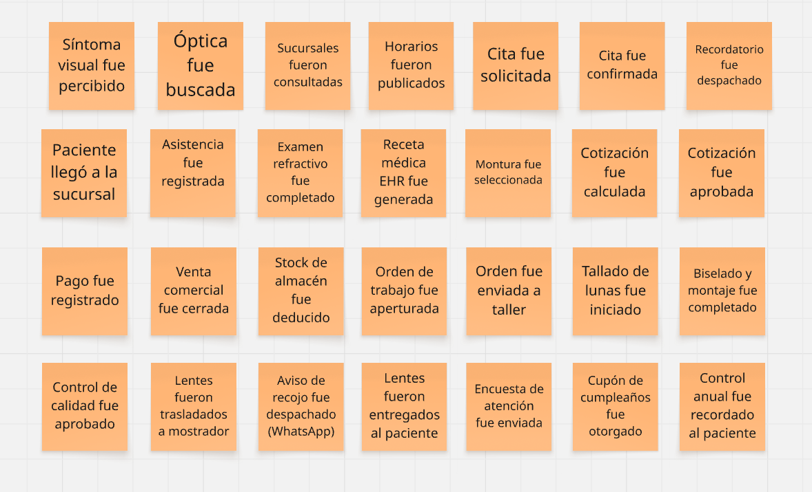

 

Complementariamente, la segunda vista del tablero detalla la distribución de los eventos a lo largo de los carriles funcionales de actores, dividiendo el flujo en tres macro-etapas operativas y explicitando los cuatro puntos críticos descubiertos durante el taller:

  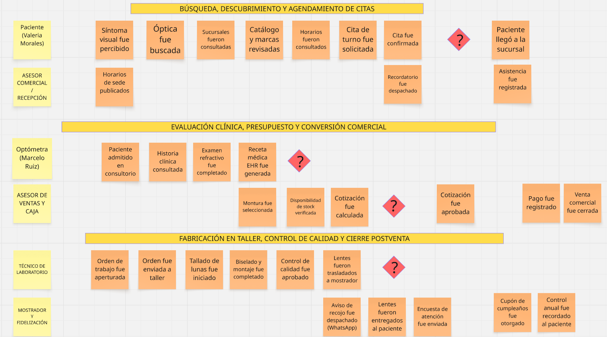

 

A partir de esta modelación colaborativa, el análisis detallado del negocio permitió aislar tres macro-etapas operativas y sus respectivos focos de fricción representados por los rombos de advertencia (?):

**1. Búsqueda, Descubrimiento y Agendamiento de Citas (Paciente y Recepción)**
Esta fase inicial modela el comportamiento del paciente frente a la necesidad de corrección visual. El usuario explora ópticas cercanas, examina sucursales, consulta el catálogo y solicita formalmente su cita.
- **Punto Crítico 1 (Ausentismo en Citas):** Ubicado tras la confirmación de la cita, refleja el ausentismo no alertado debido al olvido del turno pactado por parte del paciente, generando tiempos muertos en el consultorio y desaprovechamiento de los horarios médicos.

**2. Evaluación Clínica, Presupuesto y Conversión Comercial (Optómetra y Asesor de Ventas y Caja)**
Comprende la atención presencial dentro de la óptica. El optómetra ejecuta la refracción en cabina y genera la receta médica digital (EHR). Posteriormente, el asesor comercial asiste en la elección de la montura, valida existencias en inventario, calcula la cotización y concreta la venta tras registrar el cobro (efectivo, tarjeta o billeteras digitales Yape/Plin).
- **Punto Crítico 2 (Pérdida de Historial Clínico):** Ubicado tras la generación de la receta médica, responde a la dificultad histórica de los pacientes para conservar recetas de papel anteriores y recordar especificaciones de tratamientos (antirreflejo o filtros), obligando a repetir consultas previas.
- **Punto Crítico 3 (Desfase de Stock y Contingencia Offline):** Ubicado tras el cálculo de la cotización, señala el riesgo de prescribir monturas exhibidas en vitrina que no cuentan con existencia real en almacén, así como la vulnerabilidad de las ventas ante cortes imprevistos de internet en el salón, lo cual exige una arquitectura con soporte local (*Offline-First*).

**3. Fabricación en Taller, Control de Calidad y Cierre Postventa (Técnico de Laboratorio y Mostrador y Fidelización)**
Engloba la trazabilidad técnica posterior al cierre comercial. Se apertura la orden de trabajo para el taller, se inicia el tallado y montaje de lunas, y se somete la pieza a inspección de calidad antes de enviarla a mostrador. Finalmente, se entrega el producto terminado al paciente y se activan los flujos de fidelización (encuestas de atención, saludos de cumpleaños y recordatorios anuales).
- **Punto Crítico 4 (Incertidumbre en Tiempos de Fabricación):** Ubicado al finalizar el control de calidad y traslado a mostrador, refleja la falta de visibilidad del paciente sobre el avance real de sus lentes en taller, provocando consultas telefónicas reiteradas y sobrecarga operativa en el personal de atención.

**Articulación con los Bounded Contexts de OptiFlow**
Las fronteras funcionales y semánticas descubiertas durante el Big Picture EventStorming justifican formalmente la descomposición arquitectónica del backend en cinco Bounded Contexts:
- **Search & Booking Context:** Soporta la búsqueda de sucursales, horarios de atención y reserva formal de citas.
- **Clinical & Commercial Context:** Centraliza el historial clínico electrónico (EHR), recetas médicas, cotizaciones y cobros comerciales.
- **Production & Tracking Context:** Administra la orden de trabajo en taller, el tablero Kanban y la trazabilidad de fabricación.
- **Store Management & Inventory Context:** Controla el catálogo de monturas, precios, reabastecimiento y stock físico.
- **Notification & Loyalty Context:** Gestiona los avisos de recojo por WhatsApp/Push, encuestas de satisfacción y recordatorios preventivos de salud visual.

### 2.3.6. Ubiquitous Language

El lenguaje ubicuo constituye el vocabulario común y riguroso compartido entre los expertos del dominio (personal de óptica y pacientes) y el equipo de ingeniería de software. Su objetivo es eliminar la ambigüedad terminológica en el código, las historias de usuario y las interfaces de OptiFlow.

<table border="1" cellpadding="8" cellspacing="0" style="border-collapse:collapse; width:100%; font-family:Arial, sans-serif;">
  <thead>
      <th style="width:25%;">Término</th>
      <th style="width:50%;">Definición en el Dominio de OptiFlow</th>
      <th style="width:25%;">Contexto Delimitado Asociado</th>
    </tr>
  </thead>
  <tbody>
    <tr>
      <td><strong>Patient (Paciente)</strong></td>
      <td>Usuario final que acude a la óptica para evaluación visual, adquisición de monturas o seguimiento de recetas.</td>
      <td style="text-align:center;">Search & Booking / Clinical</td>
    </tr>
    <tr>
      <td><strong>Appointment (Cita)</strong></td>
      <td>Reserva formal de un bloque de horario para atención presencial o examen optométrico en una sucursal.</td>
      <td style="text-align:center;">Search & Booking Context</td>
    </tr>
    <tr>
      <td><strong>Optical Prescription (Receta Médica / Ficha EHR)</strong></td>
      <td>Registro clínico digital que contiene los parámetros refractivos (esfera, cilindro, eje, adición) del paciente.</td>
      <td style="text-align:center;">Clinical & Commercial Context</td>
    </tr>
    <tr>
      <td><strong>Quotation (Cotización)</strong></td>
      <td>Presupuesto comercial detallado que calcula el costo sumando monturas, tipos de luna y tratamientos específicos.</td>
      <td style="text-align:center;">Clinical & Commercial Context</td>
    </tr>
    <tr>
      <td><strong>Sale (Venta)</strong></td>
      <td>Transacción comercial cerrada mediante pago (efectivo, tarjeta o billeteras móviles Yape/Plin) que confirma el pedido.</td>
      <td style="text-align:center;">Clinical & Commercial Context</td>
    </tr>
    <tr>
      <td><strong>Work Order (Orden de Trabajo)</strong></td>
      <td>Documento operativo que describe las especificaciones técnicas enviadas al taller para el tallado y biselado de lunas.</td>
      <td style="text-align:center;">Production & Tracking Context</td>
    </tr>
    <tr>
      <td><strong>Work Order Status (Estado de la Orden)</strong></td>
      <td>Fase de avance del pedido dentro del tablero Kanban (Pendiente, En Taller, Control de Calidad, Listo para Entrega).</td>
      <td style="text-align:center;">Production & Tracking Context</td>
    </tr>
    <tr>
      <td><strong>Delivery Date (Fecha Estimada de Entrega)</strong></td>
      <td>Fecha pactada con el cliente para el recojo del producto terminado, calculada según la complejidad del pedido.</td>
      <td style="text-align:center;">Production & Tracking Context</td>
    </tr>
    <tr>
      <td><strong>Frame Model (Modelo de Montura)</strong></td>
      <td>Artículo físico del catálogo con atributos de material, forma, color y compatibilidad con el tipo de rostro.</td>
      <td style="text-align:center;">Store Management & Inventory</td>
    </tr>
    <tr>
      <td><strong>Low Stock Alert (Alerta de Stock Crítico)</strong></td>
      <td>Notificación automática generada cuando las unidades de una montura caen por debajo del umbral mínimo configurado.</td>
      <td style="text-align:center;">Store Management & Inventory</td>
    </tr>
    <tr>
      <td><strong>Order Progress Notification (Notificación de Avance)</strong></td>
      <td>Mensaje automático (push o WhatsApp) despachado al paciente al cambiar el estado de su orden en el taller.</td>
      <td style="text-align:center;">Notification & Loyalty Context</td>
    </tr>
    <tr>
      <td><strong>Reactivation Campaign (Campaña de Reactivación)</strong></td>
      <td>Recordatorio preventivo enviado anualmente al paciente para incentivar el control de su graduación visual.</td>
      <td style="text-align:center;">Notification & Loyalty Context</td>
    </tr>
  </tbody>
</table>

## 2.4. Requirements Specification

### 2.4.1. User Stories

En esta sección se detallan las historias de usuario orientadas al desarrollo de la plataforma **OptiFlow**, enfocada en la gestión oftalmológica, clínica, comercial y logística mediante tecnología móvil, bajo la visión de la startup.

| Epic / Story ID | Título | Descripción | Criterios de Aceptación | Relacionado con (Epic ID) |
| :--- | :--- | :--- | :--- | :--- |
| EP01 / US01 | Inicio de sesión en la aplicación móvil | **Como** usuario de la óptica (administrador, optómetra o asesor), **quiero** iniciar sesión en la plataforma móvil **para** acceder de forma segura a las funcionalidades correspondientes a mi rol. | **Escenario 1:** Inicio de sesión exitoso. **Dado que** el usuario cuenta con credenciales válidas, **cuando** ingresa su usuario y contraseña y selecciona "Iniciar sesión", **entonces** el sistema valida sus credenciales y muestra el dashboard correspondiente a su rol.  **Escenario 2:** Credenciales incorrectas. **Dado que** el usuario ingresa credenciales inválidas, **cuando** intenta iniciar sesión, **entonces** el sistema rechaza el acceso y muestra un mensaje indicando que las credenciales no son válidas. | EP01: Authentication & User Management |
| EP01 / US02 | Registro de pacientes desde el móvil | **Como** optómetra o asesor de ventas, **quiero** registrar nuevos pacientes desde la aplicación móvil **para** centralizar su información personal y facilitar su atención. | **Escenario 1:** Registro exitoso. **Dado que** el usuario se encuentra en el módulo de pacientes, **cuando** completa los campos obligatorios y selecciona "Guardar", **entonces** el sistema registra al paciente correctamente.  **Escenario 2:** Datos incompletos. **Dado que** existen campos obligatorios vacíos, **cuando** el usuario intenta guardar el registro, **entonces** el sistema indica los campos que deben completarse. | EP01: Authentication & User Management |
| EP02 / US03 | Gestión de la historia clínica electrónica | **Como** optómetra, **quiero** registrar y actualizar la historia clínica electrónica del paciente desde un dispositivo móvil **para** mantener disponible y organizada su información clínica. | **Escenario 1:** Registro exitoso. **Dado que** el optómetra selecciona un paciente, **cuando** registra las mediciones, observaciones y diagnóstico y selecciona "Guardar", **entonces** el sistema almacena la información en su historia clínica.  **Escenario 2:** Datos inválidos. **Dado que** existen valores que no cumplen las validaciones establecidas, **cuando** se intenta guardar la información, **entonces** el sistema muestra un mensaje de validación y solicita corregir los datos. | EP02: Clinical Management |
| EP02 / US04 | Consulta del historial clínico y receta | **Como** optómetra o asesor autorizado, **quiero** consultar el historial clínico y las recetas anteriores de un paciente **para** disponer de sus antecedentes durante la atención. | **Escenario 1:** Historial disponible. **Dado que** el paciente posee registros clínicos, **cuando** el usuario accede a su perfil, **entonces** el sistema muestra sus antecedentes y recetas registradas.  **Escenario 2:** Sin historial. **Dado que** el paciente no posee registros anteriores, **cuando** se consulta su historial, **entonces** el sistema muestra un mensaje indicando que no existen registros disponibles. | EP02: Clinical Management |
| EP03 / US05 | Búsqueda de ópticas y disponibilidad de atención | **Como** paciente, **quiero** consultar las ópticas disponibles, sus sucursales y horarios de atención **para** elegir dónde recibir el servicio. | **Escenario 1:** Consulta de establecimientos. **Dado que** existen ópticas y sucursales registradas, **cuando** el paciente accede al módulo de búsqueda, **entonces** el sistema muestra los establecimientos disponibles, sus direcciones y horarios.  **Escenario 2:** Sin establecimientos disponibles. **Dado que** no existen sucursales disponibles, **cuando** el paciente realiza una búsqueda, **entonces** el sistema muestra un mensaje informativo. | EP03: Search & Booking |
| EP03 / US06 | Reserva de cita para atención optométrica | **Como** paciente, **quiero** seleccionar una fecha y horario disponible para reservar una cita **para** recibir atención optométrica de manera organizada. | **Escenario 1:** Reserva exitosa. **Dado que** existen horarios disponibles, **cuando** el paciente selecciona una fecha, horario y sucursal y confirma la reserva, **entonces** el sistema registra la cita y muestra su confirmación.  **Escenario 2:** Horario no disponible. **Dado que** otro paciente ha ocupado el horario seleccionado, **cuando** se intenta confirmar la reserva, **entonces** el sistema informa que el horario ya no está disponible y solicita seleccionar otro. | EP03: Search & Booking |
| EP04 / US07 | Consulta de inventario mediante escáner móvil | **Como** asesor de ventas, **quiero** escanear el código de una montura utilizando la cámara del dispositivo móvil **para** consultar rápidamente su disponibilidad, características y precio. | **Escenario 1:** Producto encontrado. **Dado que** la montura posee un código registrado, **cuando** el asesor realiza el escaneo, **entonces** el sistema muestra su stock, características y precio actualizado.  **Escenario 2:** Producto no encontrado. **Dado que** el código no está registrado, **cuando** se realiza el escaneo, **entonces** el sistema informa que el producto no existe en el catálogo. | EP04: Inventory & Catalog Management |
| EP04 / US08 | Generación de cotización vinculada a receta | **Como** asesor de ventas, **quiero** generar una cotización utilizando la receta del paciente y los productos disponibles **para** elaborar un presupuesto de manera rápida y precisa. | **Escenario 1:** Cotización generada. **Dado que** el paciente cuenta con una receta válida y existen productos disponibles, **cuando** el asesor selecciona los productos y genera la cotización, **entonces** el sistema calcula y muestra el monto total.  **Escenario 2:** Receta no disponible. **Dado que** el paciente no posee una receta registrada, **cuando** se intenta generar una cotización que requiere dicha información, **entonces** el sistema solicita registrar o seleccionar una receta válida. | EP04: Inventory & Catalog Management |
| EP04 / US09 | Gestión de catálogo de monturas | **Como** administrador, **quiero** registrar y actualizar la información de las monturas del catálogo **para** mantener actualizados sus características, precios y disponibilidad. | **Escenario 1:** Actualización exitosa. **Dado que** el administrador selecciona una montura existente, **cuando** modifica sus datos y selecciona "Guardar", **entonces** el sistema actualiza la información del producto.  **Escenario 2:** Datos inválidos. **Dado que** se ingresan valores incorrectos en los campos obligatorios, **cuando** se intenta guardar, **entonces** el sistema muestra los errores de validación correspondientes. | EP04: Inventory & Catalog Management |
| EP05 / US10 | Gestión de órdenes de trabajo | **Como** administrador o responsable del laboratorio, **quiero** visualizar y actualizar las órdenes de trabajo mediante un tablero Kanban **para** controlar visualmente el avance de fabricación de los lentes. | **Escenario 1:** Cambio de estado. **Dado que** existe una orden de trabajo activa, **cuando** el responsable cambia su estado en el tablero, **entonces** el sistema actualiza la orden y registra su nuevo estado.  **Escenario 2:** Pérdida de conexión. **Dado que** el dispositivo pierde temporalmente la conexión, **cuando** se intenta actualizar una orden, **entonces** el sistema conserva la operación pendiente para sincronizarla posteriormente. | EP05: Production & Order Tracking |
| EP05 / US11 | Seguimiento del estado de los pedidos | **Como** paciente, **quiero** consultar el estado de mi pedido y su avance de fabricación **para** conocer cuándo estarán disponibles mis lentes. | **Escenario 1:** Consulta de pedido. **Dado que** el paciente posee una orden activa, **cuando** accede al seguimiento, **entonces** el sistema muestra el estado actual y la información disponible sobre su entrega.  **Escenario 2:** Pedido finalizado. **Dado que** la orden ha terminado su proceso de fabricación, **cuando** el paciente consulta el seguimiento, **entonces** el sistema indica que el pedido está listo para su entrega. | EP05: Production & Order Tracking |
| EP06 / US12 | Notificaciones del progreso de pedidos | **Como** paciente, **quiero** recibir notificaciones sobre los cambios importantes de mi pedido **para** mantenerme informado sin tener que consultar constantemente la aplicación. | **Escenario 1:** Cambio de estado. **Dado que** una orden cambia de estado, **cuando** el sistema registra el cambio, **entonces** envía una notificación al paciente.  **Escenario 2:** Notificaciones desactivadas. **Dado que** el paciente ha desactivado las notificaciones, **cuando** cambia el estado del pedido, **entonces** el sistema registra el evento sin enviar una notificación push. | EP06: Notifications & Loyalty |
| EP06 / US13 | Recordatorios de control visual | **Como** administrador, **quiero** configurar recordatorios automáticos para los pacientes **para** fomentar controles visuales periódicos y mantener la relación con ellos. | **Escenario 1:** Recordatorio generado. **Dado que** un paciente cumple el periodo establecido desde su último control, **cuando** el sistema ejecuta la regla configurada, **entonces** genera el recordatorio correspondiente.  **Escenario 2:** Paciente sin canal de notificación. **Dado que** el paciente no posee un dispositivo vinculado, **cuando** corresponde enviar el recordatorio, **entonces** el sistema registra el evento para su posterior gestión por otro medio. | EP06: Notifications & Loyalty |
| EP07 / US14 | Alertas de stock crítico | **Como** administrador de la óptica, **quiero** recibir alertas cuando un producto alcance su stock mínimo **para** gestionar el reabastecimiento oportunamente. | **Escenario 1:** Stock crítico detectado. **Dado que** la cantidad de un producto alcanza el límite mínimo configurado, **cuando** el sistema actualiza el inventario, **entonces** muestra una alerta de stock crítico.  **Escenario 2:** Stock suficiente. **Dado que** la cantidad disponible supera el mínimo establecido, **cuando** se consulta el inventario, **entonces** el sistema no genera una alerta de reposición. | EP07: Store Management & Inventory |
| EP07 / US15 | Historial de movimientos de inventario | **Como** administrador, **quiero** consultar el historial de entradas y salidas de productos **para** controlar los movimientos del inventario y detectar posibles diferencias. | **Escenario 1:** Historial disponible. **Dado que** existen movimientos registrados, **cuando** el administrador consulta el historial, **entonces** el sistema muestra la fecha, producto, cantidad y usuario asociado a cada movimiento.  **Escenario 2:** Sin movimientos. **Dado que** no existen movimientos registrados, **cuando** se consulta el historial, **entonces** el sistema muestra un estado vacío informativo. | EP07: Store Management & Inventory |
| EP07 / US16 | Gestión de permisos por roles | **Como** administrador, **quiero** asignar permisos según el rol de cada usuario **para** proteger la información y funcionalidades sensibles de la óptica. | **Escenario 1:** Acceso autorizado. **Dado que** un usuario posee permisos para un módulo, **cuando** intenta acceder a este, **entonces** el sistema permite visualizar y utilizar sus funcionalidades.  **Escenario 2:** Acceso restringido. **Dado que** un usuario no posee permisos para un módulo, **cuando** intenta acceder, **entonces** el sistema deniega el acceso y muestra un mensaje de permisos insuficientes. | EP07: Store Management & Inventory |
| EP08 / US17 | Registro de ventas y pagos | **Como** asesor de ventas, **quiero** registrar la venta y el pago asociado a una cotización **para** mantener actualizada la operación comercial del paciente. | **Escenario 1:** Venta registrada. **Dado que** existe una cotización aprobada, **cuando** el asesor registra el pago y confirma la venta, **entonces** el sistema registra la operación y actualiza el estado correspondiente.  **Escenario 2:** Pago inválido. **Dado que** los datos del pago no cumplen las validaciones establecidas, **cuando** se intenta registrar la operación, **entonces** el sistema rechaza el registro y muestra el motivo. | EP08: Clinical & Commercial |
| EP08 / US18 | Dashboard de métricas operativas | **Como** administrador de la óptica, **quiero** visualizar indicadores de atención, ventas y pedidos **para** conocer el estado general del negocio y tomar decisiones oportunas. | **Escenario 1:** Visualización de indicadores. **Dado que** existen registros operativos, **cuando** el administrador accede al dashboard, **entonces** el sistema muestra los principales indicadores del periodo seleccionado.  **Escenario 2:** Sin información. **Dado que** no existen registros para el periodo consultado, **cuando** se accede al dashboard, **entonces** el sistema muestra los indicadores en cero y un mensaje informativo. | EP08: Analytics & Reporting |
| EP08 / US19 | Generación y exportación de reportes | **Como** administrador, **quiero** generar y exportar reportes de las operaciones de la óptica **para** analizar y compartir información con las áreas correspondientes. | **Escenario 1:** Reporte generado. **Dado que** existen datos en el periodo seleccionado, **cuando** el administrador solicita un reporte, **entonces** el sistema genera el documento con la información correspondiente.  **Escenario 2:** Sin datos. **Dado que** el periodo seleccionado no contiene registros, **cuando** se solicita el reporte, **entonces** el sistema informa que no existen datos disponibles para exportar. | EP08: Analytics & Reporting |
| EP09 / US20 | Operaciones críticas sin conexión | **Como** usuario operativo, **quiero** registrar operaciones críticas aunque exista una interrupción temporal de internet **para** continuar atendiendo al paciente y evitar pérdida de información. | **Escenario 1:** Registro sin conexión. **Dado que** el dispositivo pierde temporalmente la conexión, **cuando** el usuario registra una operación crítica, **entonces** la aplicación almacena temporalmente la información en el dispositivo.  **Escenario 2:** Recuperación de conexión. **Dado que** existen operaciones almacenadas localmente, **cuando** el dispositivo recupera la conexión, **entonces** la aplicación sincroniza automáticamente la información con el servidor. | EP09: Mobile Offline Capability |
### 2.4.2. Impact Mapping

El Impact Mapping es una herramienta que nos permitió estructurar y visualizar de manera clara la relación entre los objetivos del proyecto, los actores involucrados y las funcionalidades propuestas en la solución. A partir de la información recopilada en las entrevistas y el análisis de necesidades, se identificaron los principales problemas que enfrentan los usuarios.

***IMPACT MAPPING 1***

***IMPACT MAPPING 2***

### 2.4.3. Product Backlog

| # Orden | User Story Id | Título | Descripción | Story Points (1/2/3/5/8) |
| :--- | :--- | :--- | :--- | :---: |
| **1** | **US01** | Inicio de sesión en la aplicación móvil | **Como** usuario de la óptica (administrador, optómetra o asesor), **quiero** iniciar sesión en la plataforma móvil **para** acceder de forma segura a las funcionalidades correspondientes a mi rol. | **3** |
| **2** | **US02** | Registro de pacientes desde el móvil | **Como** optómetra o asesor de ventas, **quiero** registrar nuevos pacientes directamente desde la aplicación móvil **para** gestionar su información dentro del sistema de la óptica. | **5** |
| **3** | **US03** | Gestión de historia clínica electrónica | **Como** optómetra, **quiero** registrar y actualizar la historia clínica electrónica del paciente **para** mantener un control organizado de sus evaluaciones visuales. | **8** |
| **4** | **US04** | Consulta de historial clínico y receta | **Como** paciente, **quiero** consultar mi historial clínico y receta desde la aplicación **para** acceder fácilmente a mi información visual. | **5** |
| **5** | **US05** | Búsqueda de ópticas y disponibilidad de atención | **Como** paciente, **quiero** buscar ópticas disponibles y consultar su disponibilidad de atención **para** elegir dónde recibir el servicio. | **5** |
| **6** | **US06** | Reserva de cita para atención optométrica | **Como** paciente, **quiero** reservar una cita para atención optométrica **para** programar mi visita de manera rápida y organizada. | **8** |
| **7** | **US07** | Consulta de inventario mediante escáner móvil | **Como** asesor de ventas, **quiero** escanear el código de una montura **para** consultar su stock y precio en tiempo real frente al cliente. | **5** |
| **8** | **US08** | Generación de cotización vinculada a receta | **Como** asesor de ventas, **quiero** generar una cotización vinculada a la receta del paciente **para** elaborar un presupuesto de manera rápida y precisa. | **5** |
| **9** | **US09** | Gestión de catálogo de monturas | **Como** asesor de ventas, **quiero** consultar y gestionar el catálogo de monturas **para** ofrecer productos disponibles de acuerdo con las necesidades del paciente. | **5** |
| **10** | **US10** | Gestión de órdenes de trabajo | **Como** técnico de laboratorio o administrador, **quiero** gestionar las órdenes de trabajo mediante un tablero Kanban **para** controlar visualmente el proceso de fabricación de los lentes. | **8** |
| **11** | **US11** | Seguimiento del estado de pedidos | **Como** paciente, **quiero** consultar el estado de mi pedido **para** conocer el avance de la elaboración de mis lentes. | **5** |
| **12** | **US12** | Notificaciones del progreso de pedidos | **Como** paciente, **quiero** recibir notificaciones sobre el progreso de mi pedido **para** conocer oportunamente los cambios en su estado. | **5** |
| **13** | **US13** | Recordatorios de control visual | **Como** paciente, **quiero** recibir recordatorios de control visual **para** mantener un seguimiento periódico de mi salud visual. | **3** |
| **14** | **US14** | Alertas de stock crítico | **Como** administrador, **quiero** visualizar alertas de stock crítico **para** identificar oportunamente los productos que necesitan reposición. | **5** |
| **15** | **US15** | Historial de movimientos de inventario | **Como** administrador, **quiero** consultar el historial de movimientos de inventario **para** mantener la trazabilidad de los productos de la óptica. | **5** |
| **16** | **US16** | Gestión de permisos por roles | **Como** administrador, **quiero** gestionar permisos según los roles de los usuarios **para** controlar el acceso a las funcionalidades e información de la aplicación. | **5** |
| **17** | **US17** | Registro de ventas y pagos | **Como** administrador, **quiero** registrar las ventas y pagos realizados **para** mantener actualizado el control comercial de la óptica. | **8** |
| **18** | **US18** | Dashboard de métricas operativas | **Como** administrador, **quiero** visualizar un dashboard con métricas operativas y comerciales **para** conocer el rendimiento de la óptica y facilitar la toma de decisiones. | **8** |
| **19** | **US19** | Generación y exportación de reportes | **Como** administrador, **quiero** generar y exportar reportes de las operaciones de la óptica **para** analizar y compartir información relevante del negocio. | **5** |
| **20** | **US20** | Operaciones críticas sin conexión | **Como** usuario de la óptica, **quiero** continuar realizando operaciones críticas cuando no tenga conexión a Internet **para** evitar interrupciones en el trabajo. | **8** |

## 2.5. Strategic-Level Domain-Driven Design

### 2.5.1. EventStorming

**Big Picture Event Storming**

#### 2.5.1.1. Candidate Context Discovery

A partir de las agrupaciones funcionales definidas en el Paso 3 del EventStorming ("Big Picture" y límites de subdominios), se identificaron los siguientes contextos delimitados candidatos que encapsulan el lenguaje ubicuo y los límites de responsabilidad del sistema OptiFlow:

**Search & Booking Context:** Encargado de la gestión de identidades de pacientes, la publicación de horarios disponibles (Publish available time slots) y el flujo de agendamiento de citas.

**Clinical & Commercial Context:** Centraliza tanto el proceso médico (Record medical history, Generate optical prescription) como el transaccional (Approve quotation, Close sale, Record payment), unificando el flujo del paciente en el salón.

**Production & Tracking Context:** Maneja el ciclo de vida de la orden de trabajo desde su generación, asignación a técnicos (Assign work order), envío al laboratorio y actualización de estados hasta la entrega final.

**Notification & Loyalty Context:** Gestiona la comunicación proactiva con el paciente, incluyendo alertas de cumpleaños (Detect patient's birthday), encuestas de satisfacción y campañas de reactivación.

**Store Management & Inventory Context:** Controla el catálogo de productos físicos (Add new frame model), precios, abastecimiento de proveedores (Suppliers) y alertas de bajo stock, soportando las 15 entidades del modelo de datos de inventario.

#### 2.5.1.2. Domain Message Flows Modeling

El Domain Message Flow Modelling documenta, para el proceso de negocio principal de OptiFlow —desde que el paciente descubre y reserva una cita hasta que recibe sus lentes y se fideliza con la óptica—, la secuencia de comandos y eventos que cruzan los límites de los contextos delimitados identificados en el punto anterior. Cada evento publicado por un contexto actúa como disparador (*trigger*) de un comando en el contexto suscriptor, lo que permite visualizar el acoplamiento real entre los cinco contextos sin que estos compartan modelo de datos.

| # | Contexto emisor | Comando ejecutado | Evento publicado | Contexto receptor | Comando disparado |
| :-: | :--- | :--- | :--- | :--- | :--- |
| 1 | Search & Booking | `BookAppointment` | `AppointmentBooked` | Clinical & Commercial | `ExaminePatient` |
| 2 | Search & Booking | `BookAppointment` | `AppointmentBooked` | Notification & Loyalty | `SendAppointmentReminder` |
| 3 | Clinical & Commercial | `CloseSale` | `SaleWasClosed` | Production & Tracking | `GenerateWorkOrder` |
| 4 | Clinical & Commercial | `CloseSale` | `SaleWasClosed` | Store Management & Inventory | `ScanQRBarcodeToCheckStock` (evalúa el stock consumido) |
| 5 | Production & Tracking | `UpdateWorkOrderStatus` | `WorkOrderStatusUpdated` | Notification & Loyalty | `NotifyLensOrderProgress` |
| 6 | Production & Tracking | `DeliverLensesToPatient` | `OrderWasMarkedAsDelivered` | Notification & Loyalty | `SendSatisfactionSurvey` |

Adicionalmente, el Notification & Loyalty Context ejecuta un flujo autónomo, no disparado por otro contexto sino por el calendario del sistema: `DetectPatientBirthday` → `PatientBirthdayWasDetected` → `SendBirthdayNotification`, dirigido a los pacientes ya registrados en el Search & Booking Context.

Este modelo evidencia que **Search & Booking** y **Clinical & Commercial** actúan como los principales puntos de origen de mensajes hacia el resto del sistema, mientras que **Notification & Loyalty** se comporta como un contexto predominantemente reactivo (consumidor), y **Store Management & Inventory** reacciona únicamente al cierre de una venta para mantener la consistencia del stock.

#### 2.5.1.3. Bounded Context Canvases

En esta sección se formalizan los Bounded Context Canvases para cada uno de los contextos delimitados identificados en la solución **OptiFlow**, derivándolos directamente de la dinámica de EventStorming. Se estructuran las responsabilidades, clasificación estratégica, lenguaje ubicuo, así como las comunicaciones de entrada (*Commands*, eventos a los que se suscribe) y de salida (*Events* publicados).

**Canvas 1: Search & Booking Context**

| Elemento | Descripción |
| :--- | :--- |
| **Name** | Search & Booking Context |
| **Strategic Classification** | Core Domain |
| **Domain Roles** | Gestión del proceso inicial del paciente: descubrimiento de sucursales, exploración del catálogo de monturas, gestión de preferencias e identidades, y reserva formal de citas según disponibilidad de horarios. |
| **Ubiquitous Language** | Patient, Time Slot, Optical Store, Store Catalog, Favorite Store, Store Rating, Appointment, Booking. |
| **Inbound Communication** | **Commands (vía API Gateway):** - `RegisterPatient` - `LogIn` - `PublishAvailableTimeSlots` - `SearchOpticalStores` - `FilterOpticalStores` - `SaveFavoriteOpticalStore` - `ExploreFrameCatalog` - `RateOpticalStore` - `BookAppointment` |
| **Outbound Communication** | **Events (Publicados):** - `PatientRegistered` - `PatientLoggedIn` - `OpticalStoresPublished` - `OpticalStoresFiltered` - `FavoriteOpticalStoreSaved` - `FrameCatalogExplored` - `OpticalStoreRated` - `AppointmentBooked` |

**Canvas 2: Clinical & Commercial Context**

| Elemento | Descripción |
| :--- | :--- |
| **Name** | Clinical & Commercial Context |
| **Strategic Classification** | Core Domain |
| **Domain Roles** | Control de la atención clínica presencial y conversión comercial: registro de refracción/receta optométrica, evaluación de cotizaciones, aplicación de descuentos o promociones y procesamiento del cobro de la venta. |
| **Ubiquitous Language** | Patient, Medical History, Clinical Record, Optical Prescription, Quotation, Promotion, Discount, Payment, Sale, Electronic Receipt. |
| **Inbound Communication** | **Commands (vía API Gateway):** - `ExaminePatient` - `RecordMedicalHistory` - `RegisterClinicalRecord` - `GenerateOpticalPrescription` - `ApplyPromotionOrDiscount` - `ApproveQuotation` - `RejectQuotation` - `RecordPayment` - `CloseSale`  **Events (Suscrito):** - `AppointmentBooked` |
| **Outbound Communication** | **Events (Publicados):** - `PatientExamined` - `MedicalHistoryRecorded` - `ClinicalRecordRegistered` - `OpticalPrescriptionGenerated` - `PromotionOrDiscountApplied` - `QuotationApproved` - `QuotationRejected` - `PaymentRecorded` - `SaleWasClosed` - `ElectronicReceiptIssued` |

**Canvas 3: Production & Tracking Context**

| Elemento | Descripción |
| :--- | :--- |
| **Name** | Production & Tracking Context |
| **Strategic Classification** | Core Domain |
| **Domain Roles** | Trazabilidad del proceso de fabricación de lentes y monturas: generación de órdenes de trabajo, asignación a técnicos de laboratorio, control del flujo de estado (Kanban logístico), cálculo de fechas estimadas y gestión de retrasos. |
| **Ubiquitous Language** | Work Order, Technician, Laboratory, Work Order Status, Lenses, Delivery Date, Delivery Delay. |
| **Inbound Communication** | **Commands (vía API Gateway):** - `GenerateWorkOrder` - `AssignWorkOrderToTechnician` - `SendWorkOrderToLaboratory` - `UpdateWorkOrderStatus` - `CompleteLenses` - `NotifyDeliveryDelay` - `MarkOrderAsDelivered`  **Events (Suscrito):** - `SaleWasClosed` |
| **Outbound Communication** | **Events (Publicados):** - `WorkOrderGenerated` - `WorkOrderAssigned` - `WorkOrderSentToLaboratory` - `WorkOrderStatusUpdated` - `LensesWereCompleted` - `EstimatedDeliveryDateCalculated` - `DeliveryDelayNotified` - `OrderWasMarkedAsDelivered` |

**Canvas 4: Notification & Loyalty Context**

| Elemento | Descripción |
| :--- | :--- |
| **Name** | Notification & Loyalty Context |
| **Strategic Classification** | Supporting Domain |
| **Domain Roles** | Gestión proactiva de la relación con el paciente: notificaciones push automáticas del estado del pedido, alertas de cumpleaños, envío y recolección de encuestas de satisfacción, campañas de reactivación y asignación de staff para delegación. |
| **Ubiquitous Language** | Patient Birthday, Birthday Discount, Satisfaction Survey, Staff Member, Notification Preferences, In-App Notification, Order Progress, Reactivation Campaign. |
| **Inbound Communication** | **Commands (vía API Gateway):** - `DetectPatientBirthday` - `SendBirthdayDiscount` - `SendSatisfactionSurvey` - `AssignStaffMemberToManageNotifications` - `ConfigureNotificationPreferences` - `NotifyPatientInApp` - `NotifyLensOrderProgress` - `SendReactivationCampaign`  **Events (Suscrito):** - `AppointmentBooked` - `WorkOrderStatusUpdated` - `OrderWasMarkedAsDelivered` |
| **Outbound Communication** | **Events (Publicados):** - `PatientBirthdayDetected` - `BirthdayDiscountWasSent` - `SatisfactionSurveyWasSent` - `SatisfactionSurveyCompleted` - `StaffMemberAssigned` - `NotificationPreferencesConfigured` - `InAppNotificationSent` - `LensOrderProgressNotified` - `ReactivationCampaignSent` |

**Canvas 5: Store Management & Inventory Context**

| Elemento | Descripción |
| :--- | :--- |
| **Name** | Store Management & Inventory Context |
| **Strategic Classification** | Supporting Domain |
| **Domain Roles** | Control de existencias físicas multitienda, administración del catálogo de modelos de monturas, actualización de precios, reabastecimiento y gestión de proveedores (Suppliers). |
| **Ubiquitous Language** | Frame Model, Catalog, Price, Stock, Inventory, Low Stock Alert, Supplier, Replenishment. |
| **Inbound Communication** | **Commands (vía API Gateway):** - `AddNewFrameModel` - `UpdateFrameModelPrice` - `ConsultStock` - `ReplenishStock` - `RegisterSupplier`  **Events (Suscrito):** - `SaleWasClosed` |
| **Outbound Communication** | **Events (Publicados):** - `NewFrameModelAdded` - `FrameModelPriceUpdated` - `StockWasConsulted` - `StockWasReplenished` - `LowStockAlertGenerated` - `InventoryWasUpdated` - `SupplierRegistered` |

### 2.5.2 Context Mapping

En esta sección se explica el proceso de elaboración de los Context Maps, permitiendo visualizar las relaciones estructurales entre los Bounded Contexts del sistema OptiFlow. Se aplican los patrones de relación establecidos en Domain-Driven Design, incluyendo **Customer/Supplier**, **Open Host Service**, **Anti-Corruption Layer** y **Conformist**.

##### Search & Booking → Clinical & Commercial

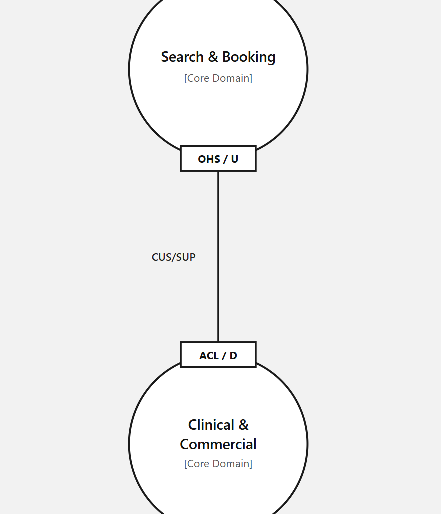

**Patrón: Customer / Supplier**

En esta relación, **Search & Booking** actúa como el upstream (U) exponiendo un Open Host Service (OHS) y **Clinical & Commercial** actúa como el downstream (D) mediante una Anti-Corruption Layer (ACL).

- **Search & Booking como proveedor:** Gestiona la reserva de turnos, la disponibilidad de horarios y el registro inicial del paciente. Cuando el paciente agenda una cita, este contexto publica el evento `AppointmentBooked` con el identificador del paciente, fecha, hora y sucursal asignada. Search & Booking influye directamente sobre Clinical & Commercial, ya que establece la entrada del flujo presencial en la óptica.

- **Clinical & Commercial como cliente:** Depende de la reserva generada para admitir al paciente en consultorio y ejecutar el comando `ExaminePatient`. Utiliza una capa anticorrupción (ACL) para traducir los datos de la cita y del usuario externo a su propio modelo clínico de historia médica (`Medical History`), protegiendo su lógica de refracción de los cambios de agenda o cancelación de turnos.

##### Search & Booking → Notification & Loyalty

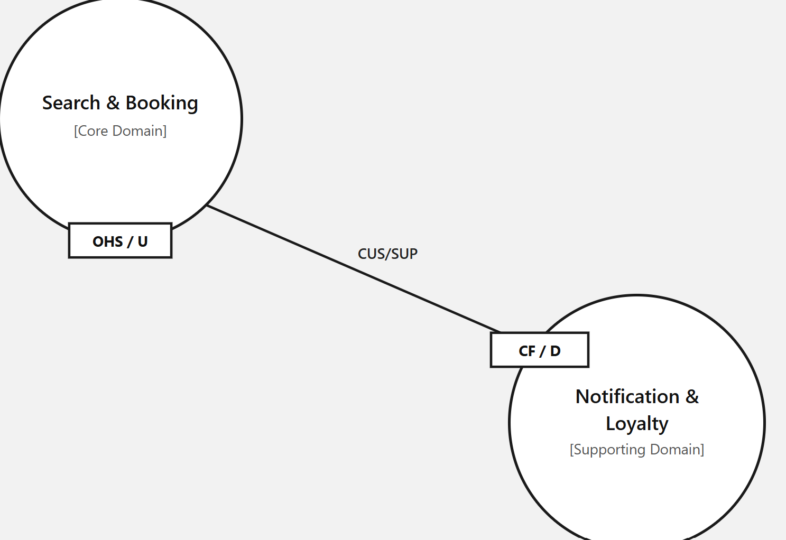

**Patrón: Customer / Supplier**

En esta relación, **Search & Booking** actúa como el upstream (U) y **Notification & Loyalty** actúa como el downstream (D) bajo una relación Conformist (CF).

- **Search & Booking como proveedor:** Al confirmarse una reserva en la plataforma, emite el evento `AppointmentBooked`. Search & Booking no tiene conocimiento de los mecanismos de comunicación ni de las plantillas de mensaje; únicamente notifica que un turno ha sido programado.

- **Notification & Loyalty como cliente:** Depende de este evento para ejecutar `SendAppointmentReminder`. Como contexto de soporte, adopta directamente el identificador del paciente y la marca de tiempo de la reserva provista por el upstream (Conformist) para programar los recordatorios preventivos de asistencia hacia el paciente sin alterar la semántica original de la reserva.

##### Clinical & Commercial → Production & Tracking

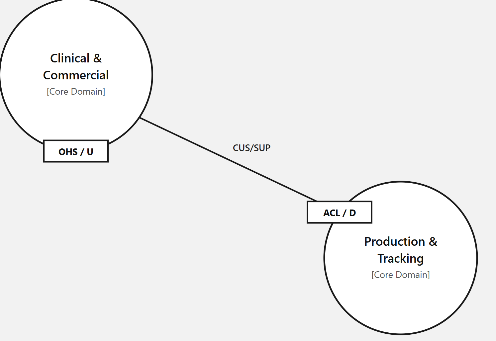

**Patrón: Customer / Supplier**

En esta relación, **Clinical & Commercial** actúa como el upstream (U) exponiendo un Open Host Service (OHS) y **Production & Tracking** actúa como el downstream (D) protegido por una Anti-Corruption Layer (ACL).

- **Clinical & Commercial como proveedor:** Gestiona la evaluación optométrica, la emisión de la receta médica (`Optical Prescription`) y el cierre de la transacción comercial. Al completarse el cobro y registrarse el evento `SaleWasClosed`, este contexto proporciona las especificaciones técnicas completas de las lunas (esferas, cilindros, ejes, adición, tratamientos y tipo de montura seleccionada).

- **Production & Tracking como cliente:** No puede iniciar ningún trabajo técnico sin la aprobación médica y comercial. Al recibir el evento, activa el comando `GenerateWorkOrder` para alimentar el tablero Kanban del taller. Implementa una ACL para aislar su modelo operativo de fabricación y control de calidad de las fluctuaciones comerciales, descuentos o métodos de facturación utilizados en la venta.

##### Clinical & Commercial → Store Management & Inventory

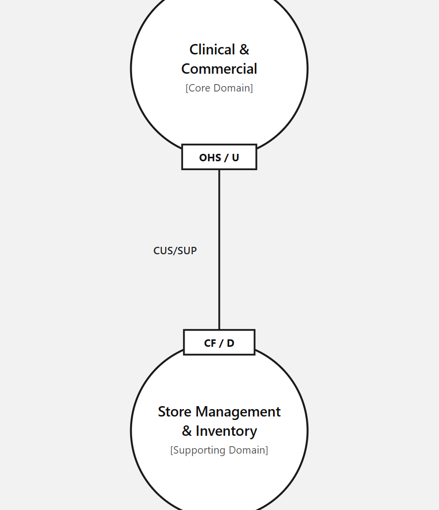

**Patrón: Customer / Supplier**

En esta relación, **Clinical & Commercial** actúa como el upstream (U) y **Store Management & Inventory** actúa como el downstream (D) bajo una relación Conformist (CF).

- **Clinical & Commercial como proveedor:** Al formalizar la venta mediante `SaleWasClosed`, emite la lista exacta de códigos SKU correspondientes a las monturas y accesorios físicos vendidos en el mostrador.

- **Store Management & Inventory como cliente:** Depende de este evento comercial para deducir el stock real de existencias en almacén y verificar si se ha alcanzado el umbral crítico de reabastecimiento (`LowStockAlertGenerated`). Actúa como un modelo conformista que acepta los códigos de producto y cantidades transaccionadas tal como fueron despachados desde el salón de venta.

##### Production & Tracking → Notification & Loyalty

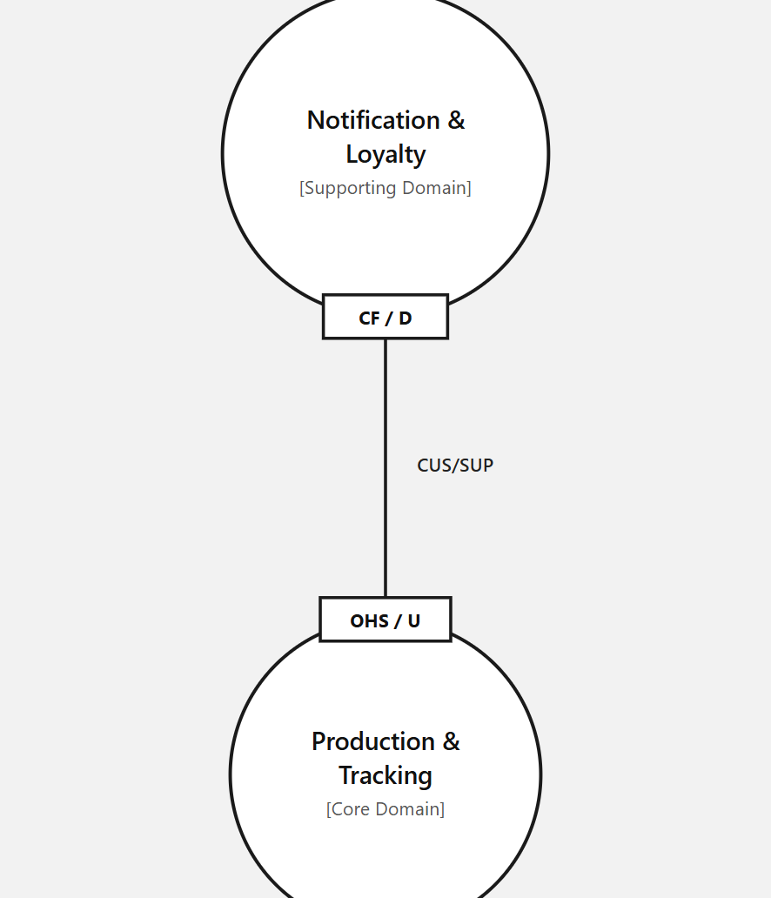

**Patrón: Customer / Supplier**

En esta relación, **Production & Tracking** actúa como el upstream (U) mediante un Open Host Service (OHS) y **Notification & Loyalty** actúa como el downstream (D) bajo una relación Conformist (CF).

- **Production & Tracking como proveedor:** Registra la trazabilidad del pedido en el laboratorio. Cada vez que el técnico actualiza el flujo logístico (tallado, biselado o montaje final) emite `WorkOrderStatusUpdated`, y al completar la fase de calidad genera `OrderWasMarkedAsDelivered`. Es el único contexto con conocimiento del estado real de fabricación de las lunas.

- **Notification & Loyalty como cliente:** No posee criterio técnico para evaluar el proceso de biselado ni los tiempos de secado de lunas. Simplemente reacciona a los eventos del laboratorio ejecutando los comandos `NotifyLensOrderProgress` y `SendSatisfactionSurvey`, consumiendo el identificador de orden y el estado logístico tal como el taller los publica.

##### Payment Gateway → Clinical & Commercial

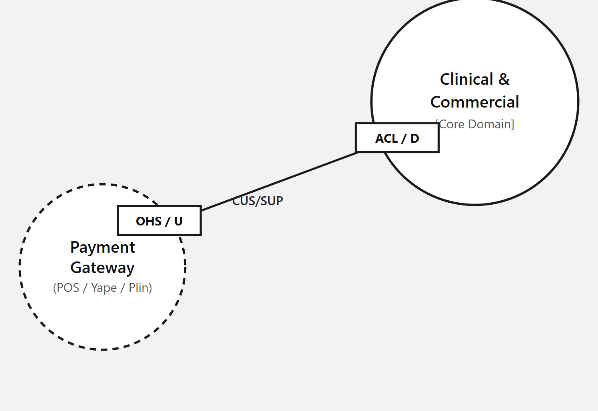

**Patrón: Customer / Supplier**

En esta relación, la **Pasarela de Pagos Externa (POS / Yape / Plin)** actúa como el upstream (U) exponiendo un Open Host Service (OHS) y **Clinical & Commercial** actúa como el downstream (D) utilizando una Anti-Corruption Layer (ACL).

- **Payment Gateway como proveedor:** Proveedor externo bancario y de billeteras móviles que procesa las transferencias monetarias y emite tokens de confirmación de transacción bancaria.

- **Clinical & Commercial como cliente:** Depende de la autorización externa para registrar formalmente el evento `PaymentReceived`. Implementa una capa anticorrupción (ACL) para mapear los formatos propietarios y respuestas JSON de la pasarela bancaria externa hacia la entidad interna de recibo electrónico (`Electronic Receipt`) del dominio de OptiFlow, evitando que cambios en las APIs de los bancos alteren el sistema contable interno.

##### Third-Party Messaging → Notification & Loyalty

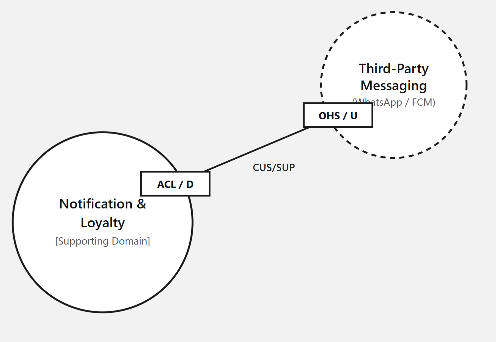

**Patrón: Customer / Supplier**

En esta relación, la plataforma de mensajería externa (**Meta WhatsApp Cloud API / Firebase Cloud Messaging**) actúa como el upstream (U) mediante un Open Host Service (OHS) y **Notification & Loyalty** actúa como el downstream (D) mediante una Anti-Corruption Layer (ACL).

- **Third-Party Messaging como proveedor:** Provee la infraestructura de entrega masiva de mensajes push y notificaciones de chat hacia los dispositivos móviles de los pacientes.

- **Notification & Loyalty como cliente:** Consume los servicios de entrega de mensajería. Utiliza una ACL para desacoplar las plantillas de mensaje y eventos de negocio de OptiFlow de la estructura de carga útil (*payloads* y cabeceras HTTP) requerida por las APIs de Meta y Google.

##### Context Map Final

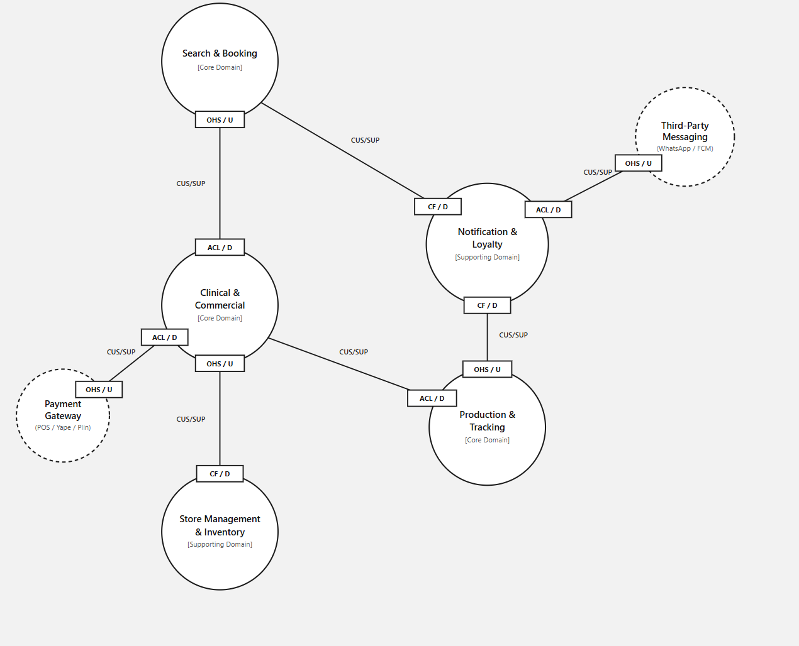

### 2.5.3. Software Architecture

#### 2.5.3.1. Software Architecture Context Level Diagrams

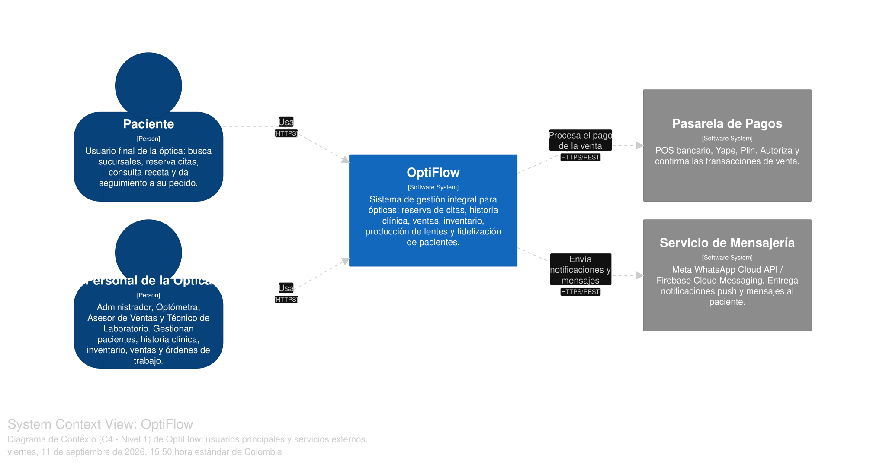

#### 2.5.3.2. Software Architecture Container Level Diagrams

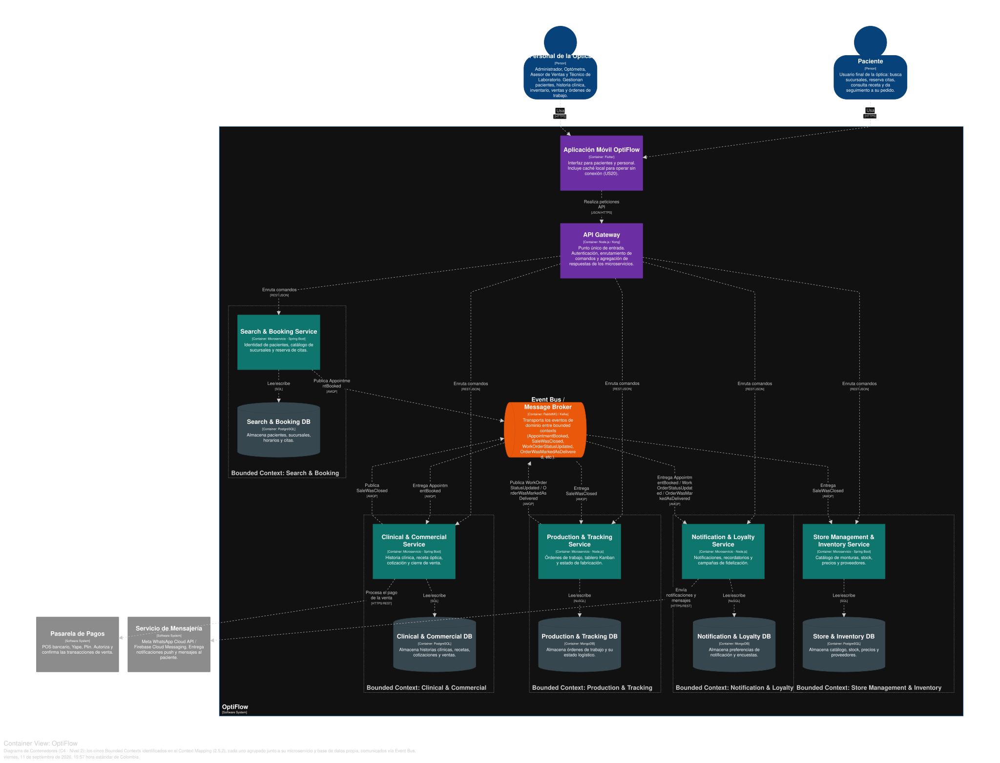

#### 2.5.3.3. Software Architecture Deployment Diagrams

##### Clinical & Commercial

##### Notification & Loyalty

##### Production & Tracking

##### Search & Booking

##### Store Management & Inventory

## 2.6. Tactical-Level Domain-Driven Design

### 2.6.1. Bounded Context: Search & Booking Context

#### 2.6.1.1. Domain Layer

La **Domain Layer** concentra el modelo de negocio del Bounded Context Search & Booking. En esta capa se definen los agregados, entidades, objetos de valor, enumeraciones, servicios de dominio, repositorios y eventos de dominio necesarios para representar las reglas del proceso de búsqueda y reserva de citas.

Esta capa no depende de frameworks, bases de datos ni servicios externos, permitiendo que las reglas principales del negocio permanezcan aisladas de los detalles técnicos de implementación.

##### Aggregate Root: `Appointment`

La entidad `Appointment` representa la reserva formal realizada por un paciente para recibir atención en una óptica dentro de un horario determinado. Se considera el **Aggregate Root** principal del proceso de reserva, debido a que concentra las reglas necesarias para mantener la consistencia de una cita.

Cuando un paciente selecciona una óptica y un horario disponible, el agregado valida la información correspondiente y permite crear la reserva. Asimismo, controla las operaciones relacionadas con la confirmación, cancelación y reprogramación de una cita.

| Atributo | Tipo | Descripción |
|---|---|---|
| `id` | `AppointmentId` (VO) | Identificador único de la cita |
| `patientId` | `PatientId` (VO) | Identificador del paciente que realiza la reserva |
| `opticalStoreId` | `OpticalStoreId` (VO) | Identificador de la óptica seleccionada |
| `timeSlot` | `TimeSlot` (VO) | Fecha y horario seleccionado para la atención |
| `status` | `AppointmentStatus` (Enum) | Estado actual de la cita |
| `createdAt` | `DateTime` | Fecha y hora en que se creó la reserva |
| `updatedAt` | `DateTime` | Fecha y hora de la última actualización |

##### Métodos principales

| Método | Visibilidad | Descripción |
|---|---|---|
| `book()` | public | Confirma la creación de una reserva cuando el horario seleccionado está disponible |
| `confirm()` | public | Cambia el estado de la cita a confirmada |
| `cancel()` | public | Cancela una cita previamente registrada |
| `reschedule(timeSlot: TimeSlot)` | public | Permite cambiar la fecha y horario de una cita |
| `isAvailable()` | public | Valida si el horario asociado puede ser utilizado para la reserva |

##### Entidad: `Patient`

La entidad `Patient` representa al paciente que utiliza OptiFlow para buscar ópticas, consultar disponibilidad y reservar citas. Dentro de este contexto, la información del paciente se utiliza principalmente para identificar al usuario y relacionarlo con sus reservas y preferencias.

| Atributo | Tipo | Descripción |
|---|---|---|
| `id` | `PatientId` (VO) | Identificador único del paciente |
| `name` | `Name` (VO) | Nombre completo del paciente |
| `email` | `EmailAddress` (VO) | Correo electrónico del paciente |
| `phone` | `PhoneNumber` (VO) | Número telefónico del paciente |
| `createdAt` | `DateTime` | Fecha de registro del paciente |

##### Entidad: `OpticalStore`

La entidad `OpticalStore` representa una sucursal óptica disponible para ser encontrada por los pacientes dentro de la plataforma.

| Atributo | Tipo | Descripción |
|---|---|---|
| `id` | `OpticalStoreId` (VO) | Identificador único de la óptica |
| `name` | `StoreName` (VO) | Nombre de la óptica |
| `address` | `StoreAddress` (VO) | Dirección física de la sucursal |
| `phone` | `PhoneNumber` (VO) | Número telefónico de contacto |
| `rating` | `StoreRating` (VO) | Valoración promedio de la óptica |
| `status` | `StoreStatus` (Enum) | Estado actual de la óptica |

##### Entidad: `TimeSlot`

`TimeSlot` representa un bloque de tiempo disponible para que el paciente pueda reservar una atención optométrica.

| Atributo | Tipo | Descripción |
|---|---|---|
| `id` | `TimeSlotId` (VO) | Identificador del horario |
| `opticalStoreId` | `OpticalStoreId` (VO) | Óptica a la que pertenece el horario |
| `startDateTime` | `DateTime` | Fecha y hora de inicio |
| `endDateTime` | `DateTime` | Fecha y hora de finalización |
| `status` | `TimeSlotStatus` (Enum) | Disponibilidad actual del horario |

##### Value Objects

| Value Object | Propósito |
|---|---|
| `AppointmentId` | Identificador único de una cita |
| `PatientId` | Identificador único del paciente |
| `OpticalStoreId` | Identificador único de una óptica |
| `TimeSlotId` | Identificador único de un horario |
| `Name` | Representa un nombre válido de paciente |
| `EmailAddress` | Encapsula y valida el correo electrónico |
| `PhoneNumber` | Encapsula el número telefónico |
| `StoreName` | Representa el nombre de una óptica |
| `StoreAddress` | Representa la dirección de una sucursal |
| `StoreRating` | Representa la valoración otorgada a una óptica |
| `TimeSlot` | Representa un intervalo de tiempo para una atención |

##### Enumerations

| Enum | Valores | Propósito |
|---|---|---|
| `AppointmentStatus` | PENDING, CONFIRMED, CANCELLED, COMPLETED | Representa el estado de una cita |
| `TimeSlotStatus` | AVAILABLE, RESERVED, BLOCKED | Representa la disponibilidad de un horario |
| `StoreStatus` | ACTIVE, INACTIVE | Representa el estado operativo de una óptica |

##### Domain Services

| Domain Service | Responsabilidad |
|---|---|
| `AppointmentAvailabilityService` | Verifica que un `TimeSlot` se encuentre disponible antes de realizar una reserva |
| `OpticalStoreSearchService` | Ejecuta las reglas de búsqueda y filtrado de ópticas |
| `StoreRatingService` | Gestiona las reglas asociadas a las valoraciones de las ópticas |

##### Repository Interfaces

Las interfaces de repositorio pertenecen al dominio y permiten abstraer la persistencia de las entidades.

| Interface | Operaciones principales |
|---|---|
| `AppointmentRepository` | `save()`, `findById()`, `findByPatientId()`, `findByTimeSlot()` |
| `PatientRepository` | `save()`, `findById()`, `findByEmail()` |
| `OpticalStoreRepository` | `findById()`, `search()`, `filter()` |
| `TimeSlotRepository` | `findById()`, `findAvailableByStore()`, `reserve()` |

##### Domain Events

Los eventos de dominio representan hechos relevantes ocurridos dentro del contexto.

| Domain Event | Descripción |
|---|---|
| `PatientRegistered` | Se genera cuando un nuevo paciente completa su registro |
| `PatientLoggedIn` | Se genera cuando un paciente inicia sesión correctamente |
| `OpticalStoresPublished` | Se genera cuando las ópticas disponibles son publicadas |
| `OpticalStoresFiltered` | Se genera cuando una búsqueda de ópticas es filtrada |
| `FavoriteOpticalStoreSaved` | Se genera cuando un paciente guarda una óptica como favorita |
| `FrameCatalogExplored` | Se genera cuando un paciente explora el catálogo de monturas |
| `OpticalStoreRated` | Se genera cuando un paciente registra una valoración |
| `AppointmentBooked` | Se genera cuando una cita es reservada correctamente |

Los eventos anteriores corresponden a los eventos publicados definidos para el **Search & Booking Context** en el diseño estratégico de OptiFlow. :contentReference[oaicite:2]{index=2}

##### Factories

| Factory | Propósito |
|---|---|
| `AppointmentFactory` | Centraliza la creación de nuevas instancias válidas de `Appointment` |
| `PatientFactory` | Centraliza la creación de nuevos pacientes cumpliendo las reglas del dominio |

---

#### 2.6.1.2. Interface Layer

La **Interface Layer** representa el punto de entrada al Bounded Context Search & Booking. Su responsabilidad es recibir las solicitudes provenientes de la aplicación cliente y traducirlas al modelo utilizado por la Application Layer.

Esta capa permite exponer las capacidades de búsqueda, consulta de disponibilidad, registro de pacientes, exploración de catálogos y reserva de citas sin exponer directamente las entidades internas del dominio.

##### Controllers

| Controller | Endpoints | Capabilities soportadas |
|---|---|---|
| `PatientController` | `POST /patients`, `POST /login` | Registro e inicio de sesión de pacientes |
| `OpticalStoreController` | `GET /optical-stores`, `GET /optical-stores/{id}` | Búsqueda y consulta de ópticas |
| `OpticalStoreFilterController` | `GET /optical-stores/search` | Filtrado de ópticas según criterios del paciente |
| `TimeSlotController` | `GET /optical-stores/{id}/availability` | Consulta de horarios disponibles |
| `AppointmentController` | `POST /appointments`, `GET /appointments/{id}` | Creación y consulta de citas |
| `FavoriteStoreController` | `POST /patients/{id}/favorites` | Registro de ópticas favoritas |
| `StoreRatingController` | `POST /optical-stores/{id}/ratings` | Registro de valoraciones |

##### Resources / DTOs

| DTO | Tipo | Uso |
|---|---|---|
| `RegisterPatientRequest` | Input | Datos necesarios para registrar un paciente |
| `LoginRequest` | Input | Datos necesarios para iniciar sesión |
| `SearchOpticalStoreRequest` | Input | Parámetros utilizados para buscar ópticas |
| `FilterOpticalStoreRequest` | Input | Criterios utilizados para filtrar resultados |
| `BookAppointmentRequest` | Input | Datos necesarios para reservar una cita |
| `SaveFavoriteStoreRequest` | Input | Datos necesarios para guardar una óptica favorita |
| `RateOpticalStoreRequest` | Input | Datos de la valoración de una óptica |
| `PatientResponse` | Output | Información pública del paciente |
| `OpticalStoreResponse` | Output | Información de una óptica |
| `TimeSlotResponse` | Output | Información sobre un horario disponible |
| `AppointmentResponse` | Output | Información de una cita registrada |

##### Assemblers

| Assembler | Transformación |
|---|---|
| `FromRegisterPatientRequestAssembler` | `RegisterPatientRequest` → `RegisterPatientCommand` |
| `FromLoginRequestAssembler` | `LoginRequest` → `LoginCommand` |
| `FromSearchOpticalStoreRequestAssembler` | `SearchOpticalStoreRequest` → `SearchOpticalStoresQuery` |
| `FromFilterOpticalStoreRequestAssembler` | `FilterOpticalStoreRequest` → `FilterOpticalStoresQuery` |
| `FromBookAppointmentRequestAssembler` | `BookAppointmentRequest` → `BookAppointmentCommand` |
| `FromRateOpticalStoreRequestAssembler` | `RateOpticalStoreRequest` → `RateOpticalStoreCommand` |

---

#### 2.6.1.3. Application Layer

La **Application Layer** coordina los casos de uso del Bounded Context Search & Booking. Esta capa recibe commands y queries desde la Interface Layer, coordina los servicios y repositorios del dominio, controla la ejecución de las operaciones y publica los eventos generados por el dominio.

Se utiliza una separación entre **Commands**, orientados a modificar el estado del sistema, y **Queries**, orientadas a consultar información.

##### Command Handlers

| Command Handler | Command procesado | Flujo |
|---|---|---|
| `RegisterPatientCommandHandler` | `RegisterPatient` | Valida los datos, crea el paciente mediante `PatientFactory`, persiste mediante `PatientRepository` y publica `PatientRegistered` |
| `LoginCommandHandler` | `LogIn` | Valida las credenciales del paciente y publica `PatientLoggedIn` |
| `PublishAvailableTimeSlotsCommandHandler` | `PublishAvailableTimeSlots` | Registra o actualiza los horarios disponibles de una óptica y publica `OpticalStoresPublished` |
| `SaveFavoriteOpticalStoreCommandHandler` | `SaveFavoriteOpticalStore` | Registra una óptica como favorita del paciente y publica `FavoriteOpticalStoreSaved` |
| `RateOpticalStoreCommandHandler` | `RateOpticalStore` | Valida y registra la valoración realizada por el paciente y publica `OpticalStoreRated` |
| `BookAppointmentCommandHandler` | `BookAppointment` | Verifica la disponibilidad del horario, crea la cita mediante `AppointmentFactory`, persiste el agregado y publica `AppointmentBooked` |

##### Query Services

| Query Service | Query soportada | Retorno |
|---|---|---|
| `SearchOpticalStoresQueryService` | `SearchOpticalStoresQuery` | Lista de ópticas encontradas |
| `FilterOpticalStoresQueryService` | `FilterOpticalStoresQuery` | Lista de ópticas filtradas |
| `GetOpticalStoreQueryService` | `GetOpticalStoreQuery` | Información detallada de una óptica |
| `GetAvailableTimeSlotsQueryService` | `GetAvailableTimeSlotsQuery` | Lista de horarios disponibles |
| `GetPatientAppointmentsQueryService` | `GetPatientAppointmentsQuery` | Lista de citas del paciente |
| `GetFrameCatalogQueryService` | `ExploreFrameCatalogQuery` | Catálogo de monturas disponible |

##### Event Handlers

Los eventos generados por Search & Booking pueden ser publicados para que otros Bounded Contexts reaccionen sin compartir directamente el modelo interno.

| Event Handler | Evento | Acción |
|---|---|---|
| `AppointmentBookedEventHandler` | `AppointmentBooked` | Publica el evento para que **Clinical & Commercial** pueda iniciar el flujo de atención mediante `ExaminePatient` |
| `AppointmentBookedNotificationHandler` | `AppointmentBooked` | Publica el evento para que **Notification & Loyalty** pueda ejecutar `SendAppointmentReminder` |

El evento `AppointmentBooked` constituye una integración importante del contexto, ya que actualmente el diseño estratégico establece que una reserva realizada en Search & Booking desencadena tanto el proceso clínico como el proceso de recordatorio de la cita. :contentReference[oaicite:3]{index=3}

##### Application Services

| Application Service | Responsabilidad |
|---|---|
| `SearchBookingApplicationService` | Fachada principal del contexto que coordina los casos de uso de búsqueda, disponibilidad y reserva |
| `PatientApplicationService` | Coordina las operaciones relacionadas con el registro e identificación de pacientes |
| `AppointmentApplicationService` | Coordina las operaciones relacionadas con la creación, consulta, confirmación, cancelación y reprogramación de citas |
| `OpticalStoreApplicationService` | Coordina las operaciones de búsqueda, filtrado, favoritos, catálogo y valoración de ópticas |

---

#### 2.6.1.4. Infrastructure Layer

La "Infrastructure Layer" proporciona las implementaciones concretas de las abstracciones definidas por el Domain Layer. Esta capa contiene los mecanismos de persistencia, comunicación y adaptación necesarios para conectar Search & Booking con los recursos externos.

La infraestructura se mantiene separada del dominio para evitar que las reglas de negocio dependan de una tecnología específica.

##### Repository Implementations

| Implementación | Interface que implementa | Responsabilidad |
|---|---|---|
| `AppointmentRepositoryImpl` | `AppointmentRepository` | Persistencia y consulta de citas |
| `PatientRepositoryImpl` | `PatientRepository` | Persistencia y consulta de pacientes |
| `OpticalStoreRepositoryImpl` | `OpticalStoreRepository` | Consulta y filtrado de ópticas |
| `TimeSlotRepositoryImpl` | `TimeSlotRepository` | Gestión de horarios disponibles y reservados |

##### Persistence Entities

| Persistence Entity | Mapeo |
|---|---|
| `AppointmentEntity` | Representa la información persistida de una cita |
| `PatientEntity` | Representa la información persistida de un paciente |
| `OpticalStoreEntity` | Representa la información persistida de una óptica |
| `TimeSlotEntity` | Representa la información persistida de un horario |
| `FavoriteStoreEntity` | Representa la relación entre un paciente y una óptica favorita |
| `StoreRatingEntity` | Representa la valoración realizada por un paciente |

##### Mappers

| Mapper | Transformación |
|---|---|
| `AppointmentMapper` | `Appointment` ↔ `AppointmentEntity` |
| `PatientMapper` | `Patient` ↔ `PatientEntity` |
| `OpticalStoreMapper` | `OpticalStore` ↔ `OpticalStoreEntity` |
| `TimeSlotMapper` | `TimeSlot` ↔ `TimeSlotEntity` |
| `FavoriteStoreMapper` | Modelo de dominio ↔ `FavoriteStoreEntity` |
| `StoreRatingMapper` | Modelo de dominio ↔ `StoreRatingEntity` |

##### External Service Adapters

| Adapter | Servicio | Responsabilidad |
|---|---|---|
| `EventPublisherAdapter` | Sistema de eventos | Publicar eventos de dominio hacia otros Bounded Contexts |
| `AuthenticationAdapter` | Servicio de autenticación | Gestionar la autenticación del paciente |
| `NotificationIntegrationAdapter` | Servicio de notificaciones | Facilitar la integración con el contexto Notification & Loyalty cuando corresponda |

##### Configuration

| Clase de configuración | Propósito |
|---|---|
| `SearchBookingContextConfig` | Configura los componentes principales del Bounded Context |
| `RepositoryConfig` | Configura las implementaciones de los repositorios |
| `EventPublisherConfig` | Configura la publicación de eventos del contexto |
| `ApiConfig` | Configura los puntos de entrada utilizados por la Interface Layer |

---

#### 2.6.1.5. Bounded Context Software Architecture Component Level Diagrams

#### 2.6.1.6. Bounded Context Software Architecture Code Level Diagrams

##### 2.6.1.6.1. Bounded Context Domain Layer Class Diagrams
El siguiente UML Class Diagram representa la estructura del **Domain Layer** correspondiente al Bounded Context **Search & Booking**.

El modelo tiene como elemento principal al Aggregate Root `Appointment`, encargado de representar el proceso de reserva de una cita. Este se relaciona con las Entities `Patient`, `OpticalStore` y `TimeSlot`, las cuales representan respectivamente al paciente que realiza la reserva, la óptica seleccionada y el horario disponible para la atención.

El diagrama también incorpora los **Domain Services** relacionados con la disponibilidad de horarios, búsqueda de ópticas y valoración de establecimientos. Asimismo, se incluyen las **Repository Interfaces**, que abstraen las operaciones de persistencia de los principales elementos del dominio, y las **Factories**, responsables de centralizar la creación de objetos del dominio cuando corresponde.

  

##### 2.6.1.6.2. Bounded Context Database Design Diagram
El siguiente Database Design Diagram representa el modelo de persistencia correspondiente al Bounded Context **Search & Booking**. De acuerdo con la arquitectura definida para OptiFlow, este contexto utiliza una base de datos relacional independiente implementada mediante **PostgreSQL**.

El modelo está compuesto por las tablas `patients`, `optical_stores`, `time_slots`, `appointments`, `favorite_stores` y `store_ratings`.

La tabla `patients` almacena la información de los pacientes registrados, mientras que `optical_stores` contiene la información correspondiente a las ópticas disponibles dentro de la plataforma. Cada óptica puede disponer de múltiples registros en `time_slots`, los cuales representan los horarios disponibles para realizar una reserva.

La tabla `appointments` representa las citas registradas en el sistema y mantiene relaciones mediante Foreign Keys con `patients`, `optical_stores` y `time_slots`. De esta manera, cada cita puede asociarse con el paciente que realizó la reserva, la óptica seleccionada y el horario correspondiente.

Por otro lado, `favorite_stores` representa la relación entre los pacientes y las ópticas marcadas como favoritas. Para evitar que un mismo paciente registre repetidamente una misma óptica como favorita, se utiliza una **Primary Key compuesta** formada por `patient_id` y `optical_store_id`. Ambas columnas también funcionan como Foreign Keys hacia las tablas `patients` y `optical_stores`.

De manera similar, `store_ratings` representa las valoraciones realizadas por los pacientes hacia las ópticas. Esta tabla utiliza una Primary Key compuesta por `patient_id` y `optical_store_id`, permitiendo identificar la valoración correspondiente a cada relación entre paciente y óptica.

El modelo utiliza **Primary Keys, Foreign Keys, restricciones de unicidad y restricciones de validación** para mantener la integridad de los datos y representar correctamente las reglas necesarias para el proceso de búsqueda y reserva.

  

### 2.6.2. Bounded Context: Clinical & Commercial Context

#### 2.6.2.1. Domain Layer

El núcleo del dominio se organiza alrededor de tres agregados: `ClinicalRecord` (episodio de atención clínica), `Quotation` (propuesta comercial) y `Sale` (venta concretada), cada uno responsable de sus propias invariantes de negocio.

| Clase | Estereotipo | Propósito | Atributos | Métodos |
| :--- | :--- | :--- | :--- | :--- |
| `ClinicalRecord` | Aggregate Root | Representa el expediente clínico de un episodio de atención optométrica. | `id: UUID`, `patientId: UUID`, `appointmentId: UUID`, `examinationDate: DateTime`, `status: ClinicalRecordStatus` | `+recordMedicalHistory(history)`, `+generatePrescription(data)`, `+close()` |
| `MedicalHistory` | Entity | Antecedentes clínicos y oculares del paciente asociados al expediente. | `allergies: String[]`, `previousConditions: String[]`, `familyOcularHistory: String`, `lastUpdated: DateTime` | `+update(data)` |
| `OpticalPrescription` | Value Object | Especificación técnica de la receta óptica emitida tras la evaluación. | `sphereOD/OS`, `cylinderOD/OS`, `axisOD/OS: Integer`, `addition: Decimal`, `treatment: String`, `recommendedFrameType: String` | `+isValid()` |
| `Quotation` | Aggregate Root | Propuesta comercial derivada de la receta, sujeta a aprobación del paciente. | `id`, `clinicalRecordId`, `discount: Discount`, `total: Money`, `status: QuotationStatus` | `+addItem(item)`, `+applyPromotionOrDiscount(d)`, `+approve()`, `+reject(reason)`, `+calculateTotal()` |
| `QuotationItem` | Entity | Línea de detalle de una cotización (producto o servicio cotizado). | `id`, `description: String`, `unitPrice: Money`, `quantity: Integer` | `+subtotal()` |
| `Discount` | Value Object | Encapsula una promoción o descuento aplicado a una cotización. | `type: DiscountType`, `value: Decimal`, `reason: String` | — |
| `Sale` | Aggregate Root | Venta concretada a partir de una cotización aprobada. | `id`, `quotationId`, `patientId`, `status: SaleStatus`, `closedAt: DateTime` | `+recordPayment(p)`, `+close()` |
| `Payment` | Value Object | Detalle del cobro asociado a la venta. | `method: PaymentMethod`, `amount: Money`, `transactionReference: String`, `paidAt: DateTime` | — |
| `ElectronicReceipt` | Entity | Comprobante electrónico emitido al cierre de la venta. | `id`, `receiptNumber`, `saleId`, `issueDate`, `taxAmount: Money`, `totalAmount: Money` | `+issue()` |
| `ClinicalRecordRepository` | Interface (Repository) | Abstracción de persistencia para `ClinicalRecord`. | — | `+save(record)`, `+findById(id)` |
| `QuotationRepository` | Interface (Repository) | Abstracción de persistencia para `Quotation`. | — | `+save(quotation)`, `+findById(id)` |
| `SaleRepository` | Interface (Repository) | Abstracción de persistencia para `Sale`. | — | `+save(sale)`, `+findById(id)` |

Relaciones principales: `ClinicalRecord` compone 1 `MedicalHistory` y 0..1 `OpticalPrescription`, y origina 0..* `Quotation`; `Quotation` compone 1..* `QuotationItem`, agrega 0..1 `Discount` y concreta 0..1 `Sale`; `Sale` compone 1 `Payment` y da lugar a 0..1 `ElectronicReceipt`.

Eventos de dominio publicados por estos agregados: `PatientExamined`, `MedicalHistoryRecorded`, `ClinicalRecordRegistered`, `OpticalPrescriptionGenerated`, `PromotionOrDiscountApplied`, `QuotationApproved`, `QuotationRejected`, `PaymentRecorded`, `SaleWasClosed`, `ElectronicReceiptIssued`.

#### 2.6.2.2. Interface Layer

| Clase | Tipo | Responsabilidad |
| :--- | :--- | :--- |
| `ClinicalRecordController` | REST Controller | Expone `ExaminePatient`, `RecordMedicalHistory`, `RegisterClinicalRecord` y `GenerateOpticalPrescription`. |
| `QuotationController` | REST Controller | Expone `ApplyPromotionOrDiscount`, `ApproveQuotation` y `RejectQuotation`. |
| `SaleController` | REST Controller | Expone `RecordPayment` y `CloseSale`. |
| `AppointmentBookedConsumer` | Event Consumer | Se suscribe al evento externo `AppointmentBooked` (proveniente de Search & Booking vía Event Bus) y lo traduce al comando interno `ExaminePatient`, actuando como puerto de entrada de la Anti-Corruption Layer documentada en el Context Mapping (2.5.2). |

#### 2.6.2.3. Application Layer

| Clase | Tipo | Orquesta |
| :--- | :--- | :--- |
| `ExaminePatientHandler` | Command Handler | Crea el `ClinicalRecord` a partir de la cita reservada. |
| `RecordMedicalHistoryHandler` | Command Handler | Registra los antecedentes clínicos en el expediente. |
| `RegisterClinicalRecordHandler` | Command Handler | Persiste el expediente clínico registrado. |
| `GenerateOpticalPrescriptionHandler` | Command Handler | Genera la `OpticalPrescription` a partir de la evaluación. |
| `ApplyPromotionOrDiscountHandler` | Command Handler | Aplica un `Discount` a la cotización vigente. |
| `ApproveQuotationHandler` / `RejectQuotationHandler` | Command Handler | Resuelven el estado de la cotización. |
| `RecordPaymentHandler` | Command Handler | Registra el `Payment` sobre la venta. |
| `CloseSaleHandler` | Command Handler | Cierra la venta y solicita la emisión del recibo. |
| `AppointmentBookedEventHandler` | Event Handler | Reacciona a la notificación entrante del `AppointmentBookedConsumer` invocando `ExaminePatientHandler`. |

#### 2.6.2.4. Infrastructure Layer

| Clase | Tipo | Detalle técnico |
| :--- | :--- | :--- |
| `ClinicalRecordRepositoryImpl` | Repository (impl) | Implementa `ClinicalRecordRepository` sobre JPA/PostgreSQL. |
| `QuotationRepositoryImpl` | Repository (impl) | Implementa `QuotationRepository` sobre JPA/PostgreSQL. |
| `SaleRepositoryImpl` | Repository (impl) | Implementa `SaleRepository` sobre JPA/PostgreSQL. |
| `DomainEventPublisher` | Messaging | Publica los eventos de dominio del contexto hacia el Event Bus (RabbitMQ/Kafka). |
| `PaymentGatewayAdapter` | Anti-Corruption Layer | Traduce las respuestas de la Pasarela de Pagos externa (POS bancario, Yape, Plin) al modelo interno de `Payment` y `ElectronicReceipt`, aislando al dominio de los formatos propietarios del proveedor bancario (patrón Customer/Supplier documentado en 2.5.2). |

#### 2.6.2.5. Bounded Context Software Architecture Component Level Diagrams

El siguiente Component Diagram (C4 Model) descompone el container **Clinical & Commercial Service** en sus bloques estructurales principales, agrupados según las cuatro capas descritas: presentation (`Clinical & Commercial Controllers`), application (`Clinical & Commercial Application Services`), domain (`Clinical & Commercial Domain Model`) e infrastructure (`Clinical Record Repository`, `Event Publisher`, `Appointment Event Subscriber` y `Payment Gateway ACL`).

El componente de presentación expone la API REST y traduce las solicitudes HTTP en comandos de aplicación; la capa de aplicación orquesta los casos de uso descritos en 2.6.2.3; el modelo de dominio concentra las reglas de negocio e invariantes de los agregados `ClinicalRecord`, `Quotation` y `Sale`; y la capa de infraestructura resuelve la persistencia (JPA), la publicación/suscripción de eventos sobre el Event Bus y la integración anticorrupción con la Pasarela de Pagos externa.

#### 2.6.2.6. Bounded Context Software Architecture Code Level Diagrams

##### 2.6.2.6.1. Bounded Context Domain Layer Class Diagrams

El siguiente Class Diagram detalla las clases del Domain Layer descritas en 2.6.2.1, incluyendo atributos, métodos, visibilidad y multiplicidad de las relaciones.

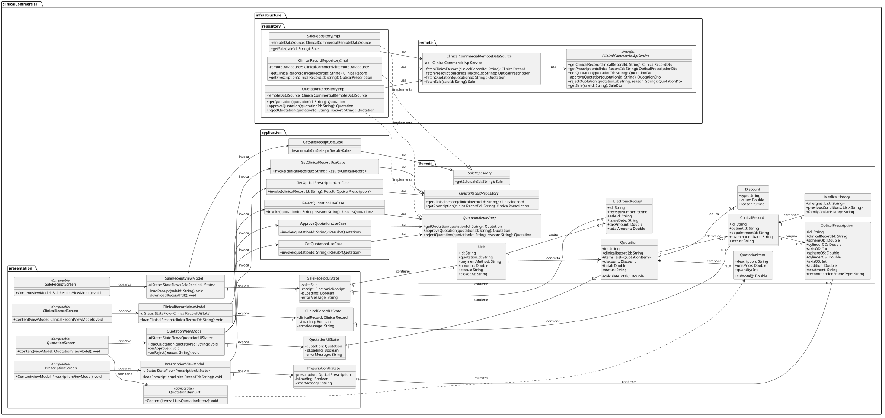

##### 2.6.2.6.2. Bounded Context Database Design Diagram

El siguiente Database Design Diagram representa el modelo de persistencia del Bounded Context **Clinical & Commercial**, implementado mediante PostgreSQL.

El esquema se organiza alrededor de `clinical_records`, que almacena la información principal de cada atención clínica. Las tablas `medical_histories` y `optical_prescriptions` dependen de dicho registro y permiten persistir los antecedentes clínicos y la receta óptica correspondiente.

Las cotizaciones se almacenan mediante `quotations`, mientras que sus elementos son registrados en `quotation_items`. Los datos correspondientes al descuento se mantienen dentro de la cotización debido a que `Discount` forma parte de su estado y no posee identidad independiente.

Una cotización aprobada puede originar una venta registrada en `sales`. Los datos correspondientes al pago se mantienen dentro de esta estructura, mientras que `electronic_receipts` registra el comprobante electrónico asociado a la venta.

Las relaciones se establecen mediante Primary Keys, Foreign Keys y restricciones de unicidad para mantener la integridad de los agregados y sus entidades persistentes.

  

### 2.6.3. Bounded Context: Production & Tracking Context

#### 2.6.3.1. Domain Layer

La **Domain Layer** concentra las reglas de negocio relacionadas con la producción y trazabilidad de los pedidos ópticos. Esta capa representa los conceptos propios del contexto y mantiene las reglas del proceso de fabricación independientes de los mecanismos de persistencia, comunicación o infraestructura.

El modelo de dominio se estructura alrededor de los principales conceptos definidos en el lenguaje ubicuo del contexto:

| Concepto | Tipo | Responsabilidad |
|---|---|---|
| `Work Order` | Aggregate / Entity | Representa la orden de trabajo asociada a la fabricación del pedido óptico y permite controlar su ciclo de vida. |
| `Technician` | Entity | Representa al técnico responsable de ejecutar las actividades asociadas a una orden de trabajo. |
| `Laboratory` | Entity | Representa el laboratorio donde se realiza el proceso de fabricación de las lentes y monturas. |
| `Lenses` | Entity | Representa las lentes que serán procesadas de acuerdo con las especificaciones técnicas del pedido. |
| `Work Order Status` | Value / Domain Concept | Representa la fase actual de la orden dentro del flujo Kanban. |
| `Delivery Date` | Value Object / Domain Concept | Representa la fecha estimada para la entrega del pedido terminado. |
| `Delivery Delay` | Domain Concept | Representa la situación en la que la orden presenta un retraso respecto a la fecha estimada de entrega. |

El flujo de estados definido para la `Work Order` utiliza las siguientes etapas:

| Estado | Descripción |
|---|---|
| `Pendiente` | La orden ha sido generada y se encuentra pendiente de iniciar el proceso de producción. |
| `En Taller` | La orden se encuentra en proceso de fabricación en el taller o laboratorio. |
| `Control de Calidad` | Las lentes y monturas se encuentran en la etapa de revisión antes de la entrega. |
| `Listo para Entrega` | El proceso de fabricación y control ha finalizado y el pedido se encuentra preparado para ser entregado al paciente. |

##### Domain Commands

Los principales comandos definidos para el contexto son:

| Command | Responsabilidad |
|---|---|
| `GenerateWorkOrder` | Genera una nueva orden de trabajo a partir de una venta cerrada. |
| `AssignWorkOrderToTechnician` | Asigna una orden de trabajo a un técnico de laboratorio. |
| `SendWorkOrderToLaboratory` | Envía la orden de trabajo al laboratorio correspondiente. |
| `UpdateWorkOrderStatus` | Actualiza el estado de la orden dentro del flujo Kanban. |
| `CompleteLenses` | Registra la finalización del proceso de fabricación de las lentes. |
| `NotifyDeliveryDelay` | Gestiona la notificación asociada a un retraso en la entrega. |
| `MarkOrderAsDelivered` | Registra que la orden ha sido entregada al paciente. |

##### Domain Events

Los eventos publicados por este contexto son:

| Domain Event | Descripción |
|---|---|
| `WorkOrderGenerated` | Indica que una nueva orden de trabajo ha sido generada. |
| `WorkOrderAssigned` | Indica que una orden de trabajo ha sido asignada a un técnico. |
| `WorkOrderSentToLaboratory` | Indica que la orden ha sido enviada al laboratorio. |
| `WorkOrderStatusUpdated` | Indica que el estado de una orden de trabajo ha cambiado. |
| `LensesWereCompleted` | Indica que las lentes asociadas a la orden han finalizado su proceso. |
| `EstimatedDeliveryDateCalculated` | Indica que se ha calculado una fecha estimada de entrega. |
| `DeliveryDelayNotified` | Indica que se ha registrado y notificado un retraso en la entrega. |
| `OrderWasMarkedAsDelivered` | Indica que la orden ha sido marcada como entregada. |

##### Repository

| Repository | Responsabilidad |
|---|---|
| `WorkOrderRepository` | Abstrae el acceso y persistencia de las órdenes de trabajo del contexto. |

La interacción principal del dominio con otros contextos comienza cuando **Clinical & Commercial** publica el evento `SaleWasClosed`. Production & Tracking recibe este evento y ejecuta el comando `GenerateWorkOrder`, iniciando así el ciclo de producción de la orden.

---

#### 2.6.3.2. Interface Layer

La **Interface Layer** representa el punto de entrada mediante el cual Production & Tracking recibe comandos y eventos externos. Su función es traducir las solicitudes externas hacia las operaciones que serán procesadas por la Application Layer.

Los comandos definidos en el Bounded Context se exponen mediante la API Gateway, mientras que el evento `SaleWasClosed` es recibido desde el contexto **Clinical & Commercial**.

##### Controllers

| Controller | Tipo | Responsabilidad |
|---|---|---|
| `WorkOrderController` | REST Controller | Expone las operaciones relacionadas con la generación, asignación, envío, actualización y entrega de órdenes de trabajo. |

##### Event Consumers

| Consumer | Tipo | Responsabilidad |
|---|---|---|
| `SaleWasClosedConsumer` | Event Consumer | Recibe el evento `SaleWasClosed` proveniente de Clinical & Commercial y permite iniciar la generación de una `Work Order`. |

##### Resources / DTOs

| DTO | Tipo | Uso |
|---|---|---|
| `GenerateWorkOrderRequest` | Input | Datos necesarios para generar una orden de trabajo. |
| `AssignWorkOrderToTechnicianRequest` | Input | Datos necesarios para asignar una orden a un técnico. |
| `SendWorkOrderToLaboratoryRequest` | Input | Datos necesarios para enviar una orden al laboratorio. |
| `UpdateWorkOrderStatusRequest` | Input | Datos necesarios para actualizar el estado de una orden. |
| `CompleteLensesRequest` | Input | Datos necesarios para registrar la finalización de las lentes. |
| `NotifyDeliveryDelayRequest` | Input | Datos asociados a la notificación de un retraso. |
| `MarkOrderAsDeliveredRequest` | Input | Datos necesarios para registrar la entrega de una orden. |
| `WorkOrderResponse` | Output | Información de una orden de trabajo. |
| `WorkOrderStatusResponse` | Output | Información relacionada con el estado actual de una orden. |

##### Assemblers

| Assembler | Transformación |
|---|---|
| `FromGenerateWorkOrderRequestAssembler` | `GenerateWorkOrderRequest` → `GenerateWorkOrderCommand` |
| `FromAssignWorkOrderToTechnicianRequestAssembler` | `AssignWorkOrderToTechnicianRequest` → `AssignWorkOrderToTechnicianCommand` |
| `FromSendWorkOrderToLaboratoryRequestAssembler` | `SendWorkOrderToLaboratoryRequest` → `SendWorkOrderToLaboratoryCommand` |
| `FromUpdateWorkOrderStatusRequestAssembler` | `UpdateWorkOrderStatusRequest` → `UpdateWorkOrderStatusCommand` |
| `FromCompleteLensesRequestAssembler` | `CompleteLensesRequest` → `CompleteLensesCommand` |
| `FromNotifyDeliveryDelayRequestAssembler` | `NotifyDeliveryDelayRequest` → `NotifyDeliveryDelayCommand` |
| `FromMarkOrderAsDeliveredRequestAssembler` | `MarkOrderAsDeliveredRequest` → `MarkOrderAsDeliveredCommand` |

---

#### 2.6.3.3. Application Layer

La **Application Layer** coordina los casos de uso definidos para Production & Tracking. Esta capa recibe los comandos provenientes de la Interface Layer y coordina su ejecución sobre el modelo de dominio.

Los casos de uso principales corresponden a las operaciones definidas en el Bounded Context Canvas.

##### Command Handlers

| Handler | Tipo | Orquesta |
|---|---|---|
| `GenerateWorkOrderHandler` | Command Handler | Genera una nueva `Work Order` a partir de la información recibida después del cierre de una venta. |
| `AssignWorkOrderToTechnicianHandler` | Command Handler | Coordina la asignación de una orden de trabajo a un técnico. |
| `SendWorkOrderToLaboratoryHandler` | Command Handler | Coordina el envío de la orden al laboratorio correspondiente. |
| `UpdateWorkOrderStatusHandler` | Command Handler | Gestiona la actualización del estado de la orden dentro del flujo Kanban. |
| `CompleteLensesHandler` | Command Handler | Gestiona la finalización del proceso de fabricación de las lentes. |
| `NotifyDeliveryDelayHandler` | Command Handler | Gestiona el registro y notificación de retrasos en la entrega. |
| `MarkOrderAsDeliveredHandler` | Command Handler | Coordina el registro de la entrega final de la orden. |

##### Event Handler

| Handler | Tipo | Responsabilidad |
|---|---|---|
| `SaleWasClosedEventHandler` | Event Handler | Reacciona al evento `SaleWasClosed` y desencadena el proceso de generación de una orden de trabajo mediante `GenerateWorkOrder`. |

##### Application Services

| Application Service | Responsabilidad |
|---|---|
| `WorkOrderApplicationService` | Coordina los casos de uso relacionados con la generación, asignación, envío, seguimiento y entrega de órdenes de trabajo. |

La Application Layer permite mantener separados los casos de uso del sistema respecto de las reglas internas del dominio y de los mecanismos utilizados para persistir o comunicar información.

---

#### 2.6.3.4. Infrastructure Layer

La **Infrastructure Layer** contiene las implementaciones técnicas necesarias para conectar el dominio de Production & Tracking con los mecanismos externos de persistencia y comunicación.

Esta capa implementa las abstracciones definidas en el dominio y permite que las reglas de negocio permanezcan independientes de tecnologías específicas.

##### Repositories

| Clase | Tipo | Responsabilidad |
|---|---|---|
| `WorkOrderRepositoryImpl` | Repository Implementation | Implementa `WorkOrderRepository` y permite persistir y recuperar las órdenes de trabajo. |

##### Persistence

| Componente | Responsabilidad |
|---|---|
| `WorkOrderEntity` | Representa la persistencia de la orden de trabajo en la base de datos. |
| `WorkOrderMapper` | Transforma el modelo de persistencia de la orden de trabajo hacia el modelo utilizado por el dominio y viceversa. |

##### Messaging

| Componente | Responsabilidad |
|---|---|
| `DomainEventPublisher` | Publica los eventos generados por Production & Tracking hacia el Event Bus. |
| `SaleWasClosedConsumer` | Consume el evento `SaleWasClosed` proveniente de Clinical & Commercial. |

La comunicación mediante eventos permite desacoplar Production & Tracking de los demás Bounded Contexts. En particular, el contexto recibe `SaleWasClosed` desde **Clinical & Commercial** y publica eventos como `WorkOrderStatusUpdated` y `OrderWasMarkedAsDelivered`, que son consumidos por **Notification & Loyalty**.

##### Anti-Corruption Layer

Production & Tracking utiliza una **Anti-Corruption Layer (ACL)** en su relación con **Clinical & Commercial**. Esta capa permite traducir la información recibida mediante `SaleWasClosed` hacia el modelo propio de producción, evitando que los conceptos comerciales y de facturación del contexto upstream se incorporen directamente al modelo de fabricación.

La relación se encuentra definida en el Context Mapping del apartado 2.5.2 mediante el patrón **Customer / Supplier**, donde **Clinical & Commercial** actúa como upstream y **Production & Tracking** como downstream.

---

#### 2.6.3.5. Bounded Context Software Architecture Component Level Diagrams

#### 2.6.3.6. Bounded Context Software Architecture Code Level Diagrams

##### 2.6.3.6.1. Bounded Context Domain Layer Class Diagrams

El siguiente UML Class Diagram representa la estructura del Domain Layer correspondiente al Bounded Context **Production & Tracking**.

El modelo se organiza alrededor de `WorkOrder`, que representa el Aggregate Root encargado de controlar el ciclo de vida de una orden de trabajo desde su generación hasta la entrega final del pedido. La orden puede ser asignada a un `Technician`, enviada a un `Laboratory` y contiene las `Lenses` que forman parte del proceso de fabricación.

El estado actual de la orden es representado mediante `WorkOrderStatus`, el cual permite identificar las diferentes etapas del flujo de producción: pendiente, en taller, control de calidad y listo para entrega. Asimismo, `DeliveryDate` representa la fecha estimada de entrega del pedido, mientras que `DeliveryDelay` permite representar situaciones relacionadas con retrasos durante el proceso de fabricación.

El Domain Layer también incluye `WorkOrderRepository`, que abstrae la persistencia del agregado, y los Domain Events generados durante las distintas operaciones realizadas sobre la orden de trabajo.

  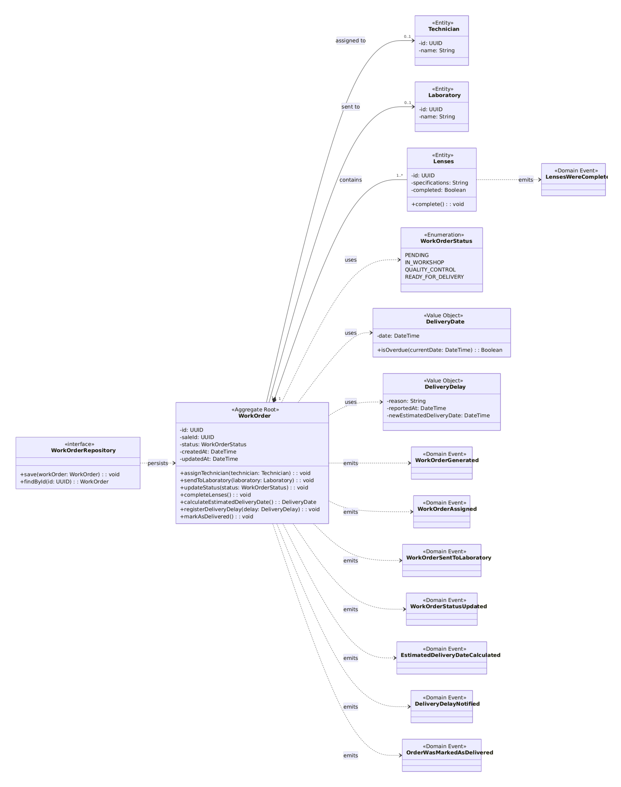

##### 2.6.3.6.2. Bounded Context Database Design Diagram

El siguiente Database Design Diagram representa el modelo de persistencia correspondiente al Bounded Context **Production & Tracking**. De acuerdo con la arquitectura definida para OptiFlow, este contexto utiliza **MongoDB** como mecanismo de persistencia.

El modelo se organiza alrededor de la colección `work_orders`, correspondiente a la representación persistente de `WorkOrderEntity`. Cada documento almacena la información necesaria para representar la orden de trabajo y los conceptos asociados a su proceso de fabricación.

Dentro del documento de una orden pueden representarse la información del técnico asignado, el laboratorio, las lentes asociadas, el estado actual de producción, la fecha estimada de entrega y la información relacionada con posibles retrasos.

Debido al uso de MongoDB, los elementos que forman parte del agregado pueden representarse mediante documentos embebidos y arreglos internos, evitando la necesidad de utilizar relaciones mediante Primary Keys y Foreign Keys propias de un modelo relacional.

  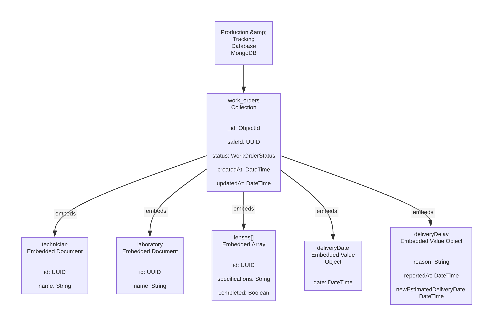

### 2.6.4. Bounded Context: Store Management & Inventory Context

#### 2.6.4.1. Domain Layer

La **Domain Layer** concentra las reglas de negocio relacionadas con la gestión del catálogo, inventario y abastecimiento de productos físicos de la óptica.

El modelo de dominio se organiza alrededor de los conceptos definidos en el lenguaje ubicuo del contexto.

##### Domain Concepts

| Concepto | Tipo | Responsabilidad |
|---|---|---|
| `Frame Model` | Entity | Representa un modelo físico de montura disponible en el catálogo. |
| `Catalog` | Aggregate / Domain Concept | Representa el conjunto de modelos de monturas disponibles para la óptica. |
| `Price` | Value Object / Domain Concept | Representa el precio asociado a un modelo de montura. |
| `Stock` | Entity / Domain Concept | Representa la cantidad disponible de un producto físico. |
| `Inventory` | Aggregate / Domain Concept | Gestiona las existencias físicas de productos dentro de la óptica. |
| `Low Stock Alert` | Domain Concept | Representa la alerta generada cuando las existencias de un producto alcanzan un nivel crítico. |
| `Supplier` | Entity | Representa al proveedor encargado del abastecimiento de productos. |
| `Replenishment` | Domain Concept | Representa el proceso de reposición de existencias. |

##### Domain Commands

Los comandos definidos para el contexto son:

| Command | Responsabilidad |
|---|---|
| `AddNewFrameModel` | Registra un nuevo modelo de montura dentro del catálogo. |
| `UpdateFrameModelPrice` | Actualiza el precio asociado a un modelo de montura. |
| `ConsultStock` | Permite consultar la disponibilidad de existencias de un producto. |
| `ReplenishStock` | Gestiona el reabastecimiento de las existencias. |
| `RegisterSupplier` | Registra un nuevo proveedor para las operaciones de abastecimiento. |

##### Domain Events

Los principales eventos publicados por el contexto son:

| Domain Event | Descripción |
|---|---|
| `NewFrameModelAdded` | Indica que un nuevo modelo de montura fue agregado al catálogo. |
| `FrameModelPriceUpdated` | Indica que el precio de un modelo de montura fue actualizado. |
| `StockWasConsulted` | Indica que se realizó una consulta sobre las existencias. |
| `StockWasReplenished` | Indica que las existencias fueron reabastecidas. |
| `LowStockAlertGenerated` | Indica que se generó una alerta debido a un nivel bajo de stock. |
| `InventoryWasUpdated` | Indica que la información del inventario fue actualizada. |
| `SupplierRegistered` | Indica que un nuevo proveedor fue registrado. |

##### Repository

| Repository | Responsabilidad |
|---|---|
| `InventoryRepository` | Abstrae el acceso y persistencia de la información relacionada con el inventario. |
| `FrameModelRepository` | Abstrae el acceso y persistencia de los modelos de monturas registrados en el catálogo. |
| `SupplierRepository` | Abstrae el acceso y persistencia de los proveedores registrados. |

---

#### 2.6.4.2. Interface Layer

La **Interface Layer** representa el punto de entrada para las operaciones relacionadas con el catálogo, precios, stock, reabastecimiento y proveedores.

Las solicitudes externas son recibidas mediante la API Gateway y posteriormente transformadas en comandos de aplicación.

##### Controllers

| Controller | Tipo | Responsabilidad |
|---|---|---|
| `FrameModelController` | REST Controller | Gestiona las operaciones relacionadas con los modelos de monturas y sus precios. |
| `InventoryController` | REST Controller | Gestiona las operaciones relacionadas con consultas y reabastecimiento de stock. |
| `SupplierController` | REST Controller | Gestiona el registro de proveedores. |

##### Event Consumers

| Consumer | Tipo | Responsabilidad |
|---|---|---|
| `SaleWasClosedConsumer` | Event Consumer | Recibe el evento `SaleWasClosed` proveniente de Clinical & Commercial para evaluar el stock consumido por la venta. |

La recepción de `SaleWasClosed` forma parte del flujo de integración definido entre **Clinical & Commercial** y **Store Management & Inventory**.

##### Resources / DTOs

| DTO | Tipo | Uso |
|---|---|---|
| `AddNewFrameModelRequest` | Input | Datos necesarios para registrar un nuevo modelo de montura. |
| `UpdateFrameModelPriceRequest` | Input | Datos necesarios para actualizar el precio de un modelo de montura. |
| `ConsultStockRequest` | Input | Parámetros utilizados para consultar las existencias. |
| `ReplenishStockRequest` | Input | Datos necesarios para gestionar el reabastecimiento del stock. |
| `RegisterSupplierRequest` | Input | Datos necesarios para registrar un proveedor. |
| `FrameModelResponse` | Output | Información de un modelo de montura registrado. |
| `StockResponse` | Output | Información sobre las existencias disponibles. |
| `SupplierResponse` | Output | Información de un proveedor registrado. |
| `InventoryResponse` | Output | Información relacionada con el inventario. |

##### Assemblers

| Assembler | Transformación |
|---|---|
| `FromAddNewFrameModelRequestAssembler` | `AddNewFrameModelRequest` → `AddNewFrameModelCommand` |
| `FromUpdateFrameModelPriceRequestAssembler` | `UpdateFrameModelPriceRequest` → `UpdateFrameModelPriceCommand` |
| `FromConsultStockRequestAssembler` | `ConsultStockRequest` → `ConsultStockCommand` |
| `FromReplenishStockRequestAssembler` | `ReplenishStockRequest` → `ReplenishStockCommand` |
| `FromRegisterSupplierRequestAssembler` | `RegisterSupplierRequest` → `RegisterSupplierCommand` |

---

#### 2.6.4.3. Application Layer

La **Application Layer** coordina los casos de uso relacionados con la administración del catálogo, actualización de precios, consulta de stock, reabastecimiento y gestión de proveedores.

Los casos de uso se ejecutan mediante handlers que reciben los comandos provenientes de la Interface Layer y coordinan las operaciones correspondientes sobre el modelo de dominio.

##### Command Handlers

| Handler | Tipo | Orquesta |
|---|---|---|
| `AddNewFrameModelHandler` | Command Handler | Coordina el registro de un nuevo modelo de montura en el catálogo. |
| `UpdateFrameModelPriceHandler` | Command Handler | Coordina la actualización del precio de un modelo de montura. |
| `ConsultStockHandler` | Command Handler | Coordina la consulta de las existencias disponibles. |
| `ReplenishStockHandler` | Command Handler | Coordina el proceso de reabastecimiento del inventario. |
| `RegisterSupplierHandler` | Command Handler | Coordina el registro de un nuevo proveedor. |

##### Event Handler

| Handler | Tipo | Responsabilidad |
|---|---|---|
| `SaleWasClosedEventHandler` | Event Handler | Reacciona al evento `SaleWasClosed` para iniciar el procesamiento relacionado con el stock consumido por la venta. |

##### Application Services

| Application Service | Responsabilidad |
|---|---|
| `InventoryApplicationService` | Coordina los casos de uso relacionados con la consulta, actualización y reabastecimiento del inventario. |
| `FrameModelApplicationService` | Coordina los casos de uso relacionados con la administración de modelos de monturas y sus precios. |
| `SupplierApplicationService` | Coordina las operaciones relacionadas con el registro y gestión de proveedores. |

La Application Layer permite mantener separados los casos de uso de las reglas de negocio del dominio y de los mecanismos utilizados para persistir la información o comunicarse con otros contextos.

---

#### 2.6.4.4. Infrastructure Layer

La **Infrastructure Layer** contiene las implementaciones técnicas necesarias para persistir la información del catálogo, inventario y proveedores, así como para publicar y consumir eventos.

##### Repositories

| Clase | Tipo | Responsabilidad |
|---|---|---|
| `InventoryRepositoryImpl` | Repository Implementation | Implementa `InventoryRepository` para gestionar la persistencia del inventario. |
| `FrameModelRepositoryImpl` | Repository Implementation | Implementa `FrameModelRepository` para gestionar la persistencia de los modelos de monturas. |
| `SupplierRepositoryImpl` | Repository Implementation | Implementa `SupplierRepository` para gestionar la persistencia de los proveedores. |

##### Persistence

| Componente | Responsabilidad |
|---|---|
| `InventoryEntity` | Representa la persistencia de la información del inventario. |
| `FrameModelEntity` | Representa la persistencia de los modelos de monturas. |
| `SupplierEntity` | Representa la persistencia de los proveedores. |
| `InventoryMapper` | Transforma la información de persistencia del inventario hacia el modelo utilizado por el dominio y viceversa. |
| `FrameModelMapper` | Transforma la información de persistencia de los modelos de monturas hacia el modelo utilizado por el dominio y viceversa. |
| `SupplierMapper` | Transforma la información de persistencia de los proveedores hacia el modelo utilizado por el dominio y viceversa. |

##### Messaging

| Componente | Responsabilidad |
|---|---|
| `DomainEventPublisher` | Publica los eventos generados por Store Management & Inventory hacia el Event Bus. |
| `SaleWasClosedConsumer` | Consume el evento `SaleWasClosed` proveniente de Clinical & Commercial. |

El evento `SaleWasClosed` permite que Store Management & Inventory reaccione al cierre de una venta y evalúe el stock consumido. Esta interacción forma parte del flujo de mensajes definido en el modelo estratégico.

#### 2.6.4.5. Bounded Context Software Architecture Component Level Diagrams

#### 2.6.4.6. Bounded Context Software Architecture Code Level Diagrams

##### 2.6.4.6.1. Bounded Context Domain Layer Class Diagrams

El siguiente UML Class Diagram representa la estructura del Domain Layer correspondiente al Bounded Context **Store Management & Inventory**.

El modelo se organiza principalmente alrededor de `FrameModel` e `Inventory`. `FrameModel` representa los modelos de monturas disponibles para la óptica y mantiene información relacionada con sus características y precio. Por su parte, `Inventory` controla las existencias físicas de los productos y concentra las operaciones de consulta, incremento, reducción y reabastecimiento de stock.

`Catalog` representa el conjunto de modelos de monturas disponibles, mientras que `Price` se modela como un Value Object asociado a `FrameModel`. La entidad `Stock` mantiene la cantidad disponible y el nivel mínimo definido para cada modelo de montura, permitiendo determinar cuándo las existencias han alcanzado un nivel crítico.

El proceso de abastecimiento se representa mediante `Replenishment`, el cual relaciona el inventario, el producto y el `Supplier` responsable del suministro. Asimismo, `LowStockAlert` representa la información generada cuando la cantidad disponible de un producto alcanza o se encuentra por debajo del nivel mínimo establecido.

El Domain Layer también incluye las interfaces `FrameModelRepository`, `InventoryRepository` y `SupplierRepository`, responsables de abstraer la persistencia de los principales elementos del dominio. Finalmente, los Domain Events representan los acontecimientos relevantes producidos durante la gestión del catálogo, inventario, stock y proveedores.

  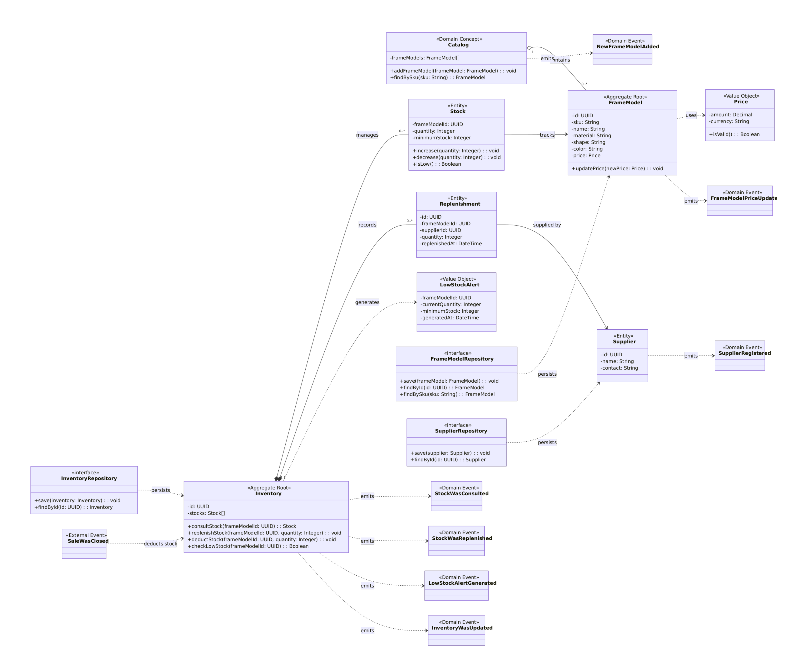

##### 2.6.4.6.2. Bounded Context Database Design Diagram

El siguiente Database Design Diagram representa el modelo de persistencia correspondiente al Bounded Context **Store Management & Inventory**. De acuerdo con la arquitectura definida para OptiFlow, este contexto utiliza **PostgreSQL** como sistema de gestión de base de datos relacional.

El modelo se organiza alrededor de las tablas `frame_models`, `inventories`, `inventory_stocks`, `suppliers` y `replenishments`.

La tabla `frame_models` almacena la información correspondiente a los modelos de monturas registrados en el catálogo, incluyendo sus principales características y la información de precio. Debido a que `Price` forma parte del estado de un modelo de montura y no posee identidad independiente, sus datos se almacenan directamente dentro de `frame_models`.

La tabla `inventories` representa los inventarios administrados por el contexto, mientras que `inventory_stocks` mantiene las existencias de cada modelo de montura. Esta última utiliza una Primary Key compuesta formada por `inventory_id` y `frame_model_id`, permitiendo mantener un único registro de stock para cada modelo dentro de un inventario.

La tabla `suppliers` almacena los proveedores responsables del abastecimiento de productos. Por otro lado, `replenishments` registra las operaciones de reposición de stock, relacionando un inventario, un modelo de montura y el proveedor involucrado en el abastecimiento.

Las relaciones entre las tablas se establecen mediante Primary Keys y Foreign Keys, permitiendo mantener la integridad referencial de la información relacionada con catálogo, existencias, proveedores y operaciones de reabastecimiento.

  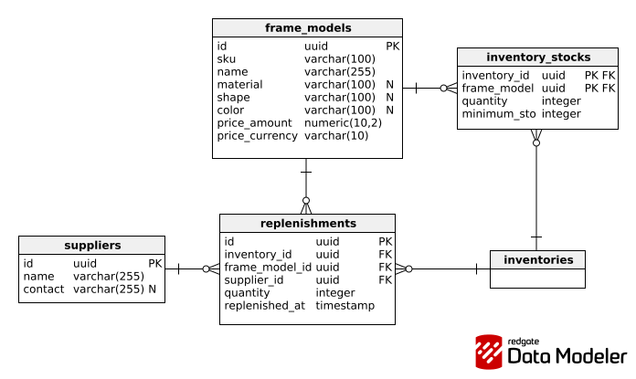

### 2.6.5. Bounded Context: Notification & Loyalty Context

#### 2.6.5.1. Domain Layer

La capa de dominio del **Notification & Loyalty Context** concentra las reglas relacionadas con la comunicación y fidelización del paciente. Este contexto gestiona las notificaciones, preferencias de comunicación, encuestas de satisfacción, campañas de reactivación y beneficios asociados a fechas especiales.

##### Domain Concepts

| Concepto | Tipo | Descripción |
|---|---|---|
| `Patient Birthday` | Domain Concept | Representa la fecha de cumpleaños del paciente utilizada para activar acciones de fidelización. |
| `Birthday Discount` | Domain Concept | Beneficio promocional enviado al paciente por motivo de su cumpleaños. |
| `Satisfaction Survey` | Domain Concept | Encuesta enviada al paciente para recopilar información sobre su experiencia. |
| `Staff Member` | Entity | Personal responsable de gestionar las notificaciones dentro de la óptica. |
| `Notification Preferences` | Value Object | Configuración de las preferencias de comunicación del paciente. |
| `In-App Notification` | Domain Concept | Notificación mostrada directamente dentro de la aplicación móvil. |
| `Order Progress` | Domain Concept | Información relacionada con el avance del pedido de lentes. |
| `Reactivation Campaign` | Domain Concept | Recordatorio preventivo enviado al paciente para incentivar un nuevo control de su graduación visual. |

##### Commands

| Command | Descripción |
|---|---|
| `DetectPatientBirthday` | Detecta los pacientes que cumplen años y permite iniciar el flujo de fidelización. |
| `SendBirthdayDiscount` | Envía el beneficio o descuento correspondiente al cumpleaños del paciente. |
| `SendSatisfactionSurvey` | Envía una encuesta de satisfacción después de la entrega del pedido. |
| `AssignStaffMemberToManageNotifications` | Asigna un miembro del personal para gestionar las notificaciones. |
| `ConfigureNotificationPreferences` | Configura las preferencias de comunicación del paciente. |
| `NotifyPatientInApp` | Envía una notificación directamente dentro de la aplicación. |
| `NotifyLensOrderProgress` | Comunica al paciente el avance de su pedido de lentes. |
| `SendReactivationCampaign` | Envía una campaña de reactivación para incentivar una nueva atención del paciente. |

##### Domain Events

| Evento | Descripción |
|---|---|
| `PatientBirthdayDetected` | Indica que se detectó el cumpleaños de un paciente. |
| `BirthdayDiscountWasSent` | Indica que el beneficio de cumpleaños fue enviado. |
| `SatisfactionSurveyWasSent` | Indica que una encuesta de satisfacción fue enviada. |
| `SatisfactionSurveyCompleted` | Indica que el paciente completó una encuesta de satisfacción. |
| `StaffMemberAssigned` | Indica que un miembro del personal fue asignado para gestionar notificaciones. |
| `NotificationPreferencesConfigured` | Indica que las preferencias de notificación fueron configuradas. |
| `InAppNotificationSent` | Indica que una notificación fue enviada dentro de la aplicación. |
| `LensOrderProgressNotified` | Indica que se comunicó al paciente el avance de su pedido. |
| `ReactivationCampaignSent` | Indica que una campaña de reactivación fue enviada. |

El contexto también consume eventos provenientes de otros Bounded Contexts. `AppointmentBooked` permite activar los recordatorios de citas, `WorkOrderStatusUpdated` permite notificar el avance del pedido y `OrderWasMarkedAsDelivered` permite iniciar el envío de la encuesta de satisfacción.

#### 2.6.5.2. Interface Layer

La Interface Layer expone los puntos de entrada necesarios para ejecutar las operaciones relacionadas con las notificaciones y la fidelización. Los comandos son recibidos mediante el API Gateway y posteriormente transformados a objetos propios de la capa de aplicación.

##### Resources / DTOs

| DTO | Tipo | Uso |
|---|---|---|
| `DetectPatientBirthdayRequest` | Input | Datos necesarios para ejecutar la detección de cumpleaños. |
| `SendBirthdayDiscountRequest` | Input | Datos necesarios para enviar el descuento de cumpleaños. |
| `SendSatisfactionSurveyRequest` | Input | Datos necesarios para enviar una encuesta de satisfacción. |
| `AssignStaffMemberToManageNotificationsRequest` | Input | Datos necesarios para asignar personal responsable de las notificaciones. |
| `ConfigureNotificationPreferencesRequest` | Input | Datos utilizados para configurar las preferencias de notificación. |
| `NotifyPatientInAppRequest` | Input | Datos necesarios para enviar una notificación dentro de la aplicación. |
| `NotifyLensOrderProgressRequest` | Input | Datos relacionados con el avance del pedido de lentes. |
| `SendReactivationCampaignRequest` | Input | Datos necesarios para ejecutar una campaña de reactivación. |

##### Controllers

| Controller | Responsabilidad |
|---|---|
| `BirthdayNotificationController` | Gestiona las operaciones relacionadas con cumpleaños y beneficios. |
| `SatisfactionSurveyController` | Gestiona el envío y procesamiento de encuestas de satisfacción. |
| `NotificationController` | Gestiona las notificaciones dentro de la aplicación. |
| `NotificationPreferencesController` | Gestiona las preferencias de comunicación. |
| `OrderProgressNotificationController` | Gestiona las notificaciones relacionadas con el avance de los pedidos. |
| `ReactivationCampaignController` | Gestiona las campañas de reactivación. |

##### Assemblers

| Assembler | Transformación |
|---|---|
| `FromDetectPatientBirthdayRequestAssembler` | `DetectPatientBirthdayRequest` → `DetectPatientBirthdayCommand` |
| `FromSendBirthdayDiscountRequestAssembler` | `SendBirthdayDiscountRequest` → `SendBirthdayDiscountCommand` |
| `FromSendSatisfactionSurveyRequestAssembler` | `SendSatisfactionSurveyRequest` → `SendSatisfactionSurveyCommand` |
| `FromAssignStaffMemberRequestAssembler` | `AssignStaffMemberToManageNotificationsRequest` → `AssignStaffMemberToManageNotificationsCommand` |
| `FromConfigureNotificationPreferencesRequestAssembler` | `ConfigureNotificationPreferencesRequest` → `ConfigureNotificationPreferencesCommand` |
| `FromNotifyPatientInAppRequestAssembler` | `NotifyPatientInAppRequest` → `NotifyPatientInAppCommand` |
| `FromNotifyLensOrderProgressRequestAssembler` | `NotifyLensOrderProgressRequest` → `NotifyLensOrderProgressCommand` |
| `FromSendReactivationCampaignRequestAssembler` | `SendReactivationCampaignRequest` → `SendReactivationCampaignCommand` |

#### 2.6.5.3. Application Layer

La Application Layer coordina los casos de uso definidos para el contexto de notificaciones y fidelización. Su responsabilidad es recibir los comandos, ejecutar los servicios correspondientes y publicar los eventos resultantes sin incorporar reglas propias del dominio.

##### Command Handlers

| Command Handler | Command |
|---|---|
| `DetectPatientBirthdayCommandHandler` | `DetectPatientBirthdayCommand` |
| `SendBirthdayDiscountCommandHandler` | `SendBirthdayDiscountCommand` |
| `SendSatisfactionSurveyCommandHandler` | `SendSatisfactionSurveyCommand` |
| `AssignStaffMemberToManageNotificationsCommandHandler` | `AssignStaffMemberToManageNotificationsCommand` |
| `ConfigureNotificationPreferencesCommandHandler` | `ConfigureNotificationPreferencesCommand` |
| `NotifyPatientInAppCommandHandler` | `NotifyPatientInAppCommand` |
| `NotifyLensOrderProgressCommandHandler` | `NotifyLensOrderProgressCommand` |
| `SendReactivationCampaignCommandHandler` | `SendReactivationCampaignCommand` |

##### Event Consumers

| Event Consumer | Evento recibido | Acción |
|---|---|---|
| `AppointmentBookedConsumer` | `AppointmentBooked` | Inicia el flujo de recordatorio de la cita. |
| `WorkOrderStatusUpdatedConsumer` | `WorkOrderStatusUpdated` | Inicia la notificación del avance del pedido. |
| `OrderWasMarkedAsDeliveredConsumer` | `OrderWasMarkedAsDelivered` | Inicia el envío de la encuesta de satisfacción. |

##### Application Services

| Application Service | Responsabilidad |
|---|---|
| `BirthdayNotificationService` | Coordina la detección de cumpleaños y el envío del beneficio correspondiente. |
| `SatisfactionSurveyService` | Coordina el envío y gestión de las encuestas de satisfacción. |
| `NotificationService` | Coordina el envío de notificaciones dentro de la aplicación. |
| `NotificationPreferenceService` | Gestiona la configuración de preferencias de comunicación. |
| `OrderProgressNotificationService` | Coordina las notificaciones relacionadas con el avance de las órdenes. |
| `ReactivationCampaignService` | Coordina el envío de campañas de reactivación. |

#### 2.6.5.4. Infrastructure Layer

La Infrastructure Layer implementa los mecanismos técnicos requeridos para persistir información y comunicarse con servicios externos de mensajería. El contexto utiliza una **Anti-Corruption Layer (ACL)** para evitar que los formatos propios de Meta WhatsApp Cloud API o Firebase Cloud Messaging se propaguen hacia el modelo interno de OptiFlow.

##### Repositories

| Repository | Responsabilidad |
|---|---|
| `NotificationRepository` | Persistencia de las notificaciones generadas. |
| `NotificationPreferencesRepository` | Persistencia de las preferencias de comunicación. |
| `SatisfactionSurveyRepository` | Persistencia de las encuestas y sus respuestas. |
| `StaffMemberRepository` | Persistencia de los miembros del personal responsables de las notificaciones. |
| `ReactivationCampaignRepository` | Persistencia de las campañas de reactivación. |

##### Persistence

| Componente | Responsabilidad |
|---|---|
| `NotificationEntity` | Representación persistente de una notificación. |
| `NotificationPreferencesEntity` | Representación persistente de las preferencias del paciente. |
| `SatisfactionSurveyEntity` | Representación persistente de una encuesta de satisfacción. |
| `StaffMemberEntity` | Representación persistente del personal asignado. |
| `ReactivationCampaignEntity` | Representación persistente de una campaña de reactivación. |

##### Messaging

| Componente | Responsabilidad |
|---|---|
| `AppointmentBookedConsumer` | Consume eventos de reservas confirmadas. |
| `WorkOrderStatusUpdatedConsumer` | Consume eventos de actualización del estado de las órdenes. |
| `OrderWasMarkedAsDeliveredConsumer` | Consume eventos de entrega de pedidos. |
| `DomainEventPublisher` | Publica los eventos generados por el contexto. |

##### External Messaging / ACL

| Componente | Responsabilidad |
|---|---|
| `WhatsAppMessagingAdapter` | Adaptación de las notificaciones internas hacia Meta WhatsApp Cloud API. |
| `FirebaseMessagingAdapter` | Adaptación de las notificaciones internas hacia Firebase Cloud Messaging. |
| `MessagingAntiCorruptionLayer` | Aísla el modelo de notificaciones de OptiFlow de los formatos externos de mensajería. |

La comunicación con **Third-Party Messaging** se realiza siguiendo el patrón **Customer / Supplier**, donde la plataforma externa actúa como proveedor y Notification & Loyalty como cliente. La ACL permite desacoplar las plantillas y eventos propios de OptiFlow de los payloads y cabeceras requeridos por los servicios externos.

#### 2.6.5.5. Bounded Context Software Architecture Component Level Diagrams

#### 2.6.5.6. Bounded Context Software Architecture Code Level Diagrams

##### 2.6.5.6.1. Bounded Context Domain Layer Class Diagrams

El siguiente UML Class Diagram representa la estructura del Domain Layer correspondiente al Bounded Context **Notification & Loyalty**.

El modelo se organiza principalmente alrededor de `NotificationPreferences`, que representa la configuración de comunicación asociada al paciente y permite determinar los canales mediante los cuales pueden enviarse las diferentes notificaciones.

`PatientBirthday` representa la información utilizada para detectar fechas especiales del paciente y puede activar la generación de un `BirthdayDiscount`. Por otro lado, `SatisfactionSurvey` permite representar las encuestas enviadas después de la entrega de un pedido, mientras que `ReactivationCampaign` modela las campañas destinadas a incentivar futuros controles visuales.

`InAppNotification` representa los mensajes mostrados directamente dentro de la aplicación y puede utilizar información de `OrderProgress` para comunicar los cambios producidos durante la fabricación de un pedido. Asimismo, `StaffMember` representa al personal responsable de gestionar las comunicaciones cuando corresponda.

El Domain Layer incluye también las interfaces de repositorio necesarias para abstraer la persistencia de notificaciones, preferencias de comunicación, encuestas, miembros del personal y campañas de reactivación. Finalmente, los Domain Events representan los acontecimientos relevantes producidos durante las diferentes operaciones de notificación y fidelización.

  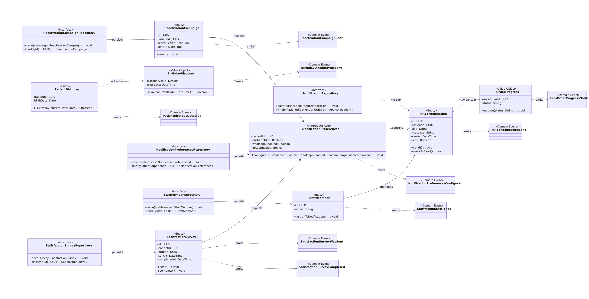

##### 2.6.5.6.2. Bounded Context Database Design Diagram

El siguiente Database Design Diagram representa el modelo de persistencia correspondiente al Bounded Context **Notification & Loyalty**. De acuerdo con la arquitectura definida para OptiFlow, este contexto utiliza **MongoDB** como sistema de persistencia NoSQL orientado a documentos.

El modelo está compuesto por las colecciones `notification_preferences`, `notifications`, `satisfaction_surveys`, `staff_members` y `reactivation_campaigns`, correspondientes a los principales elementos persistentes identificados en la Infrastructure Layer.

La colección `notification_preferences` almacena la configuración de comunicación asociada a cada paciente, permitiendo determinar los canales habilitados para el envío de mensajes. La colección `notifications` almacena las notificaciones generadas dentro del contexto y puede contener información embebida de `OrderProgress` cuando la comunicación está relacionada con el avance de una orden de trabajo.

Por otro lado, `satisfaction_surveys` almacena las encuestas enviadas a los pacientes después de la entrega de sus pedidos, mientras que `staff_members` mantiene la información del personal que puede ser asignado a la gestión de notificaciones. Finalmente, `reactivation_campaigns` registra las campañas utilizadas para incentivar futuros controles visuales.

Debido al uso de MongoDB, las relaciones entre los elementos del dominio pueden representarse mediante documentos embebidos o referencias lógicas, sin utilizar Primary Keys y Foreign Keys propias de un modelo relacional.

  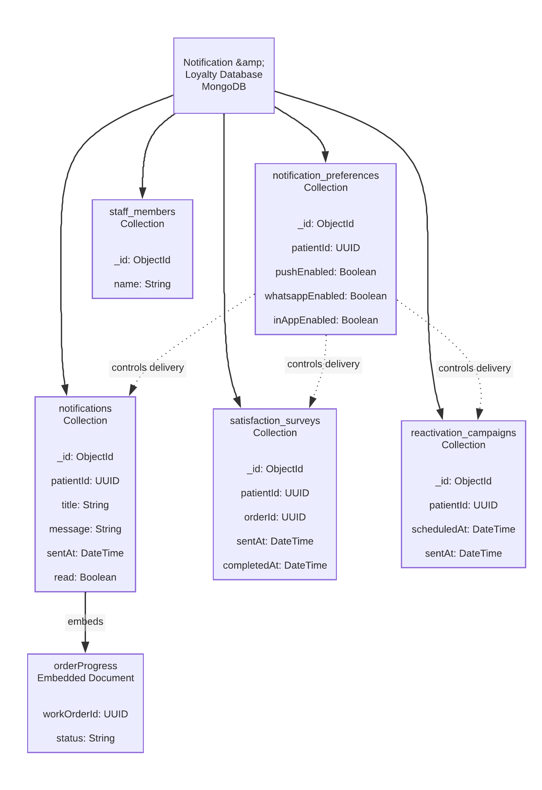

