<div style="break-before: page; page-break-before: always;"></div>

# Capítulo III: Solution UI/UX Design

## 3.1. Product design

El diseño de OptiFlow responde a las necesidades identificadas en las entrevistas y el modelado del dominio: búsqueda y reserva de citas para el paciente, junto con consulta de recetas, seguimiento de pedidos y gestión interna para el personal. El proceso sigue un enfoque de diseño centrado en las personas, en el que las decisiones de interfaz se basan en las necesidades y tareas de los usuarios (International Organization for Standardization, 2019). Este capítulo presenta la experiencia propuesta y sus criterios visuales. Los wireframes y prototipos abarcan un alcance mayor que el incremento implementado en TB1, cuya evidencia se presenta en el capítulo IV.

### 3.1.1. Style Guidelines


Las principales características consideradas para el diseño son:

* **Claridad:** la información debe presentarse de manera organizada y comprensible.
* **Consistencia:** los mismos componentes y acciones deben mantener un comportamiento y apariencia similares en toda la aplicación.
* **Simplicidad:** se debe evitar la sobrecarga visual y mostrar únicamente la información necesaria para cada contexto.
* **Accesibilidad:** los elementos deben contar con tamaños, contrastes y estructuras que faciliten su utilización.
* **Retroalimentación:** las acciones realizadas por el usuario deben mostrar estados o mensajes que indiquen si la operación fue exitosa, está en proceso o requiere alguna corrección.


#### 3.1.1.1. General Style Guidelines

 **Tipografía**


La tipografía de OptiFlow se presenta en la Figura 53.

<a id="figura-53"></a>

**Figura 53**

*Tipografía de OptiFlow*

<p align="center">
  
</p>


La tipografía de OptiFlow debe facilitar la lectura en pantallas pequeñas y mantener una jerarquía clara entre títulos, etiquetas y contenido. Este criterio es especialmente relevante al consultar horarios, recetas, pedidos y datos del paciente, donde la legibilidad favorece una interpretación precisa de la información.

Se propone utilizar una tipografía **sans-serif**, debido a que permite una lectura clara tanto en dispositivos móviles como en interfaces administrativas (ver Tabla 91).


<a id="tabla-91"></a>

**Tabla 91**

*Uso de la tipografía en la interfaz*


| Elemento                | Uso                                               |
| ----------------------- | ------------------------------------------------- |
| Título principal (32px) | Identificar las principales secciones o pantallas |
| Subtítulo        (20px) | Describir subsecciones o grupos de información    |
| Texto principal  (16px) | Mostrar información y descripciones               |
| Texto secundario (14px) | Presentar información complementaria              |
| Texto de apoyo   (12px) | Mostrar etiquetas, estados o información auxiliar |


**Colores**


La paleta de colores de OptiFlow se observa en la Figura 54.

<a id="figura-54"></a>

**Figura 54**

*Paleta de colores de OptiFlow*

<p align="center">
  
</p>


La paleta de colores debe transmitir una apariencia relacionada con los conceptos de **salud visual, confianza, claridad y tecnología**.

Se considera una paleta compuesta por colores principales, secundarios y colores destinados a comunicar estados del sistema (ver Tabla 92).


<a id="tabla-92"></a>

**Tabla 92**

*Colores de la interfaz y su uso*


| Elemento | Color actual | Uso |
| :---: | :---: | :---: |
| Primary | #212B93 | Encabezados, botones principales, bloques destacados |
| Secondary | #107194 | Botones secundarios, enlaces, elementos informativos |
| Accent / Mint | #6FF4BB | Botones destacados, selección, estados positivos |
| Background | #DFFBFF | Fondo general de las pantallas |
| Surface | #FFFFFF | Tarjetas, formularios y contenedores |
| Text | #1E1E1E | Texto principal |
| Secondary Text | #6B7280 | Texto secundario |
| Success | #6FF4BB | Confirmaciones y estados positivos |
| Error | #DC2626 | Errores y acciones críticas |

**Botones**


Los estilos de botones se muestran en la Figura 55.

<a id="figura-55"></a>

**Figura 55**

*Estilos de botones*

<p align="center">
  
</p>


Los botones deben diferenciar claramente las acciones principales de las acciones secundarias.


* **Acción primaria:** utilizada para las acciones principales, como `Reservar cita`, `Confirmar` o `Guardar`.
* **Acción secundaria:** utilizada para acciones complementarias, como `Cancelar`, `Volver` o `Editar`.
* **Acción crítica:** utilizada para operaciones que pueden generar consecuencias importantes, como eliminar información.
* **Acción contextual:** utilizada para operaciones específicas dentro de tarjetas, tablas o registros.


**Tarjetas**


Los estilos de tarjetas se presentan en la Figura 56.

<a id="figura-56"></a>

**Figura 56**

*Estilos de tarjetas*

<p align="center">
  
</p>


En el caso de los pacientes, podrán utilizarse para presentar:

* Información de una óptica.
* Modelos de monturas.
* Disponibilidad de horarios.
* Próximas citas.
* Estado de pedidos.
* Información de recetas ópticas.

Para el personal de la óptica, las tarjetas podrán presentar:

* Resumen de citas.
* Pacientes pendientes de atención.
* Alertas de inventario.
* Órdenes de trabajo.
* Estados de producción.
* Indicadores de gestión.

**Iconografía**


La iconografía de la aplicación se observa en la Figura 57.

<a id="figura-57"></a>

**Figura 57**

*Iconografía de la aplicación*

<p align="center">
  
</p>


Los iconos se utilizarán como elementos complementarios para facilitar el reconocimiento de acciones y funcionalidades (ver Tabla 93).


<a id="tabla-93"></a>

**Tabla 93**

*Íconos y funcionalidad asociada*


| Icono / representación | Funcionalidad              |
| ---------------------- | -------------------------- |
| Calendario             | Citas y disponibilidad     |
| Lupa                   | Búsqueda                   |
| Corazón                | Favoritos                  |
| Campana                | Notificaciones             |
| Usuario                | Perfil y pacientes         |
| Documento              | Receta o historial clínico |
| Caja                   | Pedidos                    |
| Lentes                 | Productos ópticos          |
| Alerta                 | Advertencias o incidencias |
| Ubicación              | Localización de ópticas    |

Los iconos no deberán utilizarse como único medio para comunicar información importante. Cuando sea necesario, deberán acompañarse de un texto descriptivo.

**Formularios**


Los estilos de formularios se muestran en la Figura 58.

<a id="figura-58"></a>

**Figura 58**

*Estilos de formularios*

<p align="center">
  
</p>


* Etiqueta del campo.
* Campo de entrada.
* Texto de ayuda cuando sea necesario.
* Mensaje de validación.
* Indicador de campo obligatorio cuando corresponda.

Las validaciones se presentan junto al campo correspondiente y explican cómo corregir el dato. Antes de confirmar una reserva, la interfaz debe permitir revisar la óptica, la fecha y el horario elegidos. Los mensajes deben indicar el resultado de la operación y ofrecer una acción de recuperación cuando la solicitud no pueda completarse.

**Estados de la interfaz**


Los estados visuales de la interfaz se presentan en la Figura 59.

<a id="figura-59"></a>

**Figura 59**

*Estados visuales de la interfaz*

<p align="center">
  
</p>


Los componentes de OptiFlow deberán contemplar diferentes estados para proporcionar retroalimentación al usuario (ver Tabla 94).


<a id="tabla-94"></a>

**Tabla 94**

*Estados visuales y su descripción*


| Estado   | Descripción                                                  |
| -------- | ------------------------------------------------------------ |
| Default  | Estado normal del componente                                 |
| Hover    | Estado al posicionar el cursor sobre un elemento interactivo |
| Active   | Estado durante la interacción                                |
| Disabled | Elemento temporalmente no disponible                         |
| Loading  | Información o proceso en proceso de carga                    |
| Success  | Operación realizada correctamente                            |
| Warning  | Situación que requiere atención                              |
| Error    | Operación incorrecta o información inválida                  |
| Empty    | No existen datos disponibles                                 |

**Diseño responsivo**


El diseño responsivo de OptiFlow se observa en la Figura 60.

<a id="figura-60"></a>

**Figura 60**

*Diseño responsivo de OptiFlow*

<p align="center">
  
</p>


La interfaz deberá adaptarse a los diferentes tamaños de pantalla en los que se utilice OptiFlow. En la aplicación orientada a pacientes, el diseño priorizará dispositivos móviles, considerando:

* Controles táctiles de tamaño adecuado.
* Navegación sencilla.
* Contenido organizado verticalmente.
* Formularios adaptados a pantallas pequeñas.
* Información importante visible sin necesidad de desplazamientos excesivos.

En las interfaces destinadas al personal de la óptica se podrá aprovechar un espacio de pantalla mayor para mostrar tablas, indicadores, filtros y diferentes bloques de información simultáneamente.

**Accesibilidad**


Los criterios de accesibilidad de la interfaz se muestran en la Figura 61.

<a id="figura-61"></a>

**Figura 61**

*Criterios de accesibilidad de la interfaz*

<p align="center">
  
</p>


El diseño contempla legibilidad, contraste, identificación de controles y mensajes comprensibles para facilitar el uso por personas con distintas necesidades. Estos criterios orientan la interfaz y deben comprobarse durante la evaluación de usabilidad.

Se considerarán los siguientes aspectos:

* Contraste suficiente entre texto y fondo.
* Tamaños de texto legibles.
* Elementos interactivos claramente identificables.
* Mensajes de error comprensibles.
* No depender únicamente del color para comunicar estados.
* Uso de etiquetas descriptivas.
* Estructura visual consistente.

### 3.1.2. Information Architecture

La arquitectura de información organiza los contenidos y funciones de OptiFlow según las tareas de cada rol. Su propósito es facilitar la localización de la información, reducir recorridos innecesarios y ofrecer una estructura consistente entre las pantallas.

La arquitectura se define considerando los dos principales tipos de usuarios identificados: **pacientes** y **personal de la óptica**. Cada perfil dispone de funcionalidades específicas, evitando presentar información que no corresponda a sus necesidades.

#### 3.1.2.1. Organization Systems

El sistema de organización de OptiFlow define cómo se agrupan las funcionalidades y contenidos de acuerdo con el tipo de usuario, las tareas que realiza y el contexto en el que se encuentra.

Para ello, se utilizan principalmente los siguientes esquemas de organización:

* **Organización jerárquica:** permite establecer niveles de información desde las funcionalidades principales hacia sus opciones específicas.
* **Organización por categorías:** agrupa funcionalidades relacionadas con una misma actividad o dominio.
* **Organización secuencial:** organiza determinadas funcionalidades de acuerdo con el orden lógico en que deben ejecutarse.

**Organización jerárquica**

La estructura general de OptiFlow parte de las funcionalidades principales y posteriormente se divide en opciones específicas.

Para el **paciente**, la organización principal se plantea de la siguiente manera:


El sistema de organización para el paciente se presenta en la Figura 62.

<a id="figura-62"></a>

**Figura 62**

*Sistema de organización para el paciente*

<p align="center">
  
</p>


```text
OptiFlow
├── Inicio
├── Buscar óptica
│   ├── Ópticas disponibles
│   ├── Información de la óptica
│   ├── Catálogo de monturas
│   └── Disponibilidad
├── Citas
│   ├── Próximas citas
│   ├── Historial de citas
│   └── Reservar cita
├── Pedidos
│   ├── Pedidos activos
│   ├── Estado del pedido
│   └── Historial de pedidos
├── Receta
│   ├── Receta actual
│   └── Historial de recetas
├── Notificaciones
└── Perfil
    ├── Datos personales
    └── Preferencias
```

Para el **personal de la óptica**, la organización se adapta a las actividades administrativas, clínicas y operativas:


El sistema de organización para el personal de la óptica se observa en la Figura 63.

<a id="figura-63"></a>

**Figura 63**

*Sistema de organización para el personal de la óptica*

<p align="center">
  
</p>


```text
OptiFlow
├── Inicio
│   ├── Resumen
│   ├── Citas del día
│   ├── Alertas
│   └── Indicadores
├── Agenda
│   ├── Citas
│   └── Disponibilidad
├── Pacientes
│   ├── Registro de pacientes
│   ├── Historia clínica
│   └── Recetas ópticas
├── Ventas
│   ├── Cotizaciones
│   ├── Ventas
│   └── Comprobantes
├── Inventario
│   ├── Monturas
│   ├── Stock
│   ├── Proveedores
│   └── Alertas de stock
├── Órdenes de trabajo
│   ├── Órdenes pendientes
│   ├── Producción
│   ├── Control de calidad
│   └── Entregas
├── Notificaciones
└── Perfil
```

Esta separación permite que cada usuario tenga acceso a las funcionalidades correspondientes a sus responsabilidades.

**Organización por categorías**

Las funcionalidades también se agrupan según la actividad que representan (ver Tabla 95).


<a id="tabla-95"></a>

**Tabla 95**

*Categorías de funcionalidades por tipo de usuario*


| Categoría                     | Funcionalidades principales                               | Usuario             |
| ----------------------------- | --------------------------------------------------------- | ------------------- |
| Búsqueda y reserva            | Buscar ópticas, consultar disponibilidad y reservar citas | Paciente            |
| Gestión clínica               | Historia clínica, recetas y seguimiento del paciente      | Paciente / Personal |
| Gestión comercial             | Cotizaciones, ventas, pagos y comprobantes                | Personal            |
| Producción y seguimiento      | Órdenes de trabajo, producción, estados y entregas        | Personal            |
| Notificaciones y fidelización | Recordatorios, alertas, promociones y encuestas           | Paciente / Personal |
| Inventario                    | Monturas, stock, proveedores y alertas                    | Personal            |

Esta clasificación permite relacionar las funcionalidades de la interfaz con los principales procesos identificados durante el análisis del dominio.

**Organización secuencial**

Algunas funcionalidades de OptiFlow requieren que el usuario complete una serie de pasos en un orden determinado. Para la **reserva de una cita**, el flujo de información se organiza de la siguiente manera:


El flujo de organización del paciente se muestra en la Figura 64.

<a id="figura-64"></a>

**Figura 64**

*Flujo de organización del paciente*

<p align="center">
  
</p>


Para el **seguimiento de una orden de trabajo**, la información se presenta de acuerdo con el avance del proceso:


El flujo de organización del personal de la óptica se presenta en la Figura 65.

<a id="figura-65"></a>

**Figura 65**

*Flujo de organización del personal de la óptica*

<p align="center">
  
</p>


Esta organización permite que el usuario comprenda en qué etapa se encuentra una actividad y cuáles son los siguientes pasos disponibles.

**Diagrama de organización de la información**

La estructura anterior puede representarse mediante un **diagrama de arquitectura de información o sitemap**, mostrando la relación entre las funcionalidades principales y sus subfuncionalidades (ver Figura 66).


<a id="figura-66"></a>

**Figura 66**

*Diagrama de organización de la información*

<p align="center">
  
</p>


#### 3.1.2.2. Labeling Systems

El sistema de etiquetado establece los nombres utilizados para identificar las funcionalidades, secciones, acciones y estados dentro de OptiFlow. Los nombres seleccionados buscan utilizar un lenguaje claro y familiar para los usuarios, evitando términos técnicos que puedan dificultar la comprensión de las funcionalidades.


**Etiquetas principales**


Las etiquetas de navegación por tipo de usuario se resumen en la Tabla 96.

<a id="tabla-96"></a>

**Tabla 96**

*Etiquetas de navegación por tipo de usuario*


| Etiqueta           | Descripción                                                | Usuario             |
| ------------------ | ---------------------------------------------------------- | ------------------- |
| Inicio             | Acceso a la información principal y resumen de actividades | Paciente / Personal |
| Buscar óptica      | Permite encontrar ópticas disponibles                      | Paciente            |
| Reservar cita      | Permite seleccionar y confirmar una cita                   | Paciente            |
| Mis citas          | Permite consultar las citas registradas                    | Paciente            |
| Mis pedidos        | Permite consultar el estado de los pedidos                 | Paciente            |
| Mi receta          | Permite consultar la receta óptica registrada              | Paciente            |
| Notificaciones     | Permite consultar avisos y actualizaciones                 | Paciente / Personal |
| Perfil             | Permite consultar y modificar información personal         | Paciente / Personal |
| Agenda             | Permite administrar las citas de la óptica                 | Personal            |
| Pacientes          | Permite gestionar la información de los pacientes          | Personal            |
| Historia clínica   | Permite consultar información clínica del paciente         | Personal            |
| Recetas ópticas    | Permite registrar y consultar recetas                      | Personal            |
| Ventas             | Permite gestionar las operaciones comerciales              | Personal            |
| Cotizaciones       | Permite gestionar cotizaciones para los pacientes          | Personal            |
| Inventario         | Permite administrar productos y existencias                | Personal            |
| Órdenes de trabajo | Permite gestionar el proceso de producción                 | Personal            |
| Alertas de stock   | Informa sobre productos con existencias bajas              | Personal            |

**Etiquetas para acciones**

Las acciones utilizarán verbos directos que indiquen claramente la operación que realizará el usuario (ver Tabla 97).


<a id="tabla-97"></a>

**Tabla 97**

*Etiquetas de acciones*


| Acción       | Uso                                                 |
| ------------ | --------------------------------------------------- |
| Buscar       | Realizar una búsqueda                               |
| Filtrar      | Reducir los resultados según determinados criterios |
| Ver detalles | Consultar información adicional                     |
| Reservar     | Registrar una cita                                  |
| Confirmar    | Confirmar una operación                             |
| Cancelar     | Cancelar una operación                              |
| Guardar      | Registrar cambios                                   |
| Editar       | Modificar información                               |
| Eliminar     | Remover información                                 |
| Descargar    | Obtener un documento o información                  |
| Continuar    | Avanzar al siguiente paso                           |
| Volver       | Regresar al paso anterior                           |

**Etiquetas para estados**

Los estados de los procesos también deberán mantener una nomenclatura consistente (ver Tabla 98).


<a id="tabla-98"></a>

**Tabla 98**

*Etiquetas de estados de la aplicación*


| Estado             | Aplicación                                 |
| ------------------ | ------------------------------------------ |
| Pendiente          | Actividad que todavía no ha sido atendida  |
| Confirmada         | Cita u operación confirmada                |
| En proceso         | Actividad actualmente en ejecución         |
| En producción      | Orden que se encuentra en fabricación      |
| Lista para entrega | Pedido que puede ser entregado al paciente |
| Entregada          | Pedido completado y entregado              |
| Cancelada          | Operación cancelada                        |
| Retrasada          | Proceso que presenta un retraso            |
| Completada         | Actividad finalizada correctamente         |

El uso de etiquetas consistentes permite que los usuarios puedan reconocer rápidamente las funcionalidades y estados del sistema. Además, evita utilizar diferentes nombres para representar un mismo concepto dentro de las distintas pantallas.

##### 3.1.2.3. SEO Tags and Meta Tags

Las etiquetas SEO y meta etiquetas de OptiFlow se aplicarán principalmente a la **Landing Page**, debido a que esta constituye el principal punto de acceso público a la solución. Su finalidad es facilitar la identificación del producto por los motores de búsqueda y proporcionar información relevante sobre el contenido de la página.

Las etiquetas se plantean para describir a OptiFlow como una solución de búsqueda de ópticas, reserva de citas y seguimiento de pedidos, manteniendo coherencia entre el contenido de la Landing Page y la información que se comparte con buscadores y redes sociales (ver Tabla 99).


<a id="tabla-99"></a>

**Tabla 99**

*SEO tags y meta tags de la Landing Page*


| Elemento | Propuesta |
|---|---|
| **Title** | OptiFlow - Gestión de citas y servicios ópticos |
| **Meta Description** | OptiFlow facilita la búsqueda de ópticas, reserva de citas y seguimiento de pedidos en un solo lugar. |
| **Keywords** | ópticas, citas ópticas, reserva de citas, gestión óptica, pacientes, recetas ópticas, seguimiento de pedidos |
| **Robots** | `index, follow` |
| **Open Graph Title** | OptiFlow - Gestión de citas y servicios ópticos |
| **Open Graph Description** | Encuentra ópticas, reserva citas y realiza el seguimiento de tus pedidos mediante OptiFlow. |
| **Open Graph Type** | `website` |

El **Title** permite identificar el propósito principal de la plataforma en los resultados de búsqueda, mientras que la **Meta Description** proporciona una descripción breve de los servicios ofrecidos. Las palabras clave propuestas se relacionan con las principales funcionalidades y conceptos del sistema, como la búsqueda de ópticas, reserva de citas, gestión de pacientes y seguimiento de pedidos.

Las etiquetas **Open Graph** definen el título y la descripción utilizados al compartir la Landing Page en plataformas compatibles. La directiva `robots` con `index, follow` permite la indexación de la página y el seguimiento de sus enlaces por los rastreadores; no garantiza su posición en los resultados de búsqueda.

##### 3.1.2.4. Searching Systems

El sistema de búsqueda propuesto permite al paciente localizar ópticas y consultar su disponibilidad mediante una interfaz móvil. El diseño organiza los resultados y prioriza los datos necesarios para elegir un establecimiento. Los filtros y el mapa descritos a continuación pertenecen a la experiencia diseñada.

La pantalla de búsqueda cuenta con una barra que permite ingresar diferentes criterios relacionados con la óptica, como el nombre, dirección o estilo. Además, se presentan accesos rápidos para facilitar la búsqueda según las necesidades del usuario.

Entre los principales elementos del sistema se encuentran:

- **Barra de búsqueda:** permite ingresar términos relacionados con la óptica que se desea encontrar.
- **Búsqueda por montura:** permite iniciar una búsqueda a partir del modelo de montura que desea encontrar el paciente.
- **Filtros rápidos:** permiten consultar ópticas cercanas, establecimientos abiertos o aquellos con disponibilidad en la primera hora.
- **Mapa:** presenta visualmente la ubicación de las ópticas disponibles.
- **Resultados cercanos:** muestra las ópticas encontradas junto con información relevante como horario disponible, distancia y servicios ofrecidos.
- **Acceso a detalles:** permite seleccionar una óptica para consultar información adicional y continuar con el proceso de reserva.

El flujo general de búsqueda se representa de la siguiente manera:

```text
Ingresar criterio de búsqueda
            ↓
Mostrar ópticas disponibles
            ↓
Aplicar filtro de búsqueda
            ↓
Consultar resultados cercanos
            ↓
Seleccionar óptica
            ↓
Consultar información y disponibilidad
```

La interfaz propuesta para la búsqueda de establecimientos se muestra a continuación (ver Figura 67).


<a id="figura-67"></a>

**Figura 67**

*Interfaz de búsqueda de ópticas*

<p align="center">
  
</p> 


##### 3.1.2.5. Navigation Systems

El sistema de navegación de OptiFlow permite que los usuarios accedan de manera rápida a las principales funcionalidades de la aplicación. La navegación se organiza de acuerdo con las necesidades del paciente, priorizando el acceso a las funcionalidades utilizadas con mayor frecuencia.

Para la aplicación móvil del paciente se utiliza una **barra de navegación inferior**, ubicada de manera permanente en la parte inferior de la pantalla. Este patrón permite acceder a las secciones principales sin necesidad de regresar constantemente a la pantalla de inicio.

La navegación principal está compuesta por las siguientes opciones:


Las opciones de la barra de navegación se detallan en la Tabla 100.

<a id="tabla-100"></a>

**Tabla 100**

*Opciones de la barra de navegación*


| Opción | Funcionalidad |
|---|---|
| **Inicio** | Permite acceder a la pantalla principal y consultar información relevante para el paciente. |
| **Buscar** | Permite buscar ópticas, consultar resultados cercanos y utilizar filtros de búsqueda. |
| **Citas** | Permite consultar y gestionar las citas del paciente. |
| **Receta** | Permite consultar la receta óptica registrada y su información asociada. |
| **Perfil** | Permite consultar y administrar la información personal y preferencias del usuario. |

La siguiente vista muestra la distribución propuesta de la navegación principal:


La pantalla de inicio con la barra de navegación se presenta en la Figura 68.

<a id="figura-68"></a>

**Figura 68**

*Pantalla de inicio con la barra de navegación*

<p align="center">
  
</p> 


### 3.1.3. Landing Page UI Design

La Landing Page presenta la propuesta de valor de OptiFlow a los propietarios de ópticas y a sus pacientes. Su diseño organiza la información del producto, los beneficios y las acciones principales para que cada visitante comprenda el propósito de la solución y encuentre el siguiente paso de interacción.

#### 3.1.3.1. Landing Page Wireframe

Los wireframes definen la jerarquía del contenido, la navegación y las áreas de interacción de la Landing Page. La distribución busca comunicar con claridad los beneficios para el paciente y para el establecimiento antes de aplicar el estilo visual definitivo.

Presentación inicial de OptiFlow con el mensaje principal y los datos destacados de la propuesta (ver Figura 69).


<a id="figura-69"></a>

**Figura 69**

*Wireframe de la sección de inicio de la Landing Page*


Se presentan los objetivos y beneficios de OptiFlow (ver Figura 70).


<a id="figura-70"></a>

**Figura 70**

*Wireframe de la sección de misión de la Landing Page*


Se presenta la distribución de la sección de precios y de los integrantes del equipo (ver Figura 71).


<a id="figura-71"></a>

**Figura 71**

*Wireframe de la sección de precios de la Landing Page*


Se muestra el espacio previsto para reseñas y la sección final de la página (ver Figura 72).


<a id="figura-72"></a>

**Figura 72**

*Wireframe de la sección de reseñas de la Landing Page*


#### 3.1.3.2. Landing Page Mock-up

El mock-up aplica la identidad visual de OptiFlow a la estructura definida en los wireframes. Permite revisar colores, tipografía, componentes y jerarquía de información antes de su implementación en la Landing Page (ver Figura 73).


<a id="figura-73"></a>

**Figura 73**

*Mock-up de la Landing Page*


### 3.1.4. Mobile Applications UX/UI Design

El diseño UX/UI móvil organiza las tareas de pacientes y personal de la óptica mediante pantallas, componentes y recorridos consistentes. Las vistas siguientes representan la propuesta de interacción; el alcance funcional implementado en TB1 se especifica en las evidencias del Sprint 1.

#### 3.1.4.1. Mobile Applications Wireframes

Los wireframes móviles definen la distribución de componentes, la jerarquía del contenido y las acciones de cada pantalla antes de aplicar el estilo visual definitivo. Se utilizan para revisar la secuencia de tareas y la relación entre las vistas.

**Sección Autenticación y Selección de Rol**


Los Wireframes del flujo de inicio de sesión y selección de rol se observan en la Figura 74.

<a id="figura-74"></a>

**Figura 74**

*Wireframes del flujo de inicio de sesión y selección de rol*


El wireframe reúne las vistas de acceso y selección de perfil, junto con los campos para iniciar sesión o registrarse.

**Sección Inicio y Consulta de Receta Óptica (Paciente)**


Los Wireframes de pantalla de inicio del paciente y ficha de receta óptica se muestran en la Figura 75.

<a id="figura-75"></a>

**Figura 75**

*Wireframes de pantalla de inicio del paciente y ficha de receta óptica*


La propuesta combina accesos a las funciones del paciente con una vista para consultar los datos de su receta óptica.

**Sección Búsqueda y Exploración de Monturas (Paciente)**


Los Wireframes del módulo de búsqueda y catálogo de armazones se presentan en la Figura 76.

<a id="figura-76"></a>

**Figura 76**

*Wireframes del módulo de búsqueda y catálogo de armazones*


Las vistas representan la búsqueda de ópticas y la exploración de armazones, con filtros y consulta de información de los productos.

**Sección Gestión y Reserva de Citas (Paciente)**


Los Wireframes del flujo de gestión, reprogramación y reserva de citas se observan en la Figura 77.

<a id="figura-77"></a>

**Figura 77**

*Wireframes del flujo de gestión, reprogramación y reserva de citas*


La secuencia reúne las vistas para consultar, reprogramar y reservar citas.

**Sección Seguimiento de Pedidos y Montaje (Paciente)**


Los Wireframes del módulo de seguimiento de pedidos en taller y entrega se muestran en la Figura 78.

<a id="figura-78"></a>

**Figura 78**

*Wireframes del módulo de seguimiento de pedidos en taller y entrega*


La propuesta resume el avance del pedido y sus etapas hasta la entrega; el wireframe no implica actualización en tiempo real.

**Sección Perfil de Usuario, Historial y Configuración (Paciente)**


Los Wireframes del perfil de paciente, historial clínico y panel de ajustes se presentan en la Figura 79.

<a id="figura-79"></a>

**Figura 79**

*Wireframes del perfil de paciente, historial clínico y panel de ajustes*


Las pantallas agrupan información del perfil, antecedentes visuales y opciones de configuración.

**Sección Directorio Clínico y Ficha del Paciente (Personal Óptico)**


Los Wireframes del directorio de pacientes, ficha médica, refracción y orden de trabajo se observan en la Figura 80.

<a id="figura-80"></a>

**Figura 80**

*Wireframes del directorio de pacientes, ficha médica, refracción y orden de trabajo*


El wireframe reúne el directorio de pacientes y vistas para registrar información clínica y consultar órdenes de trabajo.

**Sección Agenda y Control de Atención Clínica (Personal Óptico)**


Los Wireframes de la agenda diaria, control de sala de espera y flujo de atención se muestran en la Figura 81.

<a id="figura-81"></a>

**Figura 81**

*Wireframes de la agenda diaria, control de sala de espera y flujo de atención*


La propuesta reúne vistas para consultar la agenda y dar seguimiento a la atención de pacientes.

**Sección Control de Stock e Inventario (Personal Óptico)**


Los Wireframes de gestión de inventario, escáner de códigos y ajuste de existencias se presentan en la Figura 82.

<a id="figura-82"></a>

**Figura 82**

*Wireframes de gestión de inventario, escáner de códigos y ajuste de existencias*


El wireframe agrupa vistas para consultar existencias, buscar productos y registrar movimientos de inventario; representa una propuesta de interfaz.

**Sección Operaciones, Producción y Reportes (Personal Óptico)**


Los Wireframes del centro de herramientas, cotizaciones, taller de producción y reportes se observan en la Figura 83.

<a id="figura-83"></a>

**Figura 83**

*Wireframes del centro de herramientas, cotizaciones, taller de producción y reportes*


Las vistas reúnen herramientas propuestas para cotizaciones, seguimiento de órdenes de trabajo y consulta de reportes.

#### 3.1.4.2. Mobile Applications Wireflow Diagrams

Los pasos para la creación de cada diagrama empiezan por la definición de un objetivo que el usuario desea cumplir. Luego, se define el flujo de tareas que deben ser realizadas por el usuario en la aplicación para conseguir dicho objetivo. Y, finalmente, se traducen dichas tareas en pantallas de baja fidelidad.

A continuación, se presentan los wireflow diagrams desarrollados para los flujos clave de la aplicación móvil de OptiFlow:

**User Goal 1: Usuario (Paciente o Personal Clínico) desea registrarse o iniciar sesión en su cuenta**

Primero, se definen las tareas típicas que realizaría el usuario para completar este objetivo:
- Abrir la aplicación móvil y seleccionar la modalidad de acceso (Iniciar sesión o Registrarse).
- Elegir el perfil correspondiente (Paciente o Personal Clínico).
- Introducir las credenciales requeridas (correo electrónico y contraseña) o completar los campos de registro.
- Validar la información ingresada y confirmar el acceso al dashboard principal de la cuenta.

Luego, se muestra el resultado de la traducción de las acciones a pantallas (ver Figura 84).


<a id="figura-84"></a>

**Figura 84**

*Wireflow de ingreso o registro de usuario*


El diagrama representa las rutas de inicio de sesión y registro para los perfiles contemplados en la aplicación.

**User Goal 2: Personal clínico u óptico desea registrar a un nuevo paciente en el sistema**

Primero, se definen las tareas típicas que realizaría el personal para completar este objetivo:
- Ingresar al módulo del directorio de pacientes desde la navegación principal.
- Seleccionar la acción para agregar un nuevo paciente.
- Completar el formulario clínico con datos personales, número de identificación, contacto y motivo de consulta inicial.
- Guardar la ficha del paciente y verificar su inclusión en la base de datos para futuras atenciones y refracciones.

Luego, se muestra el resultado de la traducción de las acciones a pantallas (ver Figura 85).


<a id="figura-85"></a>

**Figura 85**

*Wireflow de registro de un nuevo paciente*


El flujo representa el registro de un paciente por parte del personal óptico.

**User Goal 3: Usuario desea agendar una nueva cita de evaluación visual u optometría**

Primero, se definen las tareas típicas que realizaría el usuario para completar este objetivo:
- Acceder a la sección de agendamiento o gestión de citas.
- Seleccionar el tipo de atención (examen visual, control de lentes, consulta oftalmológica) y la sede óptica de preferencia.
- Escoger al especialista disponible, así como la fecha y franja horaria idónea mediante el calendario interactivo.
- Revisar el resumen de la reserva y confirmar el agendamiento con emisión de comprobante y recordatorio.

Luego, se muestra el resultado de la traducción de las acciones a pantallas (ver Figura 86).


<a id="figura-86"></a>

**Figura 86**

*Wireflow de registro de una nueva cita*


El diagrama representa los pasos propuestos para seleccionar y confirmar una cita.

**User Goal 4: Personal óptico desea programar una cita directamente desde la tarjeta de un paciente**

Primero, se definen las tareas típicas que realizaría el personal para completar este objetivo:
- Buscar y abrir el perfil o ficha médica del paciente en el directorio.
- Pulsar la acción rápida de agendar nueva cita vinculada al expediente activo.
- Seleccionar la sede, especialidad médica y horario sin necesidad de reingresar la información del paciente.
- Confirmar la reserva y verificar la actualización automática en el historial de citas del paciente.

Luego, se muestra el resultado de la traducción de las acciones a pantallas (ver Figura 87).


<a id="figura-87"></a>

**Figura 87**

*Wireflow de una nueva cita desde la ficha de un paciente*


El flujo muestra la propuesta para agendar una cita desde la ficha del paciente.

**User Goal 5: Optómetra o especialista desea registrar la atención clínica y la prescripción óptica**

Primero, se definen las tareas típicas que realizaría el especialista para completar este objetivo:
- Seleccionar al paciente desde la lista de citas del día e iniciar la consulta médica.
- Registrar los datos del examen visual y refracción (esfera, cilindro, eje, adición, distancia pupilar para ambos ojos).
- Añadir observaciones de diagnóstico clínico, recomendaciones de uso y especificaciones técnicas de lentes/monturas.
- Guardar la prescripción y generar la orden de trabajo clínica correspondiente para su derivación a taller o venta.

Luego, se muestra el resultado de la traducción de las acciones a pantallas (ver Figura 88).


<a id="figura-88"></a>

**Figura 88**

*Wireflow del proceso de atención al paciente*


El diagrama representa el registro de la atención clínica y de la prescripción óptica.

**User Goal 6: Personal de taller o asesor desea verificar y actualizar el estado de producción de los lentes**

Primero, se definen las tareas típicas que realizaría el usuario para completar este objetivo:
- Ingresar al módulo de taller o control de producción desde las herramientas operativas.
- Localizar la orden de trabajo mediante el número de pedido o los datos del paciente.
- Comprobar la etapa técnica actual del trabajo (corte de lunas, biselado, tratamiento antirreflejante, montaje, control de calidad).
- Actualizar el estado de la orden hacia "Listo para entrega" y notificar la disponibilidad del producto.

Luego, se muestra el resultado de la traducción de las acciones a pantallas (ver Figura 89).


<a id="figura-89"></a>

**Figura 89**

*Wireflow de verificación de la producción de los lentes*


El flujo representa la consulta y actualización propuesta de las etapas de producción de una orden.

**User Goal 7: Paciente desea explorar el catálogo de monturas y reservar armazones en una óptica cercana**

Primero, se definen las tareas típicas que realizaría el paciente para completar este objetivo:
- Ingresar a la sección de catálogo y búsqueda de productos.
- Filtrar por marca, material, forma de armazón, rango de precio o sedes con disponibilidad.
- Visualizar el detalle técnico de la montura seleccionada (dimensiones, colores y stock disponible).
- Seleccionar la opción de reserva física en tienda o vincular el armazón a su próxima cita presencial.

Luego, se muestra el resultado de la traducción de las acciones a pantallas (ver Figura 90).


<a id="figura-90"></a>

**Figura 90**

*Wireflow de catálogo y reserva de monturas*


El diagrama representa la búsqueda de monturas y la propuesta de reserva en una óptica.

**User Goal 8: Paciente desea consultar el estado y avance de sus pedidos de lentes**

Primero, se definen las tareas típicas que realizaría el paciente para completar este objetivo:
- Acceder a la sección "Mis Pedidos" desde el menú principal o su perfil de usuario.
- Seleccionar el pedido activo para revisar el resumen de compra y la fecha estimada de entrega.
- Visualizar la línea de tiempo de seguimiento (en laboratorio, biselado, control de calidad, disponible para retiro).
- Consultar los detalles de la sede de recojo o comunicarse con soporte ante dudas sobre su entrega.

Luego, se muestra el resultado de la traducción de las acciones a pantallas (ver Figura 91).


<a id="figura-91"></a>

**Figura 91**

*Wireflow de consulta de pedidos*


El flujo representa la consulta del estado del pedido y de la información prevista para su entrega.

#### 3.1.4.3. Mobile Applications Mock-ups

En esta sección se presentan los mockups de alta fidelidad de la aplicación móvil de OptiFlow. Estos diseños consolidan la identidad visual, la tipografía y la paleta cromática, y ofrecen una experiencia moderna, intuitiva y accesible para pacientes y personal clínico.

**Sección Inicio y Dashboard (Paciente / Personal)**


Los mockups de la pantalla de inicio y panel principal se muestran en la Figura 92.

<a id="figura-92"></a>

**Figura 92**

*Mockups de la pantalla de inicio y panel principal*

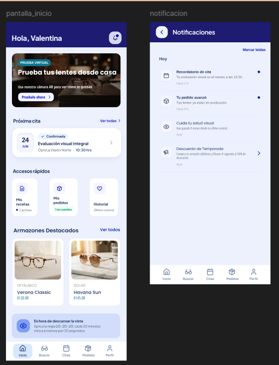


El mockup presenta la pantalla principal y sus accesos a las funciones del paciente.

**Sección Búsqueda y Exploración de Monturas (Paciente)**


Los mockups del módulo de búsqueda y catálogo de armazones se presentan en la Figura 93.

<a id="figura-93"></a>

**Figura 93**

*Mockups del módulo de búsqueda y catálogo de armazones*

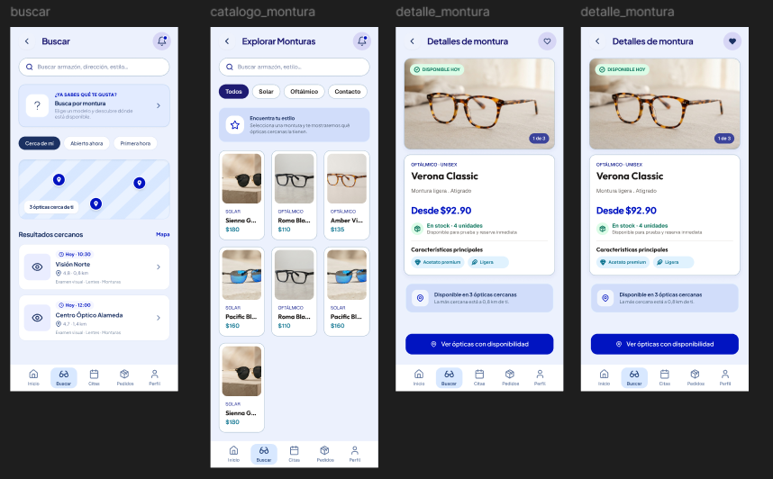


El mockup reúne la búsqueda de ópticas y la exploración del catálogo de armazones.

**Sección Gestión y Reserva de Citas (Paciente)**


Los mockups del flujo de gestión y reserva de citas se observan en la Figura 94.

<a id="figura-94"></a>

**Figura 94**

*Mockups del flujo de gestión y reserva de citas*

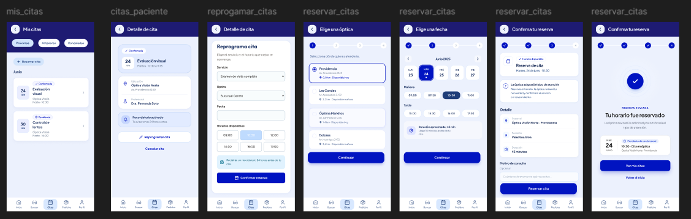


El mockup representa el proceso propuesto para consultar opciones y reservar una cita.

**Sección Consulta de Receta Óptica (Paciente)**


Los mockups del visor de recetas ópticas y prescripción médica se muestran en la Figura 95.

<a id="figura-95"></a>

**Figura 95**

*Mockups del visor de recetas ópticas y prescripción médica*

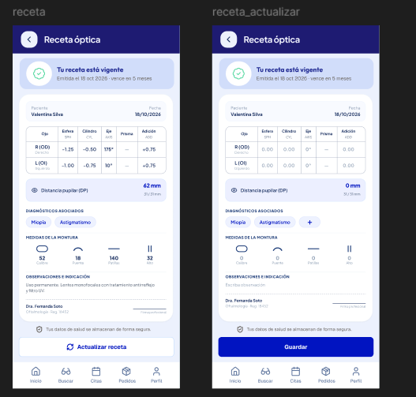


El mockup presenta la consulta de la receta óptica y sus datos principales.

**Sección Seguimiento de Pedidos y Montaje (Paciente)**


Los mockups del módulo de seguimiento de pedidos en taller y entrega se presentan en la Figura 96.

<a id="figura-96"></a>

**Figura 96**

*Mockups del módulo de seguimiento de pedidos en taller y entrega*

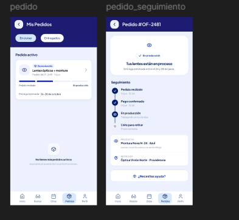


El mockup representa la consulta de pedidos y las etapas de seguimiento propuestas hasta la entrega.

**Sección Directorio Clínico y Ficha del Paciente (Personal Óptico)**


Los mockups del directorio de pacientes, ficha médica y registro de consulta se observan en la Figura 97.

<a id="figura-97"></a>

**Figura 97**

*Mockups del directorio de pacientes, ficha médica y registro de consulta*

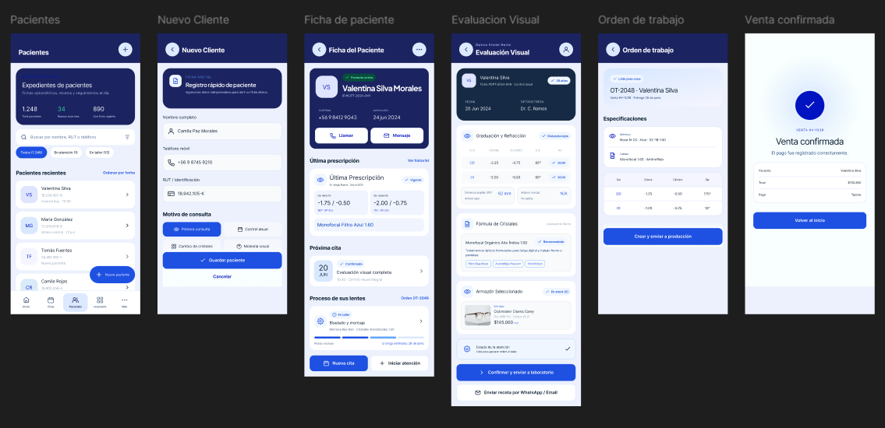


El mockup reúne el directorio de pacientes y las vistas propuestas para consultar y registrar información clínica.

**Sección Agenda Diaria y Control de Atención (Personal Óptico)**


Los mockups de la agenda diaria, control de sala de espera y flujo de turnos se muestran en la Figura 98.

<a id="figura-98"></a>

**Figura 98**

*Mockups de la agenda diaria, control de sala de espera y flujo de turnos*

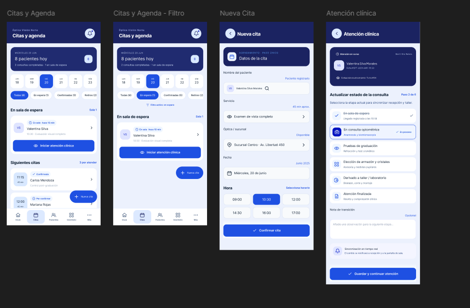


El mockup presenta la agenda diaria y los estados propuestos para dar seguimiento a la atención.

**Sección Control de Stock e Inventario (Personal Óptico)**


Los mockups de gestión de inventario, escáner de códigos y fichas de producto se presentan en la Figura 99.

<a id="figura-99"></a>

**Figura 99**

*Mockups de gestión de inventario, escáner de códigos y fichas de producto*

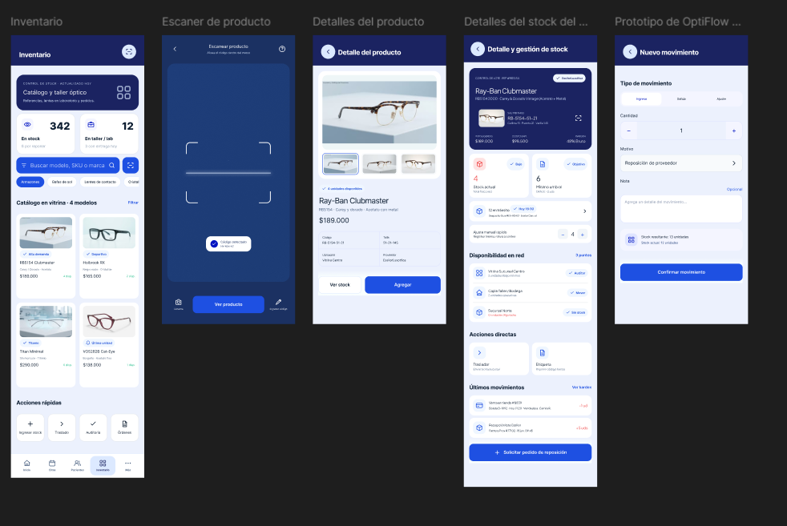


El mockup reúne la consulta del catálogo, las existencias y las vistas propuestas para gestionar inventario.

**Sección Operaciones, Producción en Taller y Reportes (Personal Óptico)**


Los mockups del centro de herramientas, cotizaciones, taller y analítica se observan en la Figura 100.

<a id="figura-100"></a>

**Figura 100**

*Mockups del centro de herramientas, cotizaciones, taller y analítica*

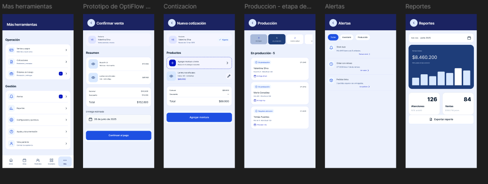


El mockup reúne las vistas propuestas para cotizaciones, seguimiento de órdenes y consulta de reportes.

#### 3.1.4.4. Mobile Applications User Flow Diagrams

Un user flow representa los pasos y decisiones propuestos para que el usuario alcance un objetivo en la aplicación. Los diagramas incluyen rutas esperadas y alternas; describen el diseño previsto y no constituyen evidencia de que todas las funciones estén implementadas en TB1.

A continuación, se presentan los user flows desarrollados para los flujos representativos de OptiFlow:

**User Goal 1: Paciente desea reservar una cita de evaluación visual u optometría**

*Happy Path*

El recorrido propuesto cubre la selección de una óptica, un horario y la confirmación de la cita (ver Figura 101).

<a id="figura-101"></a>

**Figura 101**

*User flow de reserva de una cita*

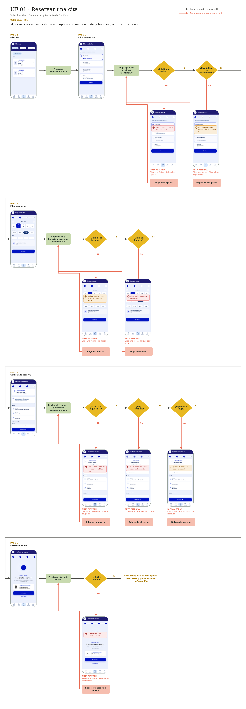

*Unhappy Paths*

Como alternativas, se consideran la pérdida de disponibilidad del horario y un problema de conexión antes de confirmar la reserva.

**User Goal 2: Paciente desea buscar y encontrar una montura en el catálogo**

*Happy Path*

El recorrido propuesto muestra la búsqueda de una montura y la consulta de su información para evaluar su disponibilidad (ver Figura 102).

<a id="figura-102"></a>

**Figura 102**

*User flow de búsqueda y selección de monturas*

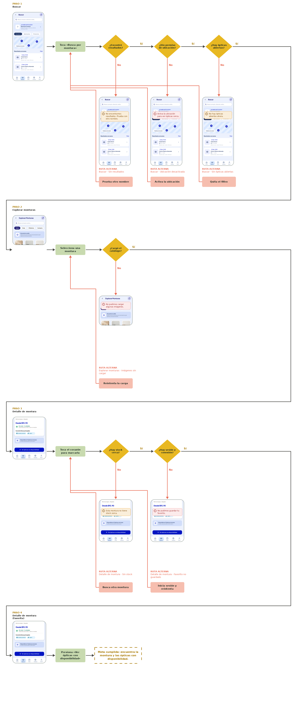

*Unhappy Paths*

Como alternativas, se consideran una búsqueda sin resultados y la falta de existencias en la sede seleccionada.

**User Goal 3: Paciente desea consultar el estado y avance de sus pedidos de lentes**

*Happy Path*

El recorrido propuesto representa la consulta del estado de un pedido y de la información prevista para su entrega (ver Figura 103).

<a id="figura-103"></a>

**Figura 103**

*User flow de seguimiento de pedidos*

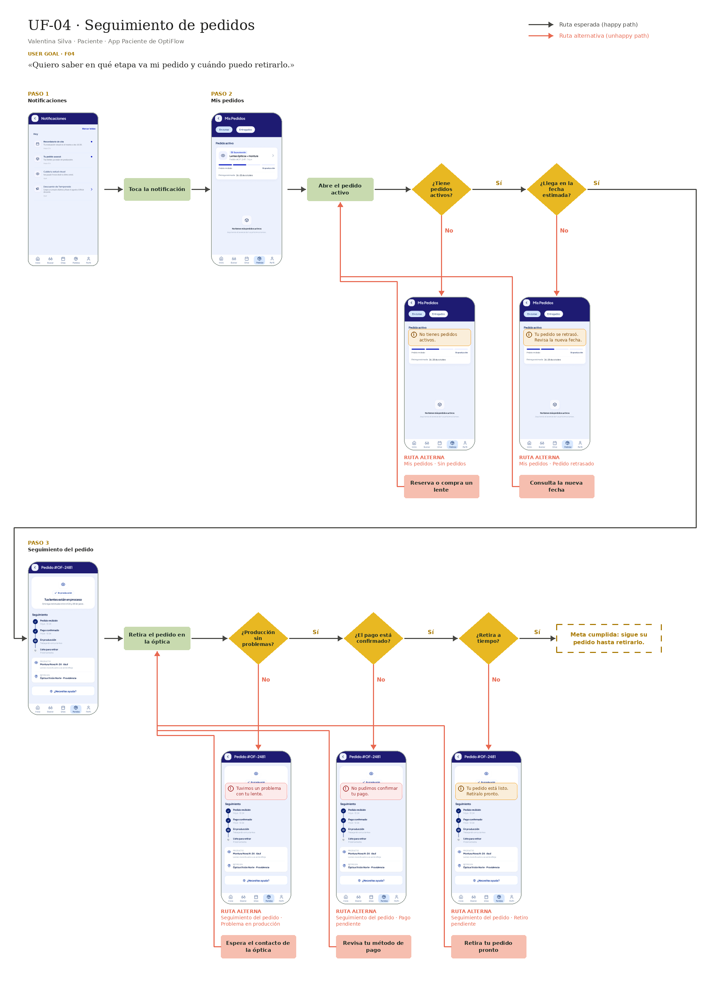

*Unhappy Paths*

Como alternativa, se contempla que una observación de calidad requiera ajustar el estado del pedido y su fecha estimada de entrega.

**User Goal 4: Paciente desea consultar su receta óptica y recomendaciones clínicas**

*Happy Path*

El recorrido propuesto permite consultar la receta óptica y sus datos principales (ver Figura 104).

<a id="figura-104"></a>

**Figura 104**

*User flow de consulta de receta óptica*

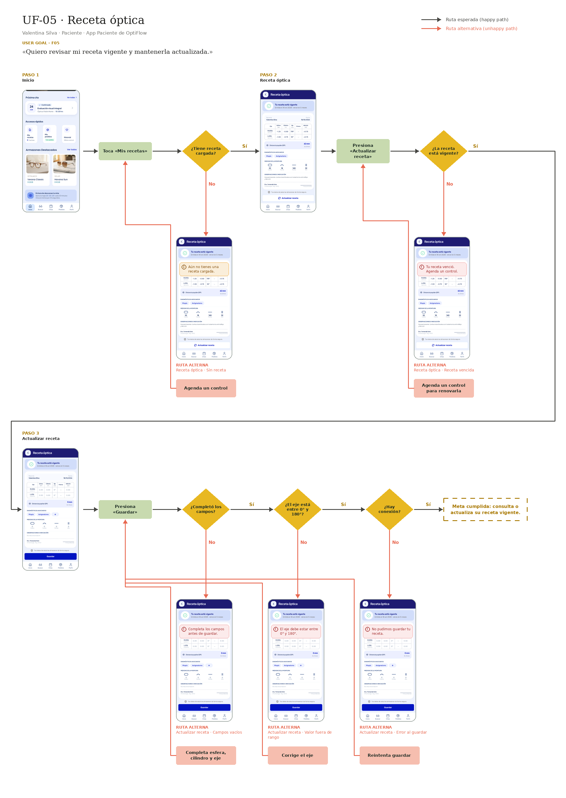

*Unhappy Paths*

Como alternativas, se consideran la ausencia de una receta registrada y la necesidad de actualizar una receta vencida.

**User Goal 5: Personal clínico desea gestionar la agenda diaria y la atención en sala de espera**

*Happy Path*

El recorrido propuesto muestra la consulta de la agenda y la actualización del estado de atención (ver Figura 105).

<a id="figura-105"></a>

**Figura 105**

*User flow de gestión de agenda y atención clínica*

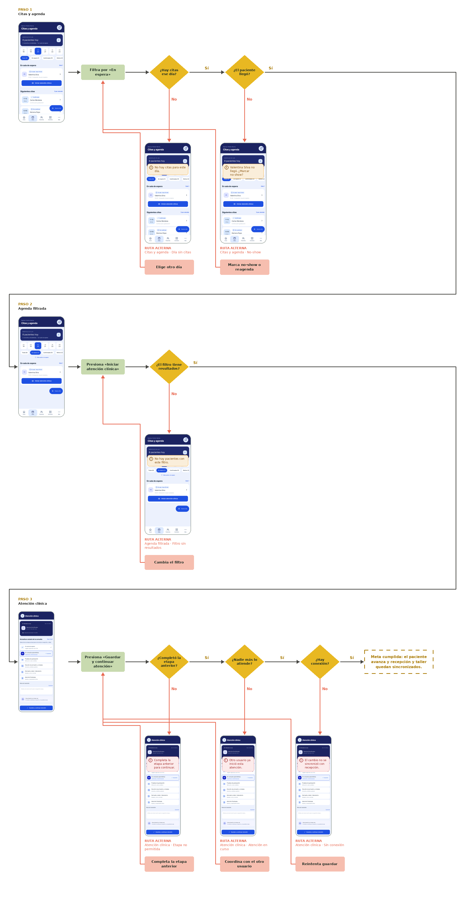

*Unhappy Paths*

Como alternativas, se consideran la inasistencia del paciente y la reprogramación de una cita.

**User Goal 6: Personal óptico desea agendar una nueva cita directamente para un paciente**

*Happy Path*

El recorrido propuesto muestra cómo el personal agenda una cita desde el registro del paciente (ver Figura 106).

<a id="figura-106"></a>

**Figura 106**

*User flow de agendamiento de cita por el personal*

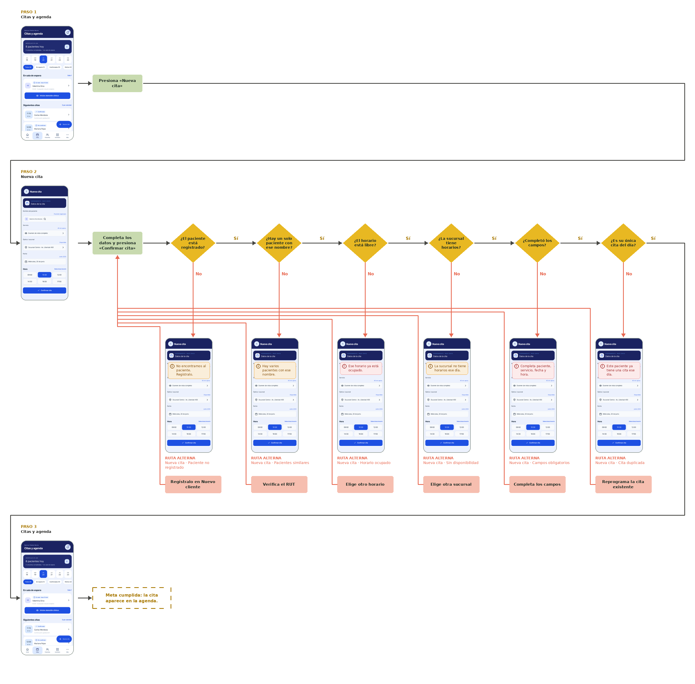

*Unhappy Paths*

Como alternativa, se contempla que el horario elegido no esté disponible.

**User Goal 7: Optómetra desea registrar a un nuevo paciente y realizar la evaluación visual**

*Happy Path*

El recorrido propuesto representa el registro de un paciente y de la información de su evaluación visual (ver Figura 107).

<a id="figura-107"></a>

**Figura 107**

*User flow de registro de paciente y evaluación visual*

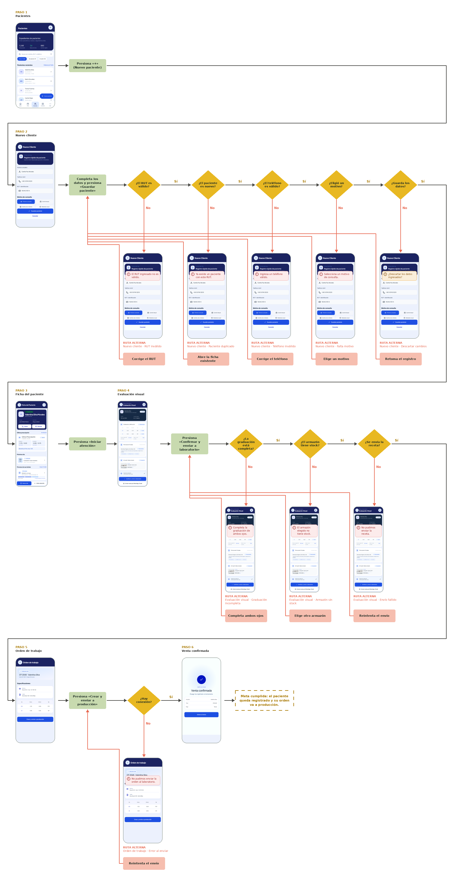

*Unhappy Paths*

Como alternativa, se considera el intento de guardar una ficha clínica con datos obligatorios incompletos.

**User Goal 8: Personal comercial desea generar una cotización y registrar una venta**

*Happy Path*

El recorrido propuesto representa la elaboración de una cotización y su conversión en venta (ver Figura 108).

<a id="figura-108"></a>

**Figura 108**

*User flow de cotización y confirmación de venta*

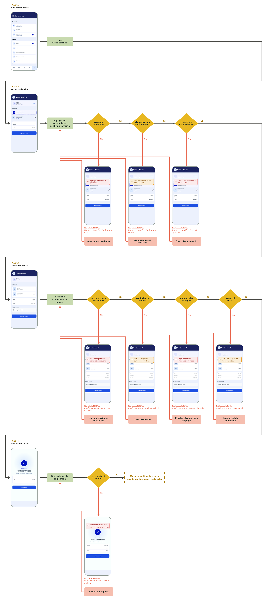

*Unhappy Paths / Alternative Paths*

Como alternativas, se consideran el rechazo de la cotización y la decisión de dejarla pendiente.

**User Goal 9: Personal de tienda desea gestionar el inventario y escanear productos**

*Happy Path*

El recorrido propuesto representa la consulta de un producto mediante escaneo y la gestión de sus movimientos de inventario (ver Figura 109).

<a id="figura-109"></a>

**Figura 109**

*User flow de control de inventario y escaneo de productos*

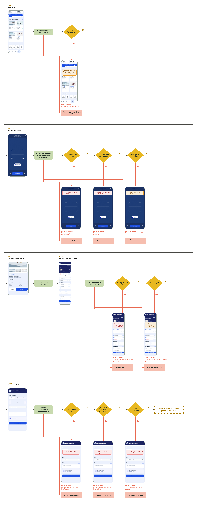

*Unhappy Paths*

Como alternativas, se consideran un código ilegible y un producto que no figure en el catálogo.

**User Goal 10: Administrador u operador desea supervisar la producción en taller, alertas y reportes**

*Happy Path*

El recorrido propuesto reúne la supervisión de órdenes de producción y la consulta de reportes (ver Figura 110).

<a id="figura-110"></a>

**Figura 110**

*User flow de supervisión de producción, alertas y reportes*

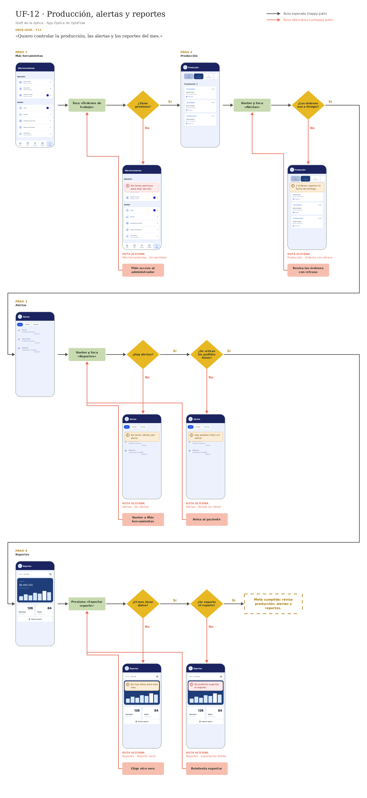

*Unhappy Paths*

Como alternativa, se contempla una demora en producción que requiera revisar la orden y tomar medidas.

#### 3.1.4.5 Mobile Applications Prototyping

##### Landing Page Prototyping:

La captura del video del prototipo de la Landing Page se muestra en la Figura 111.

<a id="figura-111"></a>

**Figura 111**

*Captura del video del prototipo de la Landing Page*


Enlace:

https://upcedupe-my.sharepoint.com/:v:/g/personal/u20241d317_upc_edu_pe/IQAKxGCxZTVuSLOdpO75JvDhATmlGtw5gxUwVA8Y_6RYOno?e=scNfBH&nav=eyJyZWZlcnJhbEluZm8iOnsicmVmZXJyYWxBcHAiOiJTdHJlYW1XZWJBcHAiLCJyZWZlcnJhbFZpZXciOiJTaGFyZURpYWxvZy1MaW5rIiwicmVmZXJyYWxBcHBQbGF0Zm9ybSI6IldlYiIsInJlZmVycmFsTW9kZSI6InZpZXcifX0%3D
