<div style="break-before: page; page-break-before: always;"></div>

# Capítulo III: Solution UI/UX Design

## 3.1. Product design

El diseño de OptiFlow responde a las necesidades identificadas en las entrevistas y el modelado del dominio: búsqueda y reserva de citas para el paciente, junto con consulta de recetas, seguimiento de pedidos y gestión interna para el personal. Este capítulo presenta la experiencia propuesta y sus criterios visuales. Los wireframes y prototipos abarcan un alcance mayor que el incremento implementado en TB1, cuya evidencia se presenta en el capítulo IV.

### 3.1.1. Style Guidelines


Las principales características consideradas para el diseño son:

* **Claridad:** la información debe presentarse de manera organizada y comprensible.
* **Consistencia:** los mismos componentes y acciones deben mantener un comportamiento y apariencia similares en toda la aplicación.
* **Simplicidad:** se debe evitar la sobrecarga visual y mostrar únicamente la información necesaria para cada contexto.
* **Accesibilidad:** los elementos deben contar con tamaños, contrastes y estructuras que faciliten su utilización.
* **Retroalimentación:** las acciones realizadas por el usuario deben mostrar estados o mensajes que indiquen si la operación fue exitosa, está en proceso o requiere alguna corrección.


#### 3.1.1.1. General Style Guidelines

 **Tipografía**


La evidencia de 3.1.1.1. General Style Guidelines se presenta en [Figura 3-001](#figura-3-001).

<p align="center">
  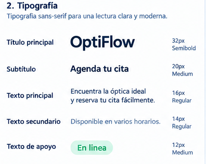
</p>

<a id="figura-3-001"></a>
**Figura 3-001. Evidencia visual de 3.1.1.1. General Style Guidelines.**


La tipografía de OptiFlow debe facilitar la lectura en pantallas pequeñas y mantener una jerarquía clara entre títulos, etiquetas y contenido. Este criterio es especialmente relevante al consultar horarios, recetas, pedidos y datos del paciente, donde la legibilidad favorece una interpretación precisa de la información.

Se propone utilizar una tipografía **sans-serif**, debido a que permite una lectura clara tanto en dispositivos móviles como en interfaces administrativas.


<a id="tabla-3-001"></a>
La [Tabla 3-001](#tabla-3-001) presenta detalle de 3.1.1.1. General Style Guidelines y permite revisar los elementos documentados en esta sección.

**Tabla 3-001. Detalle de 3.1.1.1. General Style Guidelines.**

| Elemento                | Uso                                               |
| ----------------------- | ------------------------------------------------- |
| Título principal (32px) | Identificar las principales secciones o pantallas |
| Subtítulo        (20px) | Describir subsecciones o grupos de información    |
| Texto principal  (16px) | Mostrar información y descripciones               |
| Texto secundario (14px) | Presentar información complementaria              |
| Texto de apoyo   (12px) | Mostrar etiquetas, estados o información auxiliar |


**Colores**


La evidencia de 3.1.1.1. General Style Guidelines se presenta en [Figura 3-002](#figura-3-002).

<p align="center">
  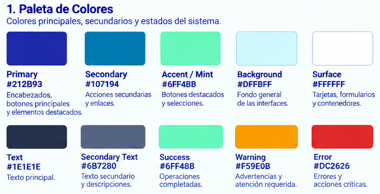
</p>

<a id="figura-3-002"></a>
**Figura 3-002. Evidencia visual de 3.1.1.1. General Style Guidelines.**


La paleta de colores debe transmitir una apariencia relacionada con los conceptos de **salud visual, confianza, claridad y tecnología**.

Se considera una paleta compuesta por colores principales, secundarios y colores destinados a comunicar estados del sistema.


<a id="tabla-3-002"></a>
La [Tabla 3-002](#tabla-3-002) presenta detalle de 3.1.1.1. General Style Guidelines y permite revisar los elementos documentados en esta sección.

**Tabla 3-002. Detalle de 3.1.1.1. General Style Guidelines.**

| Elemento | Color actual | Uso |
| :---: | :---: | :---: |
| Primary | #212B93 | Encabezados, botones principales, bloques destacados |
| Secondary | #107194 | Botones secundarios, enlaces, elementos informativos |
| Accent / Mint | #6FF4BB | Botones destacados, selección, estados positivos |
| Background | #DFFBFF | Fondo general de las pantallas |
| Surface | #FFFFFF | Tarjetas, formularios y contenedores |
| Text | #1E1E1E | Texto principal |
| Secondary Text | #6B7280 | Texto secundario |
| Success | #6FF4BB | Confirmaciones y estados positivos |
| Error | #DC2626 | Errores y acciones críticas |

**Botones**


La evidencia de 3.1.1.1. General Style Guidelines se presenta en [Figura 3-003](#figura-3-003).

<p align="center">
  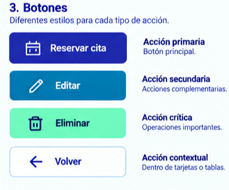
</p>

<a id="figura-3-003"></a>
**Figura 3-003. Evidencia visual de 3.1.1.1. General Style Guidelines.**


Los botones deben diferenciar claramente las acciones principales de las acciones secundarias.


* **Acción primaria:** utilizada para las acciones principales, como `Reservar cita`, `Confirmar` o `Guardar`.
* **Acción secundaria:** utilizada para acciones complementarias, como `Cancelar`, `Volver` o `Editar`.
* **Acción crítica:** utilizada para operaciones que pueden generar consecuencias importantes, como eliminar información.
* **Acción contextual:** utilizada para operaciones específicas dentro de tarjetas, tablas o registros.


**Tarjetas**


La evidencia de 3.1.1.1. General Style Guidelines se presenta en [Figura 3-004](#figura-3-004).

<p align="center">
  
</p>

<a id="figura-3-004"></a>
**Figura 3-004. Evidencia visual de 3.1.1.1. General Style Guidelines.**


En el caso de los pacientes, podrán utilizarse para presentar:

* Información de una óptica.
* Modelos de monturas.
* Disponibilidad de horarios.
* Próximas citas.
* Estado de pedidos.
* Información de recetas ópticas.

Para el personal de la óptica, las tarjetas podrán presentar:

* Resumen de citas.
* Pacientes pendientes de atención.
* Alertas de inventario.
* Órdenes de trabajo.
* Estados de producción.
* Indicadores de gestión.

**Iconografía**


La evidencia de 3.1.1.1. General Style Guidelines se presenta en [Figura 3-005](#figura-3-005).

<p align="center">
  
</p>

<a id="figura-3-005"></a>
**Figura 3-005. Evidencia visual de 3.1.1.1. General Style Guidelines.**


Los iconos se utilizarán como elementos complementarios para facilitar el reconocimiento de acciones y funcionalidades.


<a id="tabla-3-003"></a>
La [Tabla 3-003](#tabla-3-003) presenta detalle de 3.1.1.1. General Style Guidelines y permite revisar los elementos documentados en esta sección.

**Tabla 3-003. Detalle de 3.1.1.1. General Style Guidelines.**

| Icono / representación | Funcionalidad              |
| ---------------------- | -------------------------- |
| Calendario             | Citas y disponibilidad     |
| Lupa                   | Búsqueda                   |
| Corazón                | Favoritos                  |
| Campana                | Notificaciones             |
| Usuario                | Perfil y pacientes         |
| Documento              | Receta o historial clínico |
| Caja                   | Pedidos                    |
| Lentes                 | Productos ópticos          |
| Alerta                 | Advertencias o incidencias |
| Ubicación              | Localización de ópticas    |

Los iconos no deberán utilizarse como único medio para comunicar información importante. Cuando sea necesario, deberán acompañarse de un texto descriptivo.

**Formularios**


La evidencia de 3.1.1.1. General Style Guidelines se presenta en [Figura 3-006](#figura-3-006).

<p align="center">
  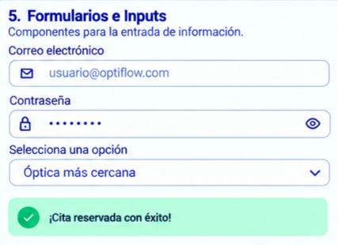
</p>

<a id="figura-3-006"></a>
**Figura 3-006. Evidencia visual de 3.1.1.1. General Style Guidelines.**


* Etiqueta del campo.
* Campo de entrada.
* Texto de ayuda cuando sea necesario.
* Mensaje de validación.
* Indicador de campo obligatorio cuando corresponda.

Las validaciones se presentan junto al campo correspondiente y explican cómo corregir el dato. Antes de confirmar una reserva, la interfaz debe permitir revisar la óptica, la fecha y el horario elegidos. Los mensajes deben indicar el resultado de la operación y ofrecer una acción de recuperación cuando la solicitud no pueda completarse.

**Estados de la interfaz**


La evidencia de 3.1.1.1. General Style Guidelines se presenta en [Figura 3-007](#figura-3-007).

<p align="center">
  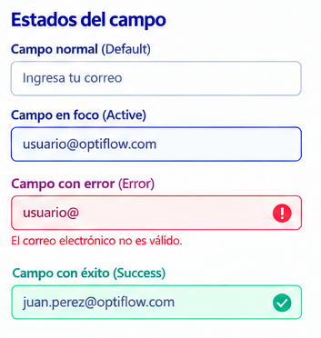
</p>

<a id="figura-3-007"></a>
**Figura 3-007. Evidencia visual de 3.1.1.1. General Style Guidelines.**


Los componentes de OptiFlow deberán contemplar diferentes estados para proporcionar retroalimentación al usuario.


<a id="tabla-3-004"></a>
La [Tabla 3-004](#tabla-3-004) presenta detalle de 3.1.1.1. General Style Guidelines y permite revisar los elementos documentados en esta sección.

**Tabla 3-004. Detalle de 3.1.1.1. General Style Guidelines.**

| Estado   | Descripción                                                  |
| -------- | ------------------------------------------------------------ |
| Default  | Estado normal del componente                                 |
| Hover    | Estado al posicionar el cursor sobre un elemento interactivo |
| Active   | Estado durante la interacción                                |
| Disabled | Elemento temporalmente no disponible                         |
| Loading  | Información o proceso en proceso de carga                    |
| Success  | Operación realizada correctamente                            |
| Warning  | Situación que requiere atención                              |
| Error    | Operación incorrecta o información inválida                  |
| Empty    | No existen datos disponibles                                 |

**Diseño responsivo**


La evidencia de 3.1.1.1. General Style Guidelines se presenta en [Figura 3-008](#figura-3-008).

<p align="center">
  
</p>

<a id="figura-3-008"></a>
**Figura 3-008. Evidencia visual de 3.1.1.1. General Style Guidelines.**


La interfaz deberá adaptarse a los diferentes tamaños de pantalla en los que se utilice OptiFlow. En la aplicación orientada a pacientes, el diseño priorizará dispositivos móviles, considerando:

* Controles táctiles de tamaño adecuado.
* Navegación sencilla.
* Contenido organizado verticalmente.
* Formularios adaptados a pantallas pequeñas.
* Información importante visible sin necesidad de desplazamientos excesivos.

En las interfaces destinadas al personal de la óptica se podrá aprovechar un espacio de pantalla mayor para mostrar tablas, indicadores, filtros y diferentes bloques de información simultáneamente.

**Accesibilidad**

La evidencia de 3.1.1.1. General Style Guidelines se presenta en [Figura 3-009](#figura-3-009).

<p align="center">
  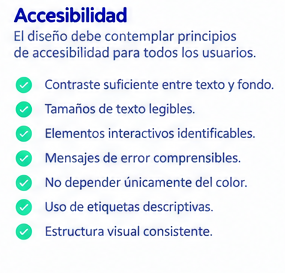
</p>

<a id="figura-3-009"></a>
**Figura 3-009. Evidencia visual de 3.1.1.1. General Style Guidelines.**


El diseño contempla legibilidad, contraste, identificación de controles y mensajes comprensibles para facilitar el uso por personas con distintas necesidades. Estos criterios orientan la interfaz y deben comprobarse durante la evaluación de usabilidad; su inclusión en el diseño no equivale a una certificación de accesibilidad.

Se considerarán los siguientes aspectos:

* Contraste suficiente entre texto y fondo.
* Tamaños de texto legibles.
* Elementos interactivos claramente identificables.
* Mensajes de error comprensibles.
* No depender únicamente del color para comunicar estados.
* Uso de etiquetas descriptivas.
* Estructura visual consistente.

### 3.1.2. Information Architecture

La arquitectura de información organiza los contenidos y funciones de OptiFlow según las tareas de cada rol. Su propósito es facilitar la localización de la información, reducir recorridos innecesarios y ofrecer una estructura consistente entre las pantallas.

La arquitectura se define considerando los dos principales tipos de usuarios identificados: **pacientes** y **personal de la óptica**. Cada perfil dispone de funcionalidades específicas, evitando presentar información que no corresponda a sus necesidades.

#### 3.1.2.1. Organization Systems

El sistema de organización de OptiFlow define cómo se agrupan las funcionalidades y contenidos de acuerdo con el tipo de usuario, las tareas que realiza y el contexto en el que se encuentra.

Para ello, se utilizan principalmente los siguientes esquemas de organización:

* **Organización jerárquica:** permite establecer niveles de información desde las funcionalidades principales hacia sus opciones específicas.
* **Organización por categorías:** agrupa funcionalidades relacionadas con una misma actividad o dominio.
* **Organización secuencial:** organiza determinadas funcionalidades de acuerdo con el orden lógico en que deben ejecutarse.

**Organización jerárquica**

La estructura general de OptiFlow parte de las funcionalidades principales y posteriormente se divide en opciones específicas.

Para el **paciente**, la organización principal se plantea de la siguiente manera:


La evidencia de 3.1.2.1. Organization Systems se presenta en [Figura 3-010](#figura-3-010).

<p align="center">
  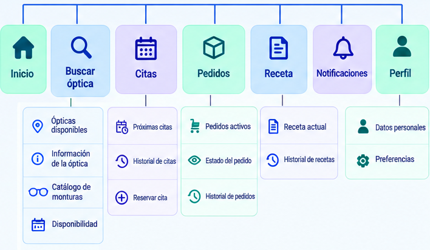
</p>

<a id="figura-3-010"></a>
**Figura 3-010. Evidencia visual de 3.1.2.1. Organization Systems.**


```text
OptiFlow
├── Inicio
├── Buscar óptica
│   ├── Ópticas disponibles
│   ├── Información de la óptica
│   ├── Catálogo de monturas
│   └── Disponibilidad
├── Citas
│   ├── Próximas citas
│   ├── Historial de citas
│   └── Reservar cita
├── Pedidos
│   ├── Pedidos activos
│   ├── Estado del pedido
│   └── Historial de pedidos
├── Receta
│   ├── Receta actual
│   └── Historial de recetas
├── Notificaciones
└── Perfil
    ├── Datos personales
    └── Preferencias
```

Para el **personal de la óptica**, la organización se adapta a las actividades administrativas, clínicas y operativas:


La evidencia de 3.1.2.1. Organization Systems se presenta en [Figura 3-011](#figura-3-011).

<p align="center">
  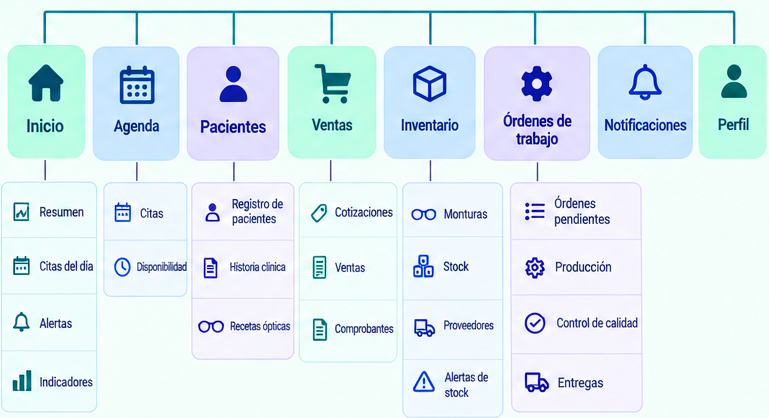
</p>

<a id="figura-3-011"></a>
**Figura 3-011. Evidencia visual de 3.1.2.1. Organization Systems.**


```text
OptiFlow
├── Inicio
│   ├── Resumen
│   ├── Citas del día
│   ├── Alertas
│   └── Indicadores
├── Agenda
│   ├── Citas
│   └── Disponibilidad
├── Pacientes
│   ├── Registro de pacientes
│   ├── Historia clínica
│   └── Recetas ópticas
├── Ventas
│   ├── Cotizaciones
│   ├── Ventas
│   └── Comprobantes
├── Inventario
│   ├── Monturas
│   ├── Stock
│   ├── Proveedores
│   └── Alertas de stock
├── Órdenes de trabajo
│   ├── Órdenes pendientes
│   ├── Producción
│   ├── Control de calidad
│   └── Entregas
├── Notificaciones
└── Perfil
```

Esta separación permite que cada usuario tenga acceso a las funcionalidades correspondientes a sus responsabilidades.

**Organización por categorías**

Las funcionalidades también se agrupan según la actividad que representan.


<a id="tabla-3-005"></a>
La [Tabla 3-005](#tabla-3-005) presenta detalle de 3.1.2.1. Organization Systems y permite revisar los elementos documentados en esta sección.

**Tabla 3-005. Detalle de 3.1.2.1. Organization Systems.**

| Categoría                     | Funcionalidades principales                               | Usuario             |
| ----------------------------- | --------------------------------------------------------- | ------------------- |
| Búsqueda y reserva            | Buscar ópticas, consultar disponibilidad y reservar citas | Paciente            |
| Gestión clínica               | Historia clínica, recetas y seguimiento del paciente      | Paciente / Personal |
| Gestión comercial             | Cotizaciones, ventas, pagos y comprobantes                | Personal            |
| Producción y seguimiento      | Órdenes de trabajo, producción, estados y entregas        | Personal            |
| Notificaciones y fidelización | Recordatorios, alertas, promociones y encuestas           | Paciente / Personal |
| Inventario                    | Monturas, stock, proveedores y alertas                    | Personal            |

Esta clasificación permite relacionar las funcionalidades de la interfaz con los principales procesos identificados durante el análisis del dominio.

**Organización secuencial**

Algunas funcionalidades de OptiFlow requieren que el usuario complete una serie de pasos en un orden determinado. Para la **reserva de una cita**, el flujo de información se organiza de la siguiente manera:


La evidencia de 3.1.2.1. Organization Systems se presenta en [Figura 3-012](#figura-3-012).

<p align="center">
  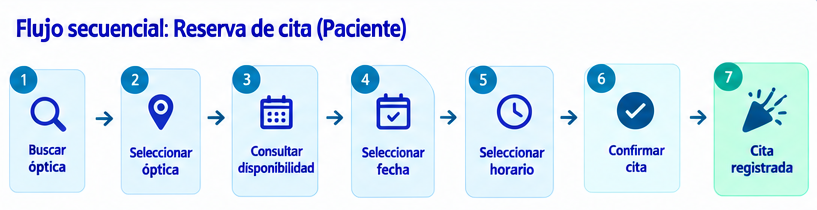
</p>

<a id="figura-3-012"></a>
**Figura 3-012. Evidencia visual de 3.1.2.1. Organization Systems.**


Para el **seguimiento de una orden de trabajo**, la información se presenta de acuerdo con el avance del proceso:


La evidencia de 3.1.2.1. Organization Systems se presenta en [Figura 3-013](#figura-3-013).

<p align="center">
  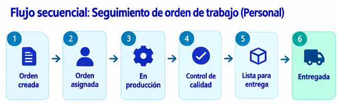
</p>

<a id="figura-3-013"></a>
**Figura 3-013. Evidencia visual de 3.1.2.1. Organization Systems.**


Esta organización permite que el usuario comprenda en qué etapa se encuentra una actividad y cuáles son los siguientes pasos disponibles.

**Diagrama de organización de la información**

La estructura anterior puede representarse mediante un **diagrama de arquitectura de información o sitemap**, mostrando la relación entre las funcionalidades principales y sus subfuncionalidades.


La evidencia de 3.1.2.1. Organization Systems se presenta en [Figura 3-014](#figura-3-014).

<p align="center">
  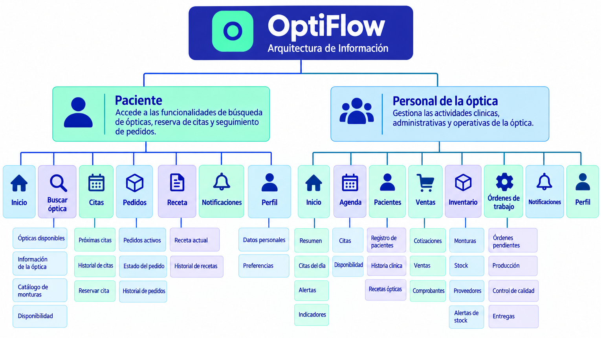
</p>

<a id="figura-3-014"></a>
**Figura 3-014. Evidencia visual de 3.1.2.1. Organization Systems.**


#### 3.1.2.2. Labeling Systems

El sistema de etiquetado establece los nombres utilizados para identificar las funcionalidades, secciones, acciones y estados dentro de OptiFlow. Los nombres seleccionados buscan utilizar un lenguaje claro y familiar para los usuarios, evitando términos técnicos que puedan dificultar la comprensión de las funcionalidades.


**Etiquetas principales**


<a id="tabla-3-006"></a>
La [Tabla 3-006](#tabla-3-006) presenta detalle de 3.1.2.2. Labeling Systems y permite revisar los elementos documentados en esta sección.

**Tabla 3-006. Detalle de 3.1.2.2. Labeling Systems.**

| Etiqueta           | Descripción                                                | Usuario             |
| ------------------ | ---------------------------------------------------------- | ------------------- |
| Inicio             | Acceso a la información principal y resumen de actividades | Paciente / Personal |
| Buscar óptica      | Permite encontrar ópticas disponibles                      | Paciente            |
| Reservar cita      | Permite seleccionar y confirmar una cita                   | Paciente            |
| Mis citas          | Permite consultar las citas registradas                    | Paciente            |
| Mis pedidos        | Permite consultar el estado de los pedidos                 | Paciente            |
| Mi receta          | Permite consultar la receta óptica registrada              | Paciente            |
| Notificaciones     | Permite consultar avisos y actualizaciones                 | Paciente / Personal |
| Perfil             | Permite consultar y modificar información personal         | Paciente / Personal |
| Agenda             | Permite administrar las citas de la óptica                 | Personal            |
| Pacientes          | Permite gestionar la información de los pacientes          | Personal            |
| Historia clínica   | Permite consultar información clínica del paciente         | Personal            |
| Recetas ópticas    | Permite registrar y consultar recetas                      | Personal            |
| Ventas             | Permite gestionar las operaciones comerciales              | Personal            |
| Cotizaciones       | Permite gestionar cotizaciones para los pacientes          | Personal            |
| Inventario         | Permite administrar productos y existencias                | Personal            |
| Órdenes de trabajo | Permite gestionar el proceso de producción                 | Personal            |
| Alertas de stock   | Informa sobre productos con existencias bajas              | Personal            |

**Etiquetas para acciones**

Las acciones utilizarán verbos directos que indiquen claramente la operación que realizará el usuario.


<a id="tabla-3-007"></a>
La [Tabla 3-007](#tabla-3-007) presenta detalle de 3.1.2.2. Labeling Systems y permite revisar los elementos documentados en esta sección.

**Tabla 3-007. Detalle de 3.1.2.2. Labeling Systems.**

| Acción       | Uso                                                 |
| ------------ | --------------------------------------------------- |
| Buscar       | Realizar una búsqueda                               |
| Filtrar      | Reducir los resultados según determinados criterios |
| Ver detalles | Consultar información adicional                     |
| Reservar     | Registrar una cita                                  |
| Confirmar    | Confirmar una operación                             |
| Cancelar     | Cancelar una operación                              |
| Guardar      | Registrar cambios                                   |
| Editar       | Modificar información                               |
| Eliminar     | Remover información                                 |
| Descargar    | Obtener un documento o información                  |
| Continuar    | Avanzar al siguiente paso                           |
| Volver       | Regresar al paso anterior                           |

**Etiquetas para estados**

Los estados de los procesos también deberán mantener una nomenclatura consistente.


<a id="tabla-3-008"></a>
La [Tabla 3-008](#tabla-3-008) presenta detalle de 3.1.2.2. Labeling Systems y permite revisar los elementos documentados en esta sección.

**Tabla 3-008. Detalle de 3.1.2.2. Labeling Systems.**

| Estado             | Aplicación                                 |
| ------------------ | ------------------------------------------ |
| Pendiente          | Actividad que todavía no ha sido atendida  |
| Confirmada         | Cita u operación confirmada                |
| En proceso         | Actividad actualmente en ejecución         |
| En producción      | Orden que se encuentra en fabricación      |
| Lista para entrega | Pedido que puede ser entregado al paciente |
| Entregada          | Pedido completado y entregado              |
| Cancelada          | Operación cancelada                        |
| Retrasada          | Proceso que presenta un retraso            |
| Completada         | Actividad finalizada correctamente         |

El uso de etiquetas consistentes permite que los usuarios puedan reconocer rápidamente las funcionalidades y estados del sistema. Además, evita utilizar diferentes nombres para representar un mismo concepto dentro de las distintas pantallas.

##### 3.1.2.3. SEO Tags and Meta Tags

Las etiquetas SEO y meta etiquetas de OptiFlow se aplicarán principalmente a la **Landing Page**, debido a que esta constituye el principal punto de acceso público a la solución. Su finalidad es facilitar la identificación del producto por los motores de búsqueda y proporcionar información relevante sobre el contenido de la página.

Las etiquetas se plantean para describir a OptiFlow como una solución de búsqueda de ópticas, reserva de citas y seguimiento de pedidos, manteniendo coherencia entre el contenido de la Landing Page y la información que se comparte con buscadores y redes sociales.


<a id="tabla-3-009"></a>
La [Tabla 3-009](#tabla-3-009) presenta detalle de 3.1.2.3. SEO Tags and Meta Tags y permite revisar los elementos documentados en esta sección.

**Tabla 3-009. Detalle de 3.1.2.3. SEO Tags and Meta Tags.**

| Elemento | Propuesta |
|---|---|
| **Title** | OptiFlow - Gestión de citas y servicios ópticos |
| **Meta Description** | OptiFlow facilita la búsqueda de ópticas, reserva de citas y seguimiento de pedidos en un solo lugar. |
| **Keywords** | ópticas, citas ópticas, reserva de citas, gestión óptica, pacientes, recetas ópticas, seguimiento de pedidos |
| **Robots** | `index, follow` |
| **Open Graph Title** | OptiFlow - Gestión de citas y servicios ópticos |
| **Open Graph Description** | Encuentra ópticas, reserva citas y realiza el seguimiento de tus pedidos mediante OptiFlow. |
| **Open Graph Type** | `website` |

El **Title** permite identificar el propósito principal de la plataforma en los resultados de búsqueda, mientras que la **Meta Description** proporciona una descripción breve de los servicios ofrecidos. Las palabras clave propuestas se relacionan con las principales funcionalidades y conceptos del sistema, como la búsqueda de ópticas, reserva de citas, gestión de pacientes y seguimiento de pedidos.

Las etiquetas **Open Graph** definen el título y la descripción utilizados al compartir la Landing Page en plataformas compatibles. La directiva `robots` con `index, follow` permite la indexación de la página y el seguimiento de sus enlaces por los rastreadores; no garantiza su posición en los resultados de búsqueda.

##### 3.1.2.4. Searching Systems

El sistema de búsqueda propuesto permite al paciente localizar ópticas y consultar su disponibilidad mediante una interfaz móvil. El diseño organiza los resultados y prioriza los datos necesarios para elegir un establecimiento. Los filtros y el mapa descritos a continuación pertenecen a la experiencia diseñada; su presencia en el prototipo no implica que todas estas opciones estén implementadas en el Sprint 1.

La pantalla de búsqueda cuenta con una barra que permite ingresar diferentes criterios relacionados con la óptica, como el nombre, dirección o estilo. Además, se presentan accesos rápidos para facilitar la búsqueda según las necesidades del usuario.

Entre los principales elementos del sistema se encuentran:

- **Barra de búsqueda:** permite ingresar términos relacionados con la óptica que se desea encontrar.
- **Búsqueda por montura:** permite iniciar una búsqueda a partir del modelo de montura que desea encontrar el paciente.
- **Filtros rápidos:** permiten consultar ópticas cercanas, establecimientos abiertos o aquellos con disponibilidad en la primera hora.
- **Mapa:** presenta visualmente la ubicación de las ópticas disponibles.
- **Resultados cercanos:** muestra las ópticas encontradas junto con información relevante como horario disponible, distancia y servicios ofrecidos.
- **Acceso a detalles:** permite seleccionar una óptica para consultar información adicional y continuar con el proceso de reserva.

El flujo general de búsqueda se representa de la siguiente manera:

```text
Ingresar criterio de búsqueda
            ↓
Mostrar ópticas disponibles
            ↓
Aplicar filtro de búsqueda
            ↓
Consultar resultados cercanos
            ↓
Seleccionar óptica
            ↓
Consultar información y disponibilidad
```

Figura Buscar óptica. Interfaz propuesta para la búsqueda de establecimientos.


La evidencia de 3.1.2.4. Searching Systems se presenta en [Figura 3-015](#figura-3-015).

<p align="center">
  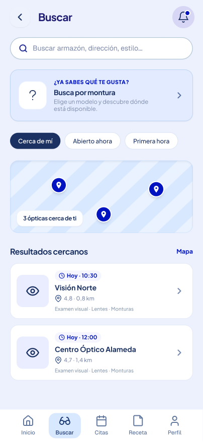
</p> 

<a id="figura-3-015"></a>
**Figura 3-015. Evidencia visual de 3.1.2.4. Searching Systems.**


##### 3.1.2.5. Navigation Systems

El sistema de navegación de OptiFlow permite que los usuarios accedan de manera rápida a las principales funcionalidades de la aplicación. La navegación se organiza de acuerdo con las necesidades del paciente, priorizando el acceso a las funcionalidades utilizadas con mayor frecuencia.

Para la aplicación móvil del paciente se utiliza una **barra de navegación inferior**, ubicada de manera permanente en la parte inferior de la pantalla. Este patrón permite acceder a las secciones principales sin necesidad de regresar constantemente a la pantalla de inicio.

La navegación principal está compuesta por las siguientes opciones:


<a id="tabla-3-010"></a>
La [Tabla 3-010](#tabla-3-010) presenta detalle de 3.1.2.5. Navigation Systems y permite revisar los elementos documentados en esta sección.

**Tabla 3-010. Detalle de 3.1.2.5. Navigation Systems.**

| Opción | Funcionalidad |
|---|---|
| **Inicio** | Permite acceder a la pantalla principal y consultar información relevante para el paciente. |
| **Buscar** | Permite buscar ópticas, consultar resultados cercanos y utilizar filtros de búsqueda. |
| **Citas** | Permite consultar y gestionar las citas del paciente. |
| **Receta** | Permite consultar la receta óptica registrada y su información asociada. |
| **Perfil** | Permite consultar y administrar la información personal y preferencias del usuario. |

La siguiente vista muestra la distribución propuesta de la navegación principal:


La evidencia de 3.1.2.5. Navigation Systems se presenta en [Figura 3-016](#figura-3-016).

<p align="center">
  
</p> 

<a id="figura-3-016"></a>
**Figura 3-016. Evidencia visual de 3.1.2.5. Navigation Systems.**


### 3.1.3. Landing Page UI Design

La Landing Page presenta la propuesta de valor de OptiFlow a los propietarios de ópticas y a sus pacientes. Su diseño organiza la información del producto, los beneficios y las acciones principales para que cada visitante comprenda el propósito de la solución y encuentre el siguiente paso de interacción.

#### 3.1.3.1. Landing Page Wireframe

Los wireframes definen la jerarquía del contenido, la navegación y las áreas de interacción de la Landing Page. La distribución busca comunicar con claridad los beneficios para el paciente y para el establecimiento antes de aplicar el estilo visual definitivo.

Presentación inicial de OptiFlow con el mensaje principal y los datos destacados de la propuesta.


La evidencia de 3.1.3.1. Landing Page Wireframe se presenta en [Figura 3-017](#figura-3-017).

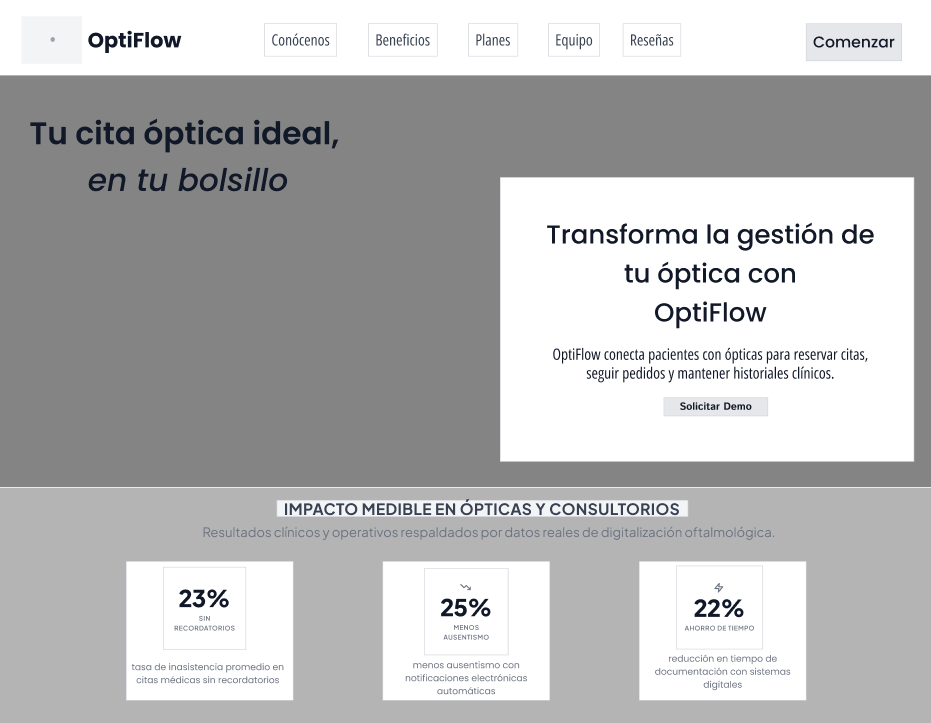

<a id="figura-3-017"></a>
**Figura 3-017. Evidencia visual de 3.1.3.1. Landing Page Wireframe.**


Se presentan los objetivos y beneficios de OptiFlow.


La evidencia de 3.1.3.1. Landing Page Wireframe se presenta en [Figura 3-018](#figura-3-018).

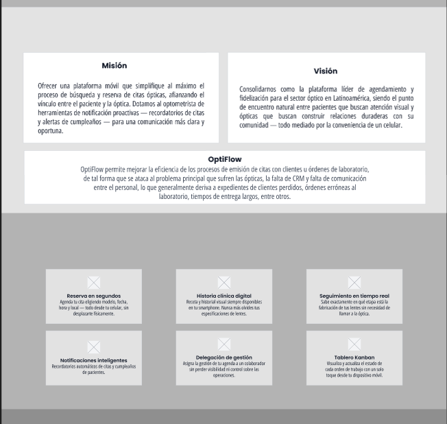

<a id="figura-3-018"></a>
**Figura 3-018. Evidencia visual de 3.1.3.1. Landing Page Wireframe.**


Se presenta la distribución de la sección de precios y de los integrantes del equipo.


La evidencia de 3.1.3.1. Landing Page Wireframe se presenta en [Figura 3-019](#figura-3-019).

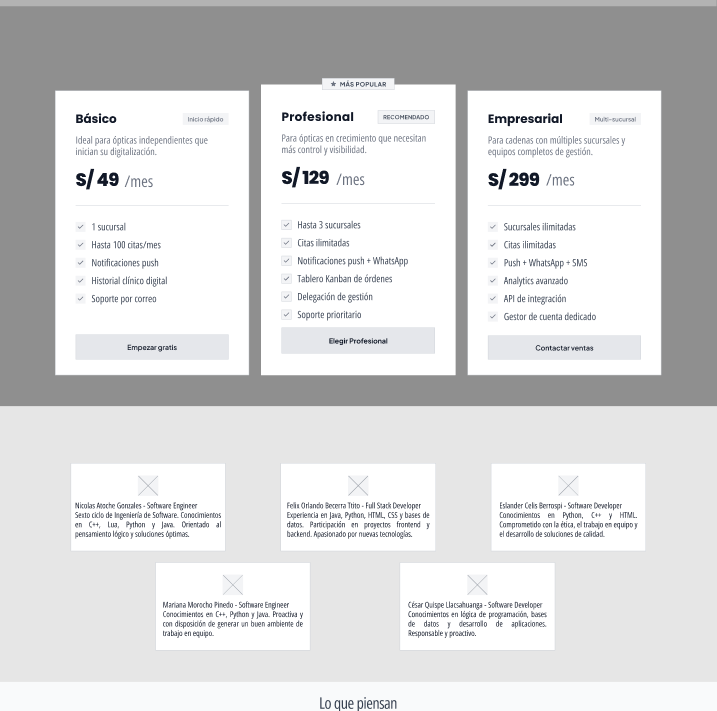

<a id="figura-3-019"></a>
**Figura 3-019. Evidencia visual de 3.1.3.1. Landing Page Wireframe.**


Se muestra el espacio previsto para reseñas y la sección final de la página. Su inclusión en el wireframe representa una decisión de diseño y no evidencia, por sí sola, testimonios de usuarios reales.


La evidencia de 3.1.3.1. Landing Page Wireframe se presenta en [Figura 3-020](#figura-3-020).

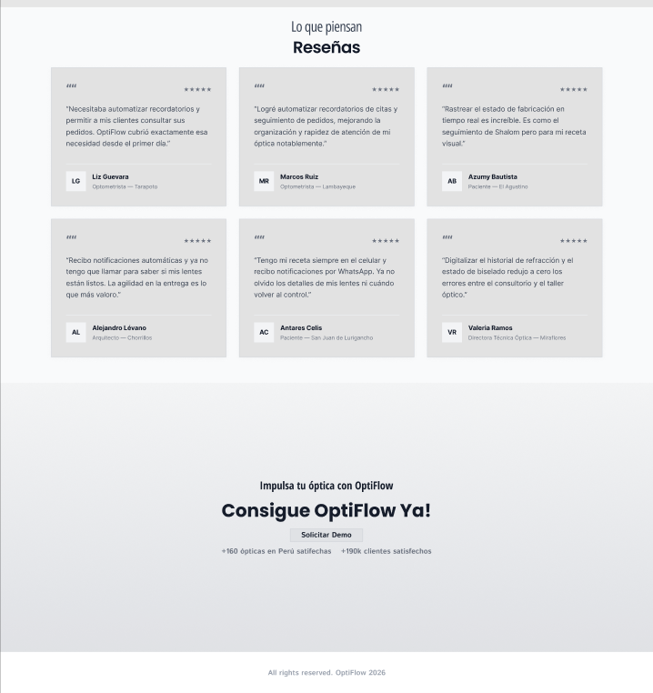

<a id="figura-3-020"></a>
**Figura 3-020. Evidencia visual de 3.1.3.1. Landing Page Wireframe.**


#### 3.1.3.2. Landing Page Mock-up

El mock-up aplica la identidad visual de OptiFlow a la estructura definida en los wireframes. Permite revisar colores, tipografía, componentes y jerarquía de información antes de su implementación en la Landing Page.


La evidencia de 3.1.3.2. Landing Page Mock-up se presenta en [Figura 3-021](#figura-3-021).


<a id="figura-3-021"></a>
**Figura 3-021. Evidencia visual de 3.1.3.2. Landing Page Mock-up.**


### 3.1.4. Mobile Applications UX/UI Design

El diseño UX/UI móvil organiza las tareas de pacientes y personal de la óptica mediante pantallas, componentes y recorridos consistentes. Las vistas siguientes representan la propuesta de interacción; el alcance funcional implementado en TB1 se especifica en las evidencias del Sprint 1.

#### 3.1.4.1. Mobile Applications Wireframes

Los wireframes móviles definen la distribución de componentes, la jerarquía del contenido y las acciones de cada pantalla antes de aplicar el estilo visual definitivo. Se utilizan para revisar la secuencia de tareas y la relación entre las vistas.

**Sección Autenticación y Selección de Rol**


La evidencia de 3.1.4.1. Mobile Applications Wireframes se presenta en [Figura 3-022](#figura-3-022).

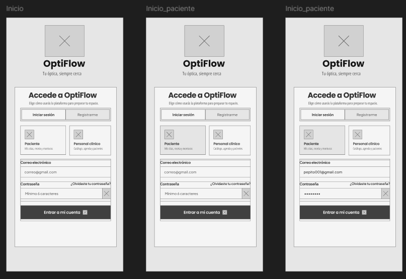

<a id="figura-3-022"></a>
**Figura 3-022. Wireframes del flujo de inicio de sesión y selección de rol.**


El contenedor central implementa un conmutador de navegación segmentada para alternar entre "Iniciar sesión" y "Registrarme". A continuación, se disponen tarjetas interactivas de selección de rol ("Paciente: Mis citas, receta y monturas" y "Personal clínico: Catálogo, agenda y pacientes"). La base del contenedor organiza los campos de entrada de datos para correo electrónico y contraseña (con botón de visibilidad y enlace de recuperación "¿Olvidaste tu contraseña?"), finalizando con el botón de acción principal de ancho completo ("Entrar a mi cuenta").

**Sección Inicio y Consulta de Receta Óptica (Paciente)**


La evidencia de 3.1.4.1. Mobile Applications Wireframes se presenta en [Figura 3-023](#figura-3-023).

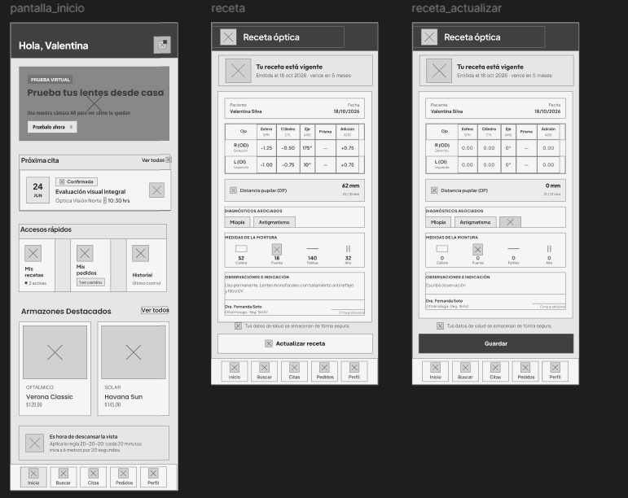

<a id="figura-3-023"></a>
**Figura 3-023. Wireframes de pantalla de inicio del paciente y ficha de receta óptica.**


El diseño de inicio del paciente propone accesos a citas, recetas, pedidos e historial, además de un espacio para una futura prueba virtual de monturas. Las vistas de receta organizan las medidas, las observaciones y los datos de la prescripción. La visualización por el paciente debe distinguirse de las acciones de registro o edición clínica, reservadas al personal autorizado según su rol. La representación en estos wireframes no constituye evidencia de implementación de realidad aumentada ni de edición clínica por el paciente.

**Sección Búsqueda y Exploración de Monturas (Paciente)**


La evidencia de 3.1.4.1. Mobile Applications Wireframes se presenta en [Figura 3-024](#figura-3-024).

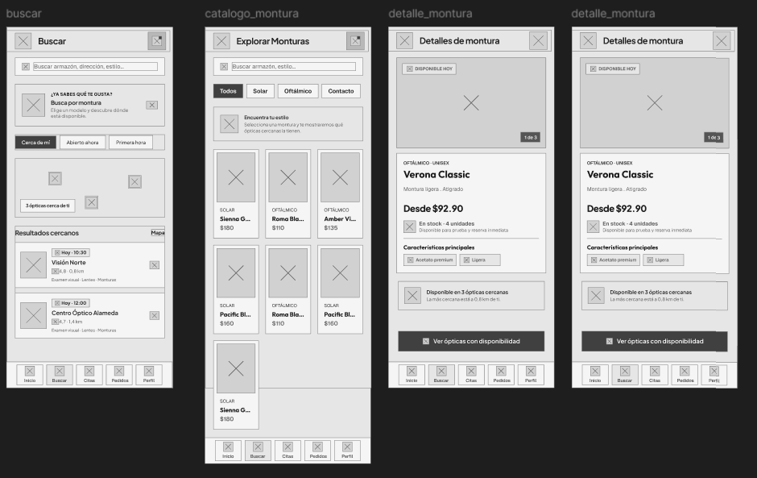

<a id="figura-3-024"></a>
**Figura 3-024. Wireframes del módulo de búsqueda y catálogo de armazones.**


Esta imagen muestra el flujo de localización de ópticas y descubrimiento de armazones en cuatro vistas. La pantalla inicial presenta una barra de búsqueda multifunción, accesos rápidos de filtrado y un bloque de mapa geolocalizado con lista de resultados cercanos que detallan distancias y horarios disponibles. Finalmente, las pantallas de detalle despliegan el carrusel de imágenes del producto, especificaciones técnicas (materiales, dimensiones, estilo unisex), disponibilidad de stock físico inmediato y el botón de acción para localizar las ópticas más cercanas con existencia en tienda.

**Sección Gestión y Reserva de Citas (Paciente)**


La evidencia de 3.1.4.1. Mobile Applications Wireframes se presenta en [Figura 3-025](#figura-3-025).

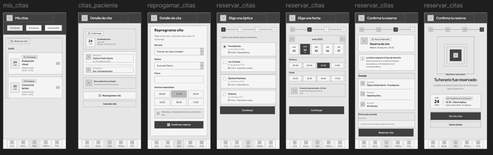

<a id="figura-3-025"></a>
**Figura 3-025. Wireframes del flujo de gestión, reprogramación y reserva de citas.**


Esta imagen detalla el flujo integral de agendamiento y control de citas médicas en siete pantallas secuenciales. Inicia con la vista "Mis citas", seguida del detalle de cita con información del profesional tratante, sede y recordatorios. El proceso de nueva reserva se guía mediante un indicador de pasos superior (stepper del 1 al 4).

**Sección Seguimiento de Pedidos y Montaje (Paciente)**


La evidencia de 3.1.4.1. Mobile Applications Wireframes se presenta en [Figura 3-026](#figura-3-026).

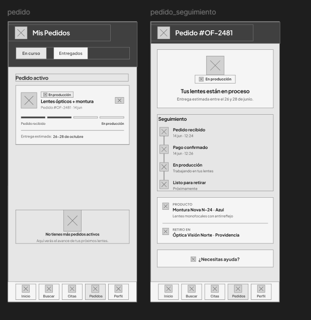

<a id="figura-3-026"></a>
**Figura 3-026. Wireframes del módulo de seguimiento de pedidos en taller y entrega.**


El diseño de seguimiento incluye un selector de pedidos en curso y entregados, una tarjeta con progreso y fecha estimada de entrega, y una vista de detalle con una línea de tiempo. Esta secuencia representa los hitos de fabricación que se propone comunicar al paciente; el wireframe no acredita una actualización en tiempo real del sistema.

**Sección Perfil de Usuario, Historial y Configuración (Paciente)**


La evidencia de 3.1.4.1. Mobile Applications Wireframes se presenta en [Figura 3-027](#figura-3-027).

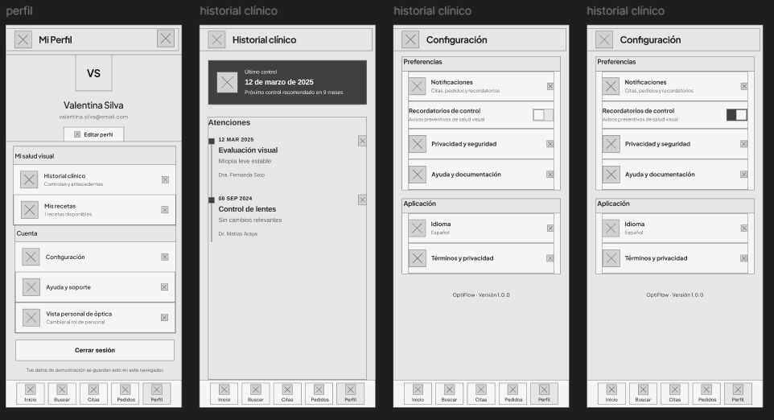

<a id="figura-3-027"></a>
**Figura 3-027. Wireframes del perfil de paciente, historial clínico y panel de ajustes.**


Esta imagen ilustra la gestión de cuenta y antecedentes médicos del paciente distribuida en cuatro pantallas.

**Sección Directorio Clínico y Ficha del Paciente (Personal Óptico)**


La evidencia de 3.1.4.1. Mobile Applications Wireframes se presenta en [Figura 3-028](#figura-3-028).

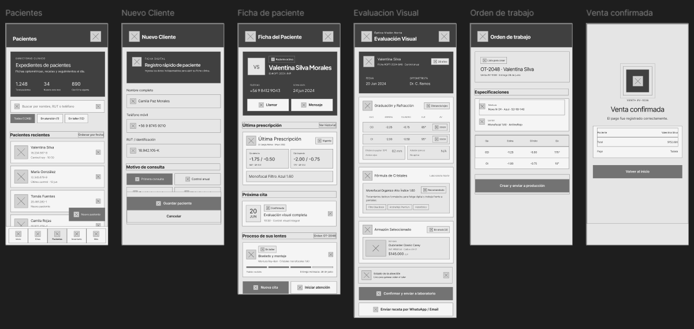

<a id="figura-3-028"></a>
**Figura 3-028. Wireframes del directorio de pacientes, ficha médica, refracción y orden de trabajo.**


Esta imagen detalla el flujo de trabajo clínico del optómetra y asesor de óptica en seis pantallas. Inicia con el directorio clínico de expedientes con métricas de resumen (total de pacientes, nuevos del mes, fichas en taller), buscador y filtros por estado. Continúa con el formulario modal de registro rápido de nuevo cliente con datos demográficos y motivo de consulta. Las pantallas clínicas finales estructuran la evaluación visual y la pantalla de confirmación de venta y pago registrado.

**Sección Agenda y Control de Atención Clínica (Personal Óptico)**


La evidencia de 3.1.4.1. Mobile Applications Wireframes se presenta en [Figura 3-029](#figura-3-029).

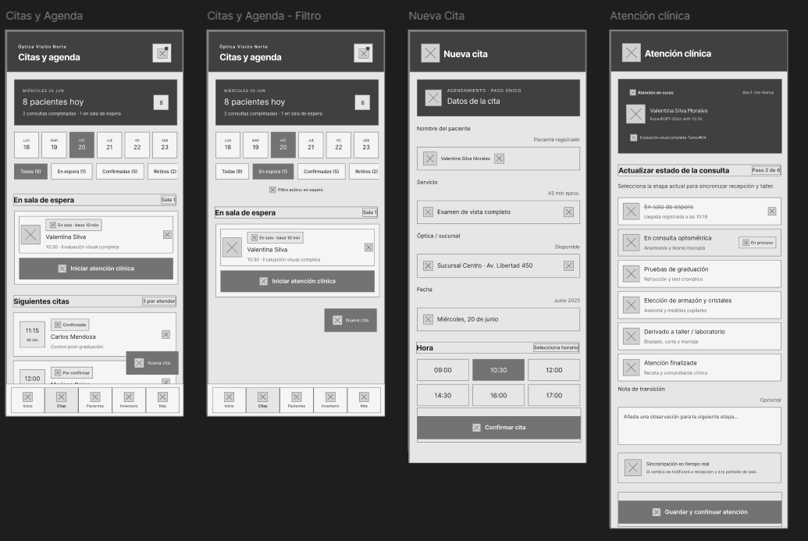

<a id="figura-3-029"></a>
**Figura 3-029. Wireframes de la agenda diaria, control de sala de espera y flujo de atención.**


El diseño de agenda organiza la atención en cuatro vistas: resumen diario con calendario y filtros, consulta de citas, registro manual y actualización del estado de atención con notas. Su objetivo es facilitar el seguimiento de los turnos por el personal; la disponibilidad operativa de estas funciones se evalúa en la implementación correspondiente.

**Sección Control de Stock e Inventario (Personal Óptico)**


La evidencia de 3.1.4.1. Mobile Applications Wireframes se presenta en [Figura 3-030](#figura-3-030).

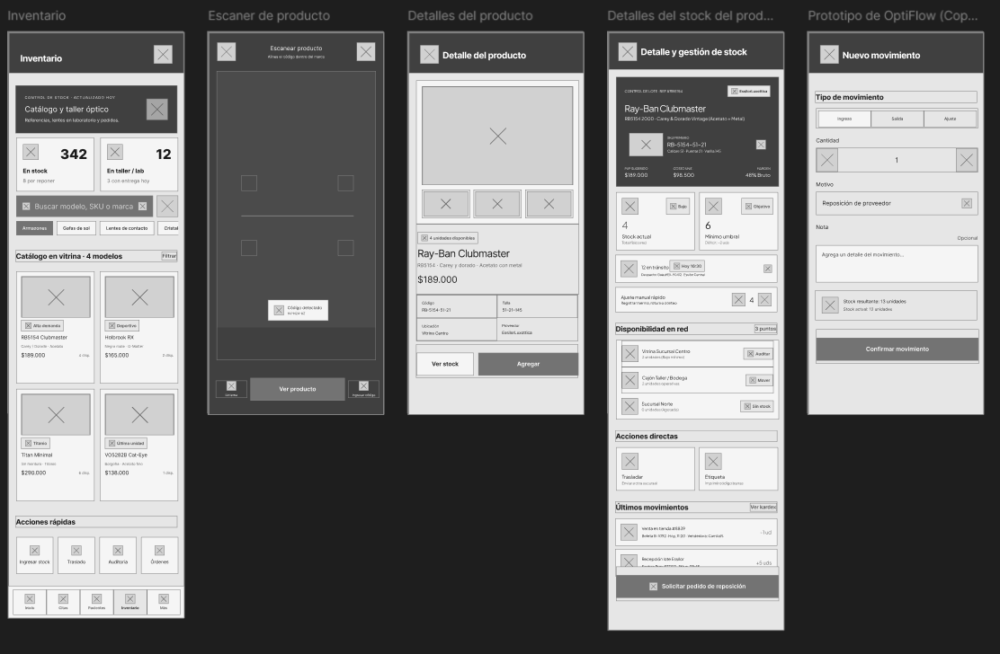

<a id="figura-3-030"></a>
**Figura 3-030. Wireframes de gestión de inventario, escáner de códigos y ajuste de existencias.**


Esta imagen presenta la arquitectura de administración física de existencias en cinco pantallas interactivas. El panel principal resume las métricas de stock en vitrina y productos en taller/laboratorio. La segunda pantalla habilita el escáner de productos mediante cámara para lectura instantánea de códigos de barras o QR. La tercera pantalla desglosa la ficha de producto con galería fotográfica, precios y especificaciones. La cuarta pantalla detalla la distribución de stock multisede. La última pantalla proporciona el formulario para registrar nuevos movimientos.

**Sección Operaciones, Producción y Reportes (Personal Óptico)**


La evidencia de 3.1.4.1. Mobile Applications Wireframes se presenta en [Figura 3-031](#figura-3-031).

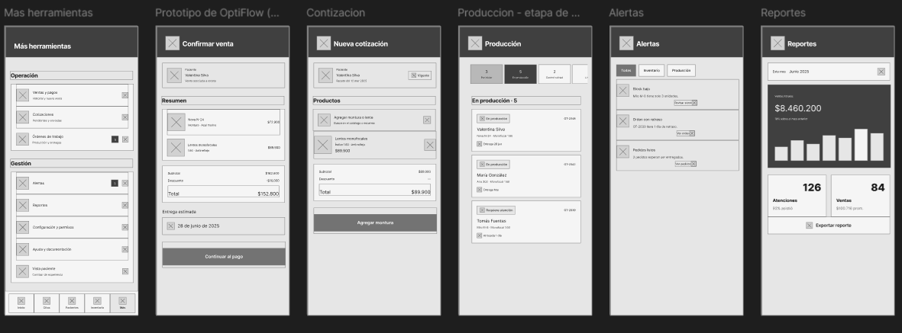

<a id="figura-3-031"></a>
**Figura 3-031. Wireframes del centro de herramientas, cotizaciones, taller de producción y reportes.**


El diseño reúne las herramientas operativas y analíticas en seis pantallas: confirmación de venta, cotizaciones vinculadas a recetas, tablero Kanban de producción, alertas y reportes. Las vistas permiten revisar la organización del flujo comercial y del taller, junto con los indicadores propuestos de facturación y atención. Estas funciones forman parte del diseño integral y no se presentan como funcionalidades móviles verificadas en el Sprint 1.

#### 3.1.4.2. Mobile Applications Wireflow Diagrams


#### 3.1.4.3. Mobile Applications Mock-ups


#### 3.1.4.4. Mobile Applications User Flow Diagrams


#### 3.1.4.5 Mobile Applications Prototyping


