<div style="break-before: page; page-break-before: always;"></div>

# Capítulo IV: Product Implementation & Validation

## 4. Product Implementation & Validation

### 4.1. Software Configuration Management

#### 4.1.1. Software Development Environment Configuration

Esta sección describe las herramientas del entorno de trabajo y su función en el diseño, desarrollo, documentación y validación de OptiFlow.

##### Figma


El logo de Figma se presenta en la Figura 102.

<a id="figura-102"></a>

**Figura 102**

*Logo de Figma*


Se utiliza para definir el diseño de la Landing Page y de la aplicación móvil: wireframes, mock-ups y prototipo interactivo con la simulación de navegación entre pantallas (Figma, s. f.).

Ruta de referencia: https://www.figma.com

##### Android Studio


El logo de Android Studio se observa en la Figura 103.

<a id="figura-103"></a>

**Figura 103**

*Logo de Android Studio*


Es el entorno de desarrollo integrado (IDE) para la programación de la aplicación móvil. Además, se emplean el Android SDK, Gradle para la gestión de dependencias y la compilación, el Android Emulator para pruebas durante el desarrollo y un dispositivo físico con depuración USB para validar el funcionamiento real de la aplicación. La aplicación se desarrolla en Kotlin, cuya adopción en proyectos Android resulta costo-efectiva frente a Java sin afectar la calidad percibida por los usuarios (Coppola et al., 2025), y su interfaz se construye con Jetpack Compose (Google, s. f.-b). El proyecto fija una versión mínima del SDK (API 26), porque la evolución de la API de Android genera problemas de compatibilidad que deben controlarse durante el desarrollo (Mahmud et al., 2024).

Ruta de descarga: https://developer.android.com/studio

##### Docker


El logo de Docker se muestra en la Figura 104.

<a id="figura-104"></a>

**Figura 104**

*Logo de Docker*


Se utiliza para empaquetar el backend (Web Services) en una imagen construida a partir de un `Dockerfile` de dos etapas, de modo que el despliegue sea reproducible y no dependa de la configuración de cada equipo (Docker, s. f.).

Ruta de descarga: https://www.docker.com/products/docker-desktop

##### Structurizr


El logo de Structurizr se presenta en la Figura 105.

<a id="figura-105"></a>

**Figura 105**

*Logo de Structurizr*


Se utiliza para elaborar los diagramas de arquitectura de software del Modelo C4 (Context, Container, Component y Deployment).

Ruta de referencia: https://structurizr.com

##### Miro


El logo de Miro se observa en la Figura 106.

<a id="figura-106"></a>

**Figura 106**

*Logo de Miro*


Se utiliza como pizarra colaborativa para las sesiones de EventStorming: Big Picture, Candidate Context Discovery y modelado de Domain Message Flows.

Ruta de referencia: https://miro.com

#### 4.1.2. Source Code Management

El equipo utiliza **Git** para el control de versiones y **GitHub** para alojar los repositorios y colaborar sobre el código y la documentación (GitHub, s. f.). Los productos se agrupan en la organización [BL-App-Movil-1ACC0238-2620-4951](https://github.com/BL-App-Movil-1ACC0238-2620-4951). Los historiales de commits permiten relacionar los cambios registrados con sus autores y fechas.

##### Repositorios del proyecto


Los repositorios del proyecto se detallan en la Tabla 101.

<a id="tabla-101"></a>

**Tabla 101**

*Repositorios del proyecto*


| Producto | Repositorio |
|---|---|
| Informe del proyecto | [URL] |
| Landing Page | [URL] |
| Web Services | [URL] |
| Aplicación móvil | [URL] |

##### Flujo de trabajo con GitFlow

Se adoptó **GitFlow** como flujo de trabajo para organizar el desarrollo en ramas con responsabilidades definidas:


Las ramas del flujo de trabajo GitFlow se presentan en la Tabla 102.

<a id="tabla-102"></a>

**Tabla 102**

*Ramas del flujo de trabajo GitFlow*


| Rama | Propósito | Convención de nombre |
|---|---|---|
| `main` | Contiene las versiones estables y publicadas del producto. | `main` |
| `develop` | Rama de integración donde se reúnen las funcionalidades terminadas. | `develop` |
| `feature/*` | Desarrollo de cada funcionalidad o User Story en su propia rama. | `feature/<descripcion-en-ingles>`, por ejemplo `feature/login-screen` |
| `release/*` | Preparación de una nueva versión antes de publicarla. | `release/<version>`, por ejemplo `release/1.0.0` |
| `hotfix/*` | Corrección urgente de errores detectados en `main`. | `hotfix/<descripcion-en-ingles>`, por ejemplo `hotfix/fix-token-validation` |

Los cambios se integran mediante **Pull Requests** hacia la rama `develop`, de modo que cada modificación sea revisada por otro integrante antes de incorporarse.

La convención propuesta para los mensajes utiliza un tipo y una descripción breve, de modo que el historial permita reconocer el propósito de cada cambio. El cuerpo del mensaje puede explicar en español el comportamiento incorporado, la corrección realizada o la documentación actualizada. Los tipos principales son:

- `feat/feature`: nueva funcionalidad.
- `fix`: corrección de un error.
- `docs`: cambios en la documentación.

#### 4.1.3. Source Code Style Guide & Conventions

Las guías de estilo buscan mantener el código legible y consistente entre los integrantes, lo que favorece la mantenibilidad, una de las características de calidad del producto de software (International Organization for Standardization, 2023). Los identificadores de clases, funciones, variables, archivos y ramas se definen en **inglés**. La documentación y la explicación del cuerpo de los commits pueden redactarse en español para describir con claridad el propósito del cambio.

##### Guías de estilo por lenguaje


Las guías de estilo por lenguaje se resumen en la Tabla 103.

<a id="tabla-103"></a>

**Tabla 103**

*Guías de estilo por lenguaje*


| Lenguaje | Producto | Guía adoptada |
|---|---|---|
| Kotlin | Aplicación móvil | [Kotlin Coding Conventions](https://kotlinlang.org/docs/coding-conventions.html) |
| Java | Web Services | [Google Java Style Guide](https://google.github.io/styleguide/javaguide.html) |
| HTML, CSS y JavaScript | Landing Page | [Google HTML/CSS Style Guide](https://google.github.io/styleguide/htmlcssguide.html) |
| Gherkin | Archivos `.feature` de pruebas de aceptación | [Gherkin Conventions for Readable Specifications](https://specflow.org/gherkin/gherkin-conventions-for-readablespecifications/) |

##### Convenciones de nomenclatura


Las convenciones de nomenclatura se detallan en la Tabla 104.

<a id="tabla-104"></a>

**Tabla 104**

*Convenciones de nomenclatura*


| Elemento | Convención | Ejemplo |
|---|---|---|
| Clases, interfaces y enumeraciones | `PascalCase` | `AppointmentRepository` |
| Funciones, métodos y variables | `camelCase` | `getUpcomingAppointments` |
| Constantes | `UPPER_SNAKE_CASE` | `MAX_RETRY_COUNT` |
| Paquetes | minúsculas, sin guiones bajos | `com.optiflow.booking` |
| Archivos CSS y de la Landing Page | `kebab-case` | `main-header.css` |
| Archivos `.feature` | `snake_case` o `kebab-case` en inglés | `book-appointment.feature` |

##### Organización del código

El código se organiza siguiendo las capas de Domain-Driven Design definidas en el Capítulo II (Domain, Application, Interface e Infrastructure), de modo que cada clase se ubique en el paquete que corresponde a su responsabilidad.

#### 4.1.4. Software Deployment Configuration
La Landing Page se publica en **GitHub Pages**, los Web Services se despliegan en **Render** mediante Docker (Render, s. f.) y la aplicación móvil se distribuye a través de **Firebase App Distribution** (Google, s. f.-a). A continuación se describe la configuración de cada producto; la evidencia de cada despliegue se presenta en la sección 4.2.1.8.

##### Landing Page

1. Se parte de la rama `main` del repositorio de la Landing Page.
2. En **Settings → Pages** se configura la publicación desde la rama `main` y la carpeta raíz (`/root`).
3. Cada integración en `main` ejecuta el workflow `pages build and deployment`, que publica los archivos estáticos (HTML, CSS y JavaScript).
4. El sitio queda disponible en [https://bl-app-movil-1acc0238-2620-4951.github.io/Logix-OptiFlow-lading-page/](https://bl-app-movil-1acc0238-2620-4951.github.io/Logix-OptiFlow-lading-page/).

##### Web Services

1. Se parte de la rama `develop` del repositorio de los Web Services; Render vuelve a desplegar el servicio cada vez que esta rama se actualiza.
2. Render construye la imagen con el `Dockerfile` del repositorio: compila el proyecto con Maven y ejecuta el JAR generado sobre Java 21.
3. El servicio se conecta a una base de datos PostgreSQL 16 administrada por Render. Las credenciales se registran como variables de entorno (`SPRING_DATASOURCE_URL`, `SPRING_DATASOURCE_USERNAME` y `SPRING_DATASOURCE_PASSWORD`) y no se incluyen en el repositorio.
4. Se verifica el despliegue en la documentación OpenAPI publicada con Swagger UI (SmartBear Software, s. f.): [https://logix-optiflow-back-end.onrender.com/swagger-ui/index.html](https://logix-optiflow-back-end.onrender.com/swagger-ui/index.html).

##### Aplicación móvil

1. Se parte de la rama `develop` del repositorio de la aplicación móvil.
2. En Android Studio se selecciona la variante `prodDebug`, que consume los Web Services desplegados en Render, y se genera el APK.
3. El APK se carga en **Firebase App Distribution** dentro del proyecto Optiflow.
4. Los evaluadores se registran en el grupo `optiflow-testers` o se unen mediante el vínculo de invitación, y reciben el enlace para instalar la aplicación en sus dispositivos Android.

##### Deployment Diagram

El Deployment Diagram muestra los nodos de publicación y ejecución del Sprint 1: GitHub Pages para la Landing Page, Render para el backend y su base de datos PostgreSQL, y Firebase App Distribution para distribuir la aplicación a los dispositivos Android. La evidencia de los entornos utilizados se presenta en la sección 4.2.1.8 (ver Figura 107).


<a id="figura-107"></a>

**Figura 107**

*Deployment Diagram de OptiFlow en el Sprint 1*

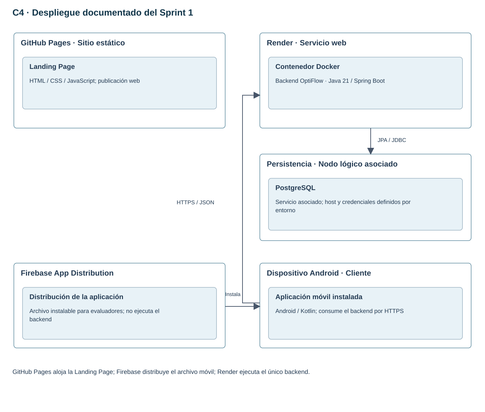


## 4.2. Landing Page & Mobile Application Implementation
### 4.2.1. Sprint 1
Durante el Sprint 1, el equipo inició la implementación de OptiFlow con dos prioridades: publicar la Landing Page y desarrollar el flujo del paciente para buscar ópticas y reservar una cita de atención optométrica. Este incremento establece una primera integración entre la aplicación móvil y los Web Services, cuyo comportamiento se documenta mediante evidencias de desarrollo, pruebas y ejecución.

Siguiendo el marco de trabajo Scrum (Schwaber & Sutherland, 2020), el trabajo del Sprint se organiza mediante reuniones virtuales realizadas a través de Discord, seguimiento de actividades mediante el Sprint Backlog y control de versiones a través de los repositorios de GitHub de la organización del equipo.

El alcance funcional comprometido en el Sprint 1 se concentra en las User Stories US05 y US06.
#### 4.2.1.1. Sprint Planning 1
El Sprint Planning 1 tuvo como finalidad establecer el objetivo de la primera iteración, seleccionar las User Stories que contribuyen directamente a dicho objetivo, determinar la capacidad inicial del equipo y distribuir las principales responsabilidades de implementación.

La reunión se realizó de manera virtual mediante Discord y fue preparada por Celis Berrospi, Eslander. Debido a que Sprint 1 representa la primera iteración de implementación de la solución, no existe un Sprint anterior sobre el cual realizar un Sprint Review o Sprint Retrospective formal (ver Tabla 105).


<a id="tabla-105"></a>

**Tabla 105**

*Sprint Planning 1*


| Sprint # | Sprint 1 |
| :--- | :--- |
| **Sprint Planning Background** | |
| **Date** | 2026-09-28 |
| **Time** | 07:00 PM |
| **Location** | Discord |
| **Prepared By** | Celis Berrospi, Eslander |
| **Attendees (to planning meeting)** | Atoche Gonzales, Nicolas Fernando / Becerra Ttito, Felix Orlando / Celis Berrospi, Eslander / Morocho Pinedo, Mariana / Quispe Llacsahuanga, César Augusto |
| **Sprint 0 Review Summary** | No aplica, debido a que Sprint 1 corresponde a la primera iteración de implementación de OptiFlow. Antes del inicio de este Sprint, el equipo desarrolló las actividades de investigación, análisis de los segmentos objetivo, especificación de requisitos, Domain-Driven Design, arquitectura de software y diseño UX/UI que sirven como base para la implementación del producto. |
| **Sprint 0 Retrospective Summary** | No se realizó una retrospectiva formal debido a que no existió un Sprint de implementación anterior. Sin embargo, a partir del trabajo realizado durante las etapas previas, el equipo identificó la necesidad de distribuir claramente las responsabilidades, dividir el trabajo en tareas de corta duración, mantener una comunicación constante mediante Discord y conservar la trazabilidad del desarrollo mediante GitHub. |
| **Sprint Goal & User Stories** | |
| **Sprint 1 Goal** | Nuestro enfoque consiste en ofrecer a los pacientes una primera experiencia integrada para encontrar ópticas y programar una atención optométrica, junto con una Landing Page que comunique la propuesta de valor de OptiFlow. Consideramos que este incremento facilitará la consulta de establecimientos y la organización de citas. El cumplimiento se verificará cuando un paciente pueda consultar ópticas, seleccionar un horario disponible y obtener la confirmación de su reserva desde la aplicación móvil; cuando el servicio rechace una segunda reserva del mismo horario; y cuando las secciones y la navegación de la Landing Page puedan demostrarse en escritorio y móvil. |
| **Sprint 1 Velocity** | 13 Story Points de capacidad planificada, según el registro inicial del equipo. |
| **Sum of Story Points** | 13 Story Points: US05 (5) y US06 (8), según el Product Backlog del Capítulo II. |

El alcance estimado en Story Points corresponde a US05 y US06. Las actividades de la Landing Page se incluyen como tareas adicionales. El registro e inicio de sesión del paciente permiten ejecutar la reserva; se documentan como soporte a este flujo y se distinguen de US01, cuyo actor en el Product Backlog es el personal de la óptica.

#### 4.2.1.2. Aspect Leaders and Collaborators
Para organizar las responsabilidades del Sprint se establece una Leadership-and-Collaboration Matrix (LACX). La matriz identifica al integrante responsable de liderar cada aspecto y a los integrantes que participan como colaboradores.

Los principales aspectos considerados durante Sprint 1 son la implementación del Landing Page, la experiencia móvil de búsqueda de ópticas, el flujo móvil de reserva de citas, los servicios asociados a Search & Booking y la integración y coordinación general del Sprint (ver Tabla 106).


<a id="tabla-106"></a>

**Tabla 106**

*Aspect leaders y colaboradores del Sprint 1*


| Team Member | GitHub Username | Landing Page | Optical Store Search | Appointment Booking | Search & Booking Services | Integration & Sprint Coordination |
| :--- | :--- | :---: | :---: | :---: | :---: | :---: |
| Atoche Gonzales, Nicolas Fernando | `THECOMAX` | C | **L** | C | C | C |
| Becerra Ttito, Felix Orlando | `Felixb14` | C | C | C | **L** | C |
| Celis Berrospi, Eslander | `Eslander-Celis` | C | C | C | C | **L** |
| Morocho Pinedo, Mariana | `Patto04` | C | C | **L** | C | C |
| Quispe Llacsahuanga, César Augusto | `user20-bit` | **L** | C | C | C | C |

**L:** Leader  
**C:** Collaborator

Cada aspecto cuenta con un líder y colaboradores. La matriz expresa la distribución de responsabilidades del Sprint; las contribuciones de implementación se presentan mediante los commits de la sección 4.2.1.4.

#### 4.2.1.3. Sprint Backlog 1

El Sprint Backlog reúne las tareas de búsqueda de ópticas y reserva de citas correspondientes a US05 y US06, junto con las actividades adicionales de la Landing Page. La tabla conserva las estimaciones y responsabilidades del registro de planificación. Las 13 tareas se encuentran en estado Done, ya que la Landing Page está publicada y la búsqueda de ópticas y la reserva de citas funcionan en la aplicación móvil y en los Web Services, como se evidencia en las secciones 4.2.1.6 a 4.2.1.8.

**Board del Sprint:** [Tablero del Sprint 1 en GitHub](https://github.com/BL-App-Movil-1ACC0238-2620-4951/Logix-OptiFlow-Report/blob/develop/assets/cap4/sprint1/sprint-board.md) · [Vista del tablero local](assets/cap4/sprint1/sprint-board.html). El tablero adjunto se elaboró para esta revisión a partir de las tareas del informe y sus evidencias (ver Figura 108).


<a id="figura-108"></a>

**Figura 108**

*Tablero de revisión del Sprint 1*

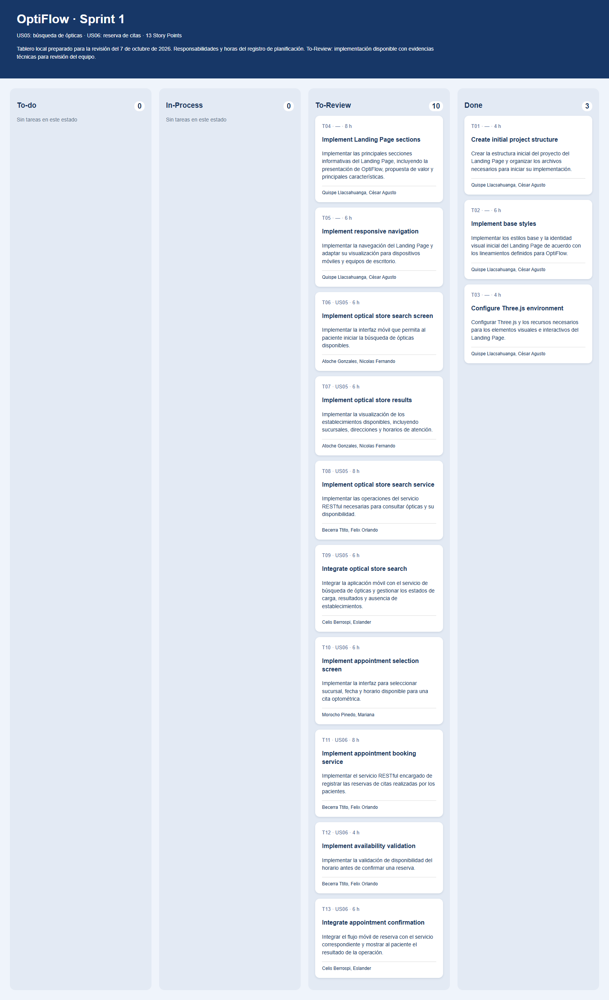


El Sprint Backlog 1 se presenta en la Tabla 107.

<a id="tabla-107"></a>

**Tabla 107**

*Sprint Backlog 1*


| Sprint # | User Story | User Story Title | Task ID | Task Title | Description | Estimation (Hours) | Assigned To | Status |
| :---: | :---: | :--- | :---: | :--- | :--- | :---: | :--- | :---: |
| 1 | — | Actividad adicional: Landing Page | T01 | Create initial project structure | Crear la estructura inicial del proyecto del Landing Page y organizar los archivos necesarios para iniciar su implementación. | 4 | Quispe Llacsahuanga, César Augusto | Done |
| 1 | — | Actividad adicional: Landing Page | T02 | Implement base styles | Implementar los estilos base y la identidad visual inicial del Landing Page de acuerdo con los lineamientos definidos para OptiFlow. | 6 | Quispe Llacsahuanga, César Augusto | Done |
| 1 | — | Actividad adicional: Landing Page | T03 | Configure Three.js environment | Configurar Three.js y los recursos necesarios para los elementos visuales e interactivos del Landing Page. | 4 | Quispe Llacsahuanga, César Augusto | Done |
| 1 | — | Actividad adicional: Landing Page | T04 | Implement Landing Page sections | Implementar las principales secciones informativas del Landing Page, incluyendo la presentación de OptiFlow, propuesta de valor y principales características. | 8 | Quispe Llacsahuanga, César Augusto | Done |
| 1 | — | Actividad adicional: Landing Page | T05 | Implement responsive navigation | Implementar la navegación del Landing Page y adaptar su visualización para dispositivos móviles y equipos de escritorio. | 6 | Quispe Llacsahuanga, César Augusto | Done |
| 1 | US05 | Búsqueda de ópticas y disponibilidad de atención | T06 | Implement optical store search screen | Implementar la interfaz móvil que permita al paciente iniciar la búsqueda de ópticas disponibles. | 6 | Atoche Gonzales, Nicolas Fernando | Done |
| 1 | US05 | Búsqueda de ópticas y disponibilidad de atención | T07 | Implement optical store results | Implementar la visualización de los establecimientos disponibles, incluyendo sucursales, direcciones y horarios de atención. | 6 | Atoche Gonzales, Nicolas Fernando | Done |
| 1 | US05 | Búsqueda de ópticas y disponibilidad de atención | T08 | Implement optical store search service | Implementar las operaciones del servicio RESTful necesarias para consultar ópticas y su disponibilidad. | 8 | Becerra Ttito, Felix Orlando | Done |
| 1 | US05 | Búsqueda de ópticas y disponibilidad de atención | T09 | Integrate optical store search | Integrar la aplicación móvil con el servicio de búsqueda de ópticas y gestionar los estados de carga, resultados y ausencia de establecimientos. | 6 | Celis Berrospi, Eslander | Done |
| 1 | US06 | Reserva de cita para atención optométrica | T10 | Implement appointment selection screen | Implementar la interfaz para seleccionar sucursal, fecha y horario disponible para una cita optométrica. | 6 | Morocho Pinedo, Mariana | Done |
| 1 | US06 | Reserva de cita para atención optométrica | T11 | Implement appointment booking service | Implementar el servicio RESTful encargado de registrar las reservas de citas realizadas por los pacientes. | 8 | Becerra Ttito, Felix Orlando | Done |
| 1 | US06 | Reserva de cita para atención optométrica | T12 | Implement availability validation | Implementar la validación de disponibilidad del horario antes de confirmar una reserva. | 4 | Becerra Ttito, Felix Orlando | Done |
| 1 | US06 | Reserva de cita para atención optométrica | T13 | Integrate appointment confirmation | Integrar el flujo móvil de reserva con el servicio correspondiente y mostrar al paciente el resultado de la operación. | 6 | Celis Berrospi, Eslander | Done |

#### 4.2.1.4. Development Evidence for Sprint Review

Durante el Sprint 1 se registraron avances en los tres productos principales de OptiFlow. La Landing Page incorpora secciones informativas, ajustes visuales, navegación y validaciones del formulario. El backend incluye operaciones de búsqueda de ópticas, disponibilidad y reserva de citas, además de validaciones de entrada y manejo de errores. La aplicación móvil incorpora el cliente de comunicación con el backend, el registro e inicio de sesión del paciente, la consulta de establecimientos y la selección de horarios para realizar reservas.

La siguiente tabla presenta commits representativos del alcance documentado, obtenidos de los historiales de las clonaciones locales revisadas el 2026-10-07 (ver Tabla 108).


<a id="tabla-108"></a>

**Tabla 108**

*Commits de desarrollo del Sprint 1*


| Repository | Branch | Commit Id | Commit Message | Commit Message Body | Committed on (Date) |
|---|---|---|---|---|---|
| `Logix-OptiFlow-lading-page` | `main` | [52a57c6](https://github.com/BL-App-Movil-1ACC0238-2620-4951/Logix-OptiFlow-lading-page/commit/52a57c6) | `feat: add initial project structure, base styles, and Three.js setup` | Descripción en español: Crea la estructura inicial, los estilos base y la configuración de Three.js. | 2026-10-03 |
| `Logix-OptiFlow-lading-page` | `main` | [8091504](https://github.com/BL-App-Movil-1ACC0238-2620-4951/Logix-OptiFlow-lading-page/commit/8091504) | `Refresh landing page visuals and intro animation` | Descripción en español: Actualiza la apariencia de la Landing Page y la animación introductoria. | 2026-10-06 |
| `Logix-OptiFlow-lading-page` | `main` | [8bf76ec](https://github.com/BL-App-Movil-1ACC0238-2620-4951/Logix-OptiFlow-lading-page/commit/8bf76ec) | `fix: set footer` | Descripción en español: Ajusta el pie de página. | 2026-10-06 |
| `Logix-OptiFlow-lading-page` | `main` | [e5f8254](https://github.com/BL-App-Movil-1ACC0238-2620-4951/Logix-OptiFlow-lading-page/commit/e5f8254) | `style: fix plans and avatars` | Descripción en español: Ajusta la presentación de planes y avatares. | 2026-10-06 |
| `Logix-OptiFlow-lading-page` | `main` | [5a9ff47](https://github.com/BL-App-Movil-1ACC0238-2620-4951/Logix-OptiFlow-lading-page/commit/5a9ff47) | `fix: update navbar` | Descripción en español: Actualiza la barra de navegación. | 2026-10-06 |
| `Logix-OptiFlow-lading-page` | `main` | [774f144](https://github.com/BL-App-Movil-1ACC0238-2620-4951/Logix-OptiFlow-lading-page/commit/774f144) | `style: fix benefits section` | Descripción en español: Ajusta los estilos de beneficios. | 2026-10-06 |
| `Logix-OptiFlow-lading-page` | `main` | [52716d7](https://github.com/BL-App-Movil-1ACC0238-2620-4951/Logix-OptiFlow-lading-page/commit/52716d7) | `feat: highlight active navigation section and fix mobile menu state` | Descripción en español: Resalta la sección activa y corrige el estado del menú móvil. | 2026-10-07 |
| `Logix-OptiFlow-lading-page` | `main` | [1cd0a27](https://github.com/BL-App-Movil-1ACC0238-2620-4951/Logix-OptiFlow-lading-page/commit/1cd0a27) | `feat: add demo form guidance and inline validation` | Descripción en español: Añade instrucciones y validaciones al formulario de demostración. | 2026-10-07 |
| `Logix-OptiFlow-lading-page` | `main` | [4c779f9](https://github.com/BL-App-Movil-1ACC0238-2620-4951/Logix-OptiFlow-lading-page/commit/4c779f9) | `feat: improve active navigation style and smooth scroll tracking` | Descripción en español: Mejora el estilo de navegación activa y el seguimiento del desplazamiento. | 2026-10-07 |
| `Logix-OptiFlow-Back-End` | `develop` | [543aaf2](https://github.com/BL-App-Movil-1ACC0238-2620-4951/Logix-OptiFlow-Back-End/commit/543aaf2) | `Add OptiFlow booking backend` | Descripción en español: Incorpora el backend de búsqueda y reserva de OptiFlow y sus pruebas iniciales. | 2026-10-06 |
| `Logix-OptiFlow-Back-End` | `develop` | [2f3f43f](https://github.com/BL-App-Movil-1ACC0238-2620-4951/Logix-OptiFlow-Back-End/commit/2f3f43f) | `Add local/postgres Spring profiles` | Descripción en español: Añade perfiles de configuración local y PostgreSQL y modifica la configuración de pruebas. | 2026-10-06 |
| `Logix-OptiFlow-Back-End` | `develop` | [ac63183](https://github.com/BL-App-Movil-1ACC0238-2620-4951/Logix-OptiFlow-Back-End/commit/ac63183) | `fix: reject invalid characters in patient phone numbers` | Descripción en español: Rechaza caracteres inválidos en teléfonos e incorpora pruebas de validación. | 2026-10-07 |
| `Logix-OptiFlow-Back-End` | `develop` | [25c3003](https://github.com/BL-App-Movil-1ACC0238-2620-4951/Logix-OptiFlow-Back-End/commit/25c3003) | `feat: standardize malformed request error responses` | Descripción en español: Unifica respuestas a solicitudes mal formadas e incorpora pruebas de errores. | 2026-10-07 |
| `Logix-OptiFlow-Movile` | `develop` | [067fd5d](https://github.com/BL-App-Movil-1ACC0238-2620-4951/Logix-OptiFlow-Movile/commit/067fd5d) | `chore(mobile): configure api base url for local and production` | Descripción en español: Configura las URL del backend para los entornos local y de producción. | 2026-10-07 |
| `Logix-OptiFlow-Movile` | `develop` | [27fef3d](https://github.com/BL-App-Movil-1ACC0238-2620-4951/Logix-OptiFlow-Movile/commit/27fef3d) | `feat: add retrofit client with timeouts and logging` | Descripción en español: Añade el cliente Retrofit con tiempos de espera y registro de comunicaciones. | 2026-10-07 |
| `Logix-OptiFlow-Movile` | `develop` | [484564d](https://github.com/BL-App-Movil-1ACC0238-2620-4951/Logix-OptiFlow-Movile/commit/484564d) | `feat: Add remote booking and search API layer` | Descripción en español: Añade la capa de API remota para búsqueda y reserva. | 2026-10-07 |
| `Logix-OptiFlow-Movile` | `develop` | [8f950a3](https://github.com/BL-App-Movil-1ACC0238-2620-4951/Logix-OptiFlow-Movile/commit/8f950a3) | `feat: load optical stores from backend` | Descripción en español: Carga los establecimientos ópticos desde el backend. | 2026-10-07 |
| `Logix-OptiFlow-Movile` | `develop` | [3e6f97c](https://github.com/BL-App-Movil-1ACC0238-2620-4951/Logix-OptiFlow-Movile/commit/3e6f97c) | `feat: register patient and login against api` | Descripción en español: Integra el registro y el inicio de sesión del paciente con la API. | 2026-10-07 |
| `Logix-OptiFlow-Movile` | `develop` | [024cd92](https://github.com/BL-App-Movil-1ACC0238-2620-4951/Logix-OptiFlow-Movile/commit/024cd92) | `feat: fetch availability and book appointment` | Descripción en español: Consulta horarios disponibles y solicita reservas de citas. | 2026-10-07 |
| `Logix-OptiFlow-Movile` | `develop` | [557a47c](https://github.com/BL-App-Movil-1ACC0238-2620-4951/Logix-OptiFlow-Movile/commit/557a47c) | `feat: wire sprint 1 screens to search booking repository` | Descripción en español: Conecta las pantallas del Sprint 1 con los repositorios de búsqueda y reserva. | 2026-10-07 |
| `Logix-OptiFlow-Movile` | `develop` | [a5f5062](https://github.com/BL-App-Movil-1ACC0238-2620-4951/Logix-OptiFlow-Movile/commit/a5f5062) | `feat: add store search filter by minimum rating` | Descripción en español: Añade un filtro de búsqueda por valoración mínima. | 2026-10-07 |
| `Logix-OptiFlow-Movile` | `develop` | [e097ffd](https://github.com/BL-App-Movil-1ACC0238-2620-4951/Logix-OptiFlow-Movile/commit/e097ffd) | `feat: Redesign auth flow and fix store rating types` | Descripción en español: Rediseña el flujo de acceso y corrige los tipos de las valoraciones. | 2026-10-07 |
| `Logix-OptiFlow-Movile` | `develop` | [f09d228](https://github.com/BL-App-Movil-1ACC0238-2620-4951/Logix-OptiFlow-Movile/commit/f09d228) | `feat: Add home dashboard and patient appointment flow` | Descripción en español: Añade la pantalla de inicio y el flujo de citas del paciente. | 2026-10-07 |
| `Logix-OptiFlow-Movile` | `develop` | [861628c](https://github.com/BL-App-Movil-1ACC0238-2620-4951/Logix-OptiFlow-Movile/commit/861628c) | `feat: Add notifications and backend setup docs` | Descripción en español: Añade notificaciones y documentación para configurar el backend. | 2026-10-07 |

**Nota:** los commits seleccionados no contienen un cuerpo adicional en Git. La columna Commit Message Body presenta una descripción explicativa en español, no una transcripción de un cuerpo original. Branch identifica la rama revisada que contiene el commit, no necesariamente su rama de creación.

**Repositorios:** [Landing Page](https://github.com/BL-App-Movil-1ACC0238-2620-4951/Logix-OptiFlow-lading-page), [Web Services](https://github.com/BL-App-Movil-1ACC0238-2620-4951/Logix-OptiFlow-Back-End) y [aplicación móvil](https://github.com/BL-App-Movil-1ACC0238-2620-4951/Logix-OptiFlow-Movile).

#### 4.2.1.5. Testing Suite Evidence for Sprint Review

La verificación de Web Services comprende pruebas unitarias, pruebas de integración y pruebas de aceptación automatizadas bajo BDD. JUnit valida las reglas del dominio; Spring Boot Test y MockMvc comprueban las operaciones de la API; Cucumber ejecuta los escenarios Gherkin de US05 y US06 mediante Steps en Java (ver Tabla 109).


<a id="tabla-109"></a>

**Tabla 109**

*Escenarios de prueba del Sprint 1*


| Test Suite | Tipo | Clases y comportamientos relacionados | Relación con el Sprint |
|---|---|---|---|
| `AppointmentBookingRulesTest` | Unit Tests | `AppointmentAvailabilityService`, `AppointmentFactory`, `TimeSlot` y `Appointment`: confirmación de una cita disponible y rechazo de un horario reservado. | US06 |
| `SearchAndBookingApiTest` | Integration Tests | Consulta de ópticas y disponibilidad, reserva confirmada, rechazo de doble reserva, búsqueda sin resultados, credenciales inválidas y validación de teléfonos. | US05, US06 y soporte al paciente |
| `PhoneNumberTest` | Unit Tests | `PhoneNumber`: normalización de formatos admitidos y rechazo de caracteres, formatos y longitudes inválidos. | Soporte al registro |
| `ApiRequestErrorsTest` | Integration Tests | Respuestas HTTP 400 ante UUID inválidos, cuerpos vacíos, JSON mal formado, tipos incorrectos y campos obligatorios ausentes. | Soporte a los servicios |
| `SearchBookingAcceptanceTest` | Acceptance Tests / BDD | Cuatro escenarios de consulta de establecimientos y disponibilidad, búsqueda sin coincidencias, reserva exitosa y rechazo de un horario reservado por otro paciente. | US05 y US06 |

##### Resultados de ejecución

El 2026-10-07 a las 23:09:57 (America/Lima) se ejecutó `mvn test` sobre el backend con la suite BDD incorporada localmente. Maven finalizó con **BUILD SUCCESS: 53 tests, 0 failures, 0 errors y 0 skipped**. Las suites relacionadas con Search & Booking y soporte suman 38 ejecuciones, incluidos cuatro escenarios de aceptación. Las 15 ejecuciones restantes corresponden a Clinical & Commercial y Production & Tracking (ver Tabla 110).


<a id="tabla-110"></a>

**Tabla 110**

*Resultados de ejecución de la suite de pruebas*


| Test Suite | Tests | Failures | Errors | Skipped |
|---|---:|---:|---:|---:|
| `AppointmentBookingRulesTest` | 2 | 0 | 0 | 0 |
| `SearchAndBookingApiTest` | 4 | 0 | 0 | 0 |
| `PhoneNumberTest` | 20 | 0 | 0 | 0 |
| `ApiRequestErrorsTest` | 8 | 0 | 0 | 0 |
| `SearchBookingAcceptanceTest` | 4 | 0 | 0 | 0 |
| **Subtotal del alcance y soporte** | **38** | **0** | **0** | **0** |
| Clinical & Commercial y Production & Tracking | 15 | 0 | 0 | 0 |
| **Total ejecutado** | **53** | **0** | **0** | **0** |

Los casos parametrizados se contabilizan como ejecuciones individuales. La ejecución utilizó Java 25.0.3 con release 21 configurado en Maven. Las pruebas BDD emplean una base H2 independiente (`optiflow_bdd`), pacientes con correos únicos y horarios nuevos para los escenarios de reserva, sin acceder a datos de producción.

**Evidencias:** [resumen de Maven Surefire](assets/cap4/sprint1/test-results.txt), [reporte HTML de Cucumber](assets/cap4/sprint1/testing/cucumber.html) y [resultados JSON](assets/cap4/sprint1/testing/cucumber.json) (ver Figura 109).


<a id="figura-109"></a>

**Figura 109**

*Resultado de los escenarios de aceptación en Cucumber*

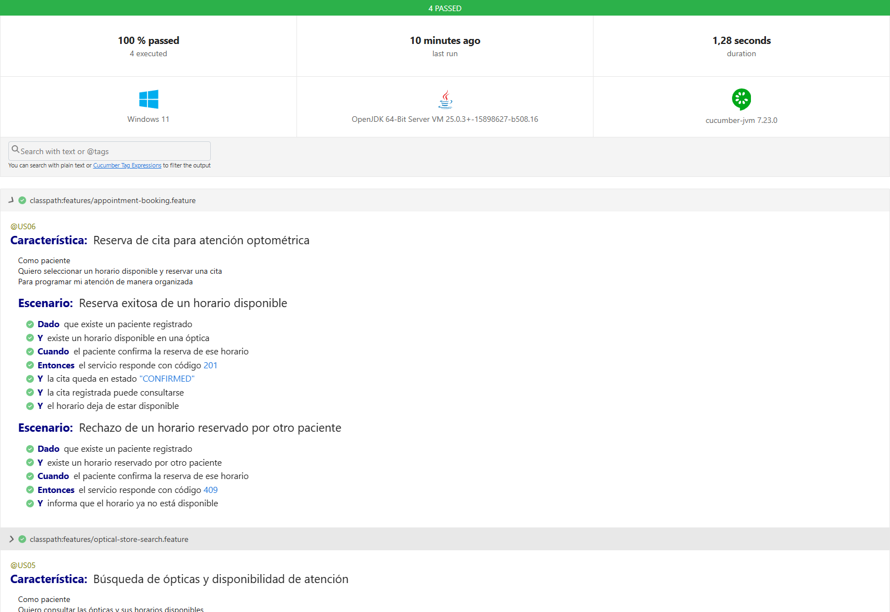


##### Verificación posterior a la integración

Antes de publicar se integraron los tres commits nuevos de Notification & Loyalty existentes en develop remoto (`6c388bc`). Sobre esa base, los cuatro escenarios BDD se ejecutaron sin fallos. La suite general registró 61 ejecuciones con 2 fallos y 4 errores; la base remota sin BDD registró 57 ejecuciones con los mismos 2 fallos y 4 errores. Se reprodujeron los mismos problemas en una copia independiente del código remoto, sin las modificaciones de aceptación.

Los errores de contexto se deben al índice parcial con WHERE de la migración V4, que H2 no admite. Los otros dos fallos corresponden a expectativas de NotificationPersistenceIntegrationTest y SearchAndBookingApiTest. Esta verificación distingue el resultado exitoso de la ejecución inicial de 53 pruebas de los problemas incorporados por la revisión remota posterior. El detalle se conserva en [validación de publicación](assets/cap4/sprint1/publish-validation.txt).

##### Evidencia de control de versiones


Los commits de la suite de pruebas se resumen en la Tabla 111.

<a id="tabla-111"></a>

**Tabla 111**

*Commits de la suite de pruebas*


| Repository | Branch | Commit Id | Commit Message | Commit Message Body | Committed on (Date) |
|---|---|---|---|---|---|
| `Logix-OptiFlow-Back-End` | `develop` | [543aaf2](https://github.com/BL-App-Movil-1ACC0238-2620-4951/Logix-OptiFlow-Back-End/commit/543aaf2) | `Add OptiFlow booking backend` | Descripción en español: Incorpora el backend de búsqueda y reserva de OptiFlow y sus pruebas iniciales. | 2026-10-06 |
| `Logix-OptiFlow-Back-End` | `develop` | [2f3f43f](https://github.com/BL-App-Movil-1ACC0238-2620-4951/Logix-OptiFlow-Back-End/commit/2f3f43f) | `Add local/postgres Spring profiles` | Descripción en español: Añade perfiles de configuración local y PostgreSQL y modifica la configuración de pruebas. | 2026-10-06 |
| `Logix-OptiFlow-Back-End` | `develop` | [ac63183](https://github.com/BL-App-Movil-1ACC0238-2620-4951/Logix-OptiFlow-Back-End/commit/ac63183) | `fix: reject invalid characters in patient phone numbers` | Descripción en español: Rechaza caracteres inválidos en teléfonos e incorpora pruebas de validación. | 2026-10-07 |
| `Logix-OptiFlow-Back-End` | `develop` | [25c3003](https://github.com/BL-App-Movil-1ACC0238-2620-4951/Logix-OptiFlow-Back-End/commit/25c3003) | `feat: standardize malformed request error responses` | Descripción en español: Unifica respuestas a solicitudes mal formadas e incorpora pruebas de errores. | 2026-10-07 |
| `Logix-OptiFlow-Back-End` | `develop` | [706ada9](https://github.com/BL-App-Movil-1ACC0238-2620-4951/Logix-OptiFlow-Back-End/commit/706ada927d4fd49807035e79d4313fbe463e9e54) | `test: add Gherkin acceptance suite for search and booking` | Descripción en español: Implementa cuatro escenarios Gherkin de US05 y US06, Steps con MockMvc y configuración de Cucumber y Surefire. | 2026-10-07 |

Los commits indicados incluyen cambios en `src/test`. Las suites y recursos pueden consultarse en [src/test del backend](https://github.com/BL-App-Movil-1ACC0238-2620-4951/Logix-OptiFlow-Back-End/tree/develop/src/test).

La suite BDD se encuentra registrada en el commit [706ada9](https://github.com/BL-App-Movil-1ACC0238-2620-4951/Logix-OptiFlow-Back-End/commit/706ada927d4fd49807035e79d4313fbe463e9e54) del backend. Los archivos Gherkin, Steps y configuración de ejecución forman parte de ese commit.

##### Archivos de pruebas de aceptación


Los archivos de pruebas de aceptación se detallan en la Tabla 112.

<a id="tabla-112"></a>

**Tabla 112**

*Archivos de pruebas de aceptación*


| Archivo en el backend | Responsabilidad | Copia de evidencia |
|---|---|---|
| `src/test/resources/features/optical-store-search.feature` | Escenarios de US05. | [Gherkin de búsqueda](assets/cap4/sprint1/testing/optical-store-search.feature) |
| `src/test/resources/features/appointment-booking.feature` | Escenarios de US06. | [Gherkin de reserva](assets/cap4/sprint1/testing/appointment-booking.feature) |
| `src/test/java/com/optiflow/platform/searchbooking/acceptance/SearchBookingSteps.java` | Steps que realizan solicitudes MockMvc y verifican códigos, datos, disponibilidad y persistencia de las citas. | [Steps en Java](assets/cap4/sprint1/testing/SearchBookingSteps.java) |
| `src/test/java/com/optiflow/platform/searchbooking/acceptance/CucumberSpringConfiguration.java` | Contexto Spring, MockMvc y base H2 de aceptación. | [Configuración Spring](assets/cap4/sprint1/testing/CucumberSpringConfiguration.java) |
| `src/test/java/com/optiflow/platform/searchbooking/acceptance/SearchBookingAcceptanceTest.java` | Suite JUnit Platform que descubre features, Steps y genera los reportes HTML y JSON. | [Suite de aceptación](assets/cap4/sprint1/testing/SearchBookingAcceptanceTest.java) |

##### Escenarios Gherkin ejecutados

```gherkin
# language: es
@US05
Característica: Búsqueda de ópticas y disponibilidad de atención
  Como paciente
  Quiero consultar las ópticas y sus horarios disponibles
  Para elegir dónde recibir atención optométrica

  Escenario: Consulta de establecimientos y disponibilidad
    Dado que existen ópticas y sucursales registradas
    Cuando el paciente consulta los establecimientos disponibles
    Entonces obtiene la información y las direcciones de los establecimientos
    Y puede consultar los horarios disponibles de una óptica

  Escenario: Búsqueda sin establecimientos coincidentes
    Dado que ninguna óptica coincide con los criterios de búsqueda
    Cuando el paciente realiza la búsqueda
    Entonces obtiene una lista vacía y un mensaje informativo
```

```gherkin
# language: es
@US06
Característica: Reserva de cita para atención optométrica
  Como paciente
  Quiero seleccionar un horario disponible y reservar una cita
  Para programar mi atención de manera organizada

  Escenario: Reserva exitosa de un horario disponible
    Dado que existe un paciente registrado
    Y existe un horario disponible en una óptica
    Cuando el paciente confirma la reserva de ese horario
    Entonces el servicio responde con código 201
    Y la cita queda en estado "CONFIRMED"
    Y la cita registrada puede consultarse
    Y el horario deja de estar disponible

  Escenario: Rechazo de un horario reservado por otro paciente
    Dado que existe un paciente registrado
    Y existe un horario reservado por otro paciente
    Cuando el paciente confirma la reserva de ese horario
    Entonces el servicio responde con código 409
    Y informa que el horario ya no está disponible
```

##### Reproducción

Desde la raíz del backend, ejecutar `mvn test`, o seleccionar Maven → Lifecycle → test en IntelliJ IDEA. Para ejecutar únicamente BDD, utilizar:

```powershell
mvn test "-Dtest=SearchBookingAcceptanceTest"
```

Los reportes se generan en `target/surefire-reports` y `target/cucumber`. La configuración incorpora Cucumber 7.23.0, el motor JUnit Platform, integración con Spring y Maven Surefire 3.5.4. El backend de producción no necesita estar iniciado para estas pruebas.

#### 4.2.1.6. Execution Evidence for Sprint Review

La ejecución del incremento permitió visualizar la Landing Page en escritorio y móvil, interactuar con los Web Services mediante Swagger y completar el flujo del paciente desde el inicio de sesión hasta la confirmación de una reserva. La demostración utilizó datos ficticios en el backend local con el perfil local y una base H2. La reserva creada desde la aplicación se consultó posteriormente en Swagger para verificar su persistencia y estado CONFIRMED.

##### Landing Page

La Landing Page presenta la propuesta de valor de OptiFlow y permite navegar entre sus secciones informativas. Las capturas se obtuvieron desde la clonación local en Chrome, con viewports de 1440 × 1000 píxeles para escritorio y 390 × 844 píxeles para móvil. Se utilizó el control Saltar para finalizar la introducción y acceder a la vista principal.

**Landing Page en escritorio.** Se visualizan la identidad de OptiFlow, la propuesta de valor y los accesos de navegación (ver Figura 110).


<a id="figura-110"></a>

**Figura 110**

*Landing Page en escritorio*


**Landing Page en móvil.** La presentación se adapta a una distribución vertical y la navegación utiliza un menú compacto (ver Figura 111).


<a id="figura-111"></a>

**Figura 111**

*Landing Page en móvil*


**Menú y navegación móvil.** Se abrió el menú y se seleccionó Beneficios para comprobar el acceso a la sección correspondiente (ver Figura 112).


<a id="figura-112"></a>

**Figura 112**

*Menú móvil de la Landing Page*

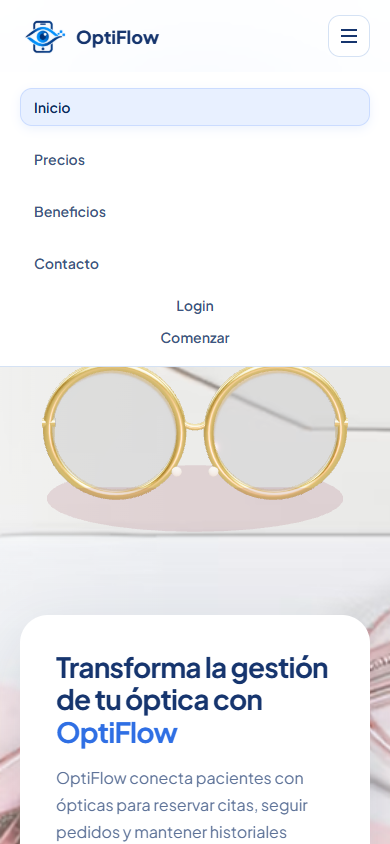


El navegación móvil a Beneficios se presenta en la Figura 113.

<a id="figura-113"></a>

**Figura 113**

*Navegación móvil a Beneficios*

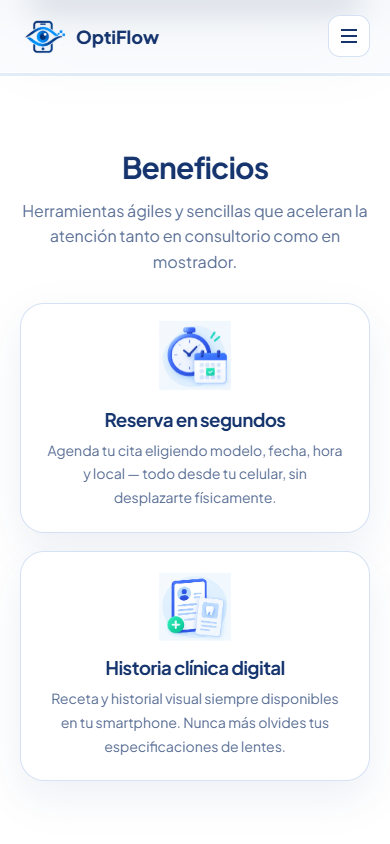


##### Web Services: Swagger UI

Los Web Services se ejecutaron en `http://127.0.0.1:8080` con el perfil local. La documentación OpenAPI se visualizó en [Swagger UI local](http://localhost:8080/swagger-ui/index.html), que permitió ejecutar consultas y solicitudes con datos de demostración. El README de la aplicación también referencia [Swagger del backend desplegado](https://logix-optiflow-back-end.onrender.com/swagger-ui/index.html); las evidencias de esta revisión corresponden al entorno local.

**Vista general de Swagger.** La documentación organiza las operaciones de pacientes, ópticas, disponibilidad y citas dentro de Search & Booking (ver Figura 114).


<a id="figura-114"></a>

**Figura 114**

*Swagger UI de OptiFlow*

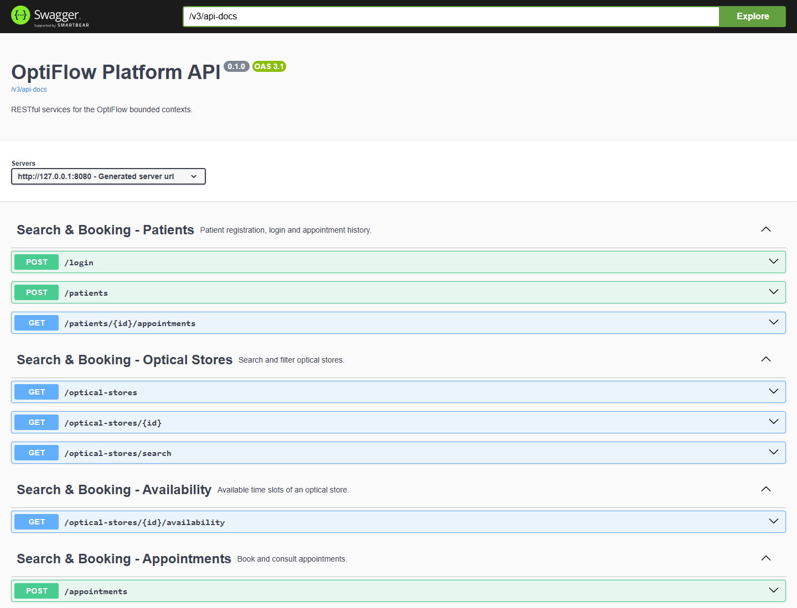


**Consulta de ópticas.** La ejecución de GET /optical-stores devuelve HTTP 200 y la información de las sucursales de Miraflores y San Isidro, incluyendo dirección, teléfono, valoración y estado (ver Figura 115).


<a id="figura-115"></a>

**Figura 115**

*Consulta de ópticas en Swagger*

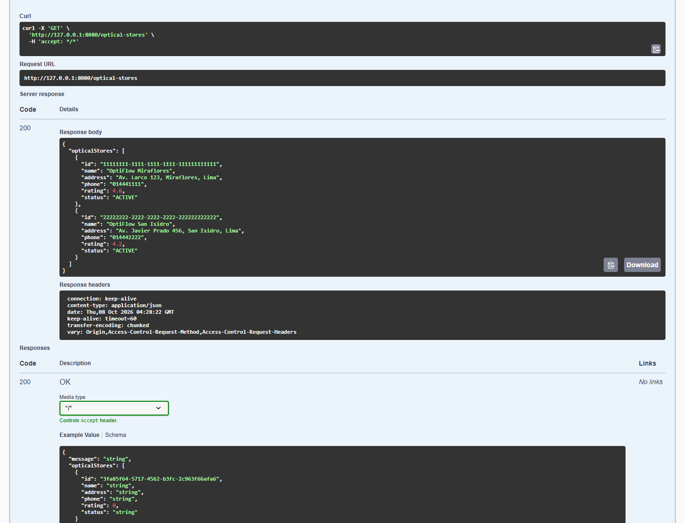


**Reserva confirmada.** POST /appointments registra una cita con datos de prueba y devuelve HTTP 201 con estado CONFIRMED (ver Figura 116).


<a id="figura-116"></a>

**Figura 116**

*Reserva confirmada en Swagger*

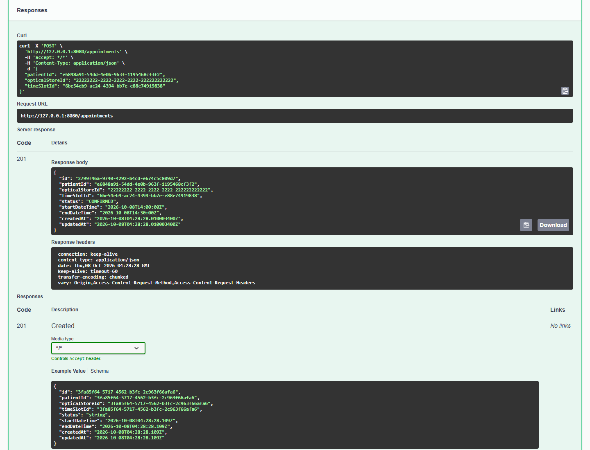


**Prevención de doble reserva.** Al repetir la solicitud sobre el mismo horario, el servicio devuelve HTTP 409 e informa que el horario seleccionado ya no está disponible (ver Figura 117).


<a id="figura-117"></a>

**Figura 117**

*Rechazo de doble reserva en Swagger*

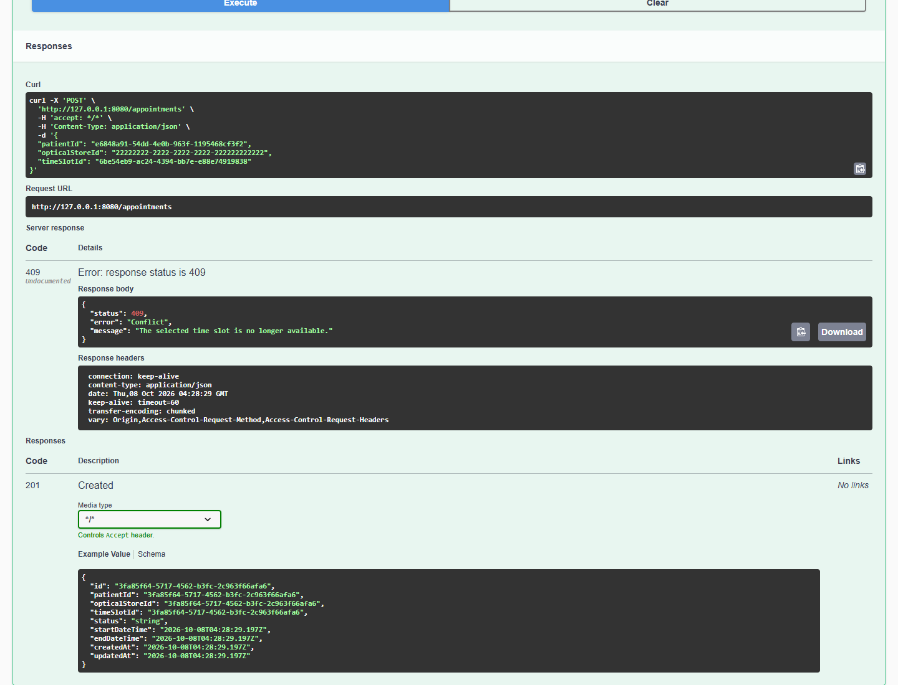


##### Aplicación móvil

La aplicación se compiló desde la rama develop mediante assembleLocalDebug y Gradle finalizó con BUILD SUCCESSFUL. El APK generado se instaló en el emulador Pixel 10 Pro XL. Para conectar la demostración con el backend de la PC se utilizó `adb reverse tcp:8080 tcp:8080` y una URL temporal de compilación `http://127.0.0.1:8080/`, sin modificar el código de producción de la app.

El recorrido utilizó el paciente ficticio Paciente Demo Informe. Tras el inicio de sesión se consultaron las ópticas disponibles, se abrió la sucursal de Miraflores, se solicitaron sus horarios y se confirmó una reserva. Las fechas y horas visibles corresponden a la zona horaria del emulador, configurado en UTC durante esta demostración.

**Acceso del paciente.** Inicio de sesión con una cuenta ficticia del backend local (ver Figura 118).


<a id="figura-118"></a>

**Figura 118**

*Acceso del paciente de demostración*

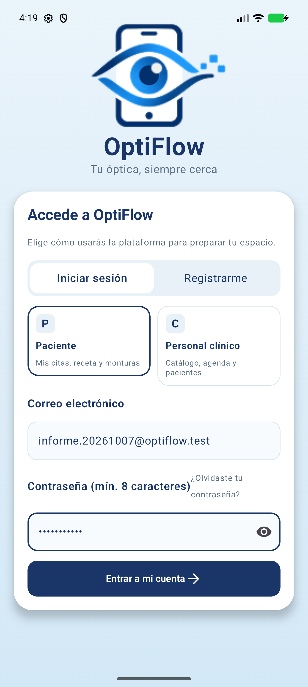


**Búsqueda de ópticas (US05).** La app muestra establecimientos obtenidos del backend, con sus direcciones, teléfonos, valoraciones y controles de búsqueda (ver Figura 119).


<a id="figura-119"></a>

**Figura 119**

*Búsqueda de ópticas en la aplicación*

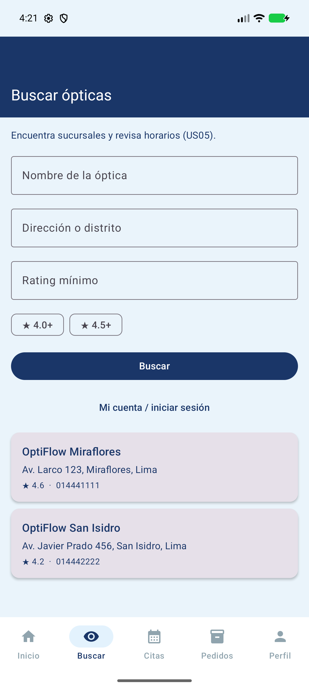


**Disponibilidad de atención.** Se consultan los horarios disponibles de la sucursal de Miraflores antes de solicitar la reserva (ver Figura 120).


<a id="figura-120"></a>

**Figura 120**

*Disponibilidad de horarios en la aplicación*

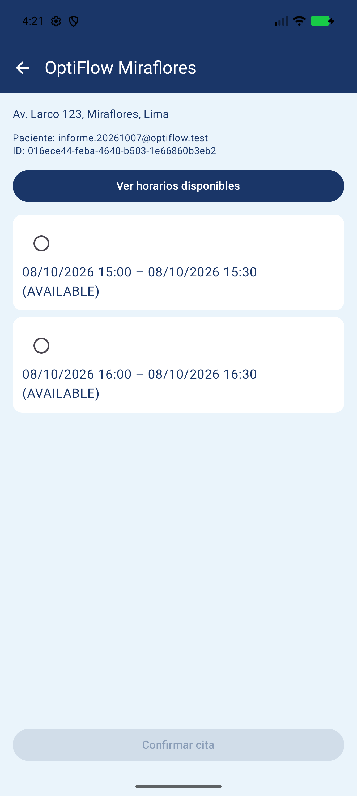


**Reserva confirmada (US06).** La app muestra el identificador de la cita creada y su estado CONFIRMED (ver Figura 121).


<a id="figura-121"></a>

**Figura 121**

*Confirmación de la reserva desde la aplicación*

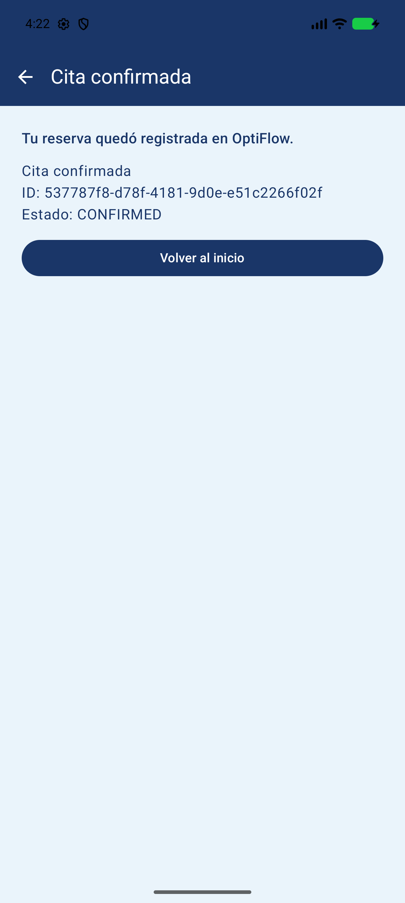


**Verificación de la cita móvil en el backend.** GET /appointments/{id} devuelve HTTP 200 para el mismo identificador mostrado en la app, confirmando que la operación se registró en el backend (ver Figura 122).


<a id="figura-122"></a>

**Figura 122**

*Consulta en Swagger de la cita creada desde la app*

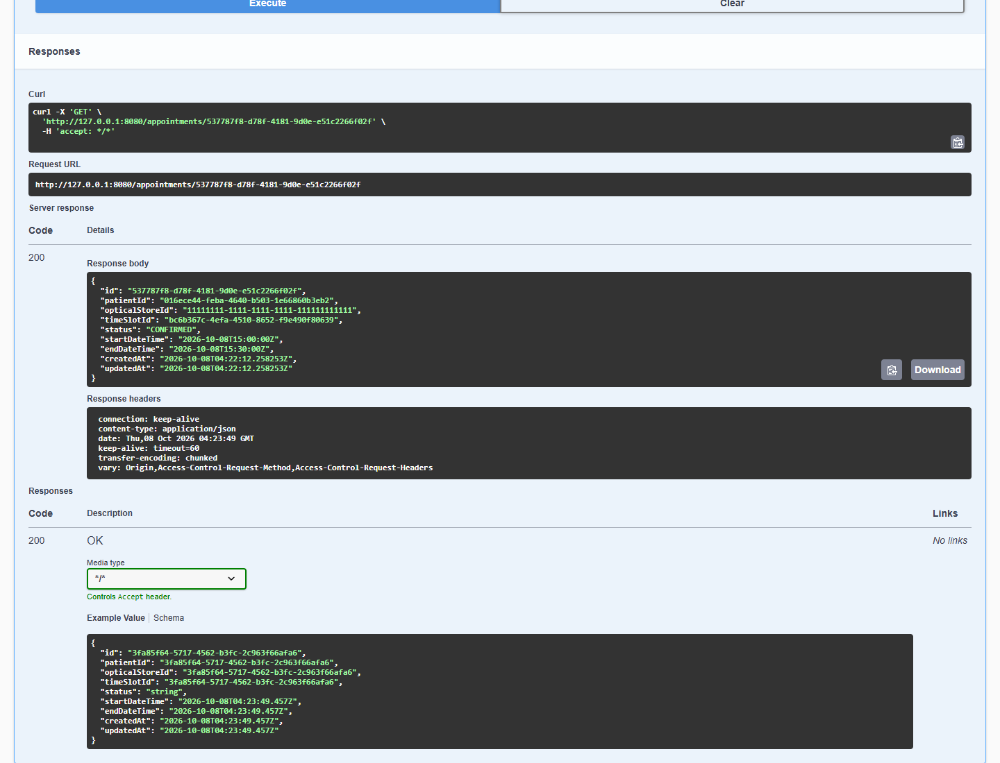


La respuesta de esta consulta se conserva como [evidencia JSON de la reserva móvil](assets/cap4/sprint1/mobile-booking-response.json). El identificador verificado es `537787f8-d78f-4181-9d0e-e51c2266f02f`, con estado CONFIRMED. Al tratarse de una base de demostración en memoria, las capturas y la respuesta adjunta conservan la evidencia de esta ejecución.

#### 4.2.1.7. Services Documentation Evidence for Sprint Review

Los Web Services de **OptiFlow** se documentan mediante **OpenAPI 3.1**. El backend utiliza **Java 21 y Spring Boot**, y **springdoc-openapi** genera la especificación y la interfaz **Swagger UI** a partir de los controladores. La configuración ubicada en `shared/documentation/openapi/configuration` define los datos generales de la API y las etiquetas que agrupan las operaciones por contexto. Esta documentación permite consultar contratos y ejecutar solicitudes para revisar el comportamiento del servicio.

La documentación cubre los tres bounded contexts del **Core Domain** definidos en el Capítulo II: **Search & Booking** (registro e inicio de sesión del paciente, búsqueda de ópticas, disponibilidad y reserva de citas), **Clinical & Commercial** (expediente clínico, receta, cotización y venta) y **Production & Tracking** (órdenes de trabajo y seguimiento del pedido). En total, la versión desplegada expone **37 operaciones**. El contexto de Notification & Loyalty ya cuenta con su dominio, sus manejadores de eventos y su persistencia, pero todavía no expone endpoints REST, por lo que no aparece en Swagger UI. Store Management & Inventory se documentará cuando se implemente.

**Datos generales de la documentación**


Los datos generales de la documentación de los Web Services se resumen en la Tabla 113.

<a id="tabla-113"></a>

**Tabla 113**

*Datos generales de la documentación de los Web Services*


| Elemento | Valor |
| :--- | :--- |
| Repositorio de Web Services | [Logix-OptiFlow-Back-End](https://github.com/BL-App-Movil-1ACC0238-2620-4951/Logix-OptiFlow-Back-End) |
| Documentación desplegada (Swagger UI) | [https://logix-optiflow-back-end.onrender.com/swagger-ui/index.html](https://logix-optiflow-back-end.onrender.com/swagger-ui/index.html) |
| Especificación OpenAPI desplegada (JSON) | [https://logix-optiflow-back-end.onrender.com/v3/api-docs](https://logix-optiflow-back-end.onrender.com/v3/api-docs) |
| Documentación local (Swagger UI) | `http://localhost:8080/swagger-ui/index.html` |
| URL base de la API | `https://logix-optiflow-back-end.onrender.com` (sin prefijo de versión) |
| Formato de intercambio | JSON (`application/json`) |
| Identificadores | UUID en todos los recursos |
| Autenticación | `POST /login` devuelve un token para el paciente. En esta versión los endpoints aún no exigen el token; la protección por roles (US16) se incorporará en un siguiente Sprint. |

Las respuestas siguen los códigos de estado HTTP estándar: `200 OK` (consulta o actualización exitosa), `201 Created` (recurso creado), `400 Bad Request` (datos inválidos o regla de dominio incumplida), `401 Unauthorized` (credenciales inválidas en `/login`), `404 Not Found` (recurso inexistente) y `409 Conflict` (conflicto de negocio, por ejemplo un horario que ya fue reservado). Los errores se devuelven con una estructura uniforme que incluye `status`, `error` y `message`.

##### Search & Booking Context


Los Endpoints del Search & Booking Context se detallan en la Tabla 114.

<a id="tabla-114"></a>

**Tabla 114**

*Endpoints del Search & Booking Context*


| Endpoint | Acción | Verbo HTTP | Sintaxis de llamada | Parámetros | Response (ejemplo y explicación) | User Story |
| :--- | :--- | :---: | :--- | :--- | :--- | :---: |
| `/patients` | Registrar un paciente | POST | `POST /patients` | Body: `name`, `email`, `phone`, `password` (mínimo 8 caracteres) | `201` `{ "id": "dc0315b5-...", "name": "Demo Paciente OptiFlow", "email": "demo.paciente@optiflow.pe", "phone": "999888777" }`: devuelve el paciente creado sin la contraseña. | Soporte a US05 y US06 |
| `/login` | Iniciar sesión del paciente | POST | `POST /login` | Body: `email`, `password` | `200` `{ "token": "...", "patient": { "id": "...", "name": "..." } }`. Si las credenciales no son válidas, responde `401` con el mensaje "The credentials are invalid." | Soporte a US05 y US06 |
| `/optical-stores` | Listar ópticas | GET | `GET /optical-stores?name=Miraflores` | Query (opcionales): `name`, `address` | `200` `{ "opticalStores": [{ "id": "11111111-...", "name": "OptiFlow Miraflores", "address": "Av. Larco 123, Miraflores, Lima", "rating": 4.60, "status": "ACTIVE" }] }` | US05 |
| `/optical-stores/search` | Búsqueda avanzada de ópticas | GET | `GET /optical-stores/search?minRating=4.5` | Query (opcionales): `name`, `address`, `minRating` | `200` lista filtrada y `message` cuando no hay resultados. | US05 |
| `/optical-stores/{id}` | Obtener el detalle de una óptica | GET | `GET /optical-stores/11111111-1111-1111-1111-111111111111` | Path: `id` | `200` datos de la sucursal. | US05 |
| `/optical-stores/{id}/availability` | Consultar horarios disponibles | GET | `GET /optical-stores/{id}/availability` | Path: `id` | `200` `{ "timeSlots": [{ "id": "4bd5f6be-...", "startDateTime": "2026-10-08T14:00:00Z", "endDateTime": "2026-10-08T14:30:00Z", "status": "AVAILABLE" }] }` | US05, US06 |
| `/optical-stores/{id}/ratings` | Calificar una óptica | POST | `POST /optical-stores/{id}/ratings` | Path: `id`. Body: `patientId`, `score` (1 a 5), `comment` | `201` calificación registrada. | US05 |
| `/patients/{id}/favorites` | Guardar una óptica favorita | POST | `POST /patients/{id}/favorites` | Path: `id`. Body: `opticalStoreId` | `201` favorito registrado. | US05 |
| `/appointments` | Reservar una cita | POST | `POST /appointments` | Body: `patientId`, `opticalStoreId`, `timeSlotId` | `201` cita con estado `CONFIRMED`. Si el horario ya fue tomado, responde `409 Conflict`. | US06 |
| `/appointments/{id}` | Consultar una cita | GET | `GET /appointments/{id}` | Path: `id` | `200` detalle de la cita. | US06 |
| `/patients/{id}/appointments` | Listar las citas de un paciente | GET | `GET /patients/{id}/appointments` | Path: `id` | `200` lista de citas del paciente. | US06 |

Ejemplo de interacción, reserva de una cita:

```http
POST /appointments
Content-Type: application/json

{
  "patientId": "016ece44-feba-4640-b503-1e66860b3eb2",
  "opticalStoreId": "11111111-1111-1111-1111-111111111111",
  "timeSlotId": "bc6b367c-4efa-4510-8652-f9e490f80639"
}
```

```json
HTTP/1.1 201 Created
{
  "id": "537787f8-d78f-4181-9d0e-e51c2266f02f",
  "patientId": "016ece44-feba-4640-b503-1e66860b3eb2",
  "opticalStoreId": "11111111-1111-1111-1111-111111111111",
  "timeSlotId": "bc6b367c-4efa-4510-8652-f9e490f80639",
  "status": "CONFIRMED",
  "startDateTime": "2026-10-08T15:00:00Z",
  "endDateTime": "2026-10-08T15:30:00Z"
}
```

La respuesta confirma la creación de la reserva y devuelve su identificador. El ejemplo corresponde a la cita registrada desde la aplicación móvil y contrastada con el backend en la sección 4.2.1.6, lo que permite relacionar la acción del usuario con el recurso persistido.

##### Clinical & Commercial Context


Los Endpoints del Clinical & Commercial Context se presentan en la Tabla 115.

<a id="tabla-115"></a>

**Tabla 115**

*Endpoints del Clinical & Commercial Context*


| Endpoint | Acción | Verbo HTTP | Sintaxis de llamada | Parámetros | Response (ejemplo y explicación) | User Story |
| :--- | :--- | :---: | :--- | :--- | :--- | :---: |
| `/clinical-records` | Registrar la atención clínica | POST | `POST /clinical-records` | Body: `patientId`, `appointmentId`, `examinationDate`, `observations` | `201` expediente clínico creado. | US03 |
| `/clinical-records/{id}` | Consultar un expediente | GET | `GET /clinical-records/{id}` | Path: `id` | `200` expediente con historia clínica y receta. | US04 |
| `/patients/{patientId}/clinical-records` | Consultar el historial clínico del paciente | GET | `GET /patients/{patientId}/clinical-records` | Path: `patientId` | `200` lista de atenciones; lista vacía si no hay registros. | US04 |
| `/clinical-records/{id}/medical-history` | Registrar la historia clínica | PUT | `PUT /clinical-records/{id}/medical-history` | Path: `id`. Body: `allergies[]`, `previousConditions[]`, `familyOcularHistory` | `200` expediente actualizado. | US03 |
| `/clinical-records/{id}/prescription` | Generar la receta óptica | POST | `POST /clinical-records/{id}/prescription` | Path: `id`. Body: `sphereOD`, `cylinderOD`, `axisOD`, `sphereOS`, `cylinderOS`, `axisOS`, `addition`, `treatment`, `recommendedFrameType` | `201` receta generada. | US03 |
| `/clinical-records/{id}/prescription` | Consultar la receta óptica | GET | `GET /clinical-records/{id}/prescription` | Path: `id` | `200` parámetros de la receta. | US04 |
| `/quotations` | Generar una cotización | POST | `POST /quotations` | Body: `clinicalRecordId`, `items[]` (`itemType`, `productSku`, `description`, `unitPrice`, `quantity`) | `201` cotización con subtotales y total calculado. | US08 |
| `/quotations/{id}` | Consultar una cotización | GET | `GET /quotations/{id}` | Path: `id` | `200` detalle de la cotización. | US08 |
| `/quotations/{id}/discount` | Aplicar un descuento o promoción | PATCH | `PATCH /quotations/{id}/discount` | Path: `id`. Body: `type`, `value`, `reason` | `200` cotización con el total recalculado. | US08 |
| `/quotations/{id}/approve` | Aprobar la cotización | PATCH | `PATCH /quotations/{id}/approve` | Path: `id` | `200` cotización aprobada. | US08 |
| `/quotations/{id}/reject` | Rechazar la cotización | PATCH | `PATCH /quotations/{id}/reject` | Path: `id`. Body: `reason` | `200` cotización rechazada. | US08 |
| `/sales` | Registrar una venta | POST | `POST /sales` | Body: `quotationId` | `201` venta asociada a la cotización aprobada. | US17 |
| `/sales/{id}` | Consultar una venta | GET | `GET /sales/{id}` | Path: `id` | `200` detalle de la venta y sus pagos. | US17 |
| `/sales/{id}/payments` | Registrar un pago | POST | `POST /sales/{id}/payments` | Path: `id`. Body: `method`, `amount`, `transactionReference` | `201` venta con el pago registrado. | US17 |
| `/sales/{id}/close` | Cerrar la venta | PATCH | `PATCH /sales/{id}/close` | Path: `id` | `200` venta cerrada y comprobante generado. | US17 |

Ejemplo de interacción, generación de una cotización:

```http
POST /quotations
Content-Type: application/json

{
  "clinicalRecordId": "<id del expediente clínico>",
  "items": [
    { "itemType": "FRAME", "productSku": "RB-5154-51-21", "description": "Montura Ray-Ban Clubmaster", "unitPrice": 320.00, "quantity": 1 },
    { "itemType": "LENS", "description": "Lunas monofocales con antirreflejo", "unitPrice": 169.00, "quantity": 1 }
  ]
}
```

La respuesta devuelve la cotización con el subtotal de cada ítem y el total calculado por el dominio. El asesor puede aplicar un descuento antes de que el paciente la apruebe y, una vez aprobada, registrar la venta.

##### Production & Tracking Context


Los Endpoints del Production & Tracking Context se resumen en la Tabla 116.

<a id="tabla-116"></a>

**Tabla 116**

*Endpoints del Production & Tracking Context*


| Endpoint | Acción | Verbo HTTP | Sintaxis de llamada | Parámetros | Response (ejemplo y explicación) | User Story |
| :--- | :--- | :---: | :--- | :--- | :--- | :---: |
| `/work-orders` | Listar órdenes de trabajo para el tablero Kanban | GET | `GET /work-orders?status=IN_WORKSHOP` | Query (opcionales): `status`, `technicianId`, `opticalStoreId` | `200` lista de órdenes con estado y fecha estimada. | US10 |
| `/work-orders` | Generar una orden de trabajo | POST | `POST /work-orders` | Body: `saleId` | `201` orden creada en estado `PENDING`. | US10 |
| `/work-orders/{id}` | Obtener una orden de trabajo | GET | `GET /work-orders/{id}` | Path: `id` | `200` detalle técnico e historial de estados. | US10, US11 |
| `/patients/{patientId}/work-orders` | Consultar los pedidos de un paciente | GET | `GET /patients/{patientId}/work-orders` | Path: `patientId` | `200` pedidos del paciente con su estado actual. | US11 |
| `/work-orders/{id}/technician` | Asignar un técnico | PATCH | `PATCH /work-orders/{id}/technician` | Path: `id`. Body: `technicianId` | `200` orden con técnico asignado. | US10 |
| `/work-orders/{id}/laboratory` | Enviar a laboratorio | PATCH | `PATCH /work-orders/{id}/laboratory` | Path: `id`. Body: `laboratoryId` | `200` orden enviada al laboratorio. | US10 |
| `/work-orders/{id}/status` | Actualizar el estado | PATCH | `PATCH /work-orders/{id}/status` | Path: `id`. Body: `status` (`PENDING`, `IN_WORKSHOP`, `QUALITY_CONTROL`, `READY_FOR_DELIVERY`, `DELIVERED`) | `200` orden con el nuevo estado y su registro en el historial. | US10, US11 |
| `/work-orders/{id}/lenses/complete` | Marcar lentes terminados | PATCH | `PATCH /work-orders/{id}/lenses/complete` | Path: `id`. Body: `lensIds[]` | `200` orden con los lentes completados. | US10 |
| `/work-orders/{id}/delays` | Notificar un retraso | POST | `POST /work-orders/{id}/delays` | Path: `id`. Body: `reason`, `newEstimatedDeliveryDate` | `201` retraso registrado con la nueva fecha estimada. | US11, US12 |
| `/work-orders/{id}/deliver` | Marcar el pedido como entregado | PATCH | `PATCH /work-orders/{id}/deliver` | Path: `id` | `200` orden en estado `DELIVERED`. | US11 |
| `/technicians` | Listar técnicos | GET | `GET /technicians` | — | `200` `[{ "id": "33333333-...", "name": "Jorge Salas" }, { "id": "44444444-...", "name": "María Quispe" }]` | US10 |
| `/laboratories` | Listar laboratorios | GET | `GET /laboratories` | — | `200` laboratorios disponibles para enviar órdenes. | US10 |

##### Evidencia de interacción con la documentación desplegada

Las capturas del 2026-10-08 registran la documentación publicada en Render. Se presentan primero las operaciones agrupadas por contexto y, después, las respuestas de consultas ejecutadas sobre datos de demostración. Estas evidencias muestran la disponibilidad de la documentación y el resultado de las operaciones consultadas; la cobertura automatizada se detalla en la sección 4.2.1.5.

**Endpoints de Search & Booking: pacientes y ópticas.** Swagger UI desplegado en Render con las operaciones de registro, inicio de sesión, citas del paciente y búsqueda de ópticas (ver Figura 123).


<a id="figura-123"></a>

**Figura 123**

*Endpoints de pacientes y ópticas en Swagger*

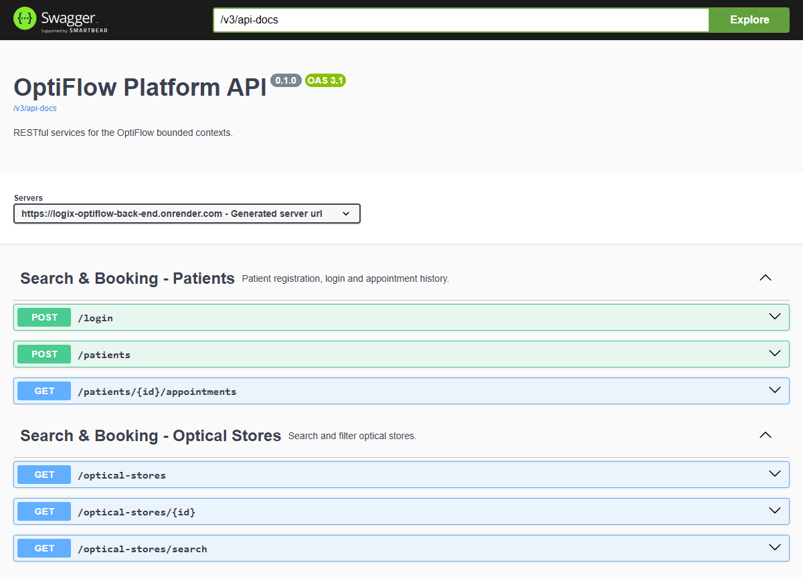


**Endpoints de Search & Booking**: Disponibilidad, citas, favoritos y calificaciones (ver Figura 124).


<a id="figura-124"></a>

**Figura 124**

*Endpoints de disponibilidad y citas en Swagger*

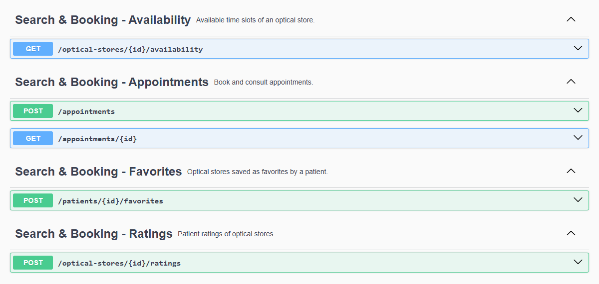


**Endpoints de Clinical & Commercial.** Operaciones de expediente clínico, receta, cotizaciones y ventas (ver Figura 125).


<a id="figura-125"></a>

**Figura 125**

*Endpoints de Clinical & Commercial en Swagger*

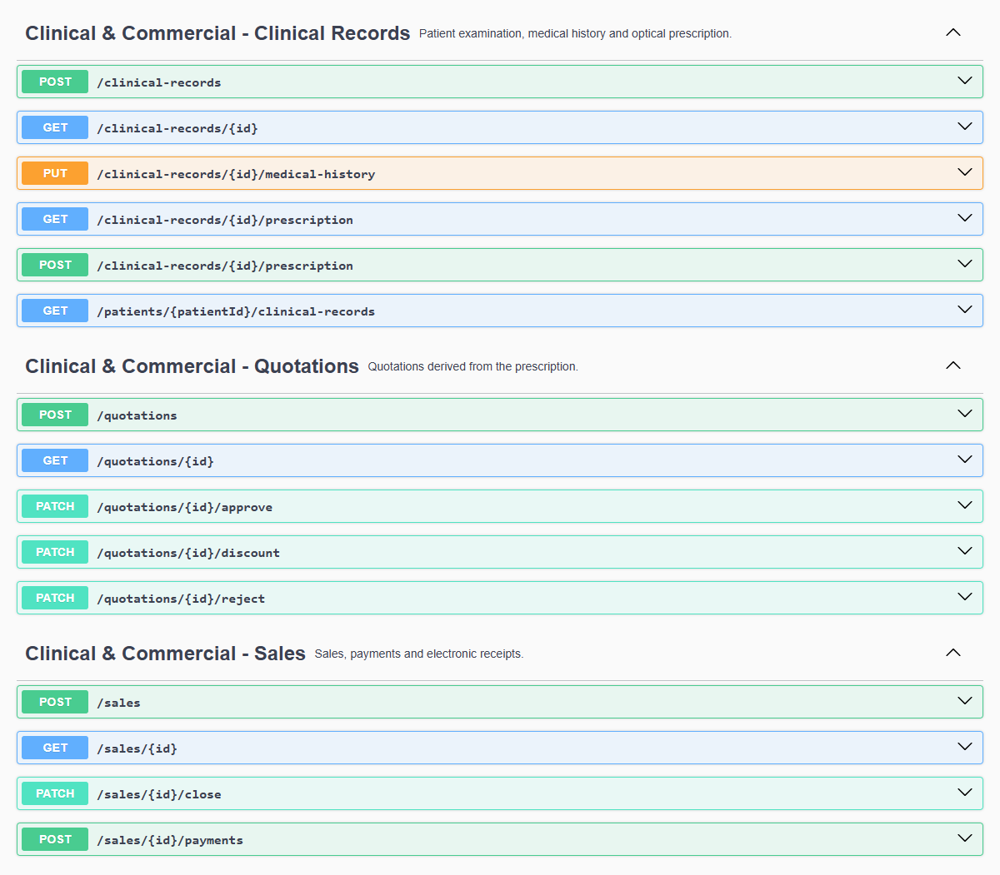


**Endpoints de Production & Tracking.** Operaciones de órdenes de trabajo, técnicos y laboratorios (ver Figura 126).


<a id="figura-126"></a>

**Figura 126**

*Endpoints de Production & Tracking en Swagger*

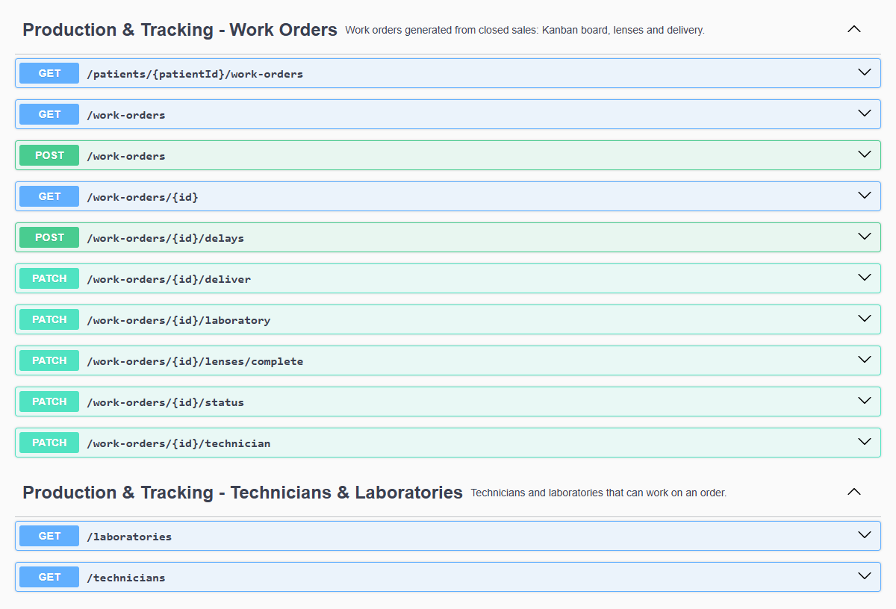


**Consulta de ópticas en el entorno desplegado.** GET /optical-stores devuelve HTTP 200 con las sucursales de Miraflores y San Isidro (ver Figura 127).


<a id="figura-127"></a>

**Figura 127**

*Consulta de ópticas en Render*

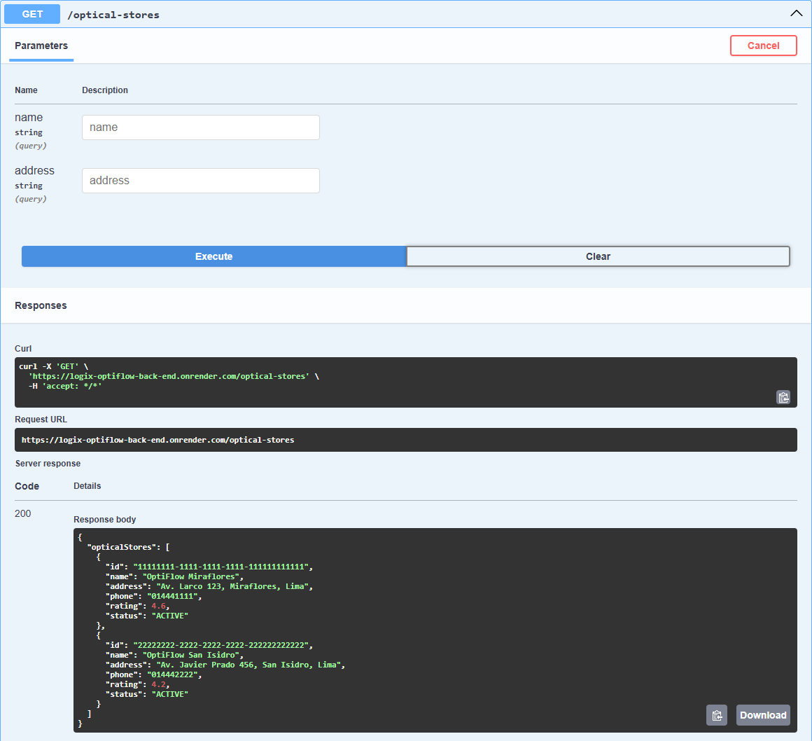


**Consulta de disponibilidad.** GET /optical-stores/{id}/availability devuelve HTTP 200 con los horarios disponibles de la sucursal de Miraflores (ver Figura 128).


<a id="figura-128"></a>

**Figura 128**

*Disponibilidad de horarios en Render*

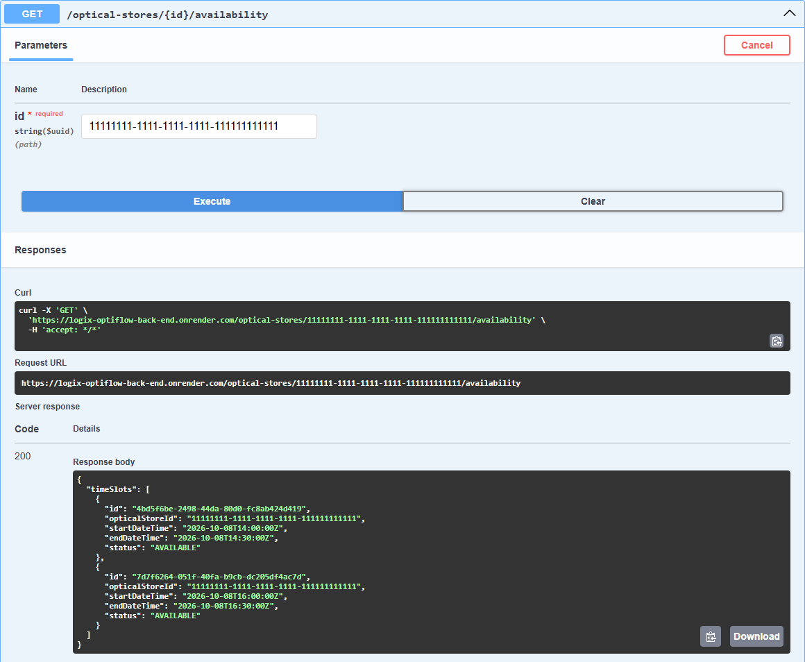


**Consulta de técnicos de Production & Tracking.** GET /technicians devuelve HTTP 200 con los técnicos registrados para asignar órdenes de trabajo (ver Figura 129).


<a id="figura-129"></a>

**Figura 129**

*Técnicos en Swagger desplegado*

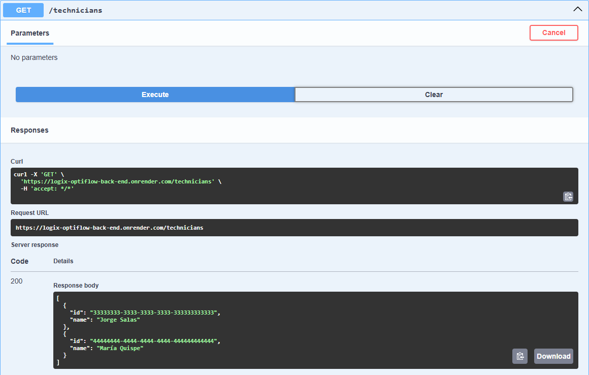


##### Commits relacionados con la documentación

Los commits del repositorio de Web Services que incorporan o modifican la documentación OpenAPI durante el Sprint 1 se detallan en la Tabla 117.

<a id="tabla-117"></a>

**Tabla 117**

*Commits relacionados con la documentación de los Web Services*

| Repository | Branch | Commit Id | Commit Message | Cambio en la documentación | Committed on (Date) |
|---|---|---|---|---|---|
| `Logix-OptiFlow-Back-End` | `develop` | [543aaf2](https://github.com/BL-App-Movil-1ACC0238-2620-4951/Logix-OptiFlow-Back-End/commit/543aaf2cb3c2f0638b88ea7e9203afe313d9883d) | `Add OptiFlow booking backend` | Agrega la dependencia springdoc-openapi y configura las rutas de Swagger UI y de la especificación OpenAPI. | 2026-10-06 |
| `Logix-OptiFlow-Back-End` | `develop` | [d2dc08b](https://github.com/BL-App-Movil-1ACC0238-2620-4951/Logix-OptiFlow-Back-End/commit/d2dc08b5fbe325ebf7523b7bc469f3e042289e2b) | `refactor: reorganize packages` | Crea la clase `OpenApiConfiguration` en el paquete `shared/documentation/openapi`. | 2026-10-07 |
| `Logix-OptiFlow-Back-End` | `develop` | [8a62f6e](https://github.com/BL-App-Movil-1ACC0238-2620-4951/Logix-OptiFlow-Back-End/commit/8a62f6ec5cd2ab5651f5f8de46afef8d76542f8c) | `docs: group swagger endpoints` | Agrupa los endpoints por bounded context con `OpenApiTags` y la anotación `@Tag` en los controladores. | 2026-10-07 |
| `Logix-OptiFlow-Back-End` | `develop` | [c00cb77](https://github.com/BL-App-Movil-1ACC0238-2620-4951/Logix-OptiFlow-Back-End/commit/c00cb774d340ffb2f1eeab2f625a573cde5a600f) | `feat: add production endpoints` | Agrega a Swagger UI los grupos de órdenes de trabajo y de técnicos y laboratorios de Production & Tracking. | 2026-10-07 |

#### 4.2.1.8. Software Deployment Evidence for Sprint Review

La evidencia de despliegue del Sprint 1 comprende la **Landing Page en GitHub Pages**, los **Web Services en Render mediante Docker** y la distribución de la **aplicación móvil mediante Firebase App Distribution**. Cada producto tiene un mecanismo de publicación distinto. La sección identifica los entornos utilizados y debe interpretarse junto con las evidencias de ejecución y pruebas, sin equiparar la publicación con la validación de todas las funciones del producto (ver Tabla 118).


<a id="tabla-118"></a>

**Tabla 118**

*Productos desplegados en el Sprint 1*


| Producto | Plataforma | URL |
| :--- | :--- | :--- |
| Landing Page | GitHub Pages | [https://bl-app-movil-1acc0238-2620-4951.github.io/Logix-OptiFlow-lading-page/](https://bl-app-movil-1acc0238-2620-4951.github.io/Logix-OptiFlow-lading-page/) |
| Web Services | Render (Docker) | [https://logix-optiflow-back-end.onrender.com/swagger-ui/index.html](https://logix-optiflow-back-end.onrender.com/swagger-ui/index.html) |
| Aplicación móvil | Firebase App Distribution | [https://appdistribution.firebase.dev/i/69aa930a1cd1ad63](https://appdistribution.firebase.dev/i/69aa930a1cd1ad63) |

##### Landing Page

El código de la Landing Page se encuentra en el repositorio [Logix-OptiFlow-lading-page](https://github.com/BL-App-Movil-1ACC0238-2620-4951/Logix-OptiFlow-lading-page). GitHub Pages se eligió porque aloja sitios estáticos sin costo y publica automáticamente los cambios integrados en la rama configurada.

**Paso 1: Acceso a la configuración del repositorio.**

Desde el repositorio de la Landing Page en la organización de GitHub se ingresó a la pestaña **Settings** y luego a la sección **Pages**.

**Paso 2: Configuración de la fuente de publicación.**

Se seleccionó *Deploy from a branch* como fuente, la rama `main` y la carpeta raíz (`/root`). Con esta configuración GitHub Pages publica el sitio en la URL de la organización y fuerza el uso de HTTPS (ver Figura 130).


<a id="figura-130"></a>

**Figura 130**

*Configuración de GitHub Pages del repositorio de la Landing Page*

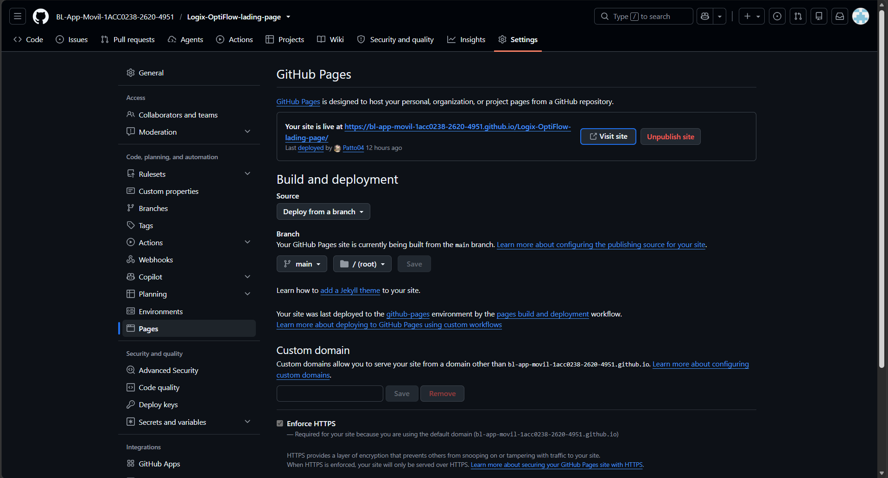

**Paso 3: Verificación del workflow de despliegue.**

Cada integración en `main` ejecuta el workflow `pages build and deployment`. La ejecución #10, lanzada por `Patto04` con el commit `54caeae`, terminó con estado *Success* en 45 segundos tras completar los jobs `build`, `report-build-status` y `deploy` (ver Figura 131).


<a id="figura-131"></a>

**Figura 131**

*Ejecución del workflow pages build and deployment*

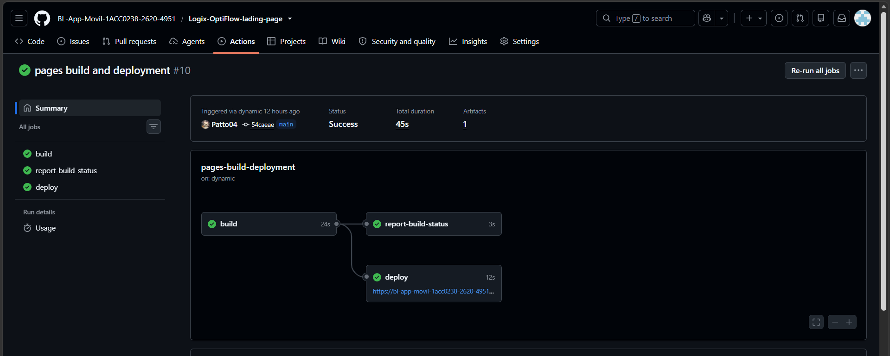

**Paso 4: Verificación del sitio publicado.**

Se ingresó a la URL pública generada por GitHub Pages y se comprobó que la Landing Page carga correctamente (ver Figura 132).


<a id="figura-132"></a>

**Figura 132**

*Landing Page publicada en GitHub Pages*

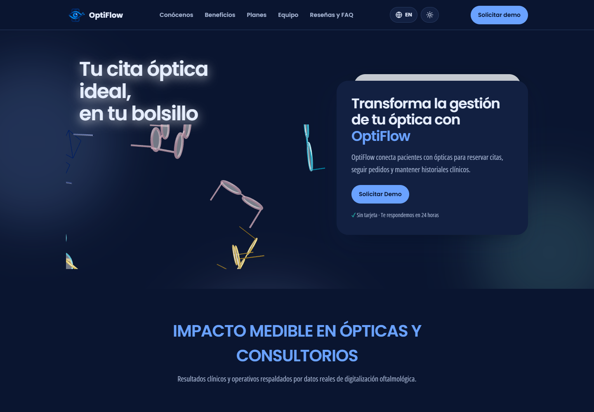

##### Web Services

El código del backend se encuentra en el repositorio [Logix-OptiFlow-Back-End](https://github.com/BL-App-Movil-1ACC0238-2620-4951/Logix-OptiFlow-Back-End). El servicio se desplegó en **Render** a partir del `Dockerfile` del repositorio, junto con una base de datos **PostgreSQL 16** administrada por la misma plataforma.

**Paso 1: Creación del proyecto y sus recursos.**

En Render se creó el proyecto **OptiFlow-Back-end** con un entorno *Production* que agrupa dos recursos en la región Frankfurt: el Web Service `Logix-OptiFlow-Back-End`, con runtime Docker, y la base de datos `Postgres Backend`, con PostgreSQL 16 (ver Figura 133).


<a id="figura-133"></a>

**Figura 133**

*Recursos del proyecto OptiFlow-Back-end en Render*

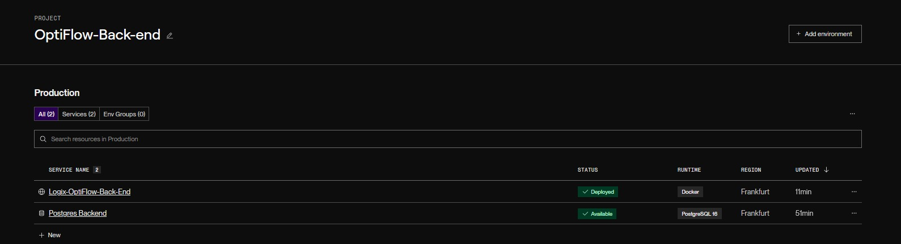

**Paso 2: Configuración del build con Docker.**

El Web Service se vinculó al repositorio del backend y a la rama `develop`. El `Dockerfile` usa una construcción en dos etapas: compila el proyecto con Maven y luego ejecuta el JAR generado sobre una imagen con Java 21, exponiendo el puerto 8080.

```dockerfile
FROM maven:3.9.11-eclipse-temurin-21 AS build
WORKDIR /app
COPY pom.xml .
COPY src ./src
RUN mvn -q -DskipTests package

FROM eclipse-temurin:21-jre
WORKDIR /app
COPY --from=build /app/target/optiflow-platform-0.1.0.jar app.jar
EXPOSE 8080
ENTRYPOINT ["java", "-jar", "app.jar"]
```

**Paso 3: Conexión con la base de datos.**

El backend define dos perfiles de Spring: `local`, con base de datos H2 en memoria, y `postgres`, que lee la conexión desde `SPRING_DATASOURCE_URL`, `SPRING_DATASOURCE_USERNAME` y `SPRING_DATASOURCE_PASSWORD` y aplica las migraciones de Flyway. Estos valores se registran como variables de entorno del servicio en Render y no se incluyen en el repositorio.

**Paso 4: Verificación del despliegue.**

Render vuelve a desplegar el servicio cada vez que se actualiza `develop`. El último despliegue corresponde al commit `6c388bc` y se encuentra en estado *Live* en [https://logix-optiflow-back-end.onrender.com](https://logix-optiflow-back-end.onrender.com). Como el servicio utiliza el plan gratuito, se suspende tras un periodo sin tráfico y la primera solicitud posterior puede demorar alrededor de un minuto. Swagger UI responde en la URL pública con los endpoints de los tres bounded contexts (ver sección 4.2.1.7) (ver Figura 134).


<a id="figura-134"></a>

**Figura 134**

*Web Service en estado Live y su historial de despliegues*

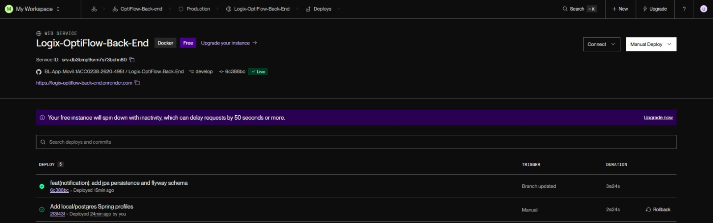

##### Aplicación móvil

La aplicación móvil se desarrolla en **Kotlin con Jetpack Compose** en el repositorio [Logix-OptiFlow-Movile](https://github.com/BL-App-Movil-1ACC0238-2620-4951/Logix-OptiFlow-Movile) y se distribuyó mediante **Firebase App Distribution** para que los evaluadores puedan instalarla en sus dispositivos Android. La variante `prodDebug` consume los Web Services desplegados en Render.

**Paso 1: Creación del proyecto en Firebase.**

Se creó el proyecto **Optiflow** en la consola de Firebase, con el plan Spark sin costo (ver Figura 135).


<a id="figura-135"></a>

**Figura 135**

*Proyecto Optiflow en la consola de Firebase*

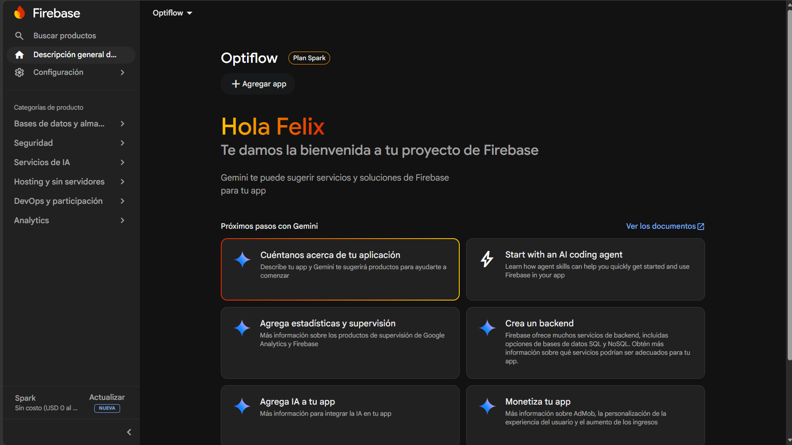

**Paso 2: Registro de la aplicación Android.**

Se registró la aplicación Android dentro del proyecto con los siguientes datos:

```
Alias de la aplicación: OptiFlow
Nombre del paquete: com.logix.optiflow
```


El aplicación Android registrada en Firebase se muestra en la Figura 136.

<a id="figura-136"></a>

**Figura 136**

*Aplicación Android registrada en Firebase*

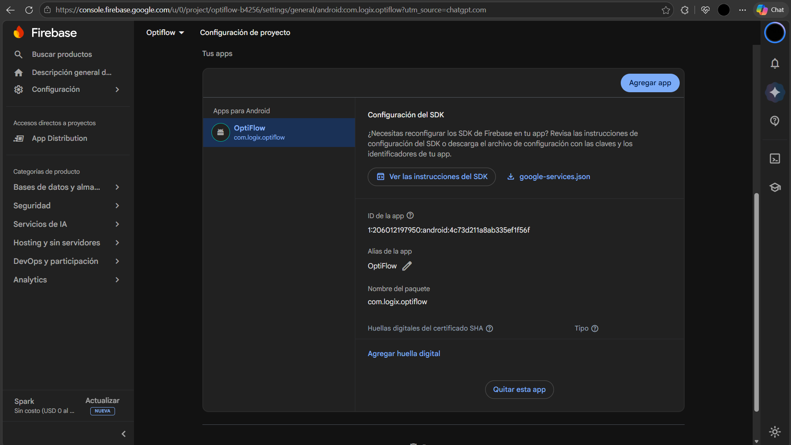

**Paso 3: Generación del APK desde Android Studio.**

En Android Studio se seleccionó la variante `prodDebug` en **Build Variants** y se generó el APK desde el menú **Build → Generate App Bundles or APKs → Generate APKs** (ver Figura 137).


<a id="figura-137"></a>

**Figura 137**

*Variante prodDebug seleccionada en Build Variants*

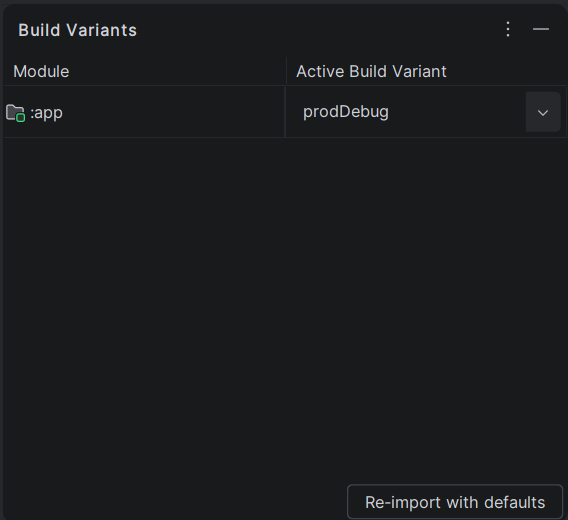


La generación del APK en Android Studio se presenta en la Figura 138.

<a id="figura-138"></a>

**Figura 138**

*Generación del APK en Android Studio*

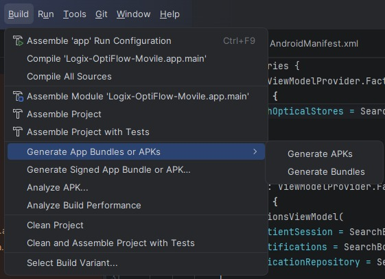

**Paso 4: Ubicación del APK generado.**

El archivo generado se ubicó en la siguiente ruta del proyecto:

```
app/build/outputs/apk/prod/debug/app-prod-debug.apk
```


El APK generado en la carpeta de salida del proyecto se observa en la Figura 139.

<a id="figura-139"></a>

**Figura 139**

*APK generado en la carpeta de salida del proyecto*

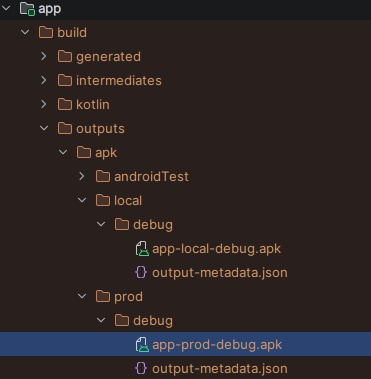

**Paso 5: Carga del APK en Firebase App Distribution.**

Se ingresó al módulo **App Distribution** y se cargó el APK, que se registró como la versión **1.0 (1)** (ver Figura 140).


<a id="figura-140"></a>

**Figura 140**

*Versión 1.0 (1) cargada en Firebase App Distribution*

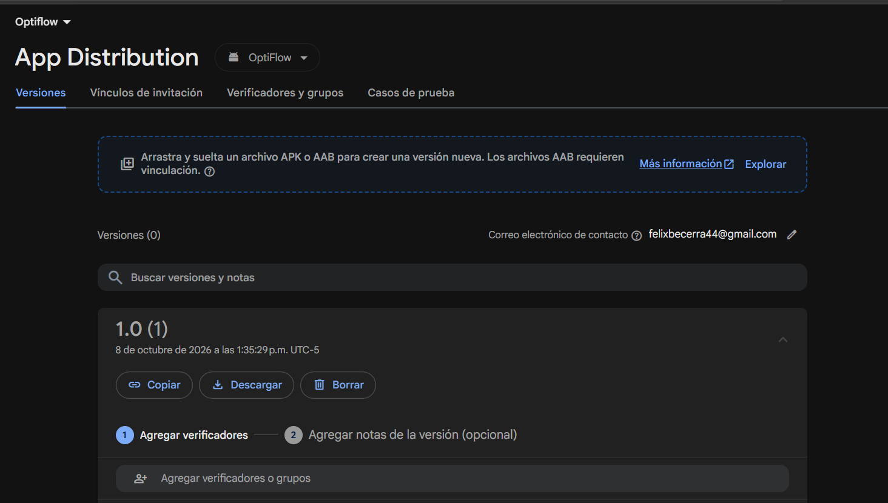

**Paso 6: Registro de evaluadores.**

Se creó el grupo `optiflow-testers` con seis evaluadores y se le distribuyó la versión 1.0 (1) con la nota "Sprint 1 – versión inicial de OptiFlow" (ver Figura 141).


<a id="figura-141"></a>

**Figura 141**

*Grupo de evaluadores optiflow-testers*

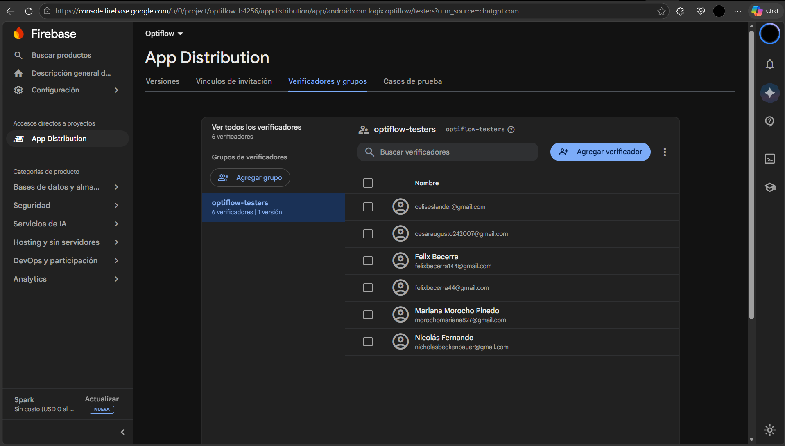

**Paso 7: Creación del vínculo de invitación.**

Se generó un vínculo de invitación asociado al grupo `optiflow-testers`. Cualquier persona que lo abra desde un dispositivo Android puede iniciar sesión con su cuenta de Google, unirse al grupo y descargar la aplicación: [https://appdistribution.firebase.dev/i/69aa930a1cd1ad63](https://appdistribution.firebase.dev/i/69aa930a1cd1ad63) (ver Figura 142).


<a id="figura-142"></a>

**Figura 142**

*Vínculo de invitación de Firebase App Distribution*

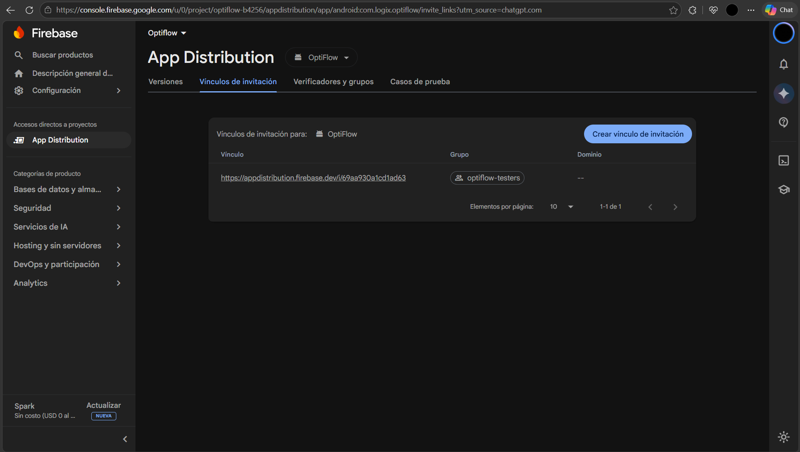

**Paso 8: Instalación en un dispositivo.**

Desde un dispositivo Android se abrió el vínculo de invitación y se instaló la versión 1.0 (1) mediante Firebase App Tester (ver Figura 143).


<a id="figura-143"></a>

**Figura 143**

*Versión 1.0 (1) instalada desde Firebase App Tester*

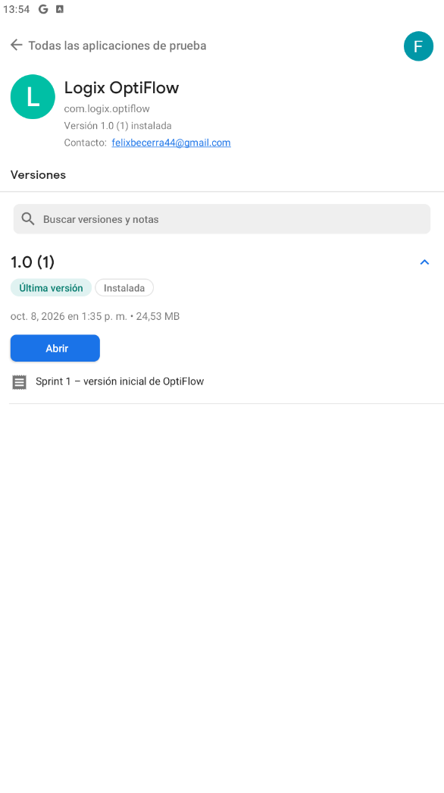

**Paso 9: Verificación de la aplicación contra el backend desplegado.**

Se comprobó que la aplicación instalada se comunica con el backend desplegado en Render: el registro e inicio de sesión del paciente, la búsqueda de ópticas y la consulta de disponibilidad devolvieron los mismos datos que Swagger UI (ver Figura 144).


<a id="figura-144"></a>

**Figura 144**

*Pantalla de inicio del paciente en el dispositivo*

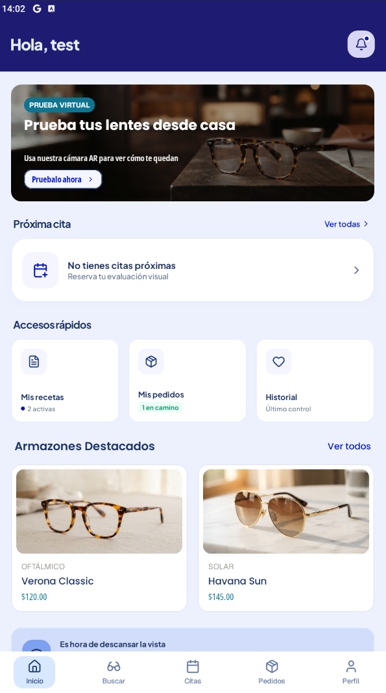


El inicio de sesión del paciente contra el backend desplegado se muestra en la Figura 145.

<a id="figura-145"></a>

**Figura 145**

*Inicio de sesión del paciente contra el backend desplegado*

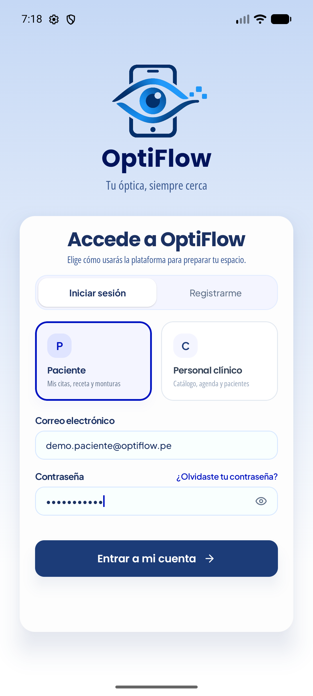


La búsqueda de ópticas obtenida de Render se presenta en la Figura 146.

<a id="figura-146"></a>

**Figura 146**

*Búsqueda de ópticas obtenida de Render*

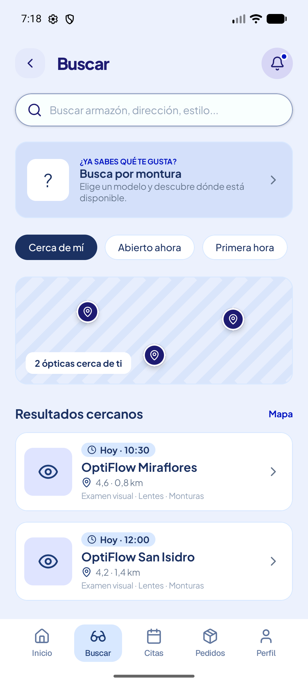


La disponibilidad de horarios obtenida de Render se observa en la Figura 147.

<a id="figura-147"></a>

**Figura 147**

*Disponibilidad de horarios obtenida de Render*

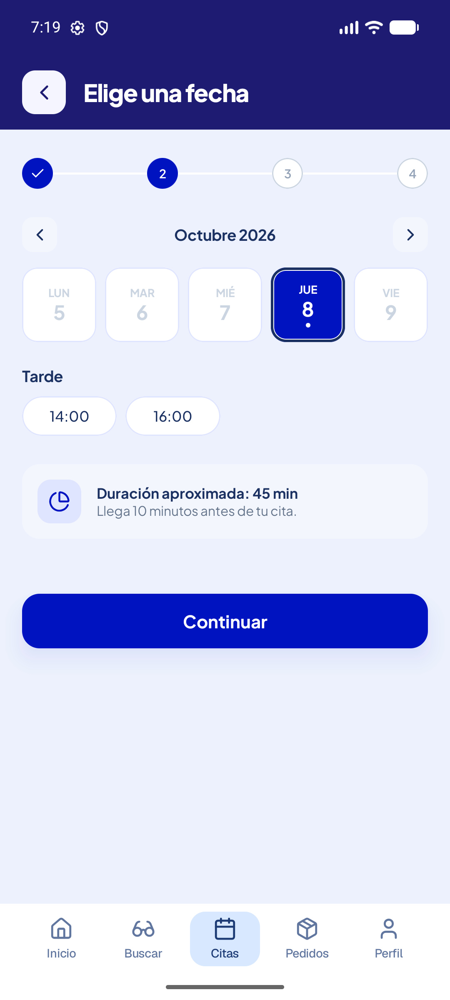

Los horarios de 14:00 y 16:00 coinciden con la respuesta de `GET /optical-stores/{id}/availability` de la [Figura 128](#figura-128).

#### 4.2.1.9. Team Collaboration Insights during Sprint

Durante el Sprint 1, las tareas de implementación de la Landing Page, los Web Services y la aplicación móvil se distribuyeron entre los integrantes según la matriz de líderes y colaboradores de la sección 4.2.1.2. El trabajo siguió **GitFlow** y **Conventional Commits**: cada integrante trabajó en ramas `feature/*` creadas desde `develop` y los cambios se integraron mediante *pull requests*. En la Landing Page, la publicación se realiza desde `main`, que dispara el workflow de GitHub Pages (ver Tabla 119).


<a id="tabla-119"></a>

**Tabla 119**

*Integrantes del equipo y sus usuarios de GitHub*


| Integrante | Usuario de GitHub | Autor en el historial de commits |
| :--- | :--- | :--- |
| Atoche Gonzales, Nicolas Fernando | `THECOMAX` | Fernando N. / Nicolas-Ato |
| Becerra Ttito, Felix Orlando | `Felixb14` | Felixb14 |
| Celis Berrospi, Eslander | `Eslander-Celis` | Eslander-Celis |
| Morocho Pinedo, Mariana | `Patto04` | Patto04 |
| Quispe Llacsahuanga, César Augusto | `user20-bit` | Cesar Augusto |

Las siguientes figuras muestran la actividad de cada repositorio según **GitHub Insights**, consultada el 2026-10-08. La sección *Contributors* cuenta los commits de cada integrante en la rama principal de trabajo, sin incluir los commits de *merge*, y la sección *Commits* muestra la cantidad de commits por semana. La mayor parte de la actividad se concentra en las semanas del 28 de septiembre y del 5 de octubre de 2026, que corresponden al Sprint 1.

##### Landing Page

En la rama `main` del repositorio de la Landing Page se registran contribuciones de los cinco integrantes: `Patto04` (8 commits), `user20-bit` (3), `Felixb14` (3), `Eslander-Celis` (3) y `THECOMAX` (2) (ver Figura 148).


<a id="figura-148"></a>

**Figura 148**

*Contribuidores del repositorio de la Landing Page*

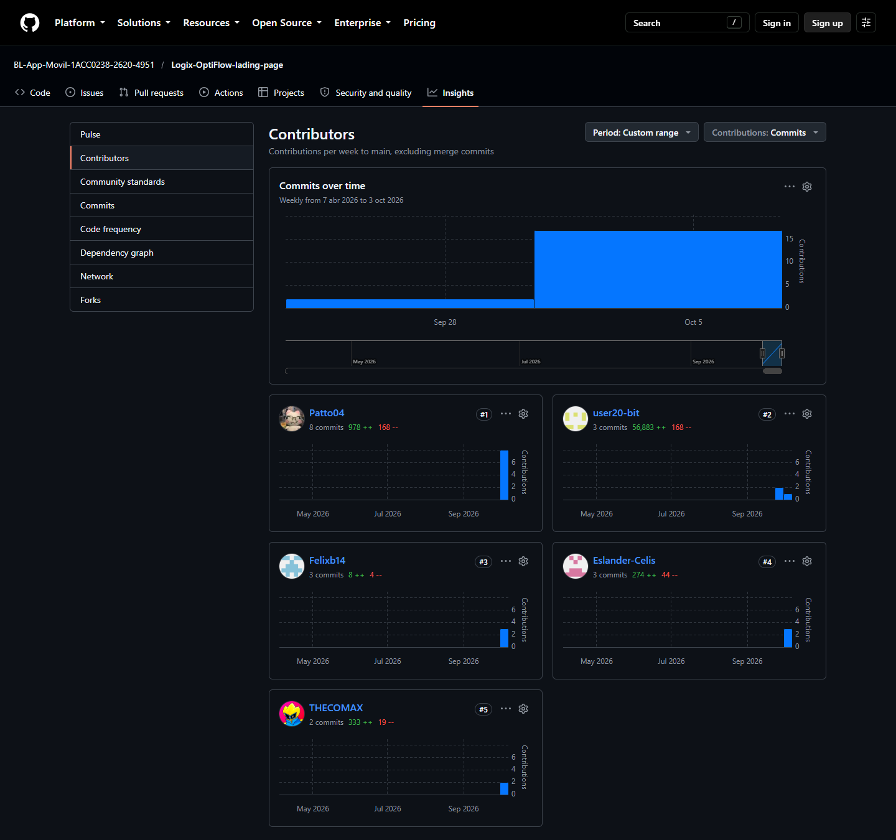


Los commits por semana del repositorio de la Landing Page se muestran en la Figura 149.

<a id="figura-149"></a>

**Figura 149**

*Commits por semana del repositorio de la Landing Page*

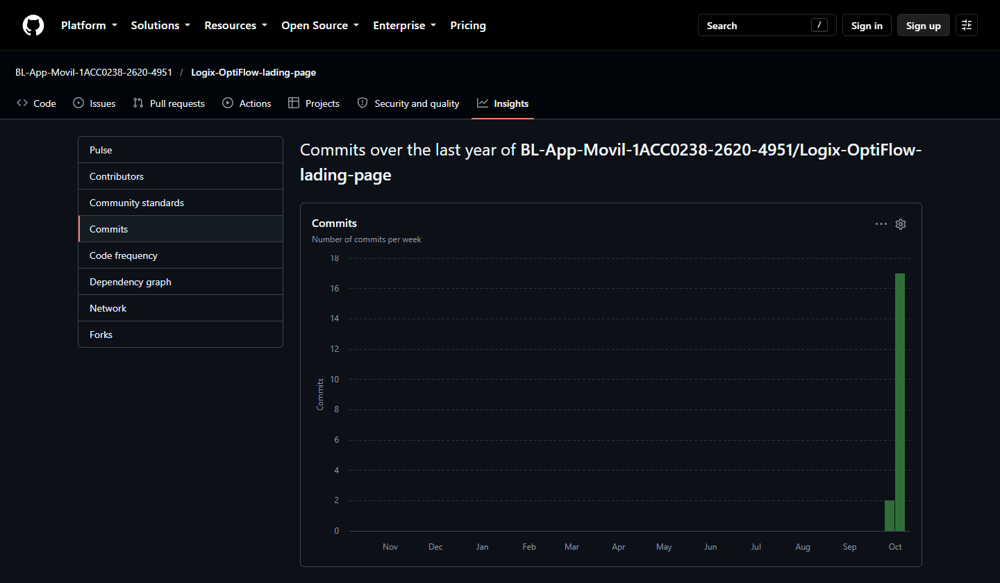

##### Web Services

En la rama `develop` del backend se registran 14 commits de `Felixb14`, 5 de `user20-bit` y 3 de `Eslander-Celis`, correspondientes a la implementación de los bounded contexts, los perfiles de base de datos y la configuración del despliegue (ver Figura 150).


<a id="figura-150"></a>

**Figura 150**

*Contribuidores del repositorio de los Web Services*

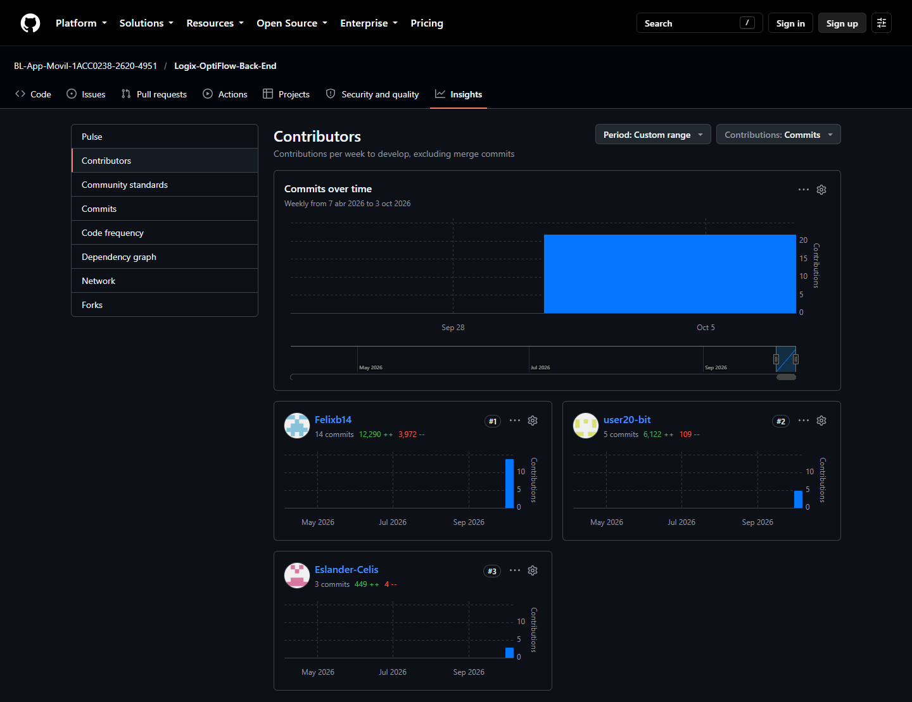


Los commits por semana del repositorio de los Web Services se presentan en la Figura 151.

<a id="figura-151"></a>

**Figura 151**

*Commits por semana del repositorio de los Web Services*

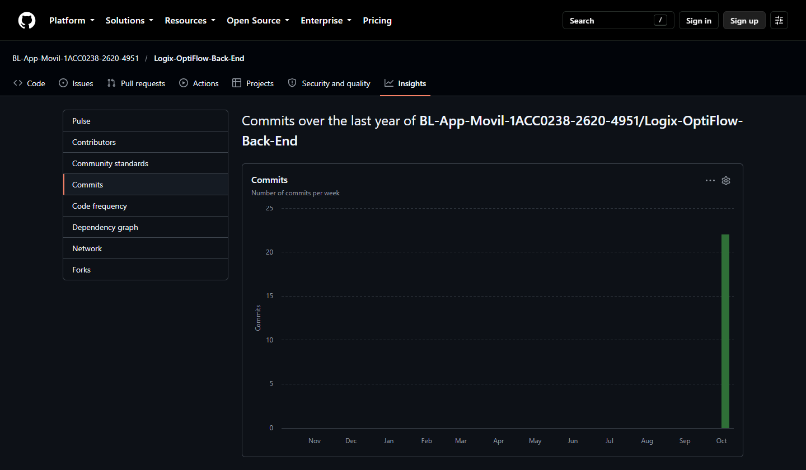

##### Aplicación móvil

En la rama `develop` de la aplicación móvil se registran 15 commits de `user20-bit` y 5 de `Felixb14`, correspondientes a la estructura base del proyecto, la integración con los Web Services y las pantallas de los roles de paciente y personal clínico (ver Figura 152).


<a id="figura-152"></a>

**Figura 152**

*Contribuidores del repositorio de la aplicación móvil*

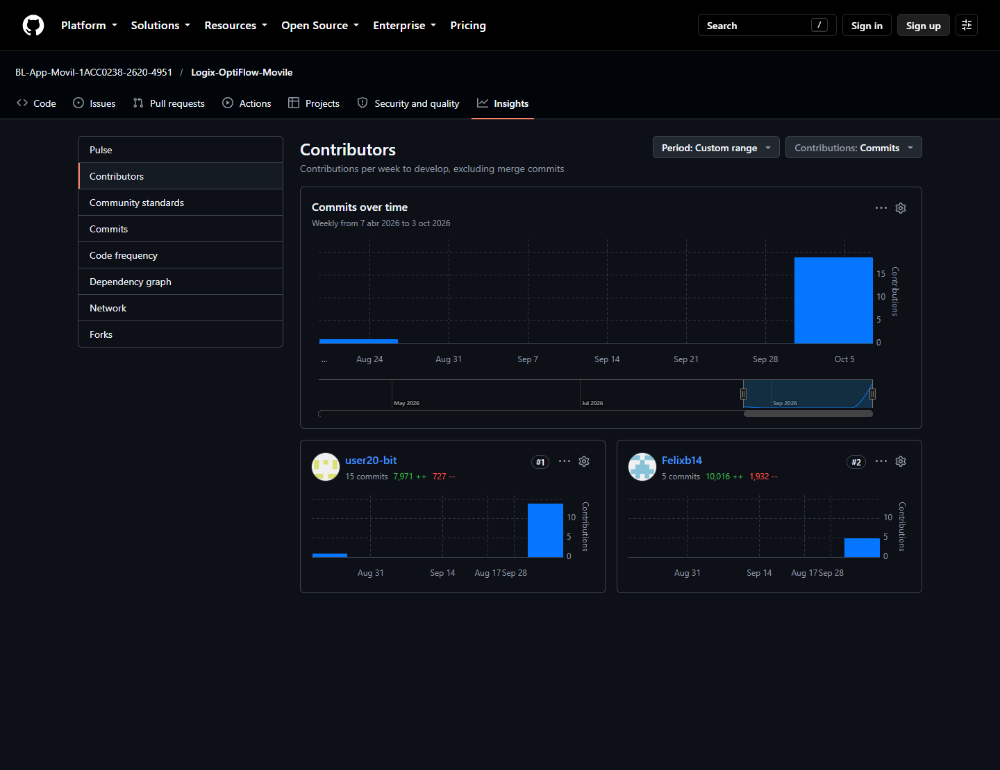


Los commits por semana del repositorio de la aplicación móvil se observan en la Figura 153.

<a id="figura-153"></a>

**Figura 153**

*Commits por semana del repositorio de la aplicación móvil*

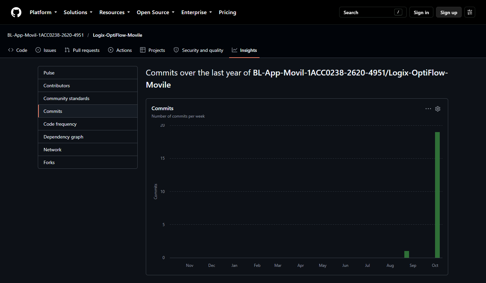

## 4.3. Validation Interviews

### 4.3.1. Diseño de entrevistas

Preguntas generales:

1.  Datos de perfil: ¿Podrías indicarme tu nombre, edad, estado civil y ocupación exacta?
2.  Contexto personal: ¿En qué distrito resides?
3.  Entorno digital: ¿Qué dispositivo utilizas con mayor frecuencia para navegar por internet y cómo describirías tu experiencia con páginas web de servicios similares (agendamiento, gestión de pedidos o atención al cliente)?

**Primer Segmento: *Staff de la óptica (Optómetras y Asesores comerciales)***

Tareas del Landing Page: explorar libremente la página, buscar las funciones que le servirían en su óptica, localizar el botón de llamada a la acción dirigido a su segmento y revisar la información disponible para decidir si probaría OptiFlow.

4.  Después de recorrer el Landing Page, explícame con tus propias palabras qué es OptiFlow, qué ofrece a una óptica y qué fue lo primero que te llamó la atención.
5.  Cuéntame cómo fue buscar en la página las funciones que te servirían en tu óptica (gestión de pacientes, inventario, cotizaciones, órdenes de trabajo): ¿dónde las buscaste, qué encontraste y qué te faltó saber?
6.  Menciona con tus palabras qué significa cada sección, menú y botón por los que pasaste, y señala cuáles interpretaste de forma distinta a lo esperado o te costó ubicar.
7.  Describe qué esperabas que ocurriera al presionar el botón de llamada a la acción dirigido a tu segmento y qué pensaste al ver adónde te llevó.
8.  ¿Qué información necesitarías ver en la página (precios, planes, testimonios, demostración del producto) para decidir probar OptiFlow en tu óptica? Cuéntame por qué.
9.  Describe cómo se ve y se lee la página en tu celular y en una computadora (texto, colores, imágenes, botones) y qué situaciones se te harían difíciles de leer o de usar.
10. Si pudieras rediseñar este Landing Page, ¿qué cambiarías, quitarías o agregarías y por qué? ¿Qué tendría que mostrar la página para que confíes en OptiFlow y contactes al equipo?

**Segundo Segmento: *Clientes de la óptica (Pacientes)***

Tareas del Landing Page: explorar libremente la página, buscar cómo reservar una cita o consultar el estado de un pedido, localizar el botón de llamada a la acción dirigido a su segmento y revisar la información disponible para decidir si usaría OptiFlow.

4.  Después de recorrer el Landing Page, explícame con tus propias palabras qué es OptiFlow, qué podrías hacer con él como paciente y qué fue lo primero que te llamó la atención.
5.  Cuéntame cómo fue buscar en la página la forma de reservar una cita o consultar el estado de tu pedido: ¿dónde lo buscaste, qué encontraste y qué te faltó saber?
6.  Menciona con tus palabras qué significa cada sección, menú y botón por los que pasaste, y señala cuáles interpretaste de forma distinta a lo esperado o te costó ubicar.
7.  Describe qué esperabas que ocurriera al presionar el botón de llamada a la acción dirigido a los clientes y qué pensaste al ver adónde te llevó.
8.  ¿Qué información o elementos (opiniones de otros usuarios, video del producto, imágenes de la aplicación) te darían confianza para registrarte? Cuéntame por qué.
9.  Describe cómo se ve y se lee la página en tu celular y en una computadora (tamaño de letra, colores, imágenes, botones) y qué dificultades imaginas que tendría un familiar de mayor edad al usarla sin ayuda.
10. Si pudieras rediseñar este Landing Page, ¿qué cambiarías, quitarías o agregarías y por qué? ¿Qué haría que quieras usar OptiFlow y recomendarlo a tus familiares o amigos?

### 4.3.2. Registro de entrevistas

En esta sección se registran las entrevistas de validación realizadas con usuarios de los dos segmentos objetivo de OptiFlow, quienes interactuaron con la Landing Page y con la aplicación móvil. Todas las entrevistas se encuentran en un solo video, publicado en el OneDrive facilitado por el docente.

**Video de entrevistas de validación:**


Enlace:

https://upcedupe-my.sharepoint.com/:v:/g/personal/u20241d317_upc_edu_pe/IQBMU94REze_ToVH6ypsrwSQAQ8o417Ttlc68_FnccjszWQ?e=k17qUs&nav=eyJyZWZlcnJhbEluZm8iOnsicmVmZXJyYWxBcHAiOiJTdHJlYW1XZWJBcHAiLCJyZWZlcnJhbFZpZXciOiJTaGFyZURpYWxvZy1MaW5rIiwicmVmZXJyYWxBcHBQbGF0Zm9ybSI6IldlYiIsInJlZmVycmFsTW9kZSI6InZpZXcifX0%3D

**Segmento 1: *Staff de la Óptica***

| Campo | Detalle |
| :--- | :--- |
| **Entrevista** | **#1** |
| **Nombre** | |
| **Apellidos** | |
| **Edad** | |
| **Distrito** | |
| **Evidencia** | |
| **Link** | |
| **Duración** | |
| **Resumen** | |

| Campo | Detalle |
| :--- | :--- |
| **Entrevista** | **#2** |
| **Nombre** | |
| **Apellidos** | |
| **Edad** | |
| **Distrito** | |
| **Evidencia** | |
| **Link** | |
| **Duración** | |
| **Resumen** | |

| Campo | Detalle |
| :--- | :--- |
| **Entrevista** | **#3** |
| **Nombre** | |
| **Apellidos** | |
| **Edad** | |
| **Distrito** | |
| **Evidencia** | |
| **Link** | |
| **Duración** | |
| **Resumen** | |

**Segmento 2: *Clientes de la óptica***

| Campo | Detalle |
| :--- | :--- |
| **Entrevista** | **#1** |
| **Nombre** | |
| **Apellidos** | |
| **Edad** | |
| **Distrito** | |
| **Evidencia** | |
| **Link** | |
| **Duración** | |
| **Resumen** | |

| Campo | Detalle |
| :--- | :--- |
| **Entrevista** | **#2** |
| **Nombre** | |
| **Apellidos** | |
| **Edad** | |
| **Distrito** | |
| **Evidencia** | |
| **Link** | |
| **Duración** | |
| **Resumen** | |

| Campo | Detalle |
| :--- | :--- |
| **Entrevista** | **#3** |
| **Nombre** | |
| **Apellidos** | |
| **Edad** | |
| **Distrito** | |
| **Evidencia** | |
| **Link** | |
| **Duración** | |
| **Resumen** | |


### 4.3.3. Evaluaciones según heurísticas

En esta sección se presenta la evaluación de la experiencia de usuario de OptiFlow a partir de las sesiones de validación. Se consideran heurísticas de **usabilidad**, principios de **arquitectura de información** y principios de **diseño inclusivo**, siguiendo el formato de evaluación indicado para el proyecto.

| | |
| :--- | :--- |
| **CARRERA** | Ingeniería de Software |
| **CURSO** | 1ACC0238 Aplicaciones para Dispositivos Móviles |
| **NRC** | 4951 |
| **PROFESOR** | Jorge Luis Mayta Guillermo |
| **AUDITOR** | Logix |
| **CLIENTE(S)** | [Nombres de las personas que participan en la sesión] |

**SITE o APP A EVALUAR:**
OptiFlow: Landing Page y aplicación móvil.

**TAREAS A EVALUAR:**
El alcance de esta evaluación incluye la revisión de la usabilidad de las siguientes tareas:

1. Conocer la propuesta de valor de OptiFlow desde la Landing Page.
2. Registrarse e iniciar sesión en la aplicación móvil según el rol (paciente o personal clínico).
3. Buscar una óptica y consultar sus horarios disponibles.
4. Reservar una cita de atención optométrica.
5. Consultar la receta óptica y el historial clínico.
6. Revisar el estado y el seguimiento de un pedido de lentes.
7. Configurar las notificaciones y los recordatorios de control visual.
8. Registrar un paciente nuevo desde el rol de personal clínico.
9. Consultar el stock de una montura mediante el escáner.
10. Generar una cotización vinculada a la receta del paciente.
11. Actualizar el estado de una orden de trabajo en el tablero de producción.
12. Revisar los reportes y las alertas de stock crítico.

No están incluidas en esta versión de la evaluación las siguientes tareas:

1. Prueba virtual de monturas con la cámara del dispositivo.
2. Registro de pagos y emisión de comprobantes.
3. Generación y exportación de reportes.
4. Gestión de permisos por roles.
5. Operaciones sin conexión a internet.

**ESCALA DE SEVERIDAD:**
Los errores serán puntuados tomando en cuenta la siguiente escala de severidad:

| Nivel | Descripción |
| :---: | :--- |
| 1 | **Problema superficial:** puede ser fácilmente superado por el usuario y ocurre con muy poca frecuencia. No necesita ser arreglado a no ser que exista disponibilidad de tiempo. |
| 2 | **Problema menor:** puede ocurrir un poco más frecuentemente o es un poco más difícil de superar para el usuario. Se le debería asignar una prioridad baja resolverlo de cara al siguiente *release*. |
| 3 | **Problema mayor:** ocurre frecuentemente o los usuarios no son capaces de resolverlo. Es importante que sea corregido y se le debe asignar una prioridad alta. |
| 4 | **Problema muy grave:** un error de gran impacto que impide al usuario continuar con el uso de la herramienta. Es imperativo que sea corregido antes del lanzamiento. |

**TABLA RESUMEN:**

**Tabla N**
*Resumen de problemas identificados en la evaluación heurística*

| # | Problema | Escala de severidad | Heurística / Principio violado(a) |
| :---: | :--- | :---: | :--- |
| 1 | | | |
| 2 | | | |
| 3 | | | |
| 4 | | | |
| 5 | | | |

*Nota.* Elaboración propia.

**DESCRIPCIÓN DE PROBLEMAS:**

**PROBLEMA #1:** [Título del problema]

- **Severidad:**
- **Heurística violada:**
- **Problema:**

**Figura N**
*[Título de la captura que ilustra el problema #1]*

**[Insertar captura: Problema 1]**

*Nota.* Captura de la aplicación OptiFlow.

- **Recomendación:**

<!-- Repetir la estructura anterior por cada problema registrado en la tabla resumen. -->
