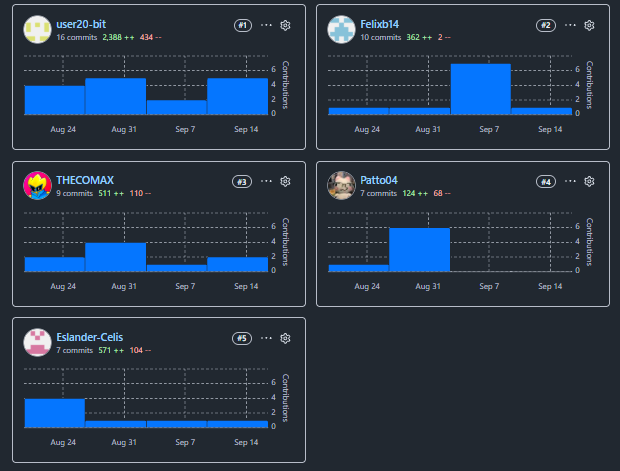
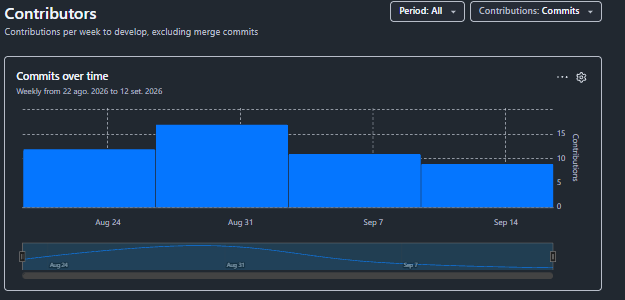
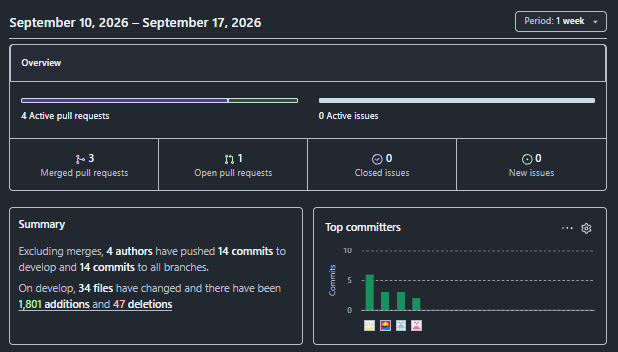

<div align="center">

 

**Universidad Peruana de Ciencias Aplicadas**<br>
**Carrera de Ingeniería de Software**

**1ACC0238**<br>
**Aplicaciones para Dispositivos Móviles**<br>

NRC<br>
**4951**<br>

Docente<br>
**Jorge Luis Mayta Guillermo**<br>

**Informe del Trabajo Final**<br>

Equipo<br>
**Logix**

Proyecto<br>
**OptiFlow**

<br>**Integrantes** 

<div align="center"> 

| Código|Apellidos y Nombres|
|-------------| --------------------------------- |
| U20241d317| Atoche Gonzáles, Nicolás Fernando|
| U20211b387| Becerra Ttito, Felix Orlando|
| U201911249| Celis Berrospi, Eslander|
| U202411521| Morocho Pinedo, Mariana|
| U202417405| Quispe llacsahuanga, Cesar Agusto| 

</div>

**Período 202620**  

**Agosto 2026**
</div>
</div> 
<div class="page"></div>
<br>

# Registro de Versiones del Informe 
 
| Versión | Fecha | Autores | Descripción de modificación |
| ----------- | --------- |----------- |--------------------|
| AV1 | 17/09/2026 | Atoche Nicolás Fernando <br> </br> Becerra Felix Orlando <br><br> Celis Eslander <br><br> Morocho Pinedo Mariana <br><br> Quispe Cesar Agusto | Desarrollo del avance inicial del informe de OptiFlow, incluyendo el análisis de antecedentes y problemática, análisis de competidores, entrevistas y levantamiento de requisitos. Elaboración y priorización de User Stories y Product Backlog. Desarrollo del análisis estratégico del dominio mediante EventStorming, Candidate Context Discovery, Domain Message Flows, Bounded Context Canvases y Context Mapping. Definición de los Bounded Contexts: Search & Booking, Clinical & Commercial, Production & Tracking, Store Management & Inventory y Notification & Loyalty. Desarrollo inicial del diseño táctico de los Bounded Contexts y de la arquitectura de software mediante diagramas C4 de Context, Container y Component. Elaboración de diagramas de diseño de dominio y base de datos para los contextos desarrollados, además de la organización de conclusiones y anexos del informe. |
| TB1 | | | |
| AV2 | | | |
| TB2 | | | |
<div style="page-break-after: always;"></div>

# Project Report Collaboration Insights

Para el desarrollo del **Project Report**, el equipo utiliza un repositorio dentro de la organización en GitHub. A continuación, se presenta la evidencia de colaboración de cada entregable, en coherencia con el **Registro de Versiones del Informe**.

**Repositorio del informe del proyecto:** https://github.com/BL-App-Movil-1ACC0238-2620-4951 

- **Total de commits:** 
- **Autores contribuyentes:**
  - Atoche Gonzáles, Nicolás Fernando (`Nicolas-Ato`)
  - Becerra Ttito, Felix Orlando (`Felixb14`)
  - Celis Berrospi, Eslander (`Eslander-Celis`)
  - Morocho Pinedo, Mariana (`Patto04`)
  - Quispe llacsahuanga, Cesar Agusto (`user20-bit`)
- La actividad se distribuyó en ramas temáticas por secciones del informe, asegurando revisiones cruzadas mediante *pull requests*.

---

## AV1 — Semana 4

Durante esta fase, el equipo elaboró el **informe inicial**, que incluyó los siguientes aspectos:

- **Carátula** con información institucional y de la startup.
- **Registro de Versiones del Informe**, documentando los cambios realizados.
- **Capítulo I** con nuestra propuesta inicial de nuestro proyecto.
- **Capítulo II** con los primeros avances en Requirements Elicitation & Analysis.
- **Adicionalmente** conclusiones, bibliografía y anexos.

A continuación se presenta la captura de los analíticos de colaboración y commits en GitHub para este entregable:







| Integrante | Usuario GitHub | Commits | Adiciones | Eliminaciones |
|---|---|---:|---:|---:|
| Atoche Gonzáles, Nicolás Fernando | `Nicolas-Ato` | 15 | 510 | 110 |
| Becerra Ttito, Felix Orlando | `Felixb14` | 10 | 362 | 2 |
| Celis Berrospi, Eslander | `Eslander-Celis` | 7 | 557 | 104 |
| Morocho Pinedo, Mariana | `Patto04` | 10 | 127 | 68 |
| Quispe Cesar Agusto | `user20-bit` | 16 | 2372 | 419 |

La colaboración fue activa y equitativa, con aportes sustanciales de todos los integrantes en la redacción y organización del informe.

## TB1 - Semana 7

## AV2 - Semana 12

## TB2 - Semana 12

-----

# Tabla de Contenidos

## [Capítulo I: Presentación](Capitulo1.md)

- [1.1. Startup Profile](Capitulo1.md#11-startup-profile)
  - [1.1.1. Descripción de la Startup](Capitulo1.md#111-descripción-de-la-startup)
  - [1.1.2. Perfiles de integrantes del equipo](Capitulo1.md#112-perfiles-de-integrantes-del-equipo)

- [1.2. Solution Profile](Capitulo1.md#12-solution-profile)
  - [1.2.1. Antecedentes y problemática](Capitulo1.md#121-antecedentes-y-problemática)
  - [1.2.2. Lean UX Process](Capitulo1.md#122-lean-ux-process)
    - [1.2.2.1. Lean UX Problem Statements](Capitulo1.md#1221-lean-ux-problem-statements)
    - [1.2.2.2. Lean UX Assumptions](Capitulo1.md#1222-lean-ux-assumptions)
    - [1.2.2.3. Lean UX Hypothesis Statements](Capitulo1.md#1223-lean-ux-hypothesis-statements)
    - [1.2.2.4. Lean UX Canvas](Capitulo1.md#1224-lean-ux-canvas)

- [1.3. Segmentos objetivo](Capitulo1.md#13-segmentos-objetivo)

---

## [Capítulo II: Requirements Development and Software Solution Design](Capitulo2.md)

- [2.1. Competidores](Capitulo2.md#21-competidores)
  - [2.1.1. Análisis competitivo](Capitulo2.md#211-análisis-competitivo)
  - [2.1.2. Estrategias y tácticas frente a competidores](Capitulo2.md#212-estrategias-y-tácticas-frente-a-competidores)

- [2.2. Entrevistas](Capitulo2.md#22-entrevistas)
  - [2.2.1. Diseño de entrevistas](Capitulo2.md#221-diseño-de-entrevistas)
  - [2.2.2. Registro de entrevistas](Capitulo2.md#222-registro-de-entrevistas)
  - [2.2.3. Análisis de entrevistas](Capitulo2.md#223-análisis-de-entrevistas)

- [2.3. Needfinding](Capitulo2.md#23-needfinding)
  - [2.3.1. User Personas](Capitulo2.md#231-user-personas)
  - [2.3.2. User Task Matrix](Capitulo2.md#232-user-task-matrix)
  - [2.3.3. User Journey Mapping](Capitulo2.md#233-user-journey-mapping)
  - [2.3.4. Empathy Mapping](Capitulo2.md#234-empathy-mapping)
  - [2.3.5. Big Picture EventStorming](Capitulo2.md#235-big-picture-eventstorming)
  - [2.3.6. Ubiquitous Language](Capitulo2.md#236-ubiquitous-language)

- [2.4. Requirements Specification](Capitulo2.md#24-requirements-specification)
  - [2.4.1. User Stories](Capitulo2.md#241-user-stories)
  - [2.4.2. Impact Mapping](Capitulo2.md#242-impact-mapping)
  - [2.4.3. Product Backlog](Capitulo2.md#243-product-backlog)

- [2.5. Strategic-Level Domain-Driven Design](Capitulo2.md#25-strategic-level-domain-driven-design)
  - [2.5.1. EventStorming](Capitulo2.md#251-eventstorming)
    - [2.5.1.1. Candidate Context Discovery](Capitulo2.md#2511-candidate-context-discovery)
    - [2.5.1.2. Domain Message Flows Modeling](Capitulo2.md#2512-domain-message-flows-modeling)
    - [2.5.1.3. Bounded Context Canvases](Capitulo2.md#2513-bounded-context-canvases)
  - [2.5.2. Context Mapping](Capitulo2.md#252-context-mapping)
  - [2.5.3. Software Architecture](Capitulo2.md#253-software-architecture)
    - [2.5.3.1. Software Architecture Context Level Diagrams](Capitulo2.md#2531-software-architecture-context-level-diagrams)
    - [2.5.3.2. Software Architecture Container Level Diagrams](Capitulo2.md#2532-software-architecture-container-level-diagrams)
    - [2.5.3.3. Software Architecture Deployment Diagrams](Capitulo2.md#2533-software-architecture-deployment-diagrams)

- [2.6. Tactical-Level Domain-Driven Design](Capitulo2.md#26-tactical-level-domain-driven-design)
  - [2.6.1. Bounded Context: Search & Booking Context](Capitulo2.md#261-bounded-context-search--booking-context)
    - [2.6.1.1. Domain Layer](Capitulo2.md#2611-domain-layer)
    - [2.6.1.2. Interface Layer](Capitulo2.md#2612-interface-layer)
    - [2.6.1.3. Application Layer](Capitulo2.md#2613-application-layer)
    - [2.6.1.4. Infrastructure Layer](Capitulo2.md#2614-infrastructure-layer)
    - [2.6.1.5. Bounded Context Software Architecture Component Level Diagrams](Capitulo2.md#2615-bounded-context-software-architecture-component-level-diagrams)
    - [2.6.1.6. Bounded Context Software Architecture Code Level Diagrams](Capitulo2.md#2616-bounded-context-software-architecture-code-level-diagrams)
      - [2.6.1.6.1. Bounded Context Domain Layer Class Diagrams](Capitulo2.md#26161-bounded-context-domain-layer-class-diagrams)
      - [2.6.1.6.2. Bounded Context Database Design Diagram](Capitulo2.md#26162-bounded-context-database-design-diagram)

  - [2.6.2. Bounded Context: Clinical & Commercial Context](Capitulo2.md#262-bounded-context-clinical--commercial-context)
    - [2.6.2.1. Domain Layer](Capitulo2.md#2621-domain-layer)
    - [2.6.2.2. Interface Layer](Capitulo2.md#2622-interface-layer)
    - [2.6.2.3. Application Layer](Capitulo2.md#2623-application-layer)
    - [2.6.2.4. Infrastructure Layer](Capitulo2.md#2624-infrastructure-layer)
    - [2.6.2.5. Bounded Context Software Architecture Component Level Diagrams](Capitulo2.md#2625-bounded-context-software-architecture-component-level-diagrams)
    - [2.6.2.6. Bounded Context Software Architecture Code Level Diagrams](Capitulo2.md#2626-bounded-context-software-architecture-code-level-diagrams)
      - [2.6.2.6.1. Bounded Context Domain Layer Class Diagrams](Capitulo2.md#26261-bounded-context-domain-layer-class-diagrams)
      - [2.6.2.6.2. Bounded Context Database Design Diagram](Capitulo2.md#26262-bounded-context-database-design-diagram)

  - [2.6.3. Bounded Context: Production & Tracking Context](Capitulo2.md#263-bounded-context-production--tracking-context)
    - [2.6.3.1. Domain Layer](Capitulo2.md#2631-domain-layer)
    - [2.6.3.2. Interface Layer](Capitulo2.md#2632-interface-layer)
    - [2.6.3.3. Application Layer](Capitulo2.md#2633-application-layer)
    - [2.6.3.4. Infrastructure Layer](Capitulo2.md#2634-infrastructure-layer)
    - [2.6.3.5. Bounded Context Software Architecture Component Level Diagrams](Capitulo2.md#2635-bounded-context-software-architecture-component-level-diagrams)
    - [2.6.3.6. Bounded Context Software Architecture Code Level Diagrams](Capitulo2.md#2636-bounded-context-software-architecture-code-level-diagrams)
      - [2.6.3.6.1. Bounded Context Domain Layer Class Diagrams](Capitulo2.md#26361-bounded-context-domain-layer-class-diagrams)
      - [2.6.3.6.2. Bounded Context Database Design Diagram](Capitulo2.md#26362-bounded-context-database-design-diagram)

  - [2.6.4. Bounded Context: Store Management & Inventory Context](Capitulo2.md#264-bounded-context-store-management--inventory-context)
    - [2.6.4.1. Domain Layer](Capitulo2.md#2641-domain-layer)
    - [2.6.4.2. Interface Layer](Capitulo2.md#2642-interface-layer)
    - [2.6.4.3. Application Layer](Capitulo2.md#2643-application-layer)
    - [2.6.4.4. Infrastructure Layer](Capitulo2.md#2644-infrastructure-layer)
    - [2.6.4.5. Bounded Context Software Architecture Component Level Diagrams](Capitulo2.md#2645-bounded-context-software-architecture-component-level-diagrams)
    - [2.6.4.6. Bounded Context Software Architecture Code Level Diagrams](Capitulo2.md#2646-bounded-context-software-architecture-code-level-diagrams)
      - [2.6.4.6.1. Bounded Context Domain Layer Class Diagrams](Capitulo2.md#26461-bounded-context-domain-layer-class-diagrams)
      - [2.6.4.6.2. Bounded Context Database Design Diagram](Capitulo2.md#26462-bounded-context-database-design-diagram)
      
  - [2.6.5. Bounded Context: Notification & Loyalty Context](Capitulo2.md#265-bounded-context-notification--loyalty-context)
    - [2.6.5.1. Domain Layer](Capitulo2.md#2651-domain-layer)
    - [2.6.5.2. Interface Layer](Capitulo2.md#2652-interface-layer)
    - [2.6.5.3. Application Layer](Capitulo2.md#2653-application-layer)
    - [2.6.5.4. Infrastructure Layer](Capitulo2.md#2654-infrastructure-layer)
    - [2.6.5.5. Bounded Context Software Architecture Component Level Diagrams](Capitulo2.md#2655-bounded-context-software-architecture-component-level-diagrams)
    - [2.6.5.6. Bounded Context Software Architecture Code Level Diagrams](Capitulo2.md#2656-bounded-context-software-architecture-code-level-diagrams)
      - [2.6.5.6.1. Bounded Context Domain Layer Class Diagrams](Capitulo2.md#26561-bounded-context-domain-layer-class-diagrams)
      - [2.6.5.6.2. Bounded Context Database Design Diagram](Capitulo2.md#26562-bounded-context-database-design-diagram)
---

## [Capítulo III: Solution UI/UX Design](Capitulo_3.md)

- [3.1. Product design]()
  - [3.1.1. Style Guidelines]()
    - [3.1.1.1. General Style Guidelines]()
  - [3.1.2. Information Architecture]()
    - [3.1.2.1. Organization Systems]()
    - [3.1.2.2. Labeling Systems]()
    - [3.1.2.3. SEO Tags and Meta Tags]()
    - [3.1.2.4. Searching Systems]()
    - [3.1.2.5. Navigation Systems]()
  - [3.1.3. Landing Page UI Design]()
    - [3.1.3.1. Landing Page Wireframe]()
    - [3.1.3.2. Landing Page Mock-up]()
  - [3.1.4. Mobile Applications UX/UI Design]()
    - [3.1.4.1. Mobile Applications Wireframes]()
    - [3.1.4.2. Mobile Applications Wireflow Diagrams]()
    - [3.1.4.3. Mobile Applications Mock-ups]()
    - [3.1.4.4. Mobile Applications User Flow Diagrams]()
    - [3.1.4.5 Mobile Applications Prototyping]()
---
## [Capítulo IV: Product Implementation & Validation](Capitulo_4.md)

 [4. Product Implementation & Validation]()

- [4.1. Software Configuration Management]()
  - [4.1.1. Software Development Environment Configuration]()
  - [4.1.2. Source Code Management]()
  - [4.1.3. Source Code Style Guide & Conventions]()
  - [4.1.4. Software Deployment Configuration]()
- [4.2. Landing Page & Mobile Application Implementation]()
  - [4.2.1. Sprint 1]()
    - [4.2.1.1. Sprint Planning 1]()
    - [4.2.1.2. Aspect Leaders and Collaborators]()
    - [4.2.1.3. Sprint Backlog 1]()
    - [4.2.1.4. Development Evidence for Sprint Review]()
    - [4.2.1.5. Testing Suite Evidence for Sprint Review]()
    - [4.2.1.6. Execution Evidence for Sprint Review]()
    - [4.2.1.7. Services Documentation Evidence for Sprint Review]()
    - [5.2.1.8. Software Deployment Evidence for Sprint Review]()
    - [5.2.1.9. Team Collaboration Insights during Sprint]()
- [4.3. Validation Interviews]()
  - [4.3.1. Diseño de entrevistas]()
  - [4.3.2. Registro de entrevistas]()
  - [4.3.3. Evaluaciones según heurísticas]()

---

## [Conclusiones](Conclusiones.md)

- [Conclusiones y recomendaciones.](Conclusiones.md#conclusiones)
- [Video App Validation]()
- [Video About the product]()
- [Video About the team]()

---

## [Glosario](Glosario.md)

- [Glosario](Glosario.md#glosario)

---

## [Bibliografía](Bibliografia.md)

- [Bibliografia](Bibliografia.md#bibliografía)

---

## [Anexos](Anexos.md)

- [Anexos](Anexos.md#anexos)

---

# Student Outcome

<table>
   <tr>
        <th>CRITERIO ESPECIFICO</th>
        <th>ACCIONES REALIZADAS</th>
        <th>CONCLUSIONES</th>
    </tr>


<tr>
    <th>Actualiza conceptos y conocimientos necesarios para su desarrollo profesional y en especial para su proyecto en soluciones de software.</th>
    <td>

<b>Atoche Nicolás Fernando: AV1</b><br>
Durante el desarrollo del AV1, actualicé mis conocimientos relacionados con el análisis y diseño de soluciones de software mediante la investigación y aplicación de conceptos como Lean UX, User Personas, User Journey Mapping, Empathy Mapping y Big Picture EventStorming. Asimismo, reforcé conocimientos relacionados con la identificación de necesidades de los usuarios y la representación de sus experiencias, permitiéndome aplicar estos conceptos de manera adecuada dentro del proyecto.<br><br>

<b>Becerra Felix Orlando: AV1</b><br>
Durante el desarrollo del AV1, amplié mis conocimientos sobre análisis competitivo, entrevistas y procesos de Needfinding. Profundicé en herramientas como User Task Matrix, User Personas, User Journey Mapping y análisis de entrevistas, las cuales permitieron identificar las principales necesidades y características de los segmentos objetivo. La investigación realizada contribuyó a mejorar mi comprensión sobre el proceso de levantamiento y análisis de información para una solución de software.<br><br>

<b>Celis Eslander: AV1</b><br>
Durante el desarrollo del AV1, actualicé mis conocimientos relacionados con la especificación de requisitos y Strategic-Level Domain-Driven Design. Profundicé en conceptos como User Stories, Product Backlog, Impact Mapping, EventStorming, Ubiquitous Language, Candidate Context Discovery, Domain Message Flows Modeling y Bounded Context Canvases. Esto me permitió comprender mejor cómo organizar los requisitos y dividir el dominio de una solución de software en contextos claramente definidos.<br><br>

<b>Morocho Pinedo Mariana: AV1</b><br>
Durante el desarrollo del AV1, reforcé mis conocimientos relacionados con la definición de una propuesta de solución mediante el Startup Profile, Solution Profile y Lean UX Process. Profundicé en conceptos como Lean UX Problem Statements, Lean UX Assumptions, Lean UX Hypothesis Statements y Lean UX Canvas, aplicándolos para analizar la problemática, identificar supuestos y establecer hipótesis relacionadas con las necesidades de los segmentos objetivo.<br><br>

<b>Quispe Cesar Agusto: AV1</b><br>
Durante el desarrollo del AV1, actualicé mis conocimientos relacionados con Domain-Driven Design y arquitectura de software. Profundicé en conceptos como Context Mapping, Bounded Contexts, Domain Layer, Application Layer, Interface Layer e Infrastructure Layer. Asimismo, reforcé mis conocimientos sobre diagramas de arquitectura a nivel de Context, Container, Component y Code, además del diseño de diagramas de clases y base de datos correspondientes a los diferentes Bounded Contexts de la solución.<br><br>
    </td>
    <td>
<b>AV1:</b><br>
Durante el desarrollo del AV1, el equipo fortaleció y actualizó sus conocimientos mediante la investigación y aplicación de diferentes metodologías, conceptos y herramientas necesarias para analizar y diseñar la solución de software. Se profundizó en temas relacionados con Lean UX, análisis competitivo, entrevistas, Needfinding, especificación de requisitos, Domain-Driven Design y arquitectura de software. La aplicación de estos conocimientos permitió comprender de manera más completa la problemática, las necesidades de los usuarios, los requisitos del sistema y la organización de los diferentes componentes de la solución. De esta manera, el equipo logró complementar los conocimientos adquiridos previamente y aplicarlos de forma práctica en el desarrollo del proyecto. </td> </tr>

<tr>
    <th>Reconoce la necesidad del aprendizaje permanente para el desempeño profesional y el desarrollo de proyectos en soluciones de software.</th>
    <td>
```

<b>Atoche Nicolás Fernando: AV1</b><br>
Durante el desarrollo del AV1, reconocí la importancia de mantener un aprendizaje permanente debido a la necesidad de comprender y aplicar herramientas como Lean UX, User Journey Mapping, Empathy Mapping y EventStorming. La revisión de documentación y materiales de apoyo fue necesaria para desarrollar correctamente estas actividades, permitiéndome comprender que en el desarrollo profesional es fundamental continuar adquiriendo nuevos conocimientos y adaptarse a diferentes metodologías de trabajo.<br><br>

<b>Becerra Felix Orlando: AV1</b><br>
Durante el desarrollo del AV1, comprendí que el aprendizaje continuo es necesario para realizar correctamente actividades como el análisis competitivo, diseño y análisis de entrevistas y Needfinding. La necesidad de investigar la forma adecuada de utilizar herramientas como User Personas y User Task Matrix me permitió reconocer que los conocimientos deben actualizarse constantemente para responder de manera adecuada a nuevos problemas y necesidades dentro de un proyecto de software.<br><br>

<b>Celis Eslander: AV1</b><br>
Durante el desarrollo del AV1, reconocí la necesidad de continuar aprendiendo nuevos conceptos relacionados con requisitos y Domain-Driven Design. La aplicación de EventStorming, Ubiquitous Language, Candidate Context Discovery, Domain Message Flows y Bounded Context Canvases requirió revisar nuevos conceptos y comprender su relación con la solución desarrollada. Esta experiencia me permitió reconocer que el aprendizaje permanente es necesario para afrontar temas cada vez más especializados dentro del desarrollo de software.<br><br>

<b>Morocho Pinedo Mariana: AV1</b><br>
Durante el desarrollo del AV1, reconocí la importancia del aprendizaje permanente al trabajar con herramientas y conceptos del Lean UX Process que requerían una comprensión previa para ser aplicados correctamente. La elaboración de Problem Statements, Assumptions, Hypothesis Statements y Lean UX Canvas implicó investigar y reforzar conocimientos, permitiéndome comprender que la actualización constante es necesaria para mejorar el análisis de problemas y la definición de soluciones dentro de proyectos de software.<br><br>

<b>Quispe Cesar Agusto: AV1</b><br>
Durante el desarrollo del AV1, reconocí la necesidad de mantener un proceso constante de aprendizaje al trabajar con conceptos de Domain-Driven Design y arquitectura de software. La elaboración de diagramas a nivel de Context, Container, Component y Code, así como la definición de las diferentes capas de los Bounded Contexts, requirió profundizar en conocimientos técnicos adicionales. Esto me permitió comprender que la actualización permanente es fundamental para adaptarse a nuevas prácticas y desarrollar soluciones de software mejor estructuradas.<br><br>
    </td>
    <td>
<b>AV1:</b><br>
Durante el desarrollo del AV1, el equipo reconoció que el aprendizaje permanente es un aspecto fundamental para el desarrollo profesional y para la elaboración de soluciones de software. Las diferentes actividades del proyecto requirieron investigar, revisar documentación y comprender nuevos conceptos relacionados con Lean UX, Needfinding, requisitos, EventStorming, Domain-Driven Design y arquitectura de software. Debido a la variedad y complejidad de los temas desarrollados, cada integrante tuvo que complementar sus conocimientos para cumplir adecuadamente con las actividades asignadas. En conjunto, esta experiencia permitió comprender que el desarrollo de software exige una actualización constante de conocimientos para adaptarse a nuevas metodologías, herramientas y desafíos profesionales. </td> </tr>

</table>


# Objetivos SMART
