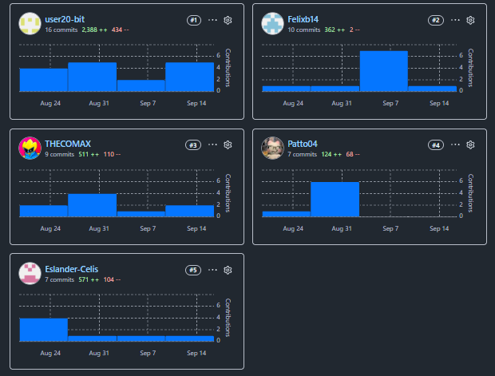
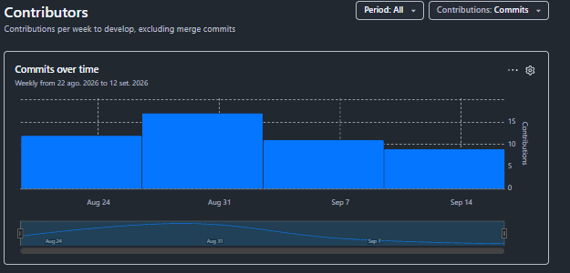
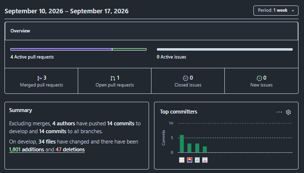
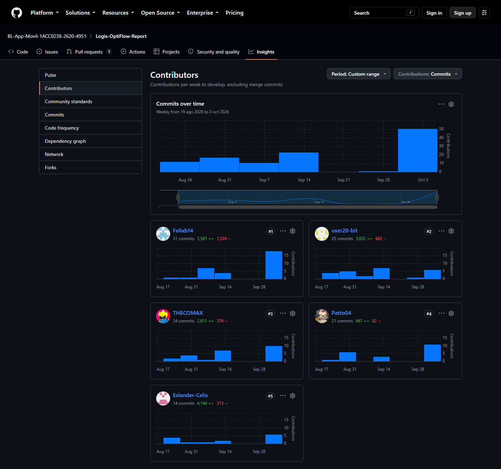
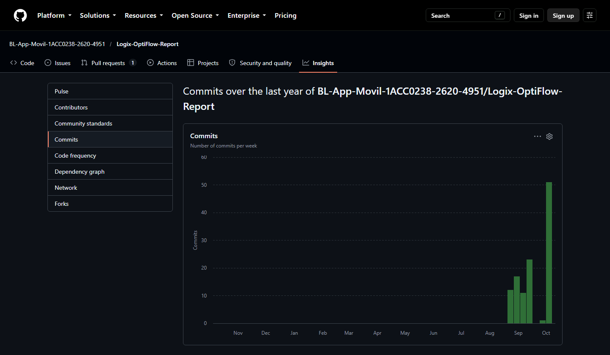

 

**Universidad Peruana de Ciencias Aplicadas** 
**Carrera de Ingeniería de Software**

**1ACC0238** 
**Aplicaciones para Dispositivos Móviles** 

NRC 
**4951** 

Docente 
**Jorge Luis Mayta Guillermo** 

**Informe de Trabajo Final** 

Equipo 
**Logix**

Proyecto 
**OptiFlow**

 **Integrantes** 

    <table style="border: none; border-collapse: collapse;">
    <tr>
      <th style="border:none ;">Código</th>
      <th style="border:none;">Apellidos y Nombres</th>
    </tr>
    <tr>
      <td style="border: none;">U20241d317</td>
      <td style="border: none;">Atoche Gonzales, Nicolas Fernando</td>
    </tr>
    <tr>
      <td style="border: none;">U20211b387</td>
      <td style="border: none;">Becerra Ttito, Felix Orlando</td>
    </tr>
    <tr>
      <td style="border: none;">U201911249</td>
      <td style="border: none;">Celis Berrospi, Eslander</td>
    </tr>
    <tr>
      <td style="border: none;">U202411521</td>
      <td style="border: none;">Morocho Pinedo, Mariana</td>
    </tr>
    <tr>
      <td style="border: none;">U202417405</td>
      <td style="border: none;">Quispe Llacsahuanga, César Augusto</td>
    </tr>
  </table>

  

**Periodo 202620**  

**Octubre 2026**

 

 

# Registro de Versiones del Informe 
 

El registro de versiones del informe se detalla en la Tabla 1.

**Tabla 1**

*Registro de versiones del informe*

| Versión | Fecha | Autores | Descripción de modificación |
| ----------- | --------- |----------- |--------------------|
| AV1 | 17/09/2026 | Atoche Nicolas Fernando    Becerra Felix Orlando    Celis Eslander    Morocho Pinedo Mariana    Quispe César Augusto | Desarrollo del avance inicial del informe de OptiFlow, incluyendo el análisis de antecedentes y problemática, análisis de competidores, entrevistas y levantamiento de requisitos. Elaboración y priorización de User Stories y Product Backlog. Desarrollo del análisis estratégico del dominio mediante EventStorming, Candidate Context Discovery, Domain Message Flows, Bounded Context Canvases y Context Mapping. Definición de los Bounded Contexts: Search & Booking, Clinical & Commercial, Production & Tracking, Store Management & Inventory y Notification & Loyalty. Desarrollo inicial del diseño táctico de los Bounded Contexts y de la arquitectura de software mediante diagramas C4 de Context, Container y Component. Elaboración de diagramas de diseño de dominio y base de datos para los contextos desarrollados, además de la organización de conclusiones y anexos del informe. |
| TB1 | 08/10/2026 | Atoche Nicolas Fernando    Becerra Felix Orlando    Celis Eslander    Morocho Pinedo Mariana    Quispe César Augusto | Corrección de las observaciones del AV1: saltos de página entre capítulos, descripción del Student Outcome, objetivos SMART, referencia de figuras y tablas, detalle del proceso de EventStorming, Domain Message Flows, Bounded Context Canvases, diagrama de contenedores con un único backend y relación entre cotización y venta en Clinical & Commercial. Desarrollo del Capítulo III con las Style Guidelines, la Information Architecture, el wireframe, mock-up y prototipo de la Landing Page, y los wireframes, wireflows y mock-ups de la aplicación móvil. Desarrollo del Capítulo IV con la configuración del entorno, la gestión del código fuente, las guías de estilo, la configuración de despliegue y el Sprint 1: planning, backlog, evidencias de desarrollo, pruebas, ejecución, documentación de los Web Services, despliegue en GitHub Pages, Render y Firebase App Distribution, y colaboración del equipo. Diseño de las entrevistas de validación. Actualización del Student Outcome y de Project Report Collaboration Insights, y aplicación del formato APA 7 a figuras, tablas y bibliografía. |

# Project Report Collaboration Insights

Para el desarrollo del **Project Report**, el equipo utiliza un repositorio dentro de la organización en GitHub. A continuación, se presenta la evidencia de colaboración de cada entregable, en coherencia con el **Registro de Versiones del Informe**.

**Repositorio del informe del proyecto:** [https://github.com/BL-App-Movil-1ACC0238-2620-4951/Logix-OptiFlow-Report](https://github.com/BL-App-Movil-1ACC0238-2620-4951/Logix-OptiFlow-Report)

- **Total de commits:** 96 commits en `develop` al 8 de octubre de 2026, sin contar los commits de *merge*.
- **Autores contribuyentes:**
  - Atoche Gonzales, Nicolas Fernando (`THECOMAX`)
  - Becerra Ttito, Felix Orlando (`Felixb14`)
  - Celis Berrospi, Eslander (`Eslander-Celis`)
  - Morocho Pinedo, Mariana (`Patto04`)
  - Quispe Llacsahuanga, César Augusto (`user20-bit`)
- La actividad se distribuyó en ramas temáticas por secciones del informe, asegurando revisiones cruzadas mediante *pull requests*.

---

## AV1 – Semana 4

Durante esta fase, el equipo elaboró el **informe inicial**, que incluyó los siguientes aspectos:

- **Carátula** con información institucional y de la startup.
- **Registro de Versiones del Informe**, documentando los cambios realizados.
- **Capítulo I** con nuestra propuesta inicial de nuestro proyecto.
- **Capítulo II** con los primeros avances en Requirements Development and Software Solution Design.
- **Adicionalmente** conclusiones, bibliografía y anexos.

A continuación se presenta la captura de los analíticos de colaboración y commits en GitHub para este entregable:

Los commits por integrante en el repositorio del informe durante AV1 se presentan en la Figura 1.

**Figura 1**

*Commits por integrante en el repositorio del informe durante AV1*

Los commits semanales del repositorio del informe durante AV1 se observan en la Figura 2.

**Figura 2**

*Commits semanales del repositorio del informe durante AV1*

El resumen de actividad del repositorio del informe entre el 10 y el 17 de septiembre de 2026 se muestra en la Figura 3.

**Figura 3**

*Resumen de actividad del repositorio del informe entre el 10 y el 17 de septiembre de 2026*

Las contribuciones por integrante al repositorio del informe durante AV1 se presentan en la Tabla 2.

**Tabla 2**

*Contribuciones por integrante al repositorio del informe durante AV1*

| Integrante | Usuario GitHub | Commits | Adiciones | Eliminaciones |
|---|---|---:|---:|---:|
| Atoche Gonzales, Nicolas Fernando | `THECOMAX` | 15 | 510 | 110 |
| Becerra Ttito, Felix Orlando | `Felixb14` | 10 | 362 | 2 |
| Celis Berrospi, Eslander | `Eslander-Celis` | 7 | 557 | 104 |
| Morocho Pinedo, Mariana | `Patto04` | 10 | 127 | 68 |
| Quispe Llacsahuanga, César Augusto | `user20-bit` | 16 | 2372 | 419 |

La colaboración fue activa y equitativa, con aportes sustanciales de todos los integrantes en la redacción y organización del informe.

## TB1 – Semana 7

Durante TB1, el equipo corrigió las observaciones del docente sobre el AV1 y desarrolló los capítulos III y IV del informe. Cada integrante trabajó en ramas creadas desde `develop` e integró sus cambios mediante *pull requests*. Entre el 18 de septiembre y el 8 de octubre de 2026 se registraron 33 commits en `develop`, sin contar los commits de *merge*. El trabajo se distribuyó de la siguiente manera:

- **Atoche Gonzales, Nicolas Fernando:** configuración del entorno de desarrollo, gestión del código fuente y configuración de despliegue del Capítulo IV; wireframe, mock-up y prototipo de la Landing Page; corrección del EventStorming y diseño de las entrevistas de validación.
- **Becerra Ttito, Felix Orlando:** evidencias de documentación de los Web Services, de despliegue y de colaboración del Sprint 1, y formatos del registro de entrevistas y de la evaluación heurística.
- **Celis Berrospi, Eslander:** Sprint Planning, Aspect Leaders and Collaborators, Sprint Backlog y evidencias de desarrollo, pruebas y ejecución del Sprint 1, además de la corrección de las observaciones del AV1.
- **Morocho Pinedo, Mariana:** wireframes de la Landing Page y de la aplicación móvil, y wireflows y mock-ups de la aplicación móvil.
- **Quispe Llacsahuanga, César Augusto:** Capítulo III, con las Style Guidelines, la Information Architecture, los SEO tags y los Navigation Systems.

Los commits por integrante en el repositorio del informe al cierre de TB1 se observan en la Figura 4.

**Figura 4**

*Commits por integrante en el repositorio del informe al cierre de TB1*

Los commits semanales del repositorio del informe durante el último año se muestran en la Figura 5.

**Figura 5**

*Commits semanales del repositorio del informe durante el último año*

Las contribuciones por integrante al repositorio del informe durante TB1 se presentan en la Tabla 3.

**Tabla 3**

*Contribuciones por integrante al repositorio del informe durante TB1*

| Integrante | Usuario GitHub | Commits | Adiciones | Eliminaciones |
|---|---|---:|---:|---:|
| Atoche Gonzales, Nicolas Fernando | `THECOMAX` | 9 | 263 | 37 |
| Becerra Ttito, Felix Orlando | `Felixb14` | 6 | 548 | 2 |
| Celis Berrospi, Eslander | `Eslander-Celis` | 5 | 3515 | 205 |
| Morocho Pinedo, Mariana | `Patto04` | 8 | 300 | 3 |
| Quispe Llacsahuanga, César Augusto | `user20-bit` | 5 | 569 | 92 |

-----

# Tabla de Contenidos

- [Student Outcome](#student-outcome)
- [Objetivos SMART](#objetivos-smart)

## [Capítulo I: Presentación](Capitulo1.md)

- [1.1. Startup Profile](Capitulo1.md#11-startup-profile)
  - [1.1.1. Descripción de la Startup](Capitulo1.md#111-descripción-de-la-startup)
  - [1.1.2. Perfiles de integrantes del equipo](Capitulo1.md#112-perfiles-de-integrantes-del-equipo)

- [1.2. Solution Profile](Capitulo1.md#12-solution-profile)
  - [1.2.1. Antecedentes y problemática](Capitulo1.md#121-antecedentes-y-problemática)
  - [1.2.2. Lean UX Process](Capitulo1.md#122-lean-ux-process)
    - [1.2.2.1. Lean UX Problem Statements](Capitulo1.md#1221-lean-ux-problem-statements)
    - [1.2.2.2. Lean UX Assumptions](Capitulo1.md#1222-lean-ux-assumptions)
    - [1.2.2.3. Lean UX Hypothesis Statements](Capitulo1.md#1223-lean-ux-hypothesis-statements)
    - [1.2.2.4. Lean UX Canvas](Capitulo1.md#1224-lean-ux-canvas)

- [1.3. Segmentos objetivo](Capitulo1.md#13-segmentos-objetivo)

---

## [Capítulo II: Requirements Development and Software Solution Design](Capitulo2.md)

- [2.1. Competidores](Capitulo2.md#21-competidores)
  - [2.1.1. Análisis competitivo](Capitulo2.md#211-análisis-competitivo)
  - [2.1.2. Estrategias y tácticas frente a competidores](Capitulo2.md#212-estrategias-y-tácticas-frente-a-competidores)

- [2.2. Entrevistas](Capitulo2.md#22-entrevistas)
  - [2.2.1. Diseño de entrevistas](Capitulo2.md#221-diseño-de-entrevistas)
  - [2.2.2. Registro de entrevistas](Capitulo2.md#222-registro-de-entrevistas)
  - [2.2.3. Análisis de entrevistas](Capitulo2.md#223-análisis-de-entrevistas)

- [2.3. Needfinding](Capitulo2.md#23-needfinding)
  - [2.3.1. User Personas](Capitulo2.md#231-user-personas)
  - [2.3.2. User Task Matrix](Capitulo2.md#232-user-task-matrix)
  - [2.3.3. User Journey Mapping](Capitulo2.md#233-user-journey-mapping)
  - [2.3.4. Empathy Mapping](Capitulo2.md#234-empathy-mapping)
  - [2.3.5. Big Picture EventStorming](Capitulo2.md#235-big-picture-eventstorming)
  - [2.3.6. Ubiquitous Language](Capitulo2.md#236-ubiquitous-language)

- [2.4. Requirements Specification](Capitulo2.md#24-requirements-specification)
  - [2.4.1. User Stories](Capitulo2.md#241-user-stories)
  - [2.4.2. Impact Mapping](Capitulo2.md#242-impact-mapping)
  - [2.4.3. Product Backlog](Capitulo2.md#243-product-backlog)

- [2.5. Strategic-Level Domain-Driven Design](Capitulo2.md#25-strategic-level-domain-driven-design)
  - [2.5.1. EventStorming](Capitulo2.md#251-eventstorming)
    - [2.5.1.1. Candidate Context Discovery](Capitulo2.md#2511-candidate-context-discovery)
    - [2.5.1.2. Domain Message Flows Modeling](Capitulo2.md#2512-domain-message-flows-modeling)
    - [2.5.1.3. Bounded Context Canvases](Capitulo2.md#2513-bounded-context-canvases)
  - [2.5.2. Context Mapping](Capitulo2.md#252-context-mapping)
  - [2.5.3. Software Architecture](Capitulo2.md#253-software-architecture)
    - [2.5.3.1. Software Architecture Context Level Diagrams](Capitulo2.md#2531-software-architecture-context-level-diagrams)
    - [2.5.3.2. Software Architecture Container Level Diagrams](Capitulo2.md#2532-software-architecture-container-level-diagrams)
    - [2.5.3.3. Software Architecture Deployment Diagrams](Capitulo2.md#2533-software-architecture-deployment-diagrams)

- [2.6. Tactical-Level Domain-Driven Design](Capitulo2.md#26-tactical-level-domain-driven-design)
  - [2.6.1. Bounded Context: Search & Booking Context](Capitulo2.md#261-bounded-context-search--booking-context)
    - [2.6.1.1. Domain Layer](Capitulo2.md#2611-domain-layer)
    - [2.6.1.2. Interface Layer](Capitulo2.md#2612-interface-layer)
    - [2.6.1.3. Application Layer](Capitulo2.md#2613-application-layer)
    - [2.6.1.4. Infrastructure Layer](Capitulo2.md#2614-infrastructure-layer)
    - [2.6.1.5. Bounded Context Software Architecture Component Level Diagrams](Capitulo2.md#2615-bounded-context-software-architecture-component-level-diagrams)
    - [2.6.1.6. Bounded Context Software Architecture Code Level Diagrams](Capitulo2.md#2616-bounded-context-software-architecture-code-level-diagrams)
      - [2.6.1.6.1. Bounded Context Domain Layer Class Diagrams](Capitulo2.md#26161-bounded-context-domain-layer-class-diagrams)
      - [2.6.1.6.2. Bounded Context Database Design Diagram](Capitulo2.md#26162-bounded-context-database-design-diagram)

  - [2.6.2. Bounded Context: Clinical & Commercial Context](Capitulo2.md#262-bounded-context-clinical--commercial-context)
    - [2.6.2.1. Domain Layer](Capitulo2.md#2621-domain-layer)
    - [2.6.2.2. Interface Layer](Capitulo2.md#2622-interface-layer)
    - [2.6.2.3. Application Layer](Capitulo2.md#2623-application-layer)
    - [2.6.2.4. Infrastructure Layer](Capitulo2.md#2624-infrastructure-layer)
    - [2.6.2.5. Bounded Context Software Architecture Component Level Diagrams](Capitulo2.md#2625-bounded-context-software-architecture-component-level-diagrams)
    - [2.6.2.6. Bounded Context Software Architecture Code Level Diagrams](Capitulo2.md#2626-bounded-context-software-architecture-code-level-diagrams)
      - [2.6.2.6.1. Bounded Context Domain Layer Class Diagrams](Capitulo2.md#26261-bounded-context-domain-layer-class-diagrams)
      - [2.6.2.6.2. Bounded Context Database Design Diagram](Capitulo2.md#26262-bounded-context-database-design-diagram)

  - [2.6.3. Bounded Context: Production & Tracking Context](Capitulo2.md#263-bounded-context-production--tracking-context)
    - [2.6.3.1. Domain Layer](Capitulo2.md#2631-domain-layer)
    - [2.6.3.2. Interface Layer](Capitulo2.md#2632-interface-layer)
    - [2.6.3.3. Application Layer](Capitulo2.md#2633-application-layer)
    - [2.6.3.4. Infrastructure Layer](Capitulo2.md#2634-infrastructure-layer)
    - [2.6.3.5. Bounded Context Software Architecture Component Level Diagrams](Capitulo2.md#2635-bounded-context-software-architecture-component-level-diagrams)
    - [2.6.3.6. Bounded Context Software Architecture Code Level Diagrams](Capitulo2.md#2636-bounded-context-software-architecture-code-level-diagrams)
      - [2.6.3.6.1. Bounded Context Domain Layer Class Diagrams](Capitulo2.md#26361-bounded-context-domain-layer-class-diagrams)
      - [2.6.3.6.2. Bounded Context Database Design Diagram](Capitulo2.md#26362-bounded-context-database-design-diagram)

  - [2.6.4. Bounded Context: Store Management & Inventory Context](Capitulo2.md#264-bounded-context-store-management--inventory-context)
    - [2.6.4.1. Domain Layer](Capitulo2.md#2641-domain-layer)
    - [2.6.4.2. Interface Layer](Capitulo2.md#2642-interface-layer)
    - [2.6.4.3. Application Layer](Capitulo2.md#2643-application-layer)
    - [2.6.4.4. Infrastructure Layer](Capitulo2.md#2644-infrastructure-layer)
    - [2.6.4.5. Bounded Context Software Architecture Component Level Diagrams](Capitulo2.md#2645-bounded-context-software-architecture-component-level-diagrams)
    - [2.6.4.6. Bounded Context Software Architecture Code Level Diagrams](Capitulo2.md#2646-bounded-context-software-architecture-code-level-diagrams)
      - [2.6.4.6.1. Bounded Context Domain Layer Class Diagrams](Capitulo2.md#26461-bounded-context-domain-layer-class-diagrams)
      - [2.6.4.6.2. Bounded Context Database Design Diagram](Capitulo2.md#26462-bounded-context-database-design-diagram)
      
  - [2.6.5. Bounded Context: Notification & Loyalty Context](Capitulo2.md#265-bounded-context-notification--loyalty-context)
    - [2.6.5.1. Domain Layer](Capitulo2.md#2651-domain-layer)
    - [2.6.5.2. Interface Layer](Capitulo2.md#2652-interface-layer)
    - [2.6.5.3. Application Layer](Capitulo2.md#2653-application-layer)
    - [2.6.5.4. Infrastructure Layer](Capitulo2.md#2654-infrastructure-layer)
    - [2.6.5.5. Bounded Context Software Architecture Component Level Diagrams](Capitulo2.md#2655-bounded-context-software-architecture-component-level-diagrams)
    - [2.6.5.6. Bounded Context Software Architecture Code Level Diagrams](Capitulo2.md#2656-bounded-context-software-architecture-code-level-diagrams)
      - [2.6.5.6.1. Bounded Context Domain Layer Class Diagrams](Capitulo2.md#26561-bounded-context-domain-layer-class-diagrams)
      - [2.6.5.6.2. Bounded Context Database Design Diagram](Capitulo2.md#26562-bounded-context-database-design-diagram)
---

## [Capítulo III: Solution UI/UX Design](Capitulo3.md)

- [3.1. Product design](Capitulo3.md#31-product-design)
  - [3.1.1. Style Guidelines](Capitulo3.md#311-style-guidelines)
    - [3.1.1.1. General Style Guidelines](Capitulo3.md#3111-general-style-guidelines)
  - [3.1.2. Information Architecture](Capitulo3.md#312-information-architecture)
    - [3.1.2.1. Organization Systems](Capitulo3.md#3121-organization-systems)
    - [3.1.2.2. Labeling Systems](Capitulo3.md#3122-labeling-systems)
    - [3.1.2.3. SEO Tags and Meta Tags](Capitulo3.md#3123-seo-tags-and-meta-tags)
    - [3.1.2.4. Searching Systems](Capitulo3.md#3124-searching-systems)
    - [3.1.2.5. Navigation Systems](Capitulo3.md#3125-navigation-systems)
  - [3.1.3. Landing Page UI Design](Capitulo3.md#313-landing-page-ui-design)
    - [3.1.3.1. Landing Page Wireframe](Capitulo3.md#3131-landing-page-wireframe)
    - [3.1.3.2. Landing Page Mock-up](Capitulo3.md#3132-landing-page-mock-up)
  - [3.1.4. Mobile Applications UX/UI Design](Capitulo3.md#314-mobile-applications-uxui-design)
    - [3.1.4.1. Mobile Applications Wireframes](Capitulo3.md#3141-mobile-applications-wireframes)
    - [3.1.4.2. Mobile Applications Wireflow Diagrams](Capitulo3.md#3142-mobile-applications-wireflow-diagrams)
    - [3.1.4.3. Mobile Applications Mock-ups](Capitulo3.md#3143-mobile-applications-mock-ups)
    - [3.1.4.4. Mobile Applications User Flow Diagrams](Capitulo3.md#3144-mobile-applications-user-flow-diagrams)
    - [3.1.4.5 Mobile Applications Prototyping](Capitulo3.md#3145-mobile-applications-prototyping)
---
## [Capítulo IV: Product Implementation & Validation](Capitulo4.md)

 [4. Product Implementation & Validation](Capitulo4.md#4-product-implementation--validation)

- [4.1. Software Configuration Management](Capitulo4.md#41-software-configuration-management)
  - [4.1.1. Software Development Environment Configuration](Capitulo4.md#411-software-development-environment-configuration)
  - [4.1.2. Source Code Management](Capitulo4.md#412-source-code-management)
  - [4.1.3. Source Code Style Guide & Conventions](Capitulo4.md#413-source-code-style-guide--conventions)
  - [4.1.4. Software Deployment Configuration](Capitulo4.md#414-software-deployment-configuration)
- [4.2. Landing Page & Mobile Application Implementation](Capitulo4.md#42-landing-page--mobile-application-implementation)
  - [4.2.1. Sprint 1](Capitulo4.md#421-sprint-1)
    - [4.2.1.1. Sprint Planning 1](Capitulo4.md#4211-sprint-planning-1)
    - [4.2.1.2. Aspect Leaders and Collaborators](Capitulo4.md#4212-aspect-leaders-and-collaborators)
    - [4.2.1.3. Sprint Backlog 1](Capitulo4.md#4213-sprint-backlog-1)
    - [4.2.1.4. Development Evidence for Sprint Review](Capitulo4.md#4214-development-evidence-for-sprint-review)
    - [4.2.1.5. Testing Suite Evidence for Sprint Review](Capitulo4.md#4215-testing-suite-evidence-for-sprint-review)
    - [4.2.1.6. Execution Evidence for Sprint Review](Capitulo4.md#4216-execution-evidence-for-sprint-review)
    - [4.2.1.7. Services Documentation Evidence for Sprint Review](Capitulo4.md#4217-services-documentation-evidence-for-sprint-review)
    - [4.2.1.8. Software Deployment Evidence for Sprint Review](Capitulo4.md#4218-software-deployment-evidence-for-sprint-review)
    - [4.2.1.9. Team Collaboration Insights during Sprint](Capitulo4.md#4219-team-collaboration-insights-during-sprint)
- [4.3. Validation Interviews](Capitulo4.md#43-validation-interviews)
  - [4.3.1. Diseño de entrevistas](Capitulo4.md#431-diseño-de-entrevistas)
  - [4.3.2. Registro de entrevistas](Capitulo4.md#432-registro-de-entrevistas)
  - [4.3.3. Evaluaciones según heurísticas](Capitulo4.md#433-evaluaciones-según-heurísticas)

---

## [Conclusiones](Conclusiones.md)

- [Conclusiones y recomendaciones.](Conclusiones.md#conclusiones)
- [Video App Validation]()
- [Video About the product]()
- [Video About the team]()

---

## [Glosario](Glosario.md)

- [Glosario](Glosario.md#glosario)

---

## [Bibliografía](Bibliografia.md)

- [Bibliografia](Bibliografia.md#bibliografía)

---

## [Anexos](Anexos.md)

- [Anexos](Anexos.md#anexos)

---

# Student Outcome

El curso contribuye al cumplimiento del Student Outcome ABET:

**ABET - EAC - Student Outcome 7**

**Criterio:** La capacidad de adquirir y aplicar nuevos conocimientos según sea necesario, utilizando estrategias de aprendizaje apropiadas.

En el siguiente cuadro se describe las acciones realizadas y enunciados de conclusiones por parte del grupo, que permiten sustentar el haber alcanzado el logro del ABET – EAC - Student Outcome 7.

En OptiFlow, este aprendizaje se relaciona con la investigación del dominio, la aplicación de Lean UX y DDD, el diseño de la experiencia móvil y la integración del flujo de búsqueda y reserva. Las acciones individuales registradas en el cuadro sustentan los dos criterios específicos: actualización de conocimientos y reconocimiento de la necesidad del aprendizaje permanente (ver Tabla 4).

**Tabla 4**

*Acciones realizadas y conclusiones respecto al ABET – EAC – Student Outcome 7*

<table>
   <tr>
        <th>CRITERIO ESPECIFICO</th>
        <th>ACCIONES REALIZADAS</th>
        <th>CONCLUSIONES</th>
    </tr>

<tr>
    <th>Actualiza conceptos y conocimientos necesarios para su desarrollo profesional y en especial para su proyecto en soluciones de software.</th>
    <td>

<b>Atoche Nicolas Fernando: AV1</b> 
Durante el desarrollo del AV1, actualicé mis conocimientos relacionados con el análisis y diseño de soluciones de software mediante la investigación y aplicación de conceptos como Lean UX, User Personas, User Journey Mapping, Empathy Mapping y Big Picture EventStorming. Asimismo, reforcé conocimientos relacionados con la identificación de necesidades de los usuarios y la representación de sus experiencias, permitiéndome aplicar estos conceptos de manera adecuada dentro del proyecto.  

<b>Atoche Nicolas Fernando: TB1</b> 
Durante el TB1, actualicé mis conocimientos sobre la configuración de entornos de desarrollo, GitFlow y la configuración de despliegue al documentar las herramientas, los repositorios y las convenciones del proyecto en el Capítulo IV. Además, utilicé Figma para elaborar el wireframe y el mock-up de la Landing Page, y revisé el proceso de EventStorming para corregir las observaciones del AV1.  

<b>Becerra Felix Orlando: AV1</b> 
Durante el desarrollo del AV1, amplié mis conocimientos sobre análisis competitivo, entrevistas y procesos de Needfinding. Profundicé en herramientas como User Task Matrix, User Personas, User Journey Mapping y análisis de entrevistas, las cuales permitieron identificar las principales necesidades y características de los segmentos objetivo. La investigación realizada contribuyó a mejorar mi comprensión sobre el proceso de levantamiento y análisis de información para una solución de software.  

<b>Becerra Felix Orlando: TB1</b> 
Durante el TB1, aprendí a documentar servicios web con OpenAPI y Swagger UI, a desplegar un backend de Spring Boot con Docker en Render y a distribuir una aplicación Android mediante Firebase App Distribution. Apliqué estos conocimientos al elaborar las evidencias de documentación de servicios, despliegue y colaboración del Sprint 1.  

<b>Celis Eslander: AV1</b> 
Durante el desarrollo del AV1, actualicé mis conocimientos relacionados con la especificación de requisitos y Strategic-Level Domain-Driven Design. Profundicé en conceptos como User Stories, Product Backlog, Impact Mapping, EventStorming, Ubiquitous Language, Candidate Context Discovery, Domain Message Flows Modeling y Bounded Context Canvases. Esto me permitió comprender mejor cómo organizar los requisitos y dividir el dominio de una solución de software en contextos claramente definidos.  

<b>Celis Eslander: TB1</b> 
Durante el TB1, actualicé mis conocimientos sobre la planificación de un sprint con Scrum, la elaboración del Sprint Backlog y la definición de pruebas de aceptación con Gherkin. Apliqué estos conceptos al documentar el Sprint 1 y al corregir las observaciones del AV1 sobre EventStorming, Domain Message Flows, Bounded Context Canvases y el modelo C4.  

<b>Morocho Pinedo Mariana: AV1</b> 
Durante el desarrollo del AV1, reforcé mis conocimientos relacionados con la definición de una propuesta de solución mediante el Startup Profile, Solution Profile y Lean UX Process. Profundicé en conceptos como Lean UX Problem Statements, Lean UX Assumptions, Lean UX Hypothesis Statements y Lean UX Canvas, aplicándolos para analizar la problemática, identificar supuestos y establecer hipótesis relacionadas con las necesidades de los segmentos objetivo.  

<b>Morocho Pinedo Mariana: TB1</b> 
Durante el TB1, reforcé mis conocimientos de diseño de interfaces al elaborar en Figma los wireframes de la Landing Page y de la aplicación móvil. Esto me permitió aplicar criterios de jerarquía visual, consistencia y navegación por rol en las pantallas del paciente y del personal de la óptica.  

<b>Quispe César Augusto: AV1</b> 
Durante el desarrollo del AV1, actualicé mis conocimientos relacionados con Domain-Driven Design y arquitectura de software. Profundicé en conceptos como Context Mapping, Bounded Contexts, Domain Layer, Application Layer, Interface Layer e Infrastructure Layer. Asimismo, reforcé mis conocimientos sobre diagramas de arquitectura a nivel de Context, Container, Component y Code, además del diseño de diagramas de clases y base de datos correspondientes a los diferentes Bounded Contexts de la solución.  

<b>Quispe César Augusto: TB1</b> 
Durante el TB1, profundicé en conceptos de diseño UX/UI y de Information Architecture, como Organization, Labeling, Searching y Navigation Systems, además de SEO tags y meta tags. Apliqué estos conocimientos al definir las Style Guidelines y la arquitectura de información del Capítulo III, y al implementar el flujo de búsqueda y reserva de la aplicación móvil conectado al backend.  
    </td>
    <td>
<b>AV1:</b> 
Durante el desarrollo del AV1, el equipo fortaleció y actualizó sus conocimientos mediante la investigación y aplicación de diferentes métodos, conceptos y herramientas necesarias para analizar y diseñar la solución de software. Se profundizó en temas relacionados con Lean UX, análisis competitivo, entrevistas, Needfinding, especificación de requisitos, Domain-Driven Design y arquitectura de software. La aplicación de estos conocimientos permitió comprender de manera más completa la problemática, las necesidades de los usuarios, los requisitos del sistema y la organización de los diferentes componentes de la solución. De esta manera, el equipo logró complementar los conocimientos adquiridos previamente y aplicarlos de forma práctica en el desarrollo del proyecto.  <b>TB1:</b> 
Durante el TB1, el equipo actualizó sus conocimientos sobre diseño UX/UI, arquitectura de información, Scrum, documentación de servicios con OpenAPI y despliegue de productos digitales en GitHub Pages, Render y Firebase App Distribution. Estos conocimientos se aplicaron directamente en el primer incremento de OptiFlow: la Landing Page publicada, el backend desplegado y la aplicación móvil distribuida a los evaluadores. </td> </tr>

<tr>
    <th>Reconoce la necesidad del aprendizaje permanente para el desempeño profesional y el desarrollo de proyectos en soluciones de software.</th>
    <td>

<b>Atoche Nicolas Fernando: AV1</b> 
Durante el desarrollo del AV1, reconocí la importancia de mantener un aprendizaje permanente debido a la necesidad de comprender y aplicar herramientas como Lean UX, User Journey Mapping, Empathy Mapping y EventStorming. La revisión de documentación y materiales de apoyo fue necesaria para desarrollar correctamente estas actividades, permitiéndome comprender que en el desarrollo profesional es fundamental continuar adquiriendo nuevos conocimientos y adaptarse a diferentes metodologías de trabajo.  

<b>Atoche Nicolas Fernando: TB1</b> 
Durante el TB1, reconocí que cada herramienta de control de versiones y de despliegue tiene configuraciones propias que debo revisar en su documentación antes de utilizarlas. Documentar el entorno del proyecto me mostró que necesito actualizar mis conocimientos de forma constante para mantener un flujo de trabajo ordenado en equipo.  

<b>Becerra Felix Orlando: AV1</b> 
Durante el desarrollo del AV1, comprendí que el aprendizaje continuo es necesario para realizar correctamente actividades como el análisis competitivo, diseño y análisis de entrevistas y Needfinding. La necesidad de investigar la forma adecuada de utilizar herramientas como User Personas y User Task Matrix me permitió reconocer que los conocimientos deben actualizarse constantemente para responder de manera adecuada a nuevos problemas y necesidades dentro de un proyecto de software.  

<b>Becerra Felix Orlando: TB1</b> 
Durante el TB1, al desplegar el backend y distribuir la aplicación enfrenté problemas de compatibilidad del Android Gradle Plugin y de conexión entre el emulador y el servidor local, que resolví consultando la documentación oficial. Esta experiencia me mostró que el aprendizaje permanente es necesario para resolver problemas técnicos que surgen fuera del aula.  

<b>Celis Eslander: AV1</b> 
Durante el desarrollo del AV1, reconocí la necesidad de continuar aprendiendo nuevos conceptos relacionados con requisitos y Domain-Driven Design. La aplicación de EventStorming, Ubiquitous Language, Candidate Context Discovery, Domain Message Flows y Bounded Context Canvases requirió revisar nuevos conceptos y comprender su relación con la solución desarrollada. Esta experiencia me permitió reconocer que el aprendizaje permanente es necesario para afrontar temas cada vez más especializados dentro del desarrollo de software.  

<b>Celis Eslander: TB1</b> 
Durante el TB1, reconocí la necesidad de seguir aprendiendo al atender las observaciones del docente sobre el AV1, ya que corregirlas exigió revisar nuevamente las técnicas de DDD Crew y el modelo C4. Comprendí que la retroalimentación es una fuente de aprendizaje continuo para mejorar la calidad de los artefactos.  

<b>Morocho Pinedo Mariana: AV1</b> 
Durante el desarrollo del AV1, reconocí la importancia del aprendizaje permanente al trabajar con herramientas y conceptos del Lean UX Process que requerían una comprensión previa para ser aplicados correctamente. La elaboración de Problem Statements, Assumptions, Hypothesis Statements y Lean UX Canvas implicó investigar y reforzar conocimientos, permitiéndome comprender que la actualización constante es necesaria para mejorar el análisis de problemas y la definición de soluciones dentro de proyectos de software.  

<b>Morocho Pinedo Mariana: TB1</b> 
Durante el TB1, comprendí que el diseño de interfaces móviles cambia constantemente y que debo mantenerme actualizada en patrones de diseño y en herramientas como Figma para proponer pantallas claras y accesibles para distintos tipos de usuarios.  

<b>Quispe César Augusto: AV1</b> 
Durante el desarrollo del AV1, reconocí la necesidad de mantener un proceso constante de aprendizaje al trabajar con conceptos de Domain-Driven Design y arquitectura de software. La elaboración de diagramas a nivel de Context, Container, Component y Code, así como la definición de las diferentes capas de los Bounded Contexts, requirió profundizar en conocimientos técnicos adicionales. Esto me permitió comprender que la actualización permanente es fundamental para adaptarse a nuevas prácticas y desarrollar soluciones de software mejor estructuradas.  

<b>Quispe César Augusto: TB1</b> 
Durante el TB1, reconocí que integrar la aplicación móvil con el backend exigió aprender nuevas bibliotecas y prácticas, como Retrofit y la configuración de perfiles de Spring. Esta experiencia me mostró que debo actualizar mis conocimientos de forma permanente para adaptarme a las tecnologías que requiere cada proyecto.  
    </td>
    <td>
<b>AV1:</b> 
Durante el desarrollo del AV1, el equipo reconoció que el aprendizaje permanente es un aspecto fundamental para el desarrollo profesional y para la elaboración de soluciones de software. Las diferentes actividades del proyecto requirieron investigar, revisar documentación y comprender nuevos conceptos relacionados con Lean UX, Needfinding, requisitos, EventStorming, Domain-Driven Design y arquitectura de software. Debido a la variedad y complejidad de los temas desarrollados, cada integrante tuvo que complementar sus conocimientos para cumplir adecuadamente con las actividades asignadas. En conjunto, esta experiencia permitió comprender que el desarrollo de software exige una actualización constante de conocimientos para adaptarse a nuevos métodos, herramientas y desafíos profesionales.  <b>TB1:</b> 
Durante el TB1, el equipo reconoció que pasar del diseño a la implementación exige aprender herramientas y tecnologías nuevas en poco tiempo. Las observaciones del docente y los problemas encontrados durante el despliegue mostraron que el aprendizaje permanente es necesario para mejorar los artefactos y entregar un producto funcional. </td> </tr>

</table>

# Objetivos SMART

Cada integrante formula dos objetivos SMART para su desarrollo profesional después de graduarse. Los objetivos parten de los intereses de cada uno y de las responsabilidades que asumió en OptiFlow, y definen qué se logrará, cómo se medirá y en qué plazo.

## Atoche Gonzales, Nicolas Fernando

**Objetivo 1.** En los 12 meses posteriores a mi graduación, obtendré la certificación AWS Certified Developer – Associate y automatizaré el despliegue de dos proyectos personales mediante pipelines de integración y despliegue continuos en GitHub Actions. Dedicaré cinco horas semanales al estudio y mediré el avance con exámenes de práctica hasta superar el 80 % en tres intentos consecutivos. Este objetivo amplía la experiencia que obtuve al configurar el entorno, el control de versiones y el despliegue de OptiFlow.

**Objetivo 2.** En los 24 meses posteriores a mi graduación, publicaré en una plataforma de distribución, como Roblox o itch.io, un videojuego desarrollado con Luau o C++ que alcance al menos 500 jugadores registrados y reciba tres actualizaciones basadas en sus comentarios. Dedicaré cuatro horas semanales y revisaré cada trimestre las métricas de jugadores y los comentarios recibidos. Este objetivo une mi interés por el desarrollo de videojuegos con la práctica de publicar y mantener un producto de software con usuarios reales.

## Becerra Ttito, Felix Orlando

**Objetivo 1.** En los seis meses posteriores a mi graduación, obtendré un puesto de desarrollador backend junior en una empresa de software. Para lograrlo, presentaré un portafolio con tres proyectos desplegados, entre ellos un servicio REST con Spring Boot, documentación OpenAPI y pruebas automatizadas, y postularé al menos a cinco ofertas por semana. Este objetivo continúa la experiencia que obtuve al implementar y desplegar los Web Services de OptiFlow.

**Objetivo 2.** En los 18 meses posteriores a mi graduación, obtendré la certificación Oracle Certified Professional: Java SE 21 Developer. Dedicaré cinco horas semanales al estudio y mediré mi preparación con simuladores del examen hasta obtener al menos 80 % en tres intentos consecutivos. La certificación respalda mi especialización en Java, el lenguaje principal del backend que desarrollé en el proyecto.

## Celis Berrospi, Eslander

**Objetivo 1.** En los 12 meses posteriores a mi graduación, obtendré la certificación Professional Scrum Master I (PSM I) de Scrum.org y facilitaré al menos seis sprints en un equipo de desarrollo, registrando en cada uno la velocidad del equipo y las acciones de mejora acordadas en la retrospectiva. Este objetivo profundiza la experiencia que obtuve al planificar el Sprint 1 y elaborar el Sprint Backlog de OptiFlow.

**Objetivo 2.** En los 24 meses posteriores a mi graduación, obtendré la certificación ISTQB Certified Tester Foundation Level y automatizaré las pruebas de aceptación de dos proyectos con Gherkin y Cucumber, cubriendo al menos el 70 % de los escenarios críticos definidos en sus User Stories. Dedicaré tres horas semanales y revisaré cada trimestre la cobertura alcanzada. Este objetivo continúa el trabajo que inicié con la suite de pruebas de aceptación de OptiFlow.

## Morocho Pinedo, Mariana

**Objetivo 1.** En los 12 meses posteriores a mi graduación, completaré el Google UX Design Professional Certificate y publicaré un portafolio con tres casos de estudio de aplicaciones móviles. Cada caso incluirá wireframes, wireflows, un prototipo en Figma y los resultados de al menos cinco pruebas de usabilidad. Dedicaré cuatro horas semanales y revisaré el avance cada mes. Este objetivo amplía la experiencia que obtuve al diseñar los wireframes y wireflows de OptiFlow.

**Objetivo 2.** En los 24 meses posteriores a mi graduación, me desempeñaré como diseñadora UX/UI o desarrolladora frontend en un equipo de producto y participaré en el lanzamiento de al menos una aplicación móvil. Mediré la usabilidad de la aplicación con el cuestionario System Usability Scale (SUS) en dos ciclos de mejora, con la meta de superar los 75 puntos. Este objetivo conecta mis conocimientos de programación con el diseño centrado en el usuario.

## Quispe Llacsahuanga, César Augusto

**Objetivo 1.** En los 12 meses posteriores a mi graduación, publicaré en Google Play una aplicación Android desarrollada con Kotlin y Jetpack Compose e integrada con un backend propio. La mantendré con al menos cuatro actualizaciones y buscaré una calificación promedio de 4,0 o más. Dedicaré cinco horas semanales y revisaré cada mes los reportes de errores y las reseñas. Este objetivo continúa la integración entre la aplicación móvil y los Web Services que desarrollé en OptiFlow.

**Objetivo 2.** En los 18 meses posteriores a mi graduación, obtendré la certificación Oracle Database SQL Certified Associate. Dedicaré tres horas semanales al estudio y mediré mi preparación con simuladores del examen hasta superar el 80 % en tres intentos consecutivos. La certificación fortalece mis conocimientos de bases de datos, base de los modelos de persistencia que diseñé para el proyecto.
